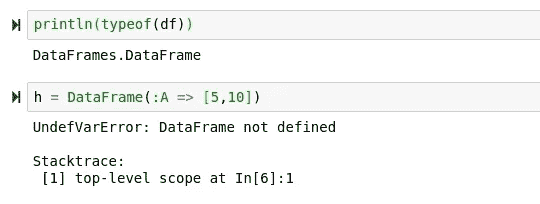
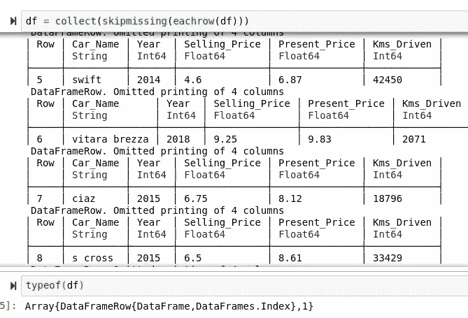
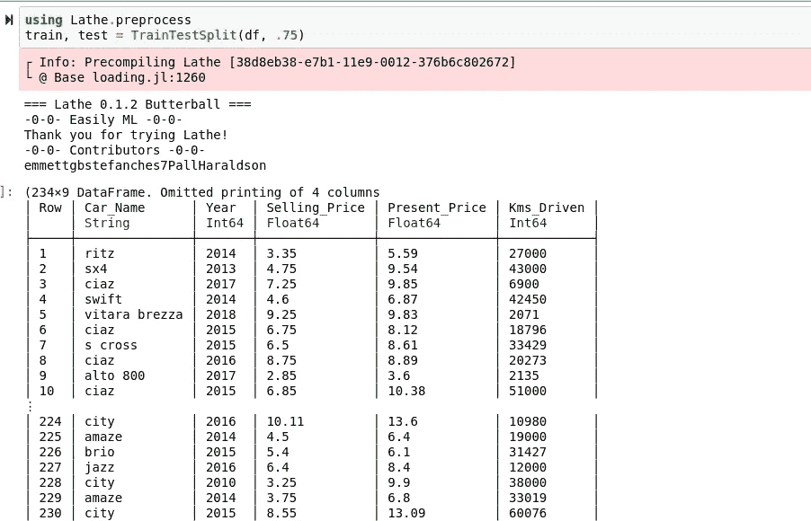
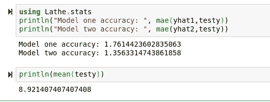
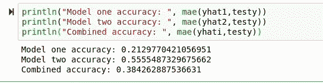

# 带精灵的 A-Z Julia 端点

> 原文：<https://towardsdatascience.com/a-z-julia-endpoint-with-genie-a2e0c2f1c884?source=collection_archive---------31----------------------->

## 关于使用 Julia、Genie 和 Lathe 部署端点的介绍。


(茱莉亚标志 src =[http://julialang.org](http://julialang.org))

> [笔记本](https://github.com/emmettgb/Emmetts-DS-NoteBooks/blob/master/Julia/DeployingGenie.ipynb)
> 
> [Github 回购](https://github.com/emmettgb/CarPricePredictor)

任何有抱负的数据科学家应该能够完成的最重要的任务之一是创建和部署一个端点。端点是现代机器学习的主干，也是将模型转化为真实生产环境的最简单方法。为了在端点部署模型，您首先需要选择一个 web 框架来创建该端点。对于 Python 和 R 来说，选择是非常明显的，并且很容易找到一个合适的 web 框架来满足您的需求。

> 但是朱莉娅呢？

尽管 Julia 的生态系统肯定没有 Python 或 R 的那么成熟，但是 Julia 确实有一些有趣的选项来部署您的模型。首先，你总是可以依靠 PyCall。这将允许您使用像 Flask 和 Django 这样的 Python 库来进行部署，而不必担心使用与这两个选项相比仍然相对年轻的 Julia 项目。但是对于那些渴望更高性能的人，我介绍

> Genie.jl。

当然，与其他 web 框架相比，Genie 还很年轻，但是在我看来，它带来了更多有趣的想法，使得部署模型成为一项休闲活动。Genie 仍在 0.31.1 版本中，但你可能会惊讶于这项技术已经有多强大。今天，我将带你了解 Genie 的一切，从建立虚拟环境到序列化模型和在 Ubuntu 上部署基于 Genie 的 API。

# 建立模型

举个例子来说，关于一个模型没有什么是真正重要的。无论如何，我们将使用 Lathe 来创建我们的模型，因为与许多其他选项不同，Lathe 模型非常容易序列化和部署。对于今天的例子，我们将使用车床 0.1.2，但语法应该保持不变，直到至少车床 1.0 的发布。第一件事是首先，让我们找到一些数据！

[](https://www.kaggle.com/nehalbirla/vehicle-dataset-from-cardekho/data#) [## 来自 cardekho 的车辆数据集

### 二手车和摩托车数据

www.kaggle.com](https://www.kaggle.com/nehalbirla/vehicle-dataset-from-cardekho/data#) 

我选定的数据集是来自 Kaggle 的“车辆数据集”。我选择这个主要是因为我对汽车感兴趣。此外，我对它们感到特别兴奋，因为下周我就要去买一幅德尔·索尔的画了。对于汽车人，我只想说一件事:

> 双收费 B20 交换。

回到数据科学的世界，我下载了我们的新数据集，现在我们可以读取它了。我们将使用 CSV.jl:

```
using CSV
df = CSV.read("car data.csv")
```

朱莉娅的趣事:虽然 DataFrames.jl 是 CSV.jl 的依赖项，但是每当我们导入 CSV 时，它都不会被预编译。换句话说，df 的类型是 DataFrame，它来自 DataFrames.jl，但是我们不能使用与此类型相关的任何方法，直到我们也导入 DataFrames。



```
using DataFrames
```

虽然肯定有其他方法可以删除你丢失的值，但这是一个有效的方法:

```
df = collect(skipmissing(eachrow(df)))
```

使用这种方法的一个优点是 collect()和 skipmissing()都是 Julia 语言中的基本方法。这意味着它们可以应用于任何类型，如果显式导入，甚至可以应用于您自己的类型。Eachrow()来自数据帧，只是用来把我们的 df 转换成可以迭代的东西。这样做的缺点是，我们将得到一个 DataFrame 行数组作为返回。



我们可以通过断言该数据的 DataFrame 类型来缓解这一问题。

```
df = DataFrame(df)
```

跳过这一步，我们不打算考虑统计测试，因为我们并不关心这个例子的准确性，所以接下来我们将继续分割我们的数据。为此，我们将使用来自 Lathe.preprocess 的 TrainTestSplit。在 Lathe 的不稳定版本中，我们需要设置 at 参数(float 设置为 75%)，但在任何稳定版本中，情况都不是这样。



接下来，我们需要确定目标和特性。我认为比较 Kms_Driven 和 Selling_Price 是一个很酷的主意。然后我想也许这一年也会很酷，所以为什么不两个都做呢？

```
target = :Present_Price
feature1 = :Year
feature2 = :Kms_Driven
```

现在，让我们插入这些内容，以便从数据帧中获取实际阵列:

```
trainy = train[!,target]
testy = test[!,target]
trainX1 = train[!,feature1]
trainX2 = train[!,feature2]
testX1 = test[!,feature1]
testX2 = test[!,feature2]
```

现在我们将安装两个独立的车床模型:

```
using Lathe.models
model1 = LinearRegression(trainX1,trainy)
model2 = LinearRegression(trainX2,trainy)
```

得到两个预测:

```
yhat1 = model1.predict(testX1)
yhat2 = model2.predict(testX2)
```

现在我们将一起和单独测试它们的准确性。对于我们的验证指标，我们将使用平均绝对误差:



> 还不错！

让我们看看如果我们把两者结合起来会发生什么。我们将通过对 zip 循环中的所有预测进行平均来将两者结合起来:

```
yhati = [mean([pred1,pred2]) for (pred1,pred2) in zip(yhat1,yhat2)]
```

现在我们将比较所有的精度:



正如您可能已经预料到的，我们的新功能稍微降低了我们的准确性，因为这个模型没有对使用哪个值或对哪个值进行优先级排序做出任何逻辑决策。因此，我们将只使用第一个模型，因为它具有最好的准确性。为了序列化这个模型，我们将使用 JLD2。使用 JLD2，我们可以使用@save 宏将我们的模型保存为序列化的 JLD2 格式。

```
using JLD2
[@save](http://twitter.com/save) "mdl.jld2" model1
```

# 创建我们的端点

现在，我们将获取 JLD2 文件，并将其移动到一个新目录中。我将在 Bash 中这样做，但是当然，您也可以按照自己的意愿这样做:

```
mkdir CarPrice
mv mdl.jld2 ./CarPrice
```

现在，我们将为我们的端点创建一个目录。

```
mkdir endp
cd endp
```

现在我们将初始化一个 Genie 项目。为此，我们将输入朱莉娅·REPL，导入精灵，然后最后是 newapp_webservice()方法:

```
julia
using Genie
Genie**.**newapp_webservice("CarPricePredictor")
```

这将实例化一个新的 Pkg 环境，并为我们的 Genie 端点创建一个新的目录系统。它还将启动一个服务器，因此您可以继续访问您的本地主机(默认为 [http://127.0.0.1:8000/](http://127.0.0.1:8000/) )并检查您的服务器！默认情况下，无法写入这些文件，因此您需要调整权限才能编辑它们。之后，我将我们的模型文件移动到端点的目录中，然后将它放在自己的名为 models 的文件夹中。现在，我们只需在由 Genie 生成的 routes.jl 文件中使用 JLD2 重新加载它:

```
using Genie.Routerroute("/") do
  mdl = [@load](http://twitter.com/load) "models/mdl.jld2"
end
```

接下来，我们将从请求中请求一个参数实参，我们可以这样做:

```
using Genie.Routerroute("/") do
  mdl = [@load](http://twitter.com/load) "models/mdl.jld2"
  year = haskey([@params](http://twitter.com/params), :year)
end
```

现在，我们将根据数据进行预测，并返回结果。

```
using Genie.Routerroute("/") do
  mdl = [@load](http://twitter.com/load) "models/mdl.jld2"
  year = haskey([@params](http://twitter.com/params), :year)
  return(mdl.predict(year))end
```

# 部署

为了部署这个模型，我们首先要把我们的文件放到我们的服务器上。为此，您可以使用 FTP、HTTP(通过 Git 或 Wget)或 STP。通常在这种情况下，您会使用 STP，但是因为我已经将我的文件提交给 Github，所以我会将它复制到我的服务器上的/var/www 目录中。

```
ssh emmett@(this_is_my_ip)
cd /var/www
git clone [https://github.com/emmettgb/CarPricePredictor](https://github.com/emmettgb/CarPricePredictor)
```

现在我们有两件事情要设置:

*   网络服务器
*   主管

对于我的网络服务器，我将使用 NGINX。我几乎什么都用 NGINX，因为它比 Apache 有一些优势，主要是它通常有更好的响应时间。如果你需要做出决定，我建议你选择你熟悉的那个。如果你对两者都不熟悉，那就用 NGINX 吧，因为它的配置更简单，而且以我的主观观点(以及许多指标)来看，它更好。使用 Apache 当然有优势，但是我不认为至少从尝试 NGINX 开始你会错过很多。

我们要在 NGINX 配置中做的是创建一个代理传递到我们的服务器将要运行的端口上，默认情况下是 8000。如果你在 VPS 上运行多个网络服务器，那么你可能需要使用更高的端口，比如 8001 或 8002。配置文件存储在/etc/nginx/conf.d 中，所以让我们创建一个新的配置:

```
sudo dnf/apt/pacman/man install nginx
sudo nano /etc/nginx/conf.d/carpredictor.conf
```

以下是从端口 80(默认 HTTP 协议端口)到端口 8000 的代理传递的配置示例:

```
**server** {
    **listen** 80;
    **server_name** your domain;

    **location** / {
        **proxy_pass** http://127.0.0.1:8000;
        **proxy_set_header** Host $host;
        **proxy_set_header** X-Forwarded-For $proxy_add_x_forwarded_for;
    }
}
```

如果这是你的第一台 NGINX 服务器，你必须解除 NGINX 默认站点的链接:

```
sudo unlink /etc/nginx/sites-enabled/default
```

接下来，我们需要设置一个主管。和 NGINX 一样，supervisor 的配置文件。我的服务器在 Ubuntu 上，尽管我痴迷于 RHEL，所以安装 supervisor 就像

```
sudo apt-get install supervisor
```

现在我们将创建一个新的配置。

```
sudo nano /etc/supervisor/conf.d/flask_app.conf
```

以下是我的主管配置:

```
[program:genieapp]
directory=/var/www/CarPricePredictor
command=. bin/server
autostart=true
autorestart=true
stopasgroup=true
killasgroup=true
stderr_logfile=/var/log/appname/lognameerr.log
stdout_logfile=/var/log/appname/lognamestdout.log
```

命令和目录是您应该在这里查看的两个参数。我们将把 SH 文件放在我们的 Genie 端点附带的 bin/server 中，这将自动启动一个我们可以使用的 Genie 服务器。我们还需要运行上述命令的目录，差不多就是这样。现在我们只需要重新加载我们的服务:

```
sudo nginx -s reload
sudo service supervisor reload
```

> 现在我们的端点已经部署好了！

# 结论

Julia 部署并不太难，最近已经变得更容易了。每当我第一次进入 Genie 时，文档是绝对糟糕的。幸运的是，随着时间的推移，这种情况已经发生了变化，现在这个工具比以往任何时候都更容易使用。车床模型也是我认为非常酷的一个方面。或者，您也可以使用车床部署管道。以下是为老版本的车床部署管道的教程:

[https://towards data science . com/building-pipelines-with-lathe-0-0-7-unstable-in-Julia-f7ba 1850 bde 3](/building-pipelines-with-lathe-0-0-7-unstable-in-julia-f7ba1850bde3)

旧版本和新版本的区别在于，现在管道只接受一个参数:

> 台阶。

所以为了做一个管道，你只需要做:

```
using Lathe.preprocess
scaler = Normalizer(xt)
using Lathe.models
mdl = LinearRegression(trainX,trainy)
pipl = Pipeline([scaler, mdl])
yhat = pipl.predict(xt)
```

> 很酷，对吧？

所以管道部署肯定是可行的，而且在 Julia 中使用车床也很酷。我很兴奋地看到这种方法能够在这方面使用车床进行机器学习到什么程度，因为管道肯定是 DS 生态系统的重要组成部分。