# 10 分钟内探索性数据分析的 A-Z

> 原文：<https://towardsdatascience.com/a-z-of-exploratory-data-analysis-under-10-mins-aae0f598dfff?source=collection_archive---------23----------------------->


数据以各种形式出现，数量巨大。图片来自 [Pixabay](https://pixabay.com/) 佳能-eos

## EDA 是迈向数据科学的第一步。

**探索性数据分析** (EDA)无论是回归还是分类，都是任何模型最关键的阶段，但往往被轻描淡写或忽略。EDA 清楚地显示了数据以及不同特性或不同数据特性组合对输出的依赖性。

我去维基百科寻找更多信息，下面是它的定义:

> **探索性数据分析** (EDA)是一种分析**数据集**以总结其主要特征的方法，通常采用可视化方法。统计模型可以使用，也可以不使用，但 EDA 主要是为了查看**数据**在正式建模或假设检验任务之外能告诉我们什么。

现在，问题是如何执行 EDA。下面是使用一个例子来执行 EDA 的简单方法。

下面是帖子的**流程**，

1.  数据集简介
2.  查看数据
3.  单变量分析

*   概率密度函数
*   累积密度函数
*   箱形图
*   小提琴情节

4.双变量分析

*   散点图
*   配对图

5.多变量分析

*   等值线图表

让我们开始吧！！

1.  **数据集介绍**

先说几个常用术语:
- **数据集**是所用数据的集合(通常是一张表)
- **数据点**是数据集(如行)中的每个观察值
- **目标**，也叫因变量或输出变量，是要预测或分析的变量。
- **特征，**也叫**-**输入变量或自变量是用来确定因变量的一个变量或变量的集合。

让我们用从 Kaggle 设置的 Haberman 的生存数据来探索 **EDA。**

[](https://www.kaggle.com/gilsousa/habermans-survival-data-set) [## 哈伯曼生存数据集

### 接受乳腺癌手术患者的存活率

www.kaggle.com](https://www.kaggle.com/gilsousa/habermans-survival-data-set) 

**属性信息:**
1。手术时患者的年龄(数值)
2。患者手术年份(年份— 1900，数字)
3。检测到的阳性腋窝淋巴结数(数值)
4。存活状态(类别属性)1 表示患者存活了 5 年或更长时间，2 表示患者在 5 年内死亡

**目的:**

**2。调查数据**

```
import pandas as pd
data = pd.read_csv('haberman_data.csv')
```

导入熊猫来读取数据。使用 pandas 将 Kaggle 中的 CSV(逗号分隔值)文件分配到数据框中。

```
data.shape
```

输出:(305，4)

数据集有 305 个数据点，4 个特征

让我们看看数据如何，

```
data.head()
```

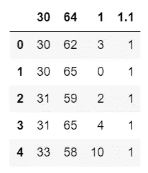

数据集中的前 5 个元素

这里，数据集没有任何标题(列名)。第一个数据点被作为标题。因此，我们需要添加一个头。

```
header_list=['age','op_year','axil_nodes','surv_status']
haberman_data = pd.read_csv('haberman_data.csv',names=header_list)
```

添加要素名称并将数据加载到数据框中。

```
haberman_data.head()
```

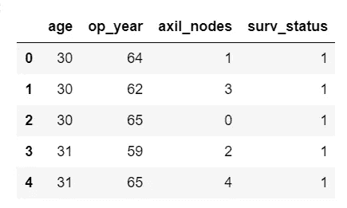

添加特征名称后数据集的前 5 个元素

现在，数据已经有了特征名称。

```
haberman_data['surv_status'].value_counts()
```

输出:

1 225
2 81
Name:surv _ status，dtype: int64

该数据是不平衡数据，这意味着“surv_status”的每个类别中的数据点数量不相似。

现在我们有了数据的图片，让我们开始进一步分析它。

**3。单变量分析**

单变量分析，顾名思义，就是简单的用一个变量进行分析。这种分析给出了变量出现的频率/计数，并让我们了解该变量在不同值下的分布。

**3.1。概率密度函数(PDF) :**

在 PDF 绘图中，X 轴是进行分析的要素，Y 轴是数据中特定 X 轴值出现的次数/频率。因此在 PDF 中出现了术语**“密度”**。

```
import seaborn as sns
sns.set_style("whitegrid")
```

Seaborn 是一个提供各种类型的分析图的库。

```
sns.FacetGrid(haberman_data,hue='surv_status',height=5).map(sns.distplot,'age').add_legend()
```

输出:

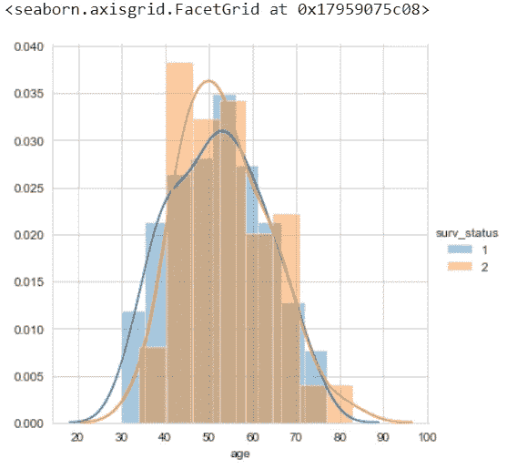

时代的 PDF

观察结果:

1.  主要的重叠被观察到，所以我们不能清楚地说年龄对生存的依赖性。
2.  粗略估计，20-50 岁的患者存活率稍高，75-90 岁的患者存活率较低。
3.  年龄可以被认为是一个因变量。

```
sns.FacetGrid(haberman_data,hue='surv_status',height=5).map(sns.distplot,'op_year').add_legend()
```

输出:

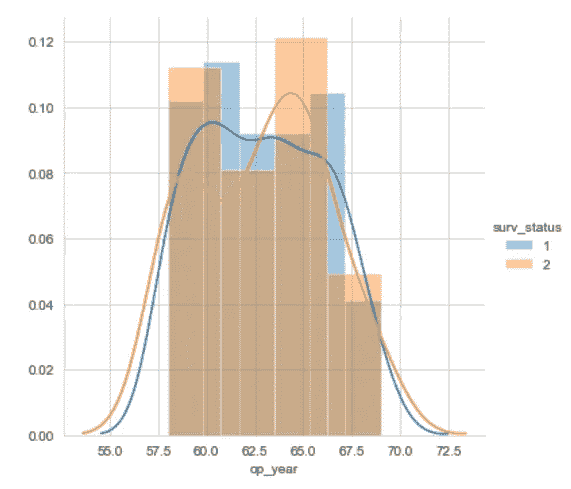

运营年份的 PDF

观察结果:

1.  重叠是巨大的。
2.  运营年份本身并不是一个高度相关的变量。

```
sns.FacetGrid(haberman_data,hue='surv_status',height=5).map(sns.distplot,'axil_nodes').add_legend()
```

输出:

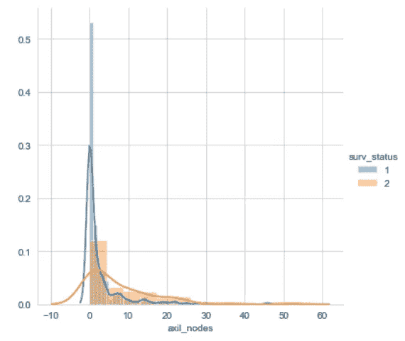

腋窝淋巴结的 PDF

观察结果:

1.  0 淋巴结的患者生存概率高。
2.  腋淋巴结可以作为因变量。

*PDF 的缺点*:在 PDF 中，我们无法准确说出有多少个数据点在某个范围内/低于某个值/高于某个特定值。

**3.2。累积密度函数(CDF) :**

要知道低于/高于特定值的数据点的数量，CDF 非常有用。

让我们从根据存活率的类别来分离数据开始。

```
survival_yes = haberman_data[haberman_data['surv_status']==1]
survival_no = haberman_data[haberman_data['surv_status']==2]
```

现在，让我们分析这些分离的数据集。

```
import numpy as np
import matplotlib.pyplot as plt
count, bin_edges = np.histogram(survival_no['age'], bins=10, density = True)
#count : the number of data points at that particular age value
#bin_edges :the seperation values of the X-axis (the feature under analysis)
#bins = the number of buckets of seperation
pdf = count/sum(count)
print(pdf)
# To get cdf, we want cumulative values of the count. In numpy, cumsum() does cumulative sum 
cdf = np.cumsum(pdf)
print(cdf)count, bin_edges = np.histogram(survival_yes['age'], bins=10, density = True)
pdf2 = count/sum(count)
cdf2 = np.cumsum(pdf2)plt.plot(bin_edges[1:],pdf,label='yes')
plt.plot(bin_edges[1:], cdf,label='yes')
plt.plot(bin_edges[1:],pdf2,label='no')
plt.plot(bin_edges[1:], cdf2,label='no')
plt.legend()
 #adding labels
plt.xlabel("AGE")
plt.ylabel("FREQUENCY")
```

输出:

```
[0.03703704 0.12345679 0.19753086 0.19753086 0.13580247 0.12345679
 0.09876543 0.04938272 0.02469136 0.01234568]
[0.03703704 0.16049383 0.35802469 0.55555556 0.69135802 0.81481481
 0.91358025 0.96296296 0.98765432 1\.        ]Text(0, 0.5, 'FREQUENCY')
```

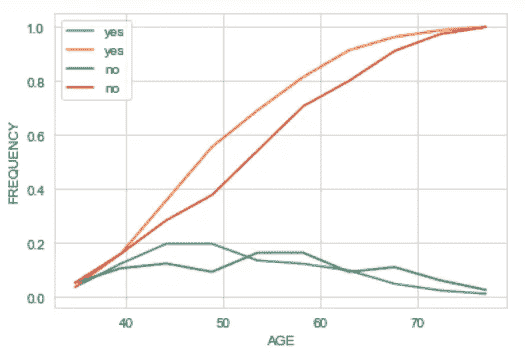

关于年龄的分离数据

观察结果:

*   大约 80%的数据点的年龄值小于或等于 60 岁

```
count, bin_edges = np.histogram(survival_no['axil_nodes'], bins=10, density = True)
pdf = count/sum(count)
print(pdf)cdf = np.cumsum(pdf)
print(cdf)count, bin_edges = np.histogram(survival_yes['axil_nodes'], bins=10, density = True)
pdf2 = count/sum(count)
cdf2 = np.cumsum(pdf2)plt.plot(bin_edges[1:],pdf,label='yes')
plt.plot(bin_edges[1:], cdf,label='yes')
plt.plot(bin_edges[1:],pdf2,label='no')
plt.plot(bin_edges[1:], cdf2,label='no')
plt.legend()
plt.xlabel("AXIL_NODES")
plt.ylabel("FREQUENCY")
```

输出:

```
[0.56790123 0.14814815 0.13580247 0.04938272 0.07407407 0.
 0.01234568 0\.         0\.         0.01234568]
[0.56790123 0.71604938 0.85185185 0.90123457 0.97530864 0.97530864
 0.98765432 0.98765432 0.98765432 1\.        ]Text(0, 0.5, 'FREQUENCY')
```

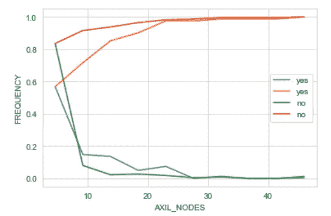

腋窝淋巴结分离数据的 CDF，PDF

观察结果:

*   大约 90%的数据点具有小于或等于 10 的 axil_node 值

**3.3。箱线图**

在探索箱线图之前，一些常用统计术语是:

*   median(第 50 个四分位数)是排序数据的中间值
*   第 25 个四分位数是排序数据中的值，其中 25%的数据小于它，75%的数据大于它
*   第 75 个四分位数是排序数据中的值，其中 75%的数据小于它，25%的数据大于它。

在箱线图中，下面的线代表第 25 个四分位数，中间的线代表中位数/第 50 个四分位数，上面的线代表第 75 个四分位数。晶须代表大多数图中的最小值和最大值或一些复杂的统计值。使用 seaborn 时，胡须不是最小值和最大值。

```
sns.boxplot(x='surv_status',y='age', data=haberman_data)
sns.boxplot(x='surv_status',y='axil_nodes', data=haberman_data)
sns.boxplot(x='surv_status',y='op_year', data=haberman_data)
```

输出:

```
<matplotlib.axes._subplots.AxesSubplot at 0x1795943de08><matplotlib.axes._subplots.AxesSubplot at 0x179594b4948>
<matplotlib.axes._subplots.AxesSubplot at 0x1795b18ac88>
```

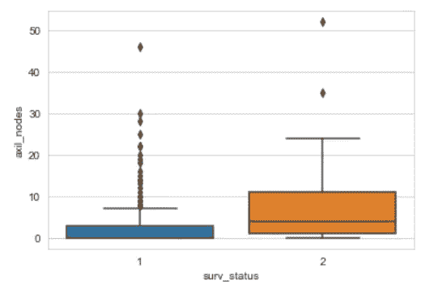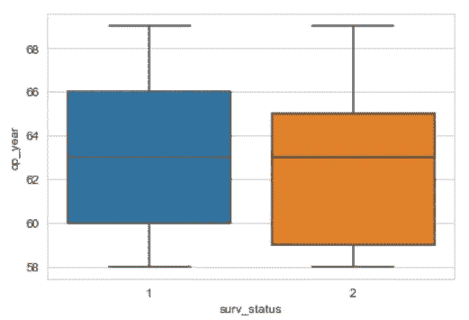

年龄、腋窝淋巴结、手术年份的箱线图

**3.4。小提琴剧情:**

小提琴图是箱线图和密度函数的组合。

*   白点代表中间值。
*   较粗的黑线的边缘代表四分位数。
*   小提琴形结构的边缘代表最小值和最大值
*   形状的宽度表示该值处数据点的密度/频率。

```
sns.violinplot(x='surv_status',y='age', data=haberman_data)
plt.show()sns.violinplot(x='surv_status',y='op_year', data=haberman_data)
plt.show()sns.violinplot(x='surv_status',y='axil_nodes', data=haberman_data)
plt.show()
```

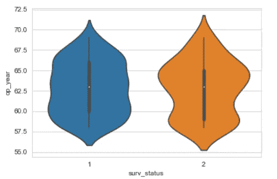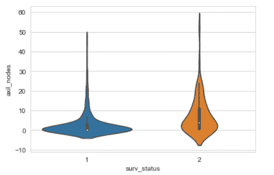

年龄，手术年份，腋窝淋巴结的小提琴图

观察结果:

*   75-90 岁的患者不太可能存活，30-40 岁的患者更有可能存活。
*   运营年度似乎没有给出确切的信息，因为它几乎平均分布在给定的几年中。
*   淋巴结值低的患者更有可能存活。

**4。双变量分析:**

在本节中，我们将一次使用两个独立变量来分析数据。

**4。1.散点图:**

散点图广泛用于比较两个变量，并帮助我们分析目标变量如何依赖于它们的组合。
在散点图中，X 轴代表一个自变量，Y 轴代表另一个自变量。
通过将目标变量赋予 seaborn 提供的面网格函数中的色调参数，可以用颜色编码来表示目标变量。

```
sns.FacetGrid(haberman_data, hue="surv_status", height=8) \
   .map(plt.scatter, "age", "op_year") \
   .add_legend();
```

输出:

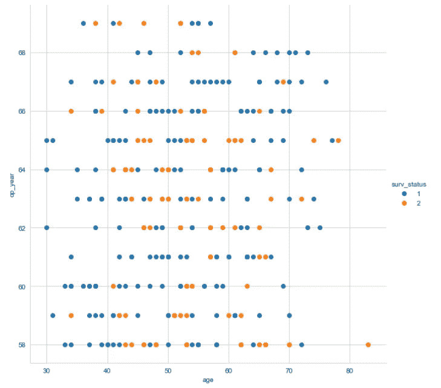

年龄和操作年份散点图

```
sns.FacetGrid(haberman_data, hue="surv_status", height=8) \
   .map(plt.scatter, "age", "axil_nodes") \
   .add_legend();
```

输出:

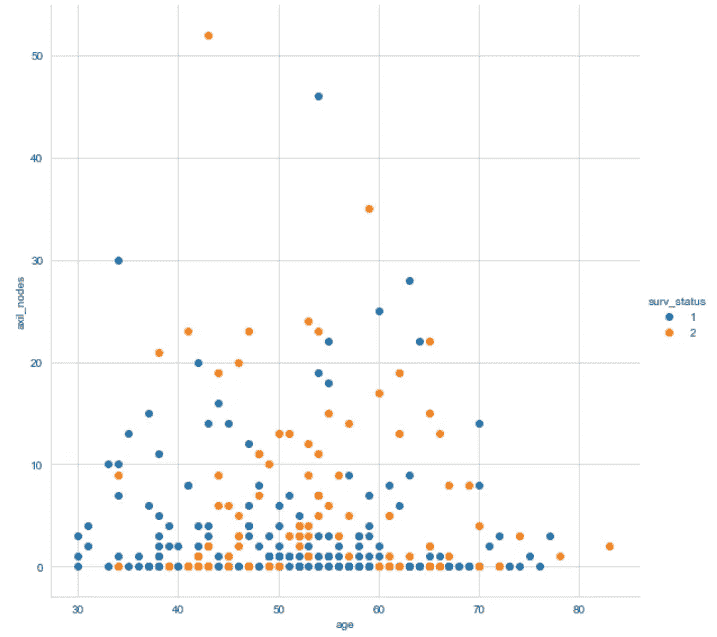

年龄和腋窝淋巴结散点图

```
sns.FacetGrid(haberman_data, hue="surv_status", height=8) \
   .map(plt.scatter, "axil_nodes", "op_year") \
   .add_legend();
```

输出:

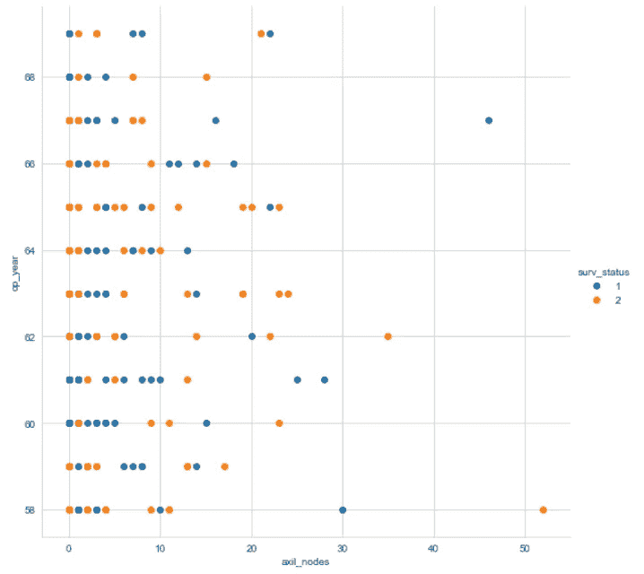

腋窝淋巴结散点图和手术年份

**4.2。配对图:**

结对图有助于用一行代码将所有变量相互比较。这可以被认为是所有可能的散点图。当特征数量较少时，可使用配对图。在这个有 3 个独立变量的例子中，配对图的数量是 9(3X3)。因此，对于任何具有 10 个特征的数据，配对图的数量将是 100。因此，当特征数量较少(~7)时，通常使用配对图。

这是一行代码:

```
sns.pairplot(haberman_data, hue="surv_status", height=5)
```

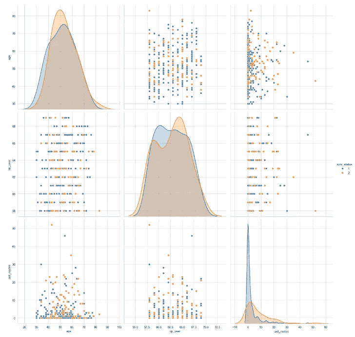

年龄、手术年份、腋窝淋巴结配对图

**5。多变量分析:**

在本节中，我们将使用多个变量来分析数据的分布。

**5.1。等高线图:**

等高线图是一种图形技术，通过在二维格式上绘制称为等高线的恒定 z 切片来表示三维表面。

```
import seaborn as sns
g=sns.jointplot(x = 'op_year', y = 'age', data = haberman_data, kind = 'kde')
```

输出:

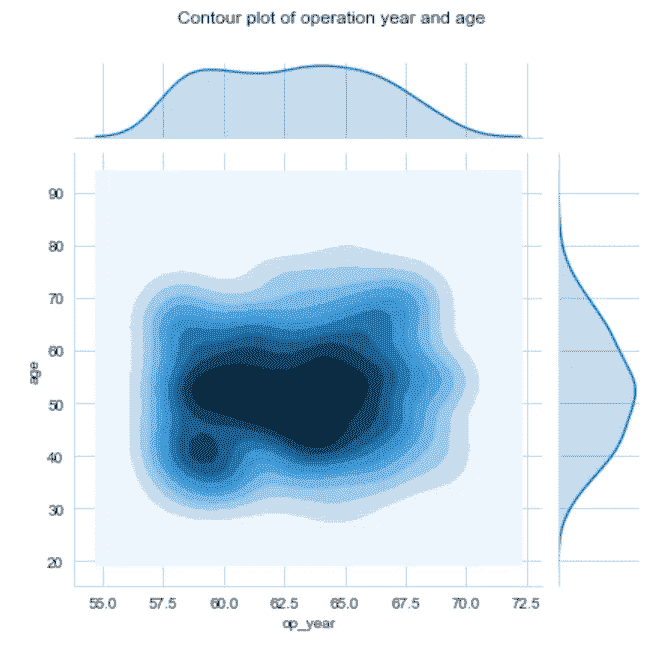

年龄和手术年份等高线图

此处，手术年份、年龄是两个参数，而为图提供蓝色阴影的 3D 参数是患者手术年份和年龄组合的计数。

观察结果:

大量的手术是在 60-64 岁和 45-55 岁之间进行的

**结论:**

*   40 岁以下的患者可能有较高的存活率，75 岁以上的患者可能有较低的存活率。
*   腋窝淋巴结越低，生存机会越高。
*   然而，年龄、手术年份或腋窝淋巴结这三个变量中的任何一个都不足以准确决定患者的生存率，而且数据集是不平衡的。因此，分类是困难的。

谢谢你的阅读。我也将在未来写更多初学者友好的帖子。请在[媒体](https://medium.com/@ramyavidiyala)上关注我，以便了解他们。我欢迎反馈，可以通过 LinkedIn [RamyaVidiyala](https://www.linkedin.com/in/ramya-vidiyala-308ba6139/) 联系