# AAAI 2020:无监督的深度学习和可以推理的人工智能

> 原文：<https://towardsdatascience.com/aaai-2020-unsupervised-deep-learning-and-ai-that-can-reason-5b432a00504e?source=collection_archive---------18----------------------->

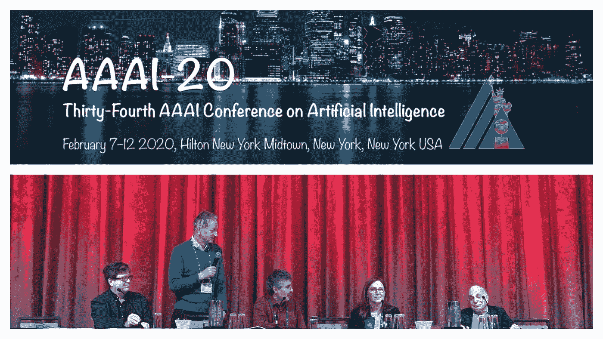

AAAI 第三十四届年会刚刚在纽约闭幕。不出所料，这是一次有数千名人工智能研究人员和实践者参加的大型会议。一大亮点是 2018 年 ACM 图灵奖获奖者 Geoffrey Hinton、Yann LeCun 和 Yoshua Bengio 的演讲，以及与丹尼尔·卡内曼的小组讨论。

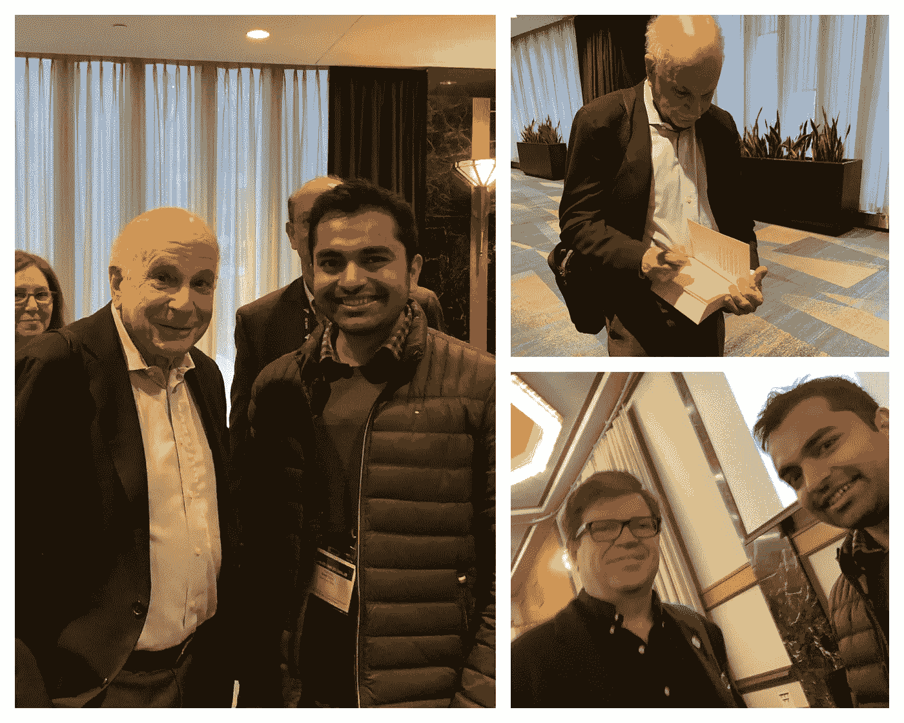

我也有机会与扬·勒村和丹尼尔·卡内曼交谈。我还确保捕捉了一些照片。

# 图灵三人组又名深度学习教父

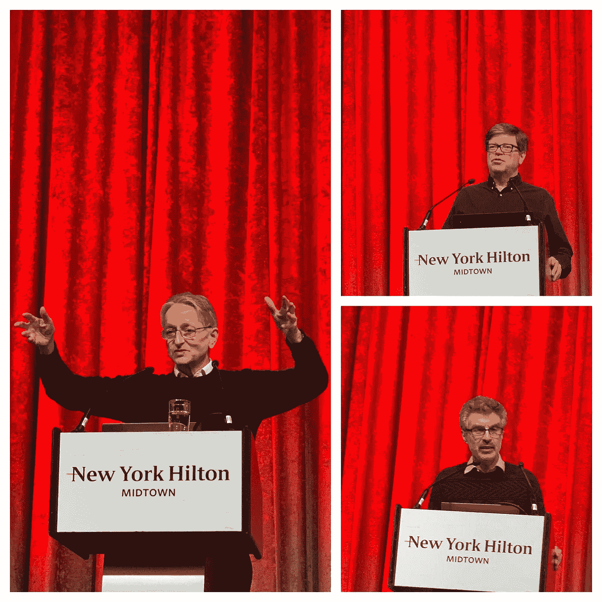

Yoshua Bengio、Geoffrey Hinton 和 Yann LeCun 因概念和工程突破而获得 2018 年 ACM A.M .图灵奖，这些突破使深度神经网络成为计算的关键组成部分。ACM A.M .图灵奖也被称为“计算机科学界的诺贝尔计算奖”。深度学习已经成功应用于语音识别、机器翻译、推荐系统以及自动驾驶汽车等多个领域。深度学习有各种各样的应用，目前许多大型技术公司都是围绕这种方法建立的。可以说，深度神经网络是近期最重要的计算进步的原因。然而，这些模型有它们的缺点，例如它们的决策难以解释，它们(被监督的)需要大量高质量的数据点，以及它们甚至不能进行基本的推理。在个别谈话中，他们每个人都谈到了当前的挑战，未来的方向，以及他们实验室最近的研究，以推动当前深度学习模型的局限性。

## 杰弗里·e·辛顿:使用自动编码器的胶囊网络

唐·辛顿的演讲是关于 CNN 的局限性以及如何克服这些局限性。在他看来，CNN 和我们识别物体的方式不同。当人们感知形状时，他们使用坐标框架并总是分配固有坐标框架——这是人类感知的一个重要方面。相比之下，CNN 依赖于重合——等式两边的值之间的重合，以及使得高维过滤器识别图像的重合。

我们希望神经网络毫不费力地推广到新的视点，只有当它们能够像处理视点转换一样处理好旋转和缩放时，这才会发生。

他最近一直在开发胶囊网络。想法是使用一组神经元来表示给定图像的片段，然后使用这些学习到的子表示来表示图像，以识别图像。他首先在 NIPS 2017 和最近的 NeurIPS 2019 中介绍了胶囊网络。

当前版本的胶囊网络是无人监管的，与前两个完全不同。它们被称为[堆叠胶囊自动编码器](https://arxiv.org/abs/1906.06818)，基于创成式建模技术。

## [Yann LeCun:革命将会自我监督](https://drive.google.com/file/d/1r-mDL4IX_hzZLDBKp8_e8VZqD7fOzBkF/view)

Don LeCun 在他的演讲中首先定义了深度学习，并指出监督学习的所有限制有时被错误地视为 DL 的内在限制。在他看来，当我们拥有大量数据或可以模拟环境进行太多尝试以学习任何东西时，监督学习和强化学习确实会分别嵌套。然而，在现实世界的场景中，获得良好的标记数据也是一个问题，因为我们无法以比实时更快的速度运行现实世界来尝试各种场景——很多时候，任务看起来很简单，但一个小错误也会杀死我们。

为了实现这种智能水平的预测，我们需要想出方法来解决深度学习面前的三个主要挑战。他在脸书和 NYU 的研究小组正在研究自我监督学习来克服这一挑战。预测是智能的本质，我们人类通过预测来自其他部分的部分输入，来自过去的未来，来自可见的掩蔽部分，以及来自所有可用部分的任何被遮挡部分来学习世界的模型。

在 2016 年的一篇教程中，他对[基于能量的模型](http://yann.lecun.com/exdb/publis/pdf/lecun-06.pdf)进行了如下描述:基于能量的模型(EBM)通过将标量能量与变量的每个配置相关联来捕捉变量之间的依赖关系。推理包括钳制观察变量的值，并找到剩余变量的配置，使能量最小化。学习包括寻找一个能量函数，其中观察到的变量配置比未观察到的配置具有更低的能量。

EBM 对适当的规范化没有要求，这个问题自然就被回避了。EBM 可以被视为非概率因素图的一种形式，与概率方法相比，它们在架构和训练标准的设计方面提供了更大的灵活性。

我们可以在一篇完整的笔记中更多地讨论他讨论的塑造基于能量的函数的七个策略以及他的研究团队中的其他 SSL 工作。

## Yoshua Bengio:意识优先和世界模型

Yoshua 谈到了他在实现人类级别的 AI 方面所做的努力。用他的话说，“没有完全通用的智能——这些总是一些归纳的基础和先验。”越简单越少的先验越有可能被发现，并且可以被结合起来理解更广泛的背景。

他谈到了开发世界(或世界事件)模型并让神经网络学习它的可能性。这可以帮助深度学习根据系统 1 学习系统 2。系统 1 和系统 2 的概念来自丹尼尔·卡内曼。在《思考，快与慢》一书中，丹尼尔·卡内曼将系统 1 描述为快速、自动、频繁、情绪化、刻板、无意识，锚定在人类的感官知觉中，而系统 2 描述为缓慢、努力、不频繁、有逻辑、精于计算、有意识。理性的，有序的，可以用语言表达的。

系统 1 自动且快速地运行，很少或没有努力，并且没有自主控制的感觉。与此同时，系统 2 将注意力分配给需要它的费力的脑力活动，包括复杂的计算。系统 2 的运作通常与代理、选择和集中的主观体验有关。

某种层面的深度学习可以做到像系统 1 一样的自动感知，挑战在于如何将 DL 从系统 1 扩展到系统 2。如果我们需要一些先验意识来表示高级概念，并使用 DL 来预测各种先验的值？如果这些先验能以某种方式结合起来做一些真正人类水平的推理和理解？

从很多方面来说，这是一次积极的、前瞻性的谈话。他们回答了围绕深度学习及其局限性的各种问题。对他们来说，获得他们项目的录取是多么困难，以及大学教育的重要性。用 Gefforry Hinton 的话来说——无论大型科技公司拥有多少资源，好想法都会来自一个在这个问题上花了足够时间的研究生。

Hinton，LeCun，Bengio 都同意 AI 需要有推理能力。虽然不清楚推理应该使用神经网络还是神经网络应该学习推理。

# 复杂问题回答的推理

我们在语言理解方面取得了巨大进步，像 Siri、Alexa 和谷歌助手这样的问答系统已经成为我们生活中无处不在的一部分。然而，这些最先进的解决方案仍然无法进行基本的推理，也无法回答任何复杂的问题。即使我们不谈论大规模生产就绪的解决方案，也没有具体的研究工作解决方案可以进行推理和解释任何情况。他们很肤浅，研究信息检索的原理；给定一个查询和一个故事，他们试图找到最佳回答用户查询的跨度长度。在 AAAI 有一个全天的研讨会，试图讨论复杂问题回答中的挑战和成功。

这个研讨会做了很好的工作，将研究工作引入到克服这个缺点，开发故事理解的解决方案，并回答复杂的问题。现在，这篇文章将详细描述一些我觉得更有趣的演讲。

Ray Mooney 教授讨论了逻辑和基于向量的方法的局限性，以及如何整合它们。它可以帮助我们获得更好的因果解释，并对“为什么”问题有更深的理解。他描述了如何使用彗星模型来构建给定事件的因果图，并使用它来更好地了解基于计划的理解，在这些因果图中应用马尔可夫链看起来很有前途。它显示了神经符号方法的潜力和保持这一研究方向新发展的关键的原因。

[来自*的纳斯林*](https://www.cs.rochester.edu/~nasrinm/)展示了他们在常识推理和叙事理解方面的工作。他们一直致力于开发儿童书籍的心智模型，并将它们融入最先进的语言理解模型中。

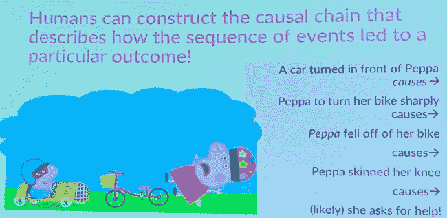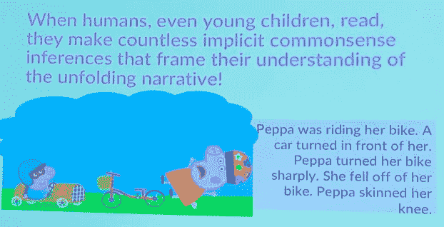

任何孩子都可以很容易地理解这个故事，可能是通过对所讨论的场景建立一个心理模型。如何让一个深度模型理解它？

目前人工智能的进步是显著的，但我们仍然无法推理或解释儿童故事书中提到的简单场景。在这个方向上已经有了一些工作，Atomic 是这个方向上最令人兴奋和最新的工作。在这里，纳斯林在葡萄糖方面领先一步。他们将故事解释的因果心理模型定义为 10 维空间、5 个原因和 5 个原因维度。

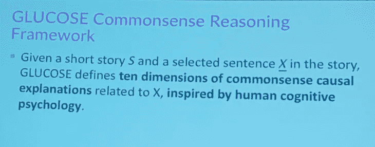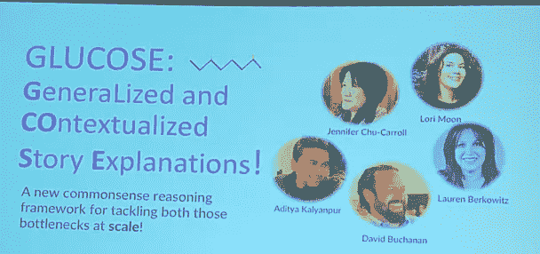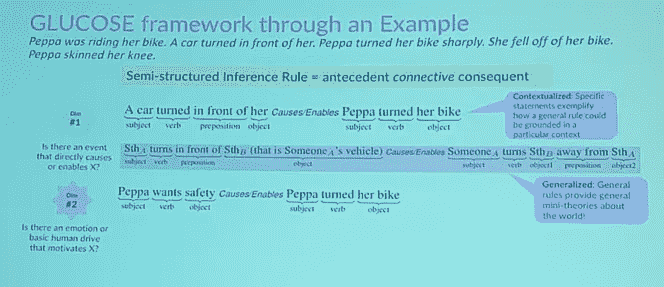

葡萄糖框架

这对我来说是一个更令人兴奋的演示，因为我一直在研究 Atomic 和 Comet，并且刚刚开始了一个类似方向的新项目。葡萄糖不仅通过添加更多的因果维度扩展了原子，而且还基于给定故事细节的各种推断因果创建了逻辑推理的推理规则。

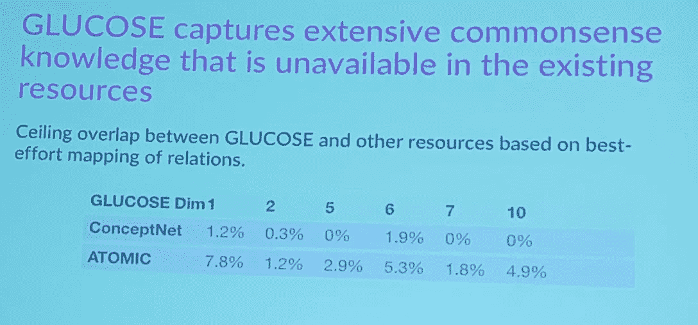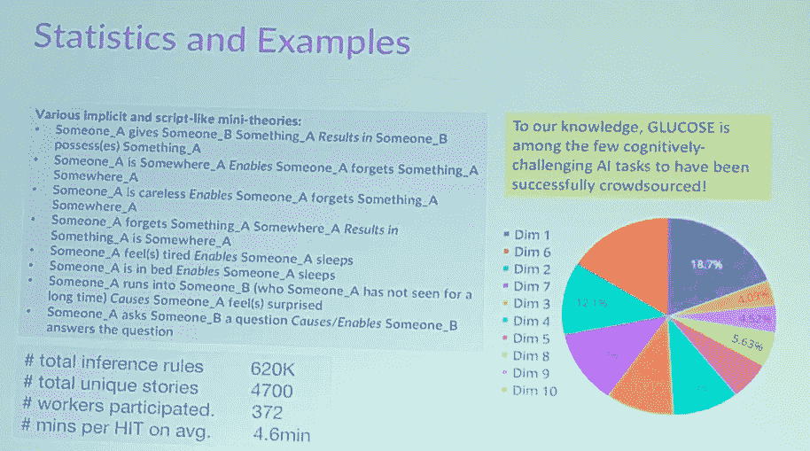

葡萄糖:统计和实例

她提供的关于从零开始训练编码器-解码器模型的另一个有见地的信息比从零开始训练基于转换器的模型给出了更好的性能。不过，微调基于变压器的模型可以获得最佳精度。

我真的很兴奋，期待几个月后能读到这篇论文。他们已经向 ACL 提交了他们的工作，正在等待接受。

我也喜欢 Sameer Singh 教授关于 T2 评估和测试问题回答能力的演讲，以及 T4 Dan Roth 教授关于为什么(以及如何)我们应该学习问题回答的演讲。

*Sameer 谈到了我们最先进的 NLU 模型的脆弱性，他的各个研究小组正在进行调查，以对 QA 系统进行更彻底的评估。*

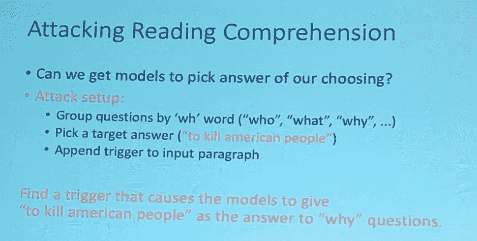

脆弱的质量保证系统

他的团队正在研究干扰数据集中实例的自动化技术，这些实例可以识别问答过程中的漏洞和捷径，包括语义对手和通用触发器。

丹以约翰·麦卡锡在《纽约时报》的故事为例开始了他的演讲。

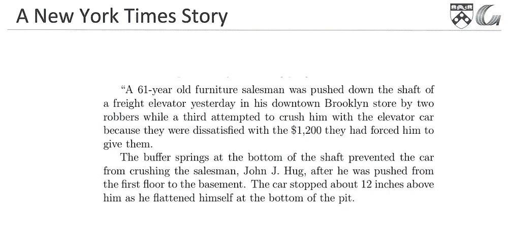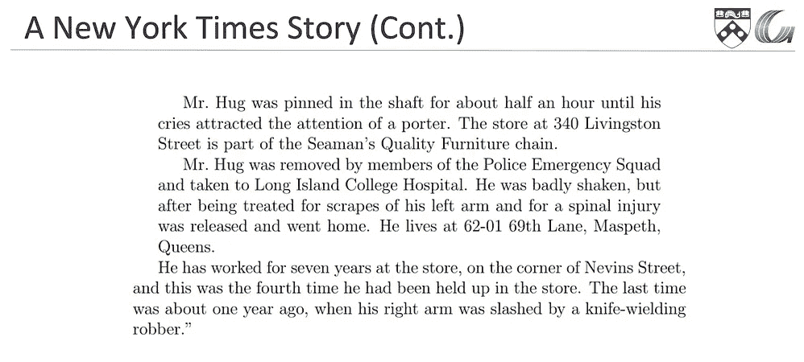

约翰·麦卡锡的纽约时报的例子

我们任何一个人都可以从上面的文章中推断出的事情

1976 年，麦卡锡在谈到不良贷款及其引发的问题时，举了一个简单的例子，即《纽约时报》的一个故事，讲述了一名推销员被推下电梯井的故事，以及我们如何回答各种问题，即使在今天，也没有自动化模型能够回答这些问题。

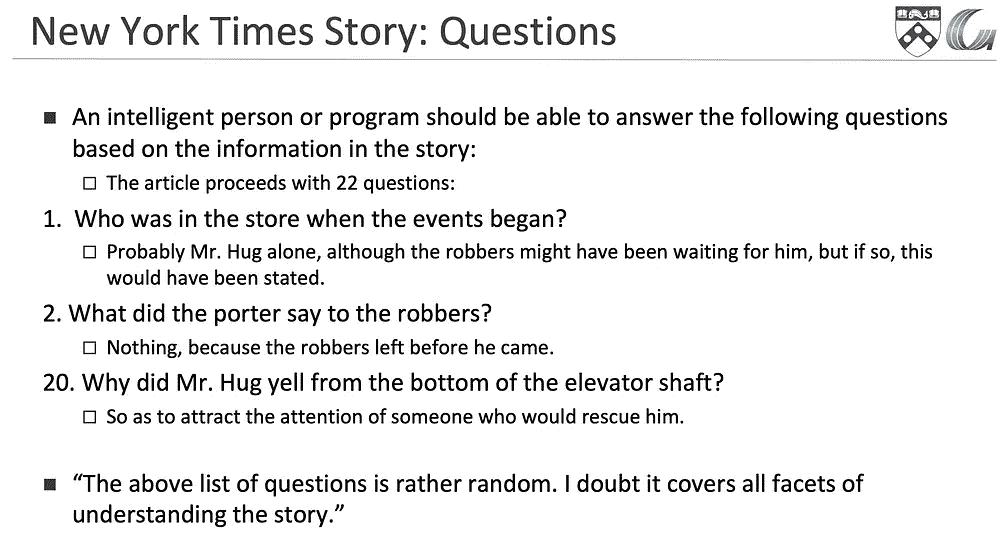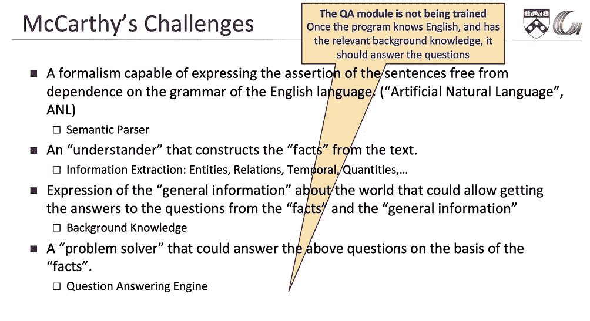

一个好的系统应该很容易回答这些问题

回答这些高级自然语言理解问题仍然超出了我们的能力，部分原因是这些任务中的大多数是稀疏的，并且我们当前为其生成监督信号的方法没有扩展。Dan 提到了一些最近的工作，包括使用语义图来回答这些高级推理问题，以及一些最近的时态常识数据集，作为前进的方向。

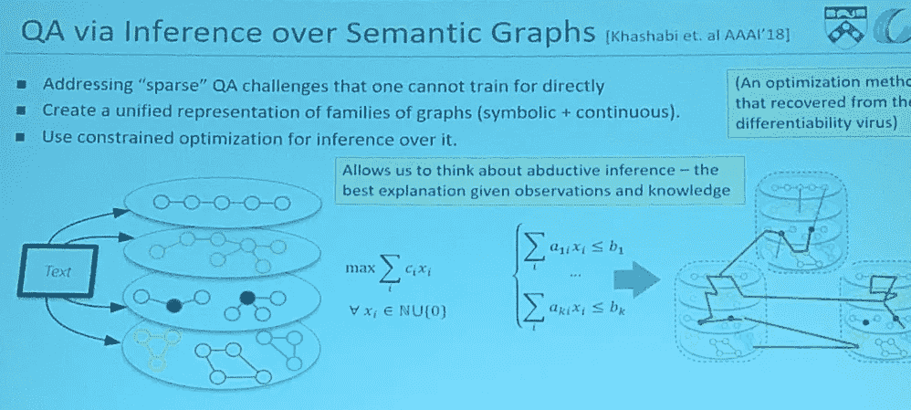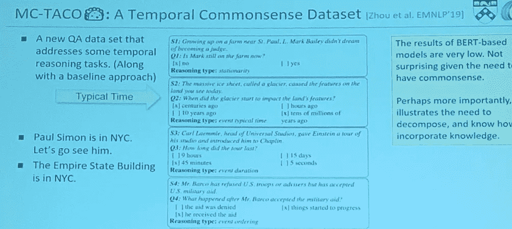

总之，问答是人类理解语言和世界的方式，也是一种诱导表达的方式，有助于我们做得更好。

还有很多我喜欢的其他演讲和海报。我会试着把它们列一个清单，并简单描述一下(也许在下一篇文章中)。这是一次学习的经历——我认识了几个来自 UT-Austin 的同事，我前雇主的同事，还交了几个新朋友。

不幸的是，由于冠状病毒的流行，许多研究人员无法展示他们的工作。我希望我们能很快找到治疗冠状病毒的方法。

# 参考资料:

以上大部分材料是基于我对演示文稿的理解、我拍摄的照片以及来自演示者的共享幻灯片和相关论文。其中一些列举如下:

*   [https://aaai.org/Conferences/AAAI-20/](https://aaai.org/Conferences/AAAI-20/)
*   [https://awards.acm.org/about/2018-turing](https://awards.acm.org/about/2018-turing)
*   [堆叠胶囊自动编码器](https://arxiv.org/abs/1906.06818)
*   [自我监督学习](https://drive.google.com/file/d/1r-mDL4IX_hzZLDBKp8_e8VZqD7fOzBkF/view):Yann、LeCun 分享的幻灯片
*   [基于能量的方法教程](http://yann.lecun.com/exdb/publis/pdf/lecun-06.pdf)
*   [思维快与慢](https://www.amazon.com/Thinking-Fast-Slow-Daniel-Kahneman/dp/0374533555)
*   Yoshua Bengio 的《意识优先》
*   [复杂问题回答的推理](https://rcqa-ws.github.io/)
*   [原子](https://homes.cs.washington.edu/~msap/atomic/)
*   [彗星](https://www.aclweb.org/anthology/P19-1470.pdf)