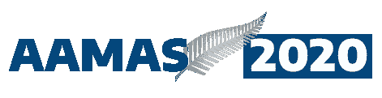
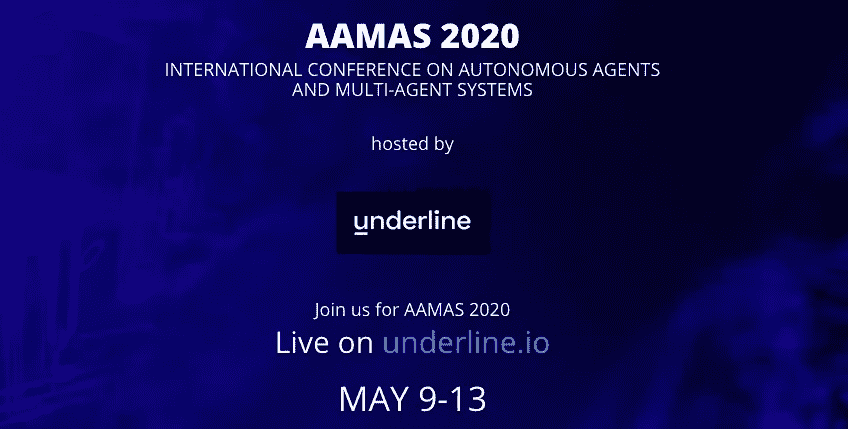

# AAMAS-20:自主代理和多代理系统自由会议

> 原文：<https://towardsdatascience.com/aamas-20-the-free-conference-on-autonomous-agents-and-multi-agent-systems-796599e5a30c?source=collection_archive---------46----------------------->

## 多智能体系统越来越重要。这里有一个免费的资源来学习前沿研究！

*智能体*，可以与其环境或其他智能体进行交互的实体，是人工智能中一个越来越重要的领域。代理可以学习，推理他人，采用规范，并在虚拟和物理环境中与人类互动。该领域包括对人工智能许多领域的贡献，包括博弈论、机器学习、机器人、人机交互、建模和社会选择。虽然大部分工作是基于实验室实验的学术研究，但也有越来越多的实际部署对政府和商业组织产生了直接影响。国际 AAMAS 会议，现在是第 19 届，在网上举行，出席是免费的**，而注册费通常超过 700 美元。**

**本次[会议](https://aamas2020.conference.auckland.ac.nz/)于 5 月 9 日周六开始，为期两天的研讨会和辅导。5 月 11 日星期一至 5 月 13 日星期三有 300 多场论文报告和主题演讲，主讲人包括[卡拉·戈麦斯](https://www.cs.cornell.edu/gomes/)、[艾莉森·赫本斯塔尔](https://environment.leeds.ac.uk/geography/staff/1046/professor-alison-heppenstall)、[谢尔盖·莱文](https://people.eecs.berkeley.edu/~svlevine/)和[托雷·格雷佩尔](https://www.linkedin.com/in/thoregraepel/?originalSubdomain=uk)。ACM SIGAI 自主智能体研究奖演讲将由[穆尼德尔·p·辛格](https://www.csc2.ncsu.edu/faculty/mpsingh/)发表，而[张秀坤·皮特斯](https://www.dominik-peters.de/)将为维克托·莱瑟博士论文颁奖。**

**虽然所有视频都将在 2020 年底之前在 [underline.io](https://underline.io/conferences/19) 上异步观看，但 underline.io 也将支持活动期间的现场问答环节。会议记录将一如既往地在网上免费提供。**

**如果你有兴趣了解更多关于自主代理和多代理系统的令人兴奋的领域，我们希望你能加入我们！**

**-马修·泰勒，代表奥玛组织 20 名主席 Amal El Fallah Seghrouchni 和 Gita Sukthankar**

****

****附加细节****

**自主代理和多代理系统(AAMAS)会议系列聚集了来自世界各地的研究人员，分享该领域的最新进展。它是研究自主代理和多代理系统的理论和实践的首要论坛。第一届 AAMAS 2002 在博洛尼亚举行，随后是墨尔本(2003 年)、纽约(2004 年)、乌特勒支(2005 年)、函馆(2006 年)、檀香山(2007 年)、埃斯托里尔(2008 年)、布达佩斯(2009 年)、多伦多(2010 年)、台北(2011 年)、巴伦西亚(2012 年)、圣保罗(2013 年)、巴黎(2014 年)、伊斯坦布尔(2015 年)、新加坡(2016 年)。本卷是 AAMAS 2020 系列会议中的第 19 次会议，将于 2020 年 5 月在奥克兰举行。**

**AAMAS 2020 邀请提交一般轨道、蓝天想法轨道和展示 JAAMAS(自治代理和多代理系统杂志)论文的轨道，这些论文以前没有在主要会议上展示过。蓝天创意赛道由 Alessandro Ricci 和 Juan Antonio Rodriguez 主持。Rym Zalila-Wenkstern 和 Pı nar Yolum 从过去 12 个月中在 JAAMAS 上发表的论文中征集论文，用于 JAAMAS 演讲。**

**选出了一组地区主席(AC)来帮助监督主要路线的审查过程。ACs 对提交的文件进行了初步检查，并建议立即拒绝那些不符合 AAMAS 范围、提交或格式说明的文件。**

**十个地区的主席与计划主席共同负责任命高级计划委员会(SPC)成员，而高级计划委员会成员反过来又帮助确定了一组强大而多样化的计划委员会(PC)成员。PC 可以审查多个领域。每篇论文都由至少三名 PC 成员审阅，并由一名 SPC 成员监督，确保审阅内容清晰、信息丰富。在作者有机会对评审者做出回应后，SPC 成员主持了一场讨论，在讨论中评审者考虑了彼此以及作者的意见。区域主席反过来与项目主席合作，对论文的接受做出最终决定，以确保一致的高质量。**

**AAMAS 2020 吸引了大量高质量的提交材料:完整论文的总体接受率为 23%(808 份经审查的提交材料中有 186 份被接受)。**

**虽然所有被接受的论文都是高质量的，但从主流中选出的几篇论文被提名为最佳论文奖和 Pragnesh Jay Modi 最佳学生论文奖。最佳论文奖在会上颁发给最佳论文，Pragnesh Jay Modi 最佳学生论文奖颁发给主要由学生撰写的其余最佳论文。最佳学生论文奖是由斯普林格赞助的。这些奖项的提名名单如下，按第一作者姓氏的字母顺序排列；主要由学生撰写的论文标有星号(*)。这些论文还被提名为《人工智能研究杂志》(JAIR)的加速审查。**

*   **Harshavardhan Kamarthi、Priyesh Vijayan、Bryan Wilder、Balaraman Ravindran 和 Milind Tambe。[未知社会网络中的影响力最大化:有效图形采样的学习策略](http://www.ifaamas.org/Proceedings/aamas2020/pdfs/p575.pdf)**
*   **Divya Ramesh、Anthony Z. Liu、Andres J .、Jean Y. Song、Nicholas R. Waytowich 和 Walter S. Lasecki。[昨天的奖励是今天的惩罚:人类对强化学习代理反馈的对比效果](http://www.ifaamas.org/Proceedings/aamas2020/pdfs/p1090.pdf)**
*   **Klaus Weber、Kathrin Janowski、Niklas Rach、Katharina Weitz、Wolfang Minker、Stefan Ultes 和 Elisabeth André。[使用双极加权论证图预测多模态行为适应的说服效果](http://www.ifaamas.org/Proceedings/aamas2020/pdfs/p1476.pdf)**
*   **尚同·张、温德林·贝默和西蒙·怀特森。[深度残余强化学习](http://www.ifaamas.org/Proceedings/aamas2020/pdfs/p1611.pdf)**

**此外，IFAAMAS 影响力论文奖将在会议上颁发给以下两篇论文:**

*   **Ariel D. Procaccia 和 Moshe Tennenholtz。[无钱近似机制设计](https://dl.acm.org/doi/10.1145/1566374.1566401)。《第十届 ACM 电子商务会议论文集》,第 177–186 页，2009 年。**
*   **科特·m·德雷斯纳和皮特·斯通。[自主交叉口管理的多智能体方法](https://jair.org/index.php/jair/article/view/10542)。《人工智能研究杂志》,第 31 卷，第 591–656 页，2008 年。**