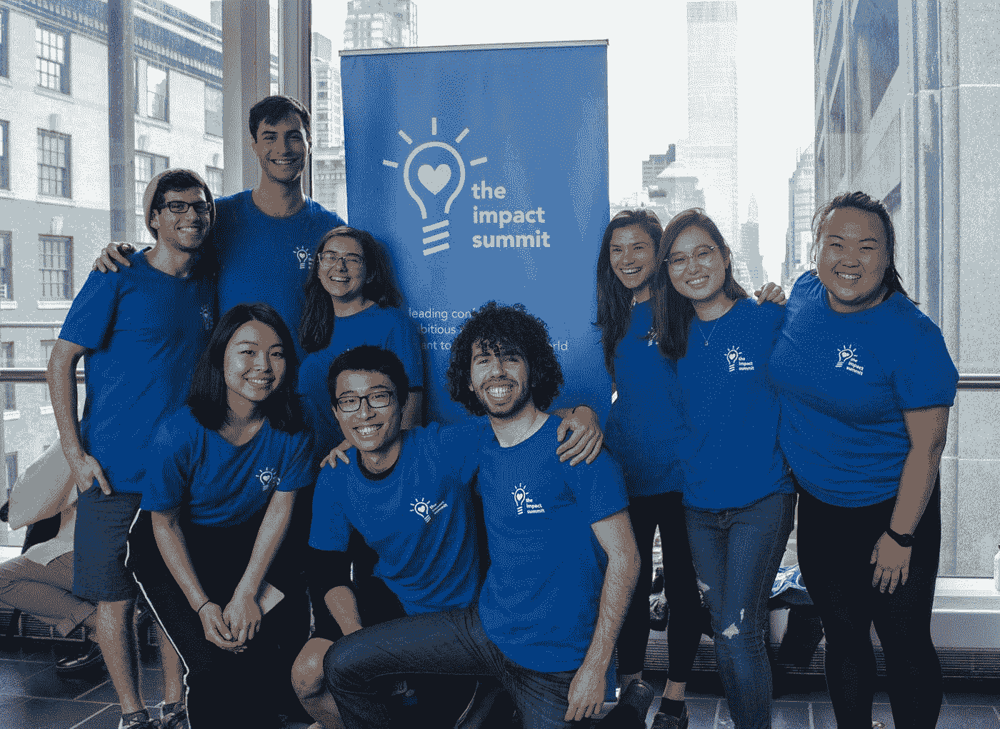
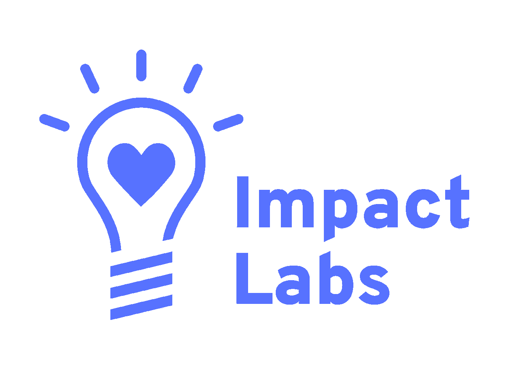
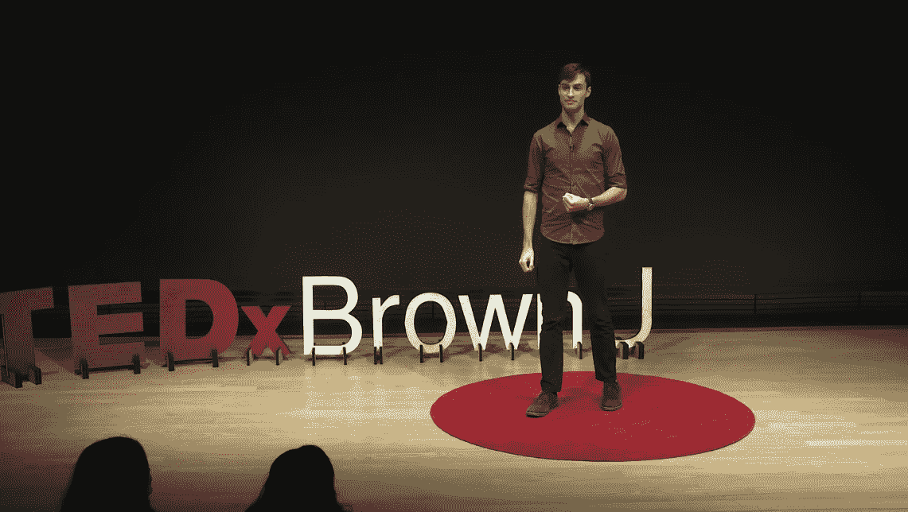
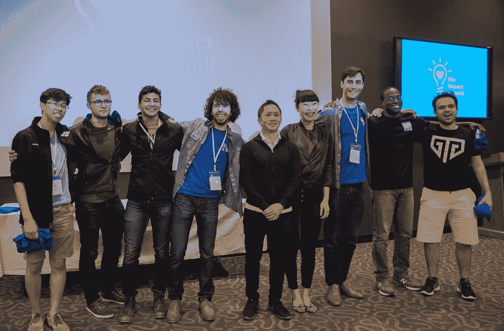
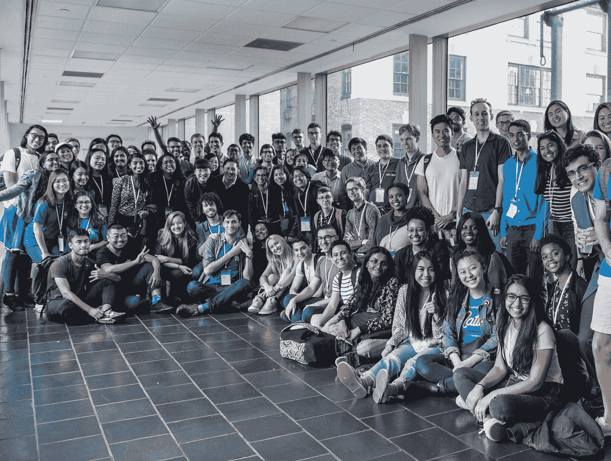

# Aaron Mayer:授权工程师建设更美好的世界

> 原文：<https://towardsdatascience.com/aaron-mayer-empowering-engineers-to-build-a-better-world-3e60faf69de3?source=collection_archive---------72----------------------->

## *技术创新者系列*

## 对 Impact Labs 联合创始人的采访

技术进步正以指数速度增长。数据素养正在成为许多行业的先决条件，许多热门的、新的和高薪的工作都在大型科技巨头那里。现在，比以往任何时候都更加明显的是，这种增长带来了责任——以及围绕可持续技术增长的光明未来的潜力。一个组织站在这场运动的最前沿，让技术人员能够利用他们的技能造福社会。

图片由 Aaron Mayer 提供

Impact Labs 在技术和社会公益之间架起了一座桥梁。他们将学生与经验丰富的社会企业家联系起来，同时在可持续技术领域创造有意义的机会。

> “我意识到，就像很多人一样，技术有巨大的能力来影响世界的变化。”

亚伦·梅尔在布朗大学的宿舍里创建了 Impact Labs。虽然布朗大学约 20%的本科生专注于计算机科学，但这些学生中的大多数最终都在知名科技公司工作。面对这种“看似有限的”职业机会，亚伦开始增加工作的可见性，让学生能够创造积极的社会变革，而不牺牲他们的薪水。为了探索是什么激励他在技术和社会公益的交叉点上进行建设和创新，我和 Aaron 谈论了他的旅程。

图片由 Impact Labs 提供

**Amber:** 你能告诉我们一些你的背景吗？
伦:确定！我从小就是一个笨拙的书呆子，喜欢 STEM，但却选择了人文学科。后来才知道，那些探究的分支其实差别挺小的。在上大学之前，我利用间隔年去了 15 个国家，那是我第一次亲眼目睹贫富之间的严重不平等。

当我终于上学的时候，我学的是哲学，重点是伦理学。后来，我回到了我最初对科学和技术的热爱，我一直在思考，我们认为理所当然的技术工具是如何对那些没有分享我们好运的人的生活产生如此巨大的影响的。我想这最终导致了冲击实验室的建立。

> Impact Labs 在技术和社会公益之间架起了一座桥梁。

你一直都知道在科技领域工作是你想做的吗？
**AM:** 创办公司绝对不在计划之内！如果你在大学问我想做什么，我可能会说我想成为一名科学老师或者一名记者。对我来说，技术和创业文化如影随形，就像他们经常做的那样，但这在很大程度上是偶然的。我记得我在布朗大学期间去过我的校园创业中心，纯粹是因为他们总是在活动中提供免费的印度食物。在大学的这个领域逗留了足够长的时间并结识了新朋友之后，我像许多人一样意识到，技术具有巨大的能力来影响世界的变化。这并不是说，我认为教育和立法等事情不能同样改变世界，但我认为我是被降低的准入门槛所逼:毕竟，任何人都可以创办公司或开发一个应用程序，可以想象这一天可以覆盖数十亿人，这种规模在其他地方真的不存在。

图片由 Aaron Mayer 提供

**AT:** 在您的 TEDx 演讲“我们时代的超级英雄”中，您描述了年轻的理想主义技术专家对构建更加公平和可持续的未来的需求。为什么你认为今天的技术人员在职业生涯中考虑公平、道德和可持续性很重要？简而言之，如果我们不做，就没有人会做。当你听到“科技”这个词时，你可能会想到世界上的微软和 IBM。这些可能是令人敬畏的公司，但解决气候变化、教育不普及、性别不平等、被忽视的热带疾病和贫困的科技公司在哪里？如果工程师代表了我们这一代最优秀、最聪明的头脑，难道他们不应该致力于解决我们作为一个物种所面临的最大、最根深蒂固的挑战吗？

我要补充的是，许多改变世界的公司通常会付出巨大的环境和社会成本。看看苹果和亚马逊的劳工行为，或者谷歌和脸书的侵犯隐私行为，不要让我开始谈论国防工业。我相信，为这些公司制造产品和服务的工程师和技术人员拥有坚强的道德品质和坚定不移的正直是至关重要的:如果他们拒绝制造有害的工具，那么有害的工具就不会被制造出来。

当然，不一定要像在 Snapchat 罢工那么戏剧化。软件工程师、UX 设计师、数据科学家等。都可以尽自己的一份力量，通过大声说出他们工作的公司潜在的有害方面，来降低他们所创造的技术的负面影响。

图片由 Impact Labs 提供

**AT:** Impact Labs 旨在“激励和授权年轻的工程师去建设一个更美好的世界”。Impact Labs 是如何实现这一使命的？
**上午:**我们在 Impact Labs 开展了一系列计划，这些计划都是根据我们的使命设计的。我们主持的第一个节目叫做[影响力奖学金](http://impactlabs.io/fellowship)。一年一度的伙伴计划即将进入第四个年头，它聚集了对社会公益事业充满热情的高素质工程师，他们将在为期两周的时间里作为一个社区一起学习、建设和成长。我们还举办现场活动，例如我们的年度[影响力峰会](http://impactlabs.io/summit)，在这里，年轻的技术专家和早期企业家可以聆听演讲者的演讲，并向社会创业领域的研讨会领导者学习，他们正在利用技术建立一个更加公平、可持续的社会。此外，我们还开展了一项名为 [The Impact Coalition](http://impactlabs.io/coalition) 的招聘计划，这基本上是高影响力组织的常用应用程序:一名工程师提交一份申请，然后我们会在我们投资组合中的数十家公司中为他们找到与他们的技能和兴趣最匹配的工作。此外，如果我可以自夸的话，我们有一个精彩的双周刊[时事通讯](https://airtable.com/shrn3Sw913prQ2y6W)，它汇集了社会影响世界技术中的机会和新闻更新，发给 5000 多名年轻工程师，所以我对此非常自豪。在不久的将来，我们一直在探索直接与大学合作的方法，让他们在计算机科学课程中实施道德要求。顺便说一句，所有这些项目都是 20 位不可思议的队友贡献的直接结果，如果没有他们的奉献和承诺，Impact Labs 就不会有今天的成就。我喜欢与他们合作，在一个我们都相信的项目上一起工作是一种快乐！

图片由 Aaron Mayer 提供

**AT:** 你认为下一代有抱负的技术人员面临的最大挑战是什么，目前在行业中的数据科学家可以做些什么来帮助他们？
**AM:** 目前，我认为最大的挑战是有悖常理的经济激励。请原谅我戴上马克思主义的帽子，众所周知，大多数公司都有基于利润的生存和发展动机，这也是我之前提到的有害副作用的最常见原因。然而，因为科技公司如此富有，他们可以支付(高得离谱的)高薪给数据科学家、机器学习专家和其他保持引擎运转的工程师。太多聪明、理想主义的技术专家被六位数的薪水所诱惑，我有太多的朋友向我承认，如果不是为了钱，他们根本不可能在帕兰蒂尔或高盛这样的机构工作。

这就是为什么我们在 Impact Labs 尽最大努力向那些通过行善而获得成功的公司展示通向有意义职业生涯的道路。当你为一家社会创业公司工作时，这并不是说你将自己托付给了贫困的生活，以我自己的经验来看，为你真正支持的使命工作的感觉是无价的。

**AT:** 对于其他有志于发展职业生涯并在行业中产生积极社会影响的技术专家和工程师，你有什么建议？
**AM:** 开始点什么！说真的，我知道这是老生常谈，但你通过自己尝试和失败学到的东西比做任何其他事情都多。

如果你完全确定成为一名创始人不是你想要的(我会再次确认这种确定性，因为成为一名创始人可能非常有趣！)，那么我的建议是这样的:从你的理想职业向后工作。如果你想成为白宫的首席技术官，那么今天就开始采取措施，你有证据表明这些措施会让你在未来走上这个职位的轨道。谷歌一下那些拥有你梦想工作的人，试着模仿他们的传记——更好的是，直接联系他们！如果你带着强烈的好奇心和爱去接近他们，你会惊讶于人们是多么的容易接受！

> "许多改变世界的公司往往以巨大的环境和社会成本为代价."

**AT:** 我们的读者如何参与 Impact Labs？
**AM:** 很多方法！第一件也是最简单的事情就是[在这里注册订阅我们的时事通讯](https://airtable.com/shrn3Sw913prQ2y6W)！你也可以关注我们的[脸书页面](https://www.facebook.com/impactlabs.io)和[推特](https://twitter.com/impactlabs_io)，并加入我们的[脸书群](https://www.facebook.com/groups/impactlabs.io)！我们将在今年 8 月举办下一次峰会，它将完全在线，所有人都可以访问，所以你应该完全参与！详情及在[impactlabs.io/summit](https://www.impactlabs.io/summit/)报名！

最后，虽然 Impact Labs 并没有明确加入有效利他主义运动，但如果你还不熟悉的话，你绝对应该去看看 EA。我们在 Impact Labs 所做的大部分工作都明确遵循 EA 的原则，如果你对改变你的职业感兴趣，这是一个很好的方式来开始问自己一些基本的问题，关于你如何才能做到最好。

图片由 Impact Labs 提供

Impact Labs 在技术和社会公益的核心领域引领可持续创新。Impact Labs 不仅将热情的学生与利用技术产生社会影响的领导者联系起来，还建立了一个聚焦全球发展未来的社区。

*特别感谢 Aaron Mayer 允许我为这个系列采访他，也非常感谢 TDS 编辑团队对这个项目的支持。*

你认识一位鼓舞人心的技术专家，你希望他出现在这个系列中吗？你是否正在从事任何你希望我写的很酷的数据科学和技术项目？欢迎给我发电子邮件，向 angelamarieteng@gmail.com 寻求意见和建议。感谢阅读！

[1]https://www . brownalumnimagazine . com/articles/2019-09-09/hi-tech-ethics
【2】[https://www.youtube.com/watch?v=zrjNBWMY8qM](https://www.youtube.com/watch?v=zrjNBWMY8qM)

## **参考文献:**

"恩尼格玛福音传道者和 Impact Labs 创始人在普林斯顿——新泽西州技术周刊发表演讲."n.d .于 2020 年 5 月 26 日获得。https://njtechweekly . com/enigma-evangelist-and-impact-labs-founder-speaks-in-Princeton/。

“影响实验室——联盟。”n.d .于 2020 年 5 月 26 日获得。https://www.impactlabs.io/coalition/.

“影响实验室—峰会”n.d .于 2020 年 5 月 26 日获得。【https://www.impactlabs.io/summit/. 

“影响实验室——伙伴关系。”n.d .于 2020 年 5 月 26 日获得。[https://www.impactlabs.io/fellowship/.](https://www.impactlabs.io/fellowship/.)

"可持续技术发展的问题—影响实验室—中等."n.d .于 2020 年 5 月 26 日获得。[https://medium . com/impact-labs/the-question-of-sustainable-technology-growth-aaea 7 B3 B4 f 4。](https://medium.com/impact-labs/the-question-of-sustainable-technological-growth-aaea7b3b4f4.)

"见艾伦·梅尔(Enigma，Impact Labs)在普林斯顿的初创公司 Grind . "n.d .于 2020 年 5 月 26 日获得。[https://www . startup grind . com/events/details/startup-grind-Princeton-presents-aaron-Mayer-enigma-impact-labs/。](https://www.startupgrind.com/events/details/startup-grind-princeton-presents-aaron-mayer-enigma-impact-labs/.)

"高科技伦理|布朗校友杂志."n.d .于 2020 年 5 月 26 日获得。[https://www . brownalumnimagazine . com/articles/2019-09-09/hi-tech-ethics。](https://www.brownalumnimagazine.com/articles/2019-09-09/hi-tech-ethics.)

“(340)我们这个时代的超级英雄|亚伦·梅尔| TEDxBrownU——YouTube。”n.d .于 2020 年 5 月 26 日获得。[https://www.youtube.com/watch?v=zrjNBWMY8qM.](https://www.youtube.com/watch?v=zrjNBWMY8qM.)

“冲击实验室”n.d .于 2020 年 5 月 26 日获得。[https://www.impactlabs.io/.](https://www.impactlabs.io/.)