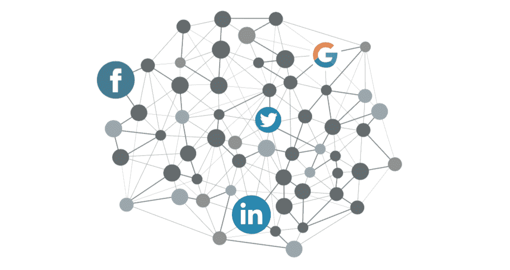
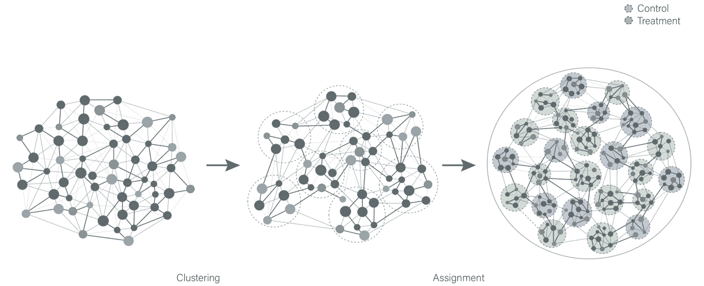

# 社交网络中的 AB 测试挑战

> 原文：<https://towardsdatascience.com/ab-testing-challenges-in-social-networks-e67611c92916?source=collection_archive---------11----------------------->

## *脸书和他的同事如何在 AB 测试中克服互联用户的挑战*

AB 测试的概念听起来很简单:将用户随机分配到控制组或治疗组，并检查治疗组的用户与控制组相比，是否表现出想要的行为变化(或任何变化)。但是，如果用户之间相互作用，以至于在控制组和治疗组之间画一条直线变得几乎不可能，会发生什么呢？

脸书、谷歌和 LinkedIn 等公司因其 AB 测试工作而广为人知。但是，考虑到他们产品的高度互联性，他们都面临上述问题，这可能会在实验结果中产生偏差，甚至更糟的是损害他们用户的体验。那么这些公司是如何解决这些问题的呢？

# 社交网络中 AB 测试的挑战

在进行 AB 测试时，人们通常假设每个人在测试中的反应只取决于自己的任务，而不取决于其他人的任务。这就是所谓的*稳定单位治疗值假设(SUTVA)* 。

但让我们假设一个大型社交网络平台，如 LinkedIn 或脸书，测试一种改进的算法，使其订阅源与用户更相关，目标是增加内容的参与度。如果用户 A 在治疗组中，并且与控制组中的用户 B 相联系，则用户 A 的行为变化可能会影响用户 B 的行为。用户 A 可能表现出对订阅源上的改进内容的参与度增加，从而开始共享更多的帖子、图片和文章。这将最终对用户 B 产生影响，用户 B 可能在没有接触到新体验的情况下就开始做同样的事情。

治疗的成功以治疗组和对照组之间平均结果的差异来衡量。例如，可以检查转换率的差异。这就是所谓的*平均治疗效果* (ATE)。溢出效应，就像在社会网络中发现的那样，会使平均治疗效果产生偏差，因为治疗组中引入的变化带来的好处再也无法准确捕捉。在新闻反馈的新算法的情况下，溢出效应可能不仅会导致治疗组的参与度增加，也会导致对照组的参与度增加。这是因为控制组中的用户也可能被鼓励更多地参与他们的提要。然而，这冲淡了治疗的积极效果，当在社交网络中使用标准 AB 测试方法时，最终会导致错误的结论。

除了偏向统计结果的风险，社交网络或协作应用中的 AB 测试也可能带来一些 UX 挑战。例如，在视频聊天应用程序或高度协作应用程序(如 Google Docs)中测试新功能时。如果正在进行视频通话或正在协作处理同一文档的用户没有相同的功能，这可能会导致混乱并恶化用户体验，从而引发诸如*“您没有看到右下角新的黄色按钮吗？”*。

> AB 测试的经典方法可能会由于有偏见的统计结果而误导业务决策，同时严重损害用户体验。

# 巢式抽样法

*集群抽样*，又称网络分桶，是处理溢出效应的常用方法。我们的目标是将用户分为治疗组和控制组，这样各组之间的交互就尽可能少。当进行 AB 测试时，用户通常被随机分配到不同的变体，这导致了前面提到的溢出效应。取而代之的是集群抽样，随机化是在**用户集群级别**上进行的。换句话说，如果用户是控制组的一部分，他们的直接网络连接的重要部分也被分配给控制组。

(社会)网络中的整群抽样(自有图形)。

以最小化它们之间的信息流的方式分割这些组是一个复杂的挑战，其中可以使用各种各样的聚类算法来实现这个目标。一种叫做 *e-net* 的方法基于以下想法:

1.  找到 k 个节点作为聚类中心，它们之间的距离大于特定阈值
2.  将剩余节点随机分配到它们最近的中心

在协作应用中，例如谷歌云平台，可以使用更确定的方法来创建这些集群。相互交流的用户数量受到他们一起工作的项目数量的限制。因此，可以创建在相同项目上工作的用户群，从而将群之间的溢出效应降低到接近 0(如果用户加入不同群中的用户所拥有的新项目，溢出效应仍然会发生)。

聚集一个实验小组有其自身的挑战。例如，在网络中的集群大小和集群数量之间存在权衡。一方面，为了实现 AB 检验的高统计功效，优选具有尽可能多的单位。另一方面，用户组中不同集群的数量越多，这些集群就越不孤立。例如，如果只有一个或两个集群，溢出效应将远远小于有 100 个或更多集群的情况。在处理组之间具有相等的集群大小是另一个要求，这有助于减少方差和增加测试的功效。

# AB 测试集群

一旦实验组被组织成组，这些组可以被分配给控制或处理单元。然后在集群上进行测试。首先在聚类水平上计算转化率等指标，然后在治疗组水平上再次进行平均。最终，这些结果可用于计算平均治疗效果。

这种方法也可以用来证明网络效应的普遍存在。例如，当运行一个实验时，一个在用户级别随机化的 AB 测试可以与另一个在集群级别随机化的测试并行运行。如果两种设置的平均治疗效果有显著差异，这可以被视为网络效应存在的证据。

# 进一步的挑战

在一个集群上而不是在一个用户层面上进行随机化，只能解决在社交网络中进行 AB 测试时出现的部分问题。另一个需要考虑的挑战是，在将用户划分为集群时，用户之间连接的强度和方向。与脸书或 LinkedIn 相比，Instagram 和 Twitter 等网络的结构非常不同。在这些网络中扮演重要角色的影响者是一个相对较小的用户群体，他们能够对许多用户产生巨大的影响。与此同时，这些联系大多是单向的:影响者可以对其追随者产生影响，但反之则不然。

想象一个极端的情况，其中一个用户非常有名，网络中的所有其他用户都追随他。该用户可以影响所有这些用户，无论网络如何划分。但是，在不太极端的情况下，溢出效应可能无法通过简单地将用户聚集到关系最密切的群体中来减少。解决这一挑战的可能方法是使用影响者作为初始聚类中心，并通过多数投票将剩余用户分配给这些聚类。

# 结论

一般来说，AB 测试是一个被广泛使用和深入研究的领域。与此同时，社交网络中的 AB 测试所带来的挑战还远未解决，仍有待深入研究。无论是找到正确的聚类方法还是平均治疗效果的理想估计值，仍然有许多挑战需要克服。但由于 AB 测试是脸书和 Twitter 等大型科技公司所有产品开发活动的核心，人们可以放心，克服这些非常有趣的挑战的新方法和方法论将会发展。

## 参考

对本文有帮助并提供更详细概述的论文和文章:

*   [网络 AB 测试:从抽样到估计](https://hanj.cs.illinois.edu/pdf/www15_hgui.pdf)
*   [在协作网络中设计 A/B 测试](http://www.unofficialgoogledatascience.com/2018/01/designing-ab-tests-in-collaboration.html)
*   [使用定向用户图对社交网络服务进行 A/B 测试](http://www.tkl.iis.u-tokyo.ac.jp/~kenn-chen/files/AB%20Testing%20for%20Social%20Network%20Services%20with%20Directed%20User%20Graphs.pdf)
*   [检测网络效应:在随机实验中随机化](http://web.media.mit.edu/~msaveski/assets/publications/2017_detecting_network_effects/paper.pdf)
*   [图簇随机化:网络暴露于多个世界](http://chbrown.github.io/kdd-2013-usb/kdd/p329.pdf)

## **更多关于 AB 测试的文章:**

 [## 在 AB 测试中解锁偷看

### 像 Optimizely 这样的实验平台是如何忽略 AB 测试中最基本的原则之一的

towardsdatascience.com](/unlocking-peeking-in-ab-tests-7847b9c2f6bb)  [## AB 测试:利润和社会责任之间的权衡？

### 产品开发中最重要的工具之一的副作用几乎没有人想到

medium.com](https://medium.com/swlh/ab-testing-a-trade-off-between-profit-and-social-responsibility-5d6394dc9eea)