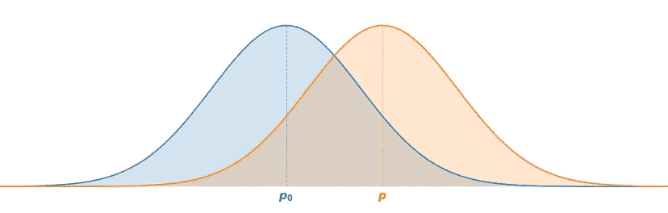
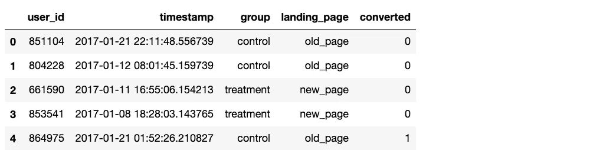
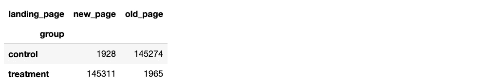
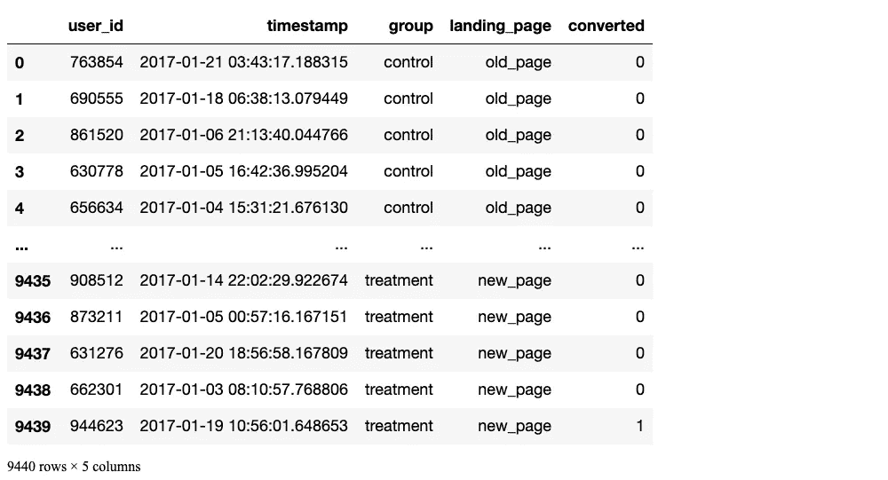
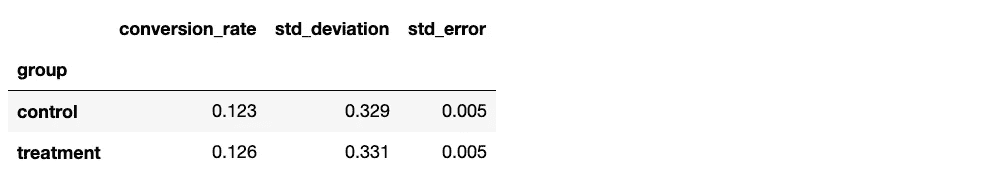
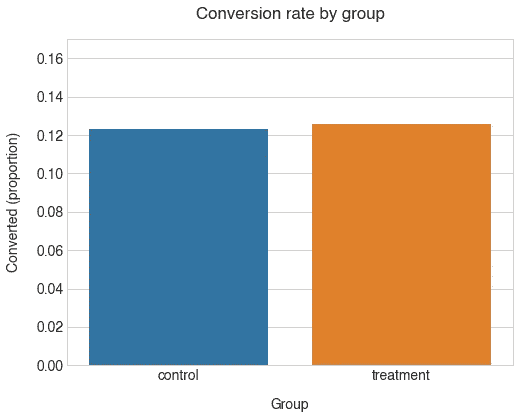

# A/B 测试:Python 中的分步指南

> 原文：<https://towardsdatascience.com/ab-testing-with-python-e5964dd66143?source=collection_archive---------0----------------------->

## 从实验设计到假设检验



作者图片

在这篇文章中，我们将回顾分析 A/B 实验的过程，从制定假设，测试它，最后解释结果。对于我们的数据，我们将使用来自 Kaggle 的一个[数据集，它包含对一个网站页面的两种不同设计(旧页面与新页面)进行 A/B 测试的结果。如果你想了解我使用的代码，请随意在我的 GitHub 页面](https://www.kaggle.com/zhangluyuan/ab-testing?select=ab_data.csv)[下载 jupyter 笔记本](https://github.com/renatofillinich/ab_test_guide_in_python)。

这是我们要做的:

1.  [设计我们的实验](#1.-Designing-our-experiment)
2.  [收集和准备数据](#2.-Collecting-and-preparing-the-data)
3.  [可视化结果](#3.-Visualising-the-results)
4.  [检验假设](#4.-Testing-the-hypothesis)
5.  [得出结论](#5.-Drawing-conclusions)

为了更现实一点，这里有一个潜在的**场景**供我们研究:

> 让我们想象一下，你在一家中型**在线电子商务企业**的产品团队工作。UX 的设计师非常努力地设计了新版本的产品页面，希望它能带来更高的转化率。产品经理(PM)告诉您，当前的**转换率**全年平均约为 **13%** ，团队会对 2% 的**增长感到满意，这意味着如果新设计将转换率提高到 15%，则认为新设计是成功的。**

在推出变更之前，团队更愿意在少量用户身上测试它，看看它的表现如何，所以你建议在你的用户群用户的子集上运行 **A/B 测试**。

## 1.设计我们的实验

## 阐明一个假设

首先，我们要确保在项目开始时制定一个假设。这将确保我们对结果的解释既正确又严谨。

假设我们不知道新设计的表现会更好还是更差(还是一样？)作为我们目前的设计，我们将选择一个 [**双尾检验**](https://en.wikipedia.org/wiki/One-_and_two-tailed_tests) :

> Hₒ: *p* = *p* ₒ
> 
> hₐ:*p*≦*p*ₒ

其中 ***p*** 和 ***p* ₒ** 分别代表新旧设计的转换率。我们还将**置信度设为 95%** :

> α = 0.05

**α** 值是我们设定的一个阈值，通过这个阈值我们说“如果观察到一个结果为极值或更大的概率(***p*-值**)低于 **α** ，那么我们拒绝零假设”。由于我们的 **α=0.05** (表示 5%概率)，我们的置信度(1 — **α** )是 95%。

如果您不熟悉以上内容，请不要担心，所有这些实际上意味着，无论我们在测试中观察到新设计的转换率是多少，在我们决定拒绝零假设 Hₒ.之前，我们都希望有 95%的把握认为它在统计上不同于旧设计的转换率

## 选择变量

对于我们的测试，我们需要两个组:

*   一个小组——他们将被展示旧的设计
*   一个`treatment`(或实验)组——他们将被展示新的设计

这将是我们的*自变量*。尽管我们知道基准转换率，但我们之所以有两组，是因为我们希望控制可能对我们的结果产生影响的其他变量，如季节性:通过有一个`control`组，我们可以直接将他们的结果与`treatment`组进行比较，因为两组之间唯一的系统差异是产品页面的设计，因此我们可以将结果中的任何差异归因于设计。

对于我们的*因变量*(即我们试图测量的东西)，我们感兴趣的是捕捉`conversion rate`。我们可以用一个二进制变量对每个用户会话进行编码:

*   `0` -用户在本次用户会话中没有购买产品
*   `1` -用户在本次用户会话中购买了产品

这样，我们可以很容易地计算出每组的平均值，从而得到每个设计的转化率。

## 选择样本大小

值得注意的是，由于我们不会测试整个用户群(我们的[人口](https://www.bmj.com/about-bmj/resources-readers/publications/statistics-square-one/3-populations-and-samples)，我们得到的转换率将不可避免地只是真实转换率的*估计值*。

我们决定在每个组中捕获的人数(或用户会话)将对我们估计的转化率的精确度产生影响:**样本量**越大，我们的估计就越精确(即，我们的置信区间越小)，**在两组中发现差异的机会就越高**，如果存在差异的话。

另一方面，我们的样本越大，我们的研究就变得越昂贵(和不切实际)。

那么每组应该有多少人呢？

我们需要的样本大小是通过所谓的 [*功效分析*](https://research.usu.edu//irb/wp-content/uploads/sites/12/2015/08/A_Researchers_Guide_to_Power_Analysis_USU.pdf) 来估计的，它取决于几个因素:

*   **检验的功效** (1 — β) —这表示当差异实际存在时，在我们的检验中发现组间统计差异的概率。按照惯例，这通常设置为 0.8(如果你好奇，这里有更多关于[统计能力](https://en.wikipedia.org/wiki/Power_of_a_test)的信息)
*   **α值** (α) —我们之前设置的临界值为 0.05
*   **效应大小**——我们预期转换率之间的差异有多大

由于我们的团队对 2%的差异感到满意，我们可以使用 13%和 15%来计算我们预期的效果大小。

幸运的是， **Python 为我们处理了所有这些计算**:

```
# Packages imports
import numpy as np
import pandas as pd
import scipy.stats as stats
import statsmodels.stats.api as sms
import matplotlib as mpl
import matplotlib.pyplot as plt
import seaborn as sns
from math import ceil

%matplotlib inline

# Some plot styling preferences
plt.style.use('seaborn-whitegrid')
font = {'family' : 'Helvetica',
        'weight' : 'bold',
        'size'   : 14}

mpl.rc('font', **font)effect_size = sms.proportion_effectsize(0.13, 0.15)    # Calculating effect size based on our expected rates

required_n = sms.NormalIndPower().solve_power(
    effect_size, 
    power=0.8, 
    alpha=0.05, 
    ratio=1
    )                                                  # Calculating sample size needed

required_n = ceil(required_n)                          # Rounding up to next whole number                          

print(required_n)
```

> `4720`

我们需要**每组至少 4720 次观察**。

在实践中将`power`参数设置为 0.8 意味着，如果我们的设计之间的转换率存在实际差异，假设该差异是我们估计的差异(13%对 15%)，我们有大约 80%的机会在使用我们计算的样本量进行的测试中将其检测为具有统计显著性。

## 2.收集和准备数据

很棒的东西！现在我们有了所需的样本量，我们需要收集数据。通常在这一点上，你会和你的团队一起建立实验，可能是在工程团队的帮助下，并确保根据所需的样本大小收集足够的数据。

但是，由于我们将使用我们在网上找到的数据集，为了模拟这种情况，我们将:

1.  从 Kaggle 下载[数据集](https://www.kaggle.com/zhangluyuan/ab-testing?select=ab_data.csv)
2.  将数据读入熊猫数据框
3.  根据需要检查和清理数据
4.  从每个组的数据帧中随机抽取`n=4720`行*

* **注**:正常情况下，我们不需要执行步骤 4，这只是为了练习

因为我已经下载了数据集，我将直接进入第二个问题。

```
df = pd.read_csv('ab_data.csv')

df.head()
```



```
df.info()<class 'pandas.core.frame.DataFrame'>
RangeIndex: 294478 entries, 0 to 294477
Data columns (total 5 columns):
 #   Column        Non-Null Count   Dtype 
---  ------        --------------   ----- 
 0   user_id       294478 non-null  int64 
 1   timestamp     294478 non-null  object
 2   group         294478 non-null  object
 3   landing_page  294478 non-null  object
 4   converted     294478 non-null  int64 
dtypes: int64(2), object(3)
memory usage: 11.2+ MB# To make sure all the control group are seeing the old page and viceversa

pd.crosstab(df['group'], df['landing_page'])
```



数据帧中有 **294478 行**，每一行代表一个用户会话，还有 **5 列**:

*   `user_id` -每个会话的用户 ID
*   `timestamp` -会话的时间戳
*   `group` -用户在该会话中被分配到哪个组{ `control`，`treatment` }
*   `landing_page` -每个用户在该会话中看到哪个设计{ `old_page`，`new_page` }
*   `converted` -会话是否以转换结束(二进制，`0`=未转换，`1`=已转换)

我们实际上将只使用`group`和`converted`列进行分析。

在我们继续对数据进行采样以获得我们的子集之前，让我们确保没有被采样多次的用户。

```
session_counts = df['user_id'].value_counts(ascending=False)
multi_users = session_counts[session_counts > 1].count()

print(f'There are {multi_users} users that appear multiple times in the dataset')
```

> `There are 3894 users that appear multiple times in the dataset`

事实上，有 3894 个用户不止一次出现。由于这个数字非常低，我们将继续从数据帧中删除它们，以避免对相同的用户进行两次采样。

```
users_to_drop = session_counts[session_counts > 1].index

df = df[~df['user_id'].isin(users_to_drop)]
print(f'The updated dataset now has {df.shape[0]} entries')
```

> `The updated dataset now has 286690 entries`

## 抽样

现在我们的数据框架已经很好很干净了，我们可以继续对每个组的`n=4720`条目进行采样。我们可以使用 pandas 的`DataFrame.sample()`方法来做到这一点，它将为我们执行简单的随机抽样。

**注意**:我已经设置了`random_state=22`，这样如果你想在你自己的笔记本上跟随，结果是可重复的:只要在你的函数中使用`random_state=22`，你应该得到和我一样的样本。

```
control_sample = df[df['group'] == 'control'].sample(n=required_n, random_state=22)
treatment_sample = df[df['group'] == 'treatment'].sample(n=required_n, random_state=22)

ab_test = pd.concat([control_sample, treatment_sample], axis=0)
ab_test.reset_index(drop=True, inplace=True)ab_test
```



```
ab_test.info()
```

> `<class 'pandas.core.frame.DataFrame'>
> RangeIndex: 9440 entries, 0 to 9439
> Data columns (total 5 columns):
> # Column Non-Null Count Dtype
> --- ------ -------------- -----
> 0 user_id 9440 non-null int64
> 1 timestamp 9440 non-null object
> 2 group 9440 non-null object
> 3 landing_page 9440 non-null object
> 4 converted 9440 non-null int64
> dtypes: int64(2), object(3)
> memory usage: 368.9+ KB`

```
ab_test['group'].value_counts()
```

> `control 4720
> treatment 4720
> Name: group, dtype: int64`

很好，看起来一切都按计划进行，我们现在可以分析我们的结果了。

## 3.可视化结果

我们可以做的第一件事是计算一些基本的统计数据来了解我们的样本是什么样的。

```
conversion_rates = ab_test.groupby('group')['converted']

std_p = lambda x: np.std(x, ddof=0)              # Std. deviation of the proportion
se_p = lambda x: stats.sem(x, ddof=0)            # Std. error of the proportion (std / sqrt(n))

conversion_rates = conversion_rates.agg([np.mean, std_p, se_p])
conversion_rates.columns = ['conversion_rate', 'std_deviation', 'std_error']

conversion_rates.style.format('{:.3f}')
```



从上面的数据来看，我们的两个设计看起来确实很相似**，我们的新设计表现略好，大约。 **12.3%对 12.6%的转化率**。**

**绘制数据将使这些结果更容易掌握:**

```
plt.figure(figsize=(8,6))

sns.barplot(x=ab_test['group'], y=ab_test['converted'], ci=False)

plt.ylim(0, 0.17)
plt.title('Conversion rate by group', pad=20)
plt.xlabel('Group', labelpad=15)
plt.ylabel('Converted (proportion)', labelpad=15);
```

****

**我们组的转化率确实非常接近。还要注意的是，根据我们对平均转化率的了解，第`control`组的转化率低于我们的预期。转化率(12.3%对 13%)。这表明，从总体中取样时，结果会有一些变化。**

**所以……这个`treatment`组的价值更高。**这种差异*有统计学意义*** 吗？**

## **4.检验假设**

**我们分析的最后一步是检验我们的假设。由于我们有一个非常大的样本，我们可以使用[正态近似值](https://en.wikipedia.org/wiki/Binomial_proportion_confidence_interval#Normal_approximation_interval)来计算我们的*p*-值(即 z 检验)。**

**同样，Python 使得所有的计算变得非常简单。我们可以使用`statsmodels.stats.proportion`模块来获得*p*-值和置信区间:**

```
from statsmodels.stats.proportion import proportions_ztest, proportion_confintcontrol_results = ab_test[ab_test['group'] == 'control']['converted']
treatment_results = ab_test[ab_test['group'] == 'treatment']['converted']n_con = control_results.count()
n_treat = treatment_results.count()
successes = [control_results.sum(), treatment_results.sum()]
nobs = [n_con, n_treat]

z_stat, pval = proportions_ztest(successes, nobs=nobs)
(lower_con, lower_treat), (upper_con, upper_treat) = proportion_confint(successes, nobs=nobs, alpha=0.05)

print(f'z statistic: {z_stat:.2f}')
print(f'p-value: {pval:.3f}')
print(f'ci 95% for control group: [{lower_con:.3f}, {upper_con:.3f}]')
print(f'ci 95% for treatment group: [{lower_treat:.3f}, {upper_treat:.3f}]')
```

> **`z statistic: -0.34
> p-value: 0.732
> ci 95% for control group: [0.114, 0.133]
> ci 95% for treatment group: [0.116, 0.135]`**

## **5.得出结论**

**由于我们的***p*-值=0.732 远远高于我们的α=0.05** 阈值，我们不能拒绝零假设 Hₒ，这意味着**我们的新设计与旧设计相比并没有显著的不同(更不用说更好了):(****

**此外，如果我们观察`treatment`组的置信区间([0.116，0.135]，或 11.6-13.5%)，我们注意到:**

1.  **它包括我们 13%转化率的基线值**
2.  **它不包括我们的目标值 15%(我们的目标是提高 2%)**

**这意味着新设计的真实转换率更有可能与我们的基线相似，而不是我们希望的 15%的目标。这进一步证明了我们的新设计不可能比我们的旧设计有所改进，不幸的是我们又回到了起点！**

> **你喜欢我的故事吗？请让我知道！**
> 
> **请随意在我的 GitHub 页面下载 jupyter 笔记本。**