# ABBYY NeoML:我们如何创建开源机器学习库以及我们为什么需要它

> 原文：<https://towardsdatascience.com/abbyy-neoml-how-we-made-the-open-source-machine-learning-library-and-why-we-need-it-dc0a13e4c3f?source=collection_archive---------46----------------------->

[用户 12683362](https://www.freepik.com/user12683362) 在 [freepik](https://www.freepik.com/premium-photo/hand-touching-telecommunication-network-wireless-mobile-internet-technology-with-5g-lte-data-connection-global-business-fintech-blockchain_5988680.htm) 上的照片

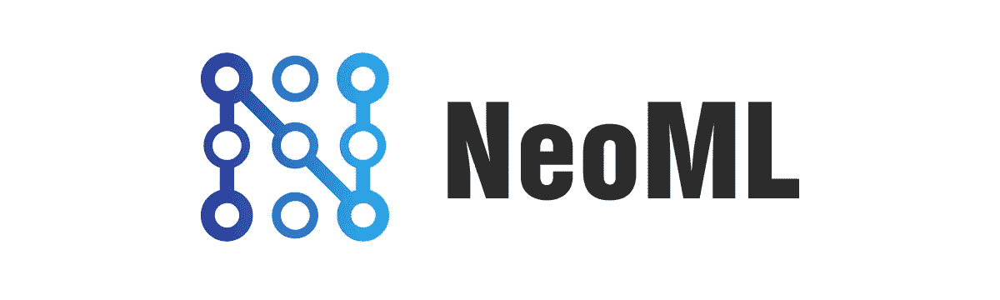

*该框架为软件开发者提供了强大的深度学习和传统的机器学习算法，用于创建推动数字化转型的应用。*

数字智能公司 ABBYY 推出了 [NeoML](https://cts.businesswire.com/ct/CT?id=smartlink&url=https%3A%2F%2Fgithub.com%2Fneoml-lib&esheet=52235643&newsitemid=20200616005112&lan=en-US&anchor=NeoML&index=1&md5=2d6d047d552f3d145ed989f9a476f3bb) ，这是一个用于构建、训练和部署机器学习模型的开源库。NeoML 现已在 GitHub 上发布，支持深度学习和传统的机器学习算法。跨平台框架针对在云环境、桌面和移动设备上运行的应用程序进行了优化。根据下面显示的测试，与流行的开源库相比，NeoML 为在任何设备上运行的预训练图像处理模型提供了 15–20%的更快性能。更高的推理速度与平台无关性相结合，使该库成为需要无缝客户体验和设备上数据处理的移动解决方案的理想选择。

NeoML 是一个跨平台的 C ++库，它允许你组织一个完整的 ML 模型开发周期。它的主要重点是在各种平台上简单有效地推出现成的模型。即使这些模型是由其他框架创建的。

> ABBYY 的人工智能宣传员 Ivan Yamshchikov 表示:“NeoML 的推出反映了我们致力于推动全行业人工智能创新的承诺。“ABBYY 拥有超过 400 项专利和专利申请的技术创新记录。共享我们的框架允许开发人员利用它的推理速度、跨平台能力，特别是它在移动设备上的潜力，同时他们的反馈和贡献将增长和改进库。我们很高兴推动人工智能的进步，并支持机器学习应用于越来越高价值和有影响力的用例。”

你可能会问:为什么我们需要另一个机器学习库？

下面我来回答这个问题，告诉你我们在 ABBYY 是怎么创建我们的库的，遇到了什么困难，最后发生了什么。

## ABBYY 开始机器学习的地方

机器学习和人工智能的发展长期以来一直是 ABBYY 数字智能技术的一部分。随着时间的推移，很明显 ML 的工作需要统一。我们开始思考如何以最干净、最简单、最有效的方式改进我们的机器学习工厂。该公司几乎所有的代码都是用 C ++编写的——这意味着我们需要一个 C / C ++解决方案。然而，没有一个 C ++框架能满足我们所有的需求。当然，现在有不同的库实现不同的功能。比如 Liblinear，XGBoost，Scikit-learn，Libsvm，Caffe，TensorFlow 等。我们开始分析他们的能力。

大多数库适合于研究目的，但不适合于生产。他们的代码需要大量的修改:日志、错误处理、内存管理。此外，许多额外的功能，不同的构建系统，额外的依赖。不是每个人都有 C ++界面。库发展和变化很快，并且不总是可预测的；他们的表现和稳定性引发了质疑，没有人承诺支持。我们别无选择，只能开始我们自己的发展，所以我们决定创建我们自己的图书馆，在里面收集我们需要的一切，然后我们为自己决定未来的道路。

马库斯·斯皮斯克在 [Unsplash](https://unsplash.com?utm_source=medium&utm_medium=referral) 上的照片

## 经典算法

开源库 Liblinear、Libsvm、Scikit-learn 和 XGBoost 已经存在，并且非常有用。我们开始利用它们，但是在分析了它们的能力之后，我们用我们需要的东西实现了类似的想法，并且增加了一些优化。例如，我们只处理适合内存的样本，只在 CPU 上处理，不进行低级优化。因此，经典算法的速度在我们的问题中并不是瓶颈，所以我们并没有认真努力去优化它们，但是我们成功地超越了上述类似算法的速度。

统一产生了良好的效果:培训变得更快，质量更高。发展速度也提高了。每个程序员不再需要重新发明轮子——一个人现在可以简单地使用默认设置，并立即得到一个结果，而在此之前他们至少要花几天的时间进行实验。

因此，库中出现了解决分类、回归和聚类问题的方法。

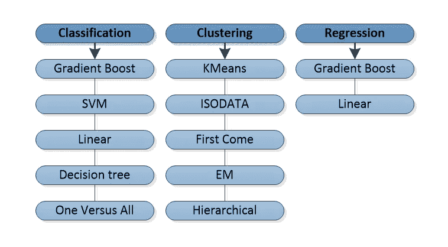

在我看来，经典算法的实现并不是一项非常困难的任务，神经网络的情况更有趣。

## 神经网络

经典算法本质上是一组使用公共原语的独立方法。但是神经网络的实现要困难得多。除了数学和算法问题之外，非显而易见的架构和底层优化问题也出现在其中。

在查看了当时存在的 Caffe 和 TensorFlow 库之后，我们认为 Caffe 的想法更接近我们的愿景。这就是为什么我们用 blobs 而不是 tensors 来表示数据。我们希望以更高层次的概念进行操作，在训练期间修改网络，能够在使用过程中完成它，并为用户透明地组织 GPU 上的计算。

在 NeoML 中，网络是一个有向图，其顶点表示层，边表示从一些层的输出到其他层的输入的数据传输。层是执行某种操作的元素。操作可以是任何东西，从改变输入数据的形状或计算简单的数学函数到卷积或 LSTM。可以随时在网络中添加和移除图层。网络中的所有数据——输入、输出和层间传输的数据——都以 blobs 的形式呈现。blob 是一段连续的内存。该库不直接使用 blob 内存，而是通过一个特殊的独立于平台的接口。因此，实现了算法部分与直接执行计算的设备的独立性。例如，通过使用 CUDA 实现这个接口，可以在 GPU 上进行计算。

如果我们谈论网络的架构，我们从卷积网络开始，我们添加了各种卷积层、池、全连接层、激活和损失函数。简单的梯度下降被用作优化器。

稍后，循环网络 LSTM 和 GRU，高级优化器，甚至更多的激活和损失函数，CTC，CRF 等。得到了支持。

目前，该库有大约 100 种不同类型的层，这允许我们实现几乎所有的现代网络架构。

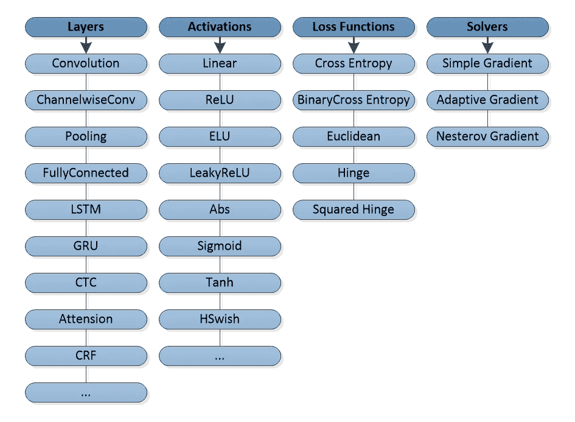

随着新架构在我们的任务中证明其有效性，我们试图扩展功能。

于是效率之争开始了。

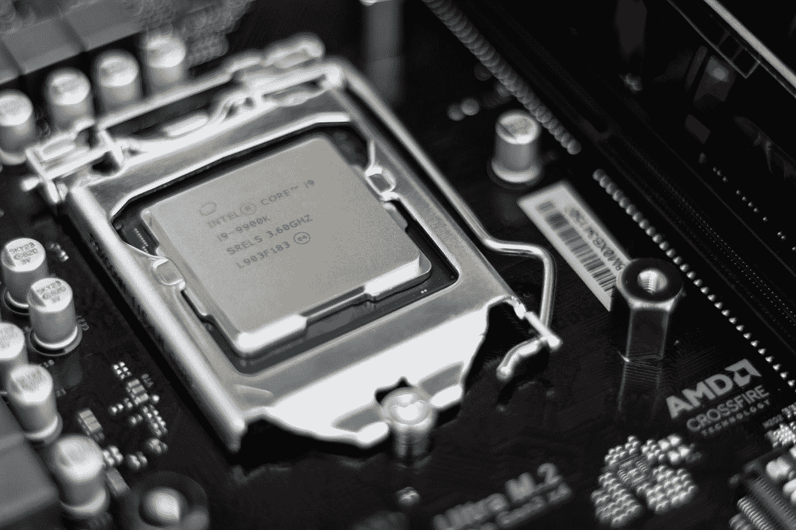

克里斯蒂安·威迪格在 [Unsplash](https://unsplash.com?utm_source=medium&utm_medium=referral) 上拍摄的照片

## CPU 计算

一个神经网络通常是一个巨大的计算量，如果没有低级别的优化，你将一事无成。首先，我们开始针对面向 Windows 的 x86 处理器进行优化，这是我们的主要平台，我们希望在这个平台上取得尽可能大的成功。

神经网络中的大多数操作都可以归结为 BLAS(基本线性代数子程序)，而 x86 的最佳 BLAS 当然是英特尔 MKL。我们开始使用它。其余操作必须使用 SIMD 系统独立实施。我们只使用 SSE 指令，也有 AVX / AVX2 的实验，但它们并没有给我们的操作带来多少收益，为了降低支持成本，我们决定拒绝它们。当英特尔发布 MKL-DNN 法案时，我们非常高兴:终于，你可以不用自己写这些了！但是，不幸的是，对比显示我们的包工作速度快了 20%,这个想法还没有被放弃。

目前，NeoML 在 x86 上工作得很好，但仍有很大的优化空间，我们计划在未来的版本中进行优化。

在 [Unsplash](https://unsplash.com?utm_source=medium&utm_medium=referral) 上拍摄的 [ThisisEngineering RAEng](https://unsplash.com/@thisisengineering?utm_source=medium&utm_medium=referral)

## GPU 计算

对我们来说，GPU 计算主要是学习。培训通常在公司内部或我们的云中进行。在这里，我们可以选择我们将在其上执行此操作的设备，这简化了工作:例如，如果客户端没有 AVX，则不需要支持 SSE。因此，他们决定使用 CUDA 实现 GPU 的计算引擎，并在支持它的 Nvidia 显卡上进行计算。我们做出这个决定，除了别的以外，是因为有专门的库可用:cuDNN、cuBLAS、cuSparse 等。尽管由于不断的错误和低效的操作，我们在未来放弃了 cuDNN，转而支持我们自己的实现。其余的库表现得很好，我们没有成功地编写自己的内核。

GPU 引入的结果是显而易见的。许多网络的训练速度加快了一个数量级。得益于此，开发速度加快了，模型的质量也提高了。

在主平台上获得了不错的结果，并且建立了有效的培训之后，我们考虑将这个库发布到其他平台上。

照片由 [NASA](https://unsplash.com/@nasa?utm_source=medium&utm_medium=referral) 在 [Unsplash](https://unsplash.com?utm_source=medium&utm_medium=referral) 拍摄

## 跨平台

ABBYY 的主要开发是在 Windows 上，用于培训和测试的服务器也在 Windows 上，因此库的第一个版本只适用于这个操作系统。然而，ABBYY 的产品也可以在其他平台上工作，很快我们开始将我们的库移植到 Linux 和 macOS。转移非常容易，因为我们需要的唯一英特尔 MKL 依赖项是这些操作系统的版本，并且不需要 CUDA 支持培训。唯一的困难是 Microsoft Visual Studio 编译器与 GCC 和 Clang 的差异，但这并没有花费太多时间。

现在，我们正在积极地使用 Linux 版本的库与竞争对手进行比较测量，因为 Windows 支持往往还有许多不足之处。此外，云中还有学习网络的任务。因此，在下一个版本中，我们将有一个在 Linux 上支持 CUDA 的 NeoML 版本。

马文·迈耶在 [Unsplash](https://unsplash.com?utm_source=medium&utm_medium=referral) 上的照片

## 移动平台

ABBYY 正在开发和销售用于图像处理和文本识别的 SDK，包括那些适用于手机的 SDK。因此，随着这些 SDK 中神经网络的出现，关于它们在移动平台上的有效启动的问题出现了。这一刻，我们又一次想到了是否使用第三方解决方案。在评估了 TensorFlow Lite for Android 和 Core ML for iOS 的集成后，我们得出的结论是，同时使用几个框架将会非常昂贵，最好改进您自己的框架，即使这是低效的。

我们开始为 ARM 创造一个“计算引擎”。用 NEON 替换 SSE，用 Eigen 替换 MKL，在几周内，我们做出了运行在 ARM CPU 上的第一个版本的库。事实证明，就效率而言，最终的解决方案完全适合我们；它甚至在速度上超过了同类产品。当然，从那时起，TF Lite 和 Core ML 都取得了长足的进步，但我们也做了许多重大的优化，其中大部分与 x86 版本重叠，并且不是很昂贵。然而，有一些特定于 ARM 的优化。其中最严重的是我们自己的矩阵乘法，多亏了它，我们超过了特征库 20%左右的速度，结果拒绝使用它。

目前，NeoML 在 CPU 上的运行方式与其同类产品大致相同，这完全符合我们的需求。

此外，为了简化 iOS 和 Android 上现成模型的发布，我们为 ObjectiveC 和 Java 语言添加了推理包装器。

## 移动 GPU

几乎所有现代的 Android 和 iOS 手机都配备了独立的 GPU。有趣的是，我们思考并开始研究如何开始使用它。第一次实验是用 RenderScript 完成的，完全没有结果，一切都非常慢…然而，用 OpenCL、Vulkan 和 Metal 进行的实验显示了良好的结果。在大型网络中，GPU 可以提供 5 到 7 倍的优势。在小型计算机上，由于开销的原因，CPU 仍然更快；即使在大型网络上，也不是每个 GPU 都能盈利；只有顶级型号上的昂贵芯片才能正常工作。此外，事实证明，对于不同系列的 GPU，您需要编写不同的代码:例如，针对 Adreno 优化的着色器在 Mali 上不一定工作得一样好。总的来说，现在对我们来说，在移动设备中使用 GPU 的话题是有争议的，但潜在的非常有前途。目前，我们已经实现了在 Vulkan 和 Metal 上运行的计算引擎，我们在有限的任务中使用它们，同时继续致力于它们的开发。我必须说，移动 GPU 上的计算是一个相当广阔的话题，在许多方面不同于桌面上的计算，关于它的故事值得单独撰写一篇文章。

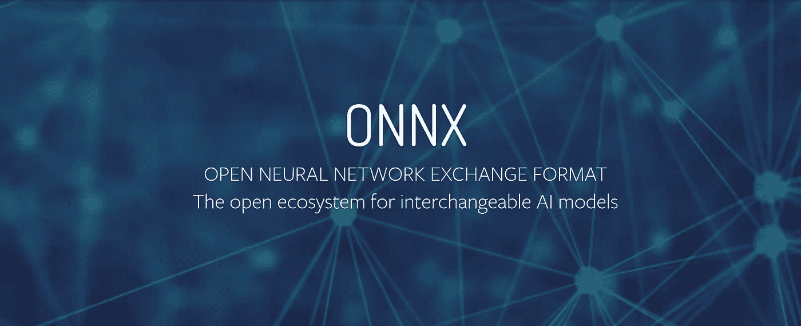

## ONNX

所以，我们有了一个完全自给自足的框架。有了它，我们可以了解自己的网络，轻松地将它们集成到桌面应用程序中，并转移到移动平台上，而无需额外的成本。一个问题仍然存在:在阅读新文章、探索新架构及其使用示例时，我们的数据科学家经常会遇到其他框架。为了快速有效地开发解决任何问题的模型，他们需要能够将模型从第三方框架转换到我们的框架中。

新的 ONNX 格式是一个很大的改进，尽管这种格式还很年轻，它在许多框架中的支持还有很多需要改进的地方，但是它正在被积极地开发，我们认为它是目前解决这个问题的最佳方案。我们支持将神经网络模型从 ONNX 下载到我们的库中。当然，我们并不支持整个格式:它有相当大的规格和几个版本，但这不是主要的。在不同的框架中，其使用的语义是不同的。比如同一个模型，如果上传到不同框架的 ONNX 上，看起来可能完全不一样。我们决定在这件事上关注 PyTorch。当然，其他人的 ONNX 模型也可以工作，但可能效率不高。

因此，模型开发过程可能看起来像这样:在 PyTorch 上完成模型的第一次实验，然后将模型存储在 ONNX 中，从 ONNX 加载到 NeoML 中，重新训练 NeoML 模型，测量其速度和质量，然后模型进入修订或生产。

现在，我们拥有了支持 ML 模型整个开发周期所需的一切。

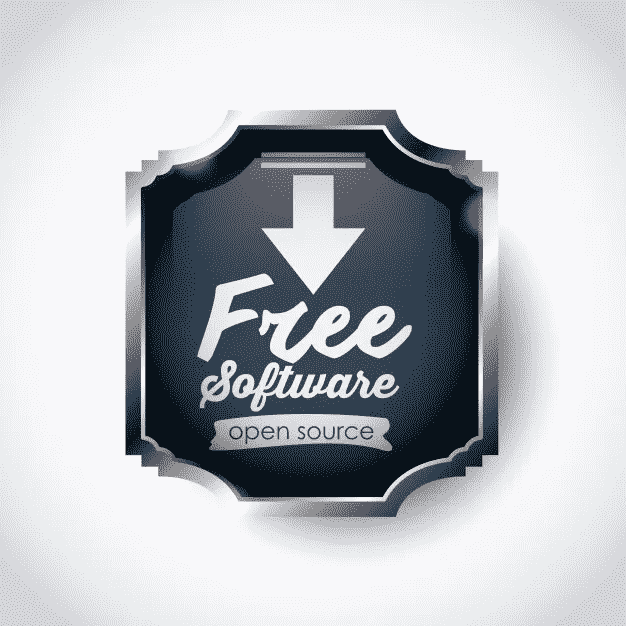

## 开源

我们决定下一步做什么？我们决定创建一个开源库，这样其他人也可以从中受益

这是图书馆发展的一个新步骤。我们与社区分享我们的最佳实践，作为回应，我们希望收到评论和建议，以使我们的图书馆更快、更方便。

该库已经有了几个独特的特性，可以成为在各种平台上的各种应用程序中启动模型的有效手段。我们希望拥有类似脚本的开发人员会喜欢 NeoML，并可能在不久的将来加入到这个库的工作中来。

## 比较测量

我们试图定期与同行(最常见的是 TensorFlow)比较我们的库在我们的任务上的有效性，以了解我们当前的水平。在这里，例如，我将比较从 MobileNetV2 架构的 TorchVision 包直接访问公共网络的速度，该架构被训练为对 ImageNet 数据集进行分类。网络输入的尺寸为 224x224x3。测量是在我现在触手可及的台式机 CPU 和几部手机上进行的(如你所知，这个帖子是在自我隔离期间创建的)。

在运行 Ubuntu 20.04 的酷睿 i5–4400 处理器的电脑上，我们获得了以下 10，000 次网络启动的结果:

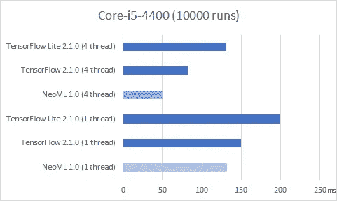

内存消耗如下:

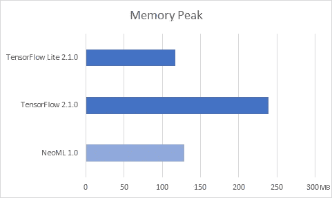

在 10，000 次启动的 Android 手机上，结果如下:

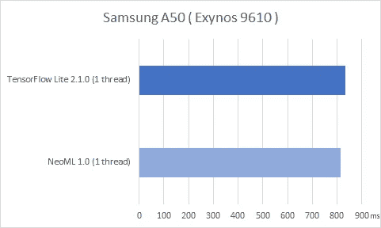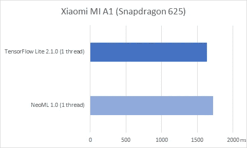

在 iOS 手机上:

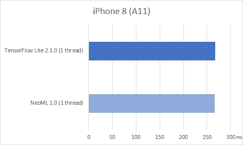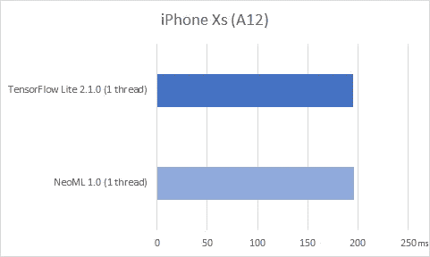

值得注意的是手机上的运行时间测量——一个吃力不讨好的任务。如果您愿意，您可以测量几乎任何结果，对几个流的测量甚至更不具有指示性(因此，这里没有显示)。但还是可以看到发射数量相当多的整体画面。

为了详细分析和优化，我们通常使用各种处理器计数器，如 cpu_cycles、cpu_instructions、cache_access、cache_miss、branch_count、branch_miss、bus_cycles 等。您还可以从中看出两个库的工作方式大致相同。

## 使用强大的 NeoML 框架来构建、训练和部署机器学习模型

*   支持超过 100 层类型的神经网络
*   CPU 和 GPU 支持，快速推断
*   语言:C++，Java，Objective
*   传统机器学习:20 多种算法(分类、回归、聚类等)
*   ONNX 支持
*   跨平台:相同的代码可以在 Windows、Linux、macOS、iOS 和 Android 上运行

## 随处部署

NeoML 由 ABBYY 工程师用于计算机视觉和自然语言任务，包括图像预处理、分类、文档布局分析、OCR 以及从结构化和非结构化文档中提取数据。您可以在云中、本地、浏览器或设备上部署模型。

## 下一步是什么

NeoML 支持[开放神经网络交换(ONNX)](https://cts.businesswire.com/ct/CT?id=smartlink&url=https%3A%2F%2Fonnx.ai%2F&esheet=52235643&newsitemid=20200616005112&lan=en-US&anchor=the+Open+Neural+Network+Exchange+%28ONNX%29&index=3&md5=93cc525d73f4e42244dbe9ff4a95faa9) ，这是一个用于互操作 ML 模型的全球开放生态系统，它提高了工具的兼容性，使开发人员更容易使用正确的组合来实现他们的目标。ONNX 标准是由微软、脸书和其他合作伙伴共同支持的一个开源项目。

ABBYY 邀请开发人员、数据科学家和业务分析师在 GitHub 上使用并贡献 [NeoML，其代码在 Apache License 2.0 下获得许可。该公司提供个性化的开发人员支持、持续的报告审查、定期更新和性能增强。展望未来，ABBYY 计划添加新的算法和架构，以及进一步提高使用框架算法可实现的速度。](https://cts.businesswire.com/ct/CT?id=smartlink&url=https%3A%2F%2Fgithub.com%2Fneoml-lib&esheet=52235643&newsitemid=20200616005112&lan=en-US&anchor=NeoML+on+GitHub&index=4&md5=a3d1307ad40807d9ce5118c6772b8a40)

总之，我们可以说我们得到了一个体面的解决方案，允许我们组织一个完整的 ML 模型开发和实现周期。目前，NeoML 几乎用于该公司的所有产品，并且每天都在证明其有效性。

机器学习是 ABBYY 的首要任务之一。我们计划通过定期发布新版本来发展我们的库。在即将发布的版本中，我们希望添加一个 Python 包装器，支持新的网络架构，扩展对 ONNX 格式的支持，当然，还要努力提高生产率。

如果你的工作遇到与我们相似的场景，那么[访问我们的 Github](https://github.com/neoml-lib/neoml) 并尝试 NeoML。我们欢迎任何反馈。还有，在评论里写上你的管道是什么样子的，你在里面遇到了什么问题！