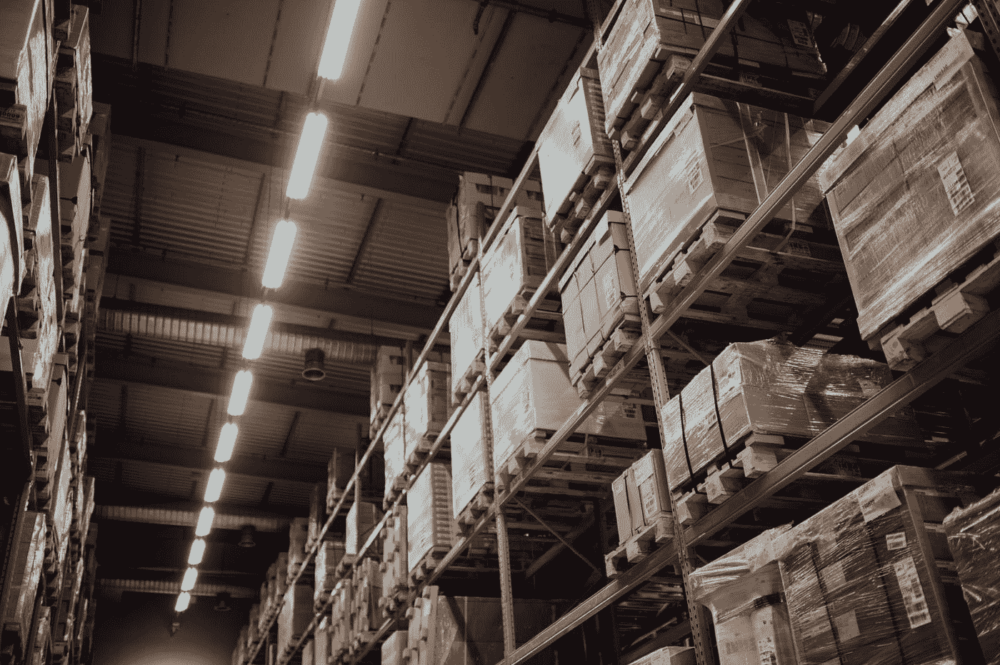
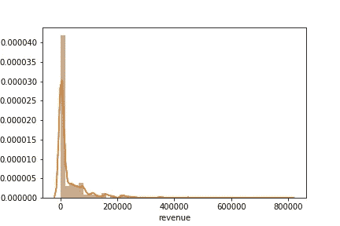

# 基于 K 均值聚类的 ABC 分析

> 原文：<https://towardsdatascience.com/abc-analysis-with-k-means-clustering-10d63ffff5b?source=collection_archive---------21----------------------->

## 基于机器学习的库存规划



由 [Unsplash](https://unsplash.com?utm_source=medium&utm_medium=referral) 上的 [chuttersnap](https://unsplash.com/@chuttersnap?utm_source=medium&utm_medium=referral) 拍摄

# 什么是 ABC 分析？

ABC 分析假设库存中产生收入的项目遵循帕累托分布，其中很小比例的项目产生最大的收入。使用以下约定，根据重要性给库存中的项目分配一个字母:

*   a 项目占项目的 20%，但贡献了 70%的收入
*   b 类商品占商品的 30%，但贡献了 25%的收入
*   c 类商品占商品的 50%，但贡献了 5%的收入

请记住，这些数字是粗略的，会因实际销售分布而有很大差异。关键要点是，A 类商品占库存的比例很小，但对收入的贡献最大，C 类商品占库存的比例很大，但对收入的贡献最小，B 类商品介于两者之间。

库存计划和仓储策略都依赖 ABC 分析来做出关键的物流决策。例如，仓库经理通常希望货物离装运码头最近，以减少提货所需的时间。这提高了生产率，降低了劳动力成本。

# k 均值聚类

广义地说，K-means 聚类是一种无监督的机器学习技术，它试图将相似的观察结果分组在一起。它通过计算每个随机组或*群*的平均值或*质心*，并将观察结果放入具有最近平均值的群中。

一旦将观测值添加到聚类中，就再次计算质心，并且相应地将点移除或添加到聚类中。重复这个过程，直到聚类稳定(即，不再从聚类中添加或删除观察值)。

这个简单的机器学习算法可以用于 ABC 分析。

K-means 聚类的最大缺点是需要预先知道聚类的个数。虽然在许多情况下很难估计，但我们知道我们要将存货分成三组进行 ABC 分析:A、B 和 c。

此外，由于使用与平均值的距离的性质，K-means 聚类假设聚类是圆形的。在这种假设下，更细微的分类问题将无法正确分类，但 ABC 分析足够简单，它可以充分代表。

类似地，使用距离作为度量常常会扭曲高维数据。幸运的是，ABC 分析只检查两个参数:一个项目产生的收入和收入是如何分配的。

所有这些因素使得 K-均值聚类成为确定 A、B 和 C 项的最佳解决方案。

# 数据集


[Unsplash](https://unsplash.com?utm_source=medium&utm_medium=referral) 上[视觉](https://unsplash.com/@visuals?utm_source=medium&utm_medium=referral)的照片

本项目中使用的数据来自流行的在线零售商 Wish。该数据集仅包括整个夏季服装的在线销售。最重要的是，它显示了售出的数量和价格，这将产生每件商品的收入。完整的数据集可以在 [Kaggle](https://www.kaggle.com/jmmvutu/summer-products-and-sales-in-ecommerce-wish) 上找到。

目标是根据重要性将数据集中的所有项目分类到 ABC 分类中。当查看结果时，应该有相对较少的 A 项推动了大部分收入，而大量的 C 项没有提供多少收入。

这些的分布应该是 A 品卖的最多，C 品卖的最少，B 品落在两者中间。如果商品在数据中是随机分布的(例如，第一个最高销售额的商品是 A，第二个是 C)，就有一个问题需要解决。

# 格式化数据

所有的数据格式化和分析都将在 python 中完成。

```
# Import libraries
import pandas as pd
import numpy as np# read the data to a dataframe
df = pd.read_csv("Summer_Sales_08.2020.csv")
```

在处理任何数字之前，导入 Pandas 和 NumPy 库来帮助管理数据。

接下来，将先前保存为 CSV 文件的数据读入数据帧。

```
# Add a column for revenues
df["revenue"] = df["units_sold"] * df["price"]
```

通过简单地将售出的数量单位乘以价格，在数据框中添加一个新的收入列。价格可能会随着时间的推移而变化，尤其是在闪购发生时，但在没有进一步数据分析的情况下，假设所有商品都以一个稳定的价格出售。

```
import seaborn as snssns.distplot(df["revenue"])
```



收入分布图。图由作者制作。

上图展示了数据中的帕累托分布。绝大多数项目的收入都低于€20 万英镑(尽管图中没有明确显示，但进一步分析发现，约三分之二的项目收入低于€2 万英镑)。与此同时，一些商品的售价在€40 万英镑到€80 万英镑之间，这是收入的主要来源。

```
# Create bins function
def bins(x):
    for bar in range(20000, 820000, 20000):
        if x <= bar:
            return bar# Create new column to apply the bin function
df["rev_dist"] = df["revenue"].apply(lambda x: bins(x))
```

编写一个函数，将一个项目产生的收入金额分类到各个箱中，然后应用于数据帧。如果一个项目产生€20，000 或更少，它被归类为€20，000。它是一个在€20，000 到€40，000 之间的项目，它被归类为€40，000，以此类推，每增加€20，000。

选择一个箱子的大小对于做出一个好的估计是至关重要的。箱子不能太大也不能太小，否则最终的 ABC 分类会有偏差。在这种情况下，选择箱的大小，使得每个箱中的物品比前一个箱中的少。可能需要进行初步的评估，然后进行调整，以达到预期的效果。

```
# Create a support column of 1’s to facilitate the pivot table
df["count"] = 1# Create a pivot table of the revenue distributions
pivot_table = pd.pivot_table(df, index = ["rev_dist"], values = ["count"], aggfunc = np.sum)
```

创建一个数据透视表来枚举属于每个类别的项目数。例如，1，072 个项目产生的€不超过 20，000。120 件物品在€20，000 到€40，000 之间，以此类推。

# 为 ABC 分析执行 K 均值聚类

为了正确地训练模型，仅仅查看每个项目产生多少收入是不够的。它还需要知道收入是如何分配的。这个数据透视表为模型训练提供了一个非常易于管理的数据集。

```
# import model from SKLearn
from sklearn.cluster import KMeans# K -clusters is equal to 3 because things will be sorted into A, B, and C
kmeans = KMeans(n_clusters=3)kmeans.fit(pivot_table)
```

scikit-learn 中的 K-means 模型被导入并初始化。如前所述，参数 n_clusters 设置为三，因为我们要将数据分成三个簇。然后将模型放到数据透视表上。

```
pivot_table["category"] = kmeans.labels_
```

一个新列被放置在数据透视表中，给出来自模型的分类。值得注意的是，默认情况下，scikit-learn 的 K-means 模型将按数字比例而不是 ABC 分析中使用的字母比例对项目进行分类。因此，每一行将被标记为零、一或二。

幸运的是，虽然标签不同，但实际的潜在模式是相同的。因此，数字标签将与字母标签相关联，但需要审核才能确定。在这种情况下，0 是 A，1 是 C，2 是 b。

```
# Create a dictionary to give alphabetical labels
ABC_dict = {    
    0: "A",
    1: "C",
    2: "B"
}pivot_table["ABC"] = pivot_table["category"].apply(lambda x: ABC_dict[x])
```

编写了一个快速字典，并将其应用于数据透视表，为每一行提供 ABC 分类。

```
# Merge the dataframes so that there's a new column to identify ABC
df = pd.merge(df, pivot_table, on = "rev_dist", how ="left")
```

回想一下，模型是在数据透视表上训练的。ABC 分类尚未分配给这些项目。相反，它被分配到一个收入类别。

这意味着，虽然我们不能立即知道哪些项目属于 A 类，但我们知道某些收入类别(即€780，000 到€800，000)被评为 A 类项目。

因此，我们可以简单地合并主数据框架和数据透视表，为每一项赋予其 ABC 分类。

# 估价

在分析物品的最终分配时，发现:

*   a 项目占项目的 11.4%，但占收入的 61.7%
*   b 项目占项目的 20.5%，但占收入的 30.7%
*   c 项目占项目的 68.1%，但占收入的 7.6%

虽然这些数字并不完全符合帕累托分布，但数据本身很可能与这些理想化的数字有所不同。相反，更重要的是，集群非常清楚地传达出一小部分库存产生了大部分收入。

同样，所有的 A 类商品都是最畅销的商品，而所有的 C 类商品都是最畅销的商品，B 类商品正好落在中间。模型是成功的！

# 结论

虽然 K-means 聚类可能不是执行 ABC 分析的最有效的方法，但它展示了该模型找到相同潜在模式的能力。

随着这一成功，它打开了使用更多无监督学习技术来揭示销售和物流洞察力的大门。特别是聚类提供了一种直观的方式，可以沿着人眼可能明显也可能不明显的模式来分割产品，并且可以为使用它的人提供前沿。