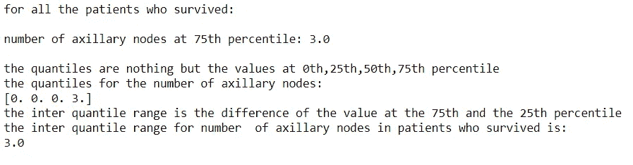
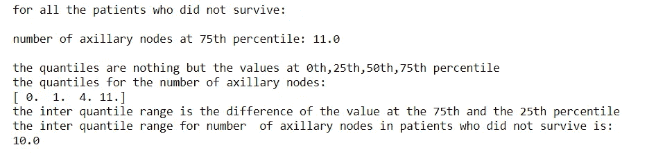

# 基于哈伯曼生存数据集的 EDA 基础知识

> 原文：<https://towardsdatascience.com/abc-of-eda-with-habermans-survival-dataset-faa23dba9c68?source=collection_archive---------67----------------------->


[国家癌症研究所](https://unsplash.com/@nci?utm_source=medium&utm_medium=referral)在 [Unsplash](https://unsplash.com?utm_source=medium&utm_medium=referral) 上拍摄的照片

# **简介**

探索性数据分析听起来是一个非常酷的术语，直到你真正了解它是什么。通常被称为“你好，世界！”在机器学习领域，当一个人决定深入分析时，他可能会首先遇到 EDA。

假设我给你 30 分钟时间来做一个人今天可以做出的最重要的人生决定之一——决定你想买哪部智能手机。在做出最终裁决之前的半个小时里，无论你沉迷于什么程序——无论是查看在线评论、比较规格，还是观看拆箱视频——都是我们所说的“探索性数据分析”。

EDA 不完全是一种科学工具，而更像是一种哲学，它相信以开放的心态不带偏见地分析数据。这一标准程序有助于人们在对数据进行复杂的机器学习算法之前获得对数据的见解。为了让这次对话更直观，我决定加入我对 Kaggle 上最基本的数据集之一——哈伯曼癌症生存数据集所做的分析。所以让我们开始吧。

# **数据集**

哈伯曼的数据集包含了芝加哥大学比林斯医院在 1958 年至 1970 年间对接受乳腺癌手术的患者进行的一项研究的数据。对于数据集。我在分析中使用了 Python 及其精彩的库(Pandas、Numpy、Matplotlib、Seaborn 等)。重要的一点——本文不是编码教程，而是一种机制的概述(**机器学习！=用 Python** 编码)，所以如果你对一些代码片段感到不知所措——忽略它们，试着专注于我们试图通过它们实现的目标。

**目标**——永远在你的脑海中保持以下口头禅——*通过随机运算进行随机分析，会给你随机结果*。我们应该非常清楚我们分析的目标，我们执行的每一个操作都应该理想地让我们一点点接近它。例如，这种特殊分析背后的动机是**预测癌症患者的存活几率。**

首先，我们需要从。csv 文件放到我们的数据框中。

```
import pandas as pd import numpy as np import matplotlib.pyplot as plt import seaborn as sns haberman=pd.read_csv(“haberman.csv”,header=None) 
column_names=[“age”,”year”,”axillary_nodes”,”survival_status”] haberman.columns=column_names haberman.survival_status=haberman.survival_status.map({1:”yes”,2:”no”})
```

现在我们的数据框实际上是左边的那个，但稍加修改，它看起来就像右边的那个，更容易理解-


在继续分析之前，让我让你熟悉一些与我将从这里开始使用的数据集相关的关键词。任何数据集都有以下特征-

1.  **数据点/矢量/观测值** -数据框中的每一行都是一个数据点或一个观测值。它是被记录的*实例*之一。如果一个数据点有 n 个特征，我们称之为 n 维向量。
2.  **特征/输入变量/独立变量** -它是作为预测指标的数据点的组成部分。我们的数据集有 3 个特征——患者年龄、手术年份和体内腋窝/淋巴结数量。
3.  **标签/类/输出变量/因变量**——我们准备进入这一团乱麻的一件事——做完一切后需要预测的值/结果。标签是在特征的基础上预测的，因此被命名为因变量。在这里，我们需要预测癌症患者的生存机会，这在我们的案例中充当了一个标签。

为了确定每个类有多少数据点，我们运行一个简单的命令-

```
g=haberman.groupby(“survival_status”).size() g
```


我们可以观察到，在我们的数据集中，有 225 例患者存活，81 例患者死于该疾病。我们可以得出结论，我们的数据集是一个**不平衡数据集**，这是病历案例中常见的观察结果。

注意，可以用这个简单的命令找出当前的全部观察值( **306** )

```
haberman.shape
```

现在，我们已经熟悉了我们的数据，让我们前进到真正的东西。

# **多元分析-三维散点图**

既然我们的数据集有 3 个要素，为什么不快速查看相同要素的 3-d 散点图看起来是什么样的-也许我们在这一步就能解决我们的问题？

```
import plotly.express as px fig=px.scatter_3d(data_frame=haberman,x=”age”,y=”year”,z=”axillary_nodes”,color=”survival_status”)
 fig.show()
```


正如你自己所看到的，没有任何由人类定义的程序可以帮助我们从混乱中理出头绪。所以回答前面的问题-不，我们不会在第一步就解决我们的问题！

# **双变量分析**

它指的是找到 2 个特征变量之间的关系，并用它来找到感兴趣的目标变量。双变量分析中最常用的技术是**二维散点图**。配对图是所有可能配对的二维散点图的集合，可从我们的特征中生成。

使用配对图背后的动机是识别那些导致 2 类标签之间最佳区别的特征-生存状态:是和生存状态:否。我使用 seaborn 来绘制配对图-

```
sns.set_style(“whitegrid”) sns.pairplot(haberman,hue=”survival_status”,size=3) 
plt.show()
```


**注:**仅考虑对角线上方的图形，因为其下方的图形是相同的图形，只是轴颠倒，不会影响我们的观察。

**注意:**处理配对图的一般工作流程是选择各类别之间重叠最小的图，然后选择这些图中涉及的特征进行进一步分类，以获得最佳结果。

**来自配对图的观察结果**

1.  年龄与运营年份——高度重叠，因此被丢弃。
2.  手术年份与腋窝淋巴结数目-高度重叠，因此被丢弃。
3.  年龄与腋窝淋巴结数目-重叠但优于上述情况。因此，我们将选择这两个特征进行单变量分析。

**配对图的限制** -当特征的数量达到一个非常大的值时，不可能以一种有效的方式使用配对图进行分类，因为我们将不得不通过大量的图来识别我们的最佳特征。在这种情况下，我们使用特定的数学技术，如 PCA 和 t-SNE ( *，这将是下一篇文章讨论的主题！*)进行降维。

**结论**——患者年龄和腋窝淋巴结数目是预测生存几率的最佳特征。

# **单变量分析**

单变量分析也许是最简单的统计分析形式。关键事实是只涉及一个变量。

在当今世界，一个变得极为重要的事情是外交的概念，这也是全球所有数据科学家的身体和头脑中根深蒂固的概念。我们总是喜欢谈论机会，而不是预测将会发生什么。)。当我们开始谈论机会的时候，概率就开始起作用了。

**概率密度函数** -它代表连续范围内数据点的密度，帮助我们确定特定结果的可能性。它是通过平滑直方图的边缘形成的。

**患者年龄的 PDF**

```
sns.FacetGrid(haberman,hue=”survival_status”,size=5)\ .map(sns.distplot,”age”)\.add_legend();
plt.title(“pdf for survival status labelling on the basis of age”) plt.show();
```


观察-

1.  我们可以看到，基于年龄的生存状态的 PDF 在 40 至 65 岁之间的两个阶层高度重叠(曲线下的面积几乎相等)。
2.  因此，在 40 至 65 岁之间，存活状态为“是”的患者的百分比和存活状态为“否”的患者的百分比几乎相同——因此该特征不适合分类。

**运营年度 PDF**

```
sns.FacetGrid(haberman,hue="survival_status",size=5)\     .map(sns.distplot,"year")\.add_legend();\
plt.title("pdf for survival status labelling on the basis of year of operation")
plt.show();
```


观察-

1.  我们可以看到，在 1958 年和 1968 年之间，基于运行年份的生存状态 pdf 再次与两个类别高度重叠。
2.  因此，在 1958 年和 1968 年之间，存活状态为“是”的患者的百分比和存活状态为“否”的患者的百分比几乎相同——因此该特征也不适合分类。

**腋窝淋巴结数量的 PDF**

```
sns.FacetGrid(haberman,hue="survival_status",size=5)\     .map(sns.distplot,"axillary_nodes")\.add_legend();
plt.title("pdf for survival status labelling on the basis of number of axillary nodes")
plt.show();
```


观察-

1.  基于腋窝淋巴结数量的生存状态的 PDF 对于 2 个标记类别具有最小的重叠，并且是我们在进行最佳可能分类方面的最佳尝试。
2.  因此，我们可以利用下面的 if-else 条件来获得相当准确的结果

> *如果腋窝淋巴结数> =0 且<= 3→生存状态=高*
> 
> *如果腋窝淋巴结数目>= 3→生存状态→低*

# 基于腋窝淋巴结数量的详细单变量分析

现在知道了我们分类的最佳特征，我们就有机会进行更详细的分析，以获得一些具体的结果。

```
y=haberman.survival_status=="yes"
n=haberman.survival_status=="no"
haberman[y]
haberman[n]
```


## **对于存活的患者(存活状态:是)**

```
count,bin_edges=np.histogram(haberman[y].axillary_nodes,bins=20,density=True)
print(count) 
print(bin_edges) 
pdf=count/sum(count) cdf=np.cumsum(pdf) plt.plot(bin_edges[1:],pdf,’g’,label=”PDF FOR SURVIVAL STATUS YES”) plt.plot(bin_edges[1:],cdf,’b’,label=”CDF FOR SURVUVAL STATUS YES”) plt.xlabel(“NUMBER OF AXILLARY NODES”) 
plt.title(“pdf and cdf number of axillary nodes-survival status:YES”) plt.legend() plt.show()
```


**观察-**

1.  蓝线显示了所有存活患者的 CDF(除了 PDF 值的累积和之外什么都没有)。
2.  从蓝线中，我们可以清楚地看到，大约 85%的幸存患者体内的腋窝淋巴结少于 5 个。
3.  **如果腋窝淋巴结> =0、< =5 →生存状态=高→这个说法有 85%的几率是正确的。**
4.  我们还可以从 CDF 中看到，当腋窝病例的数量达到 10 个时，存活的机会变得非常低，因为存活的总患者只有 10%具有超过 10 个淋巴结。

## **对于未存活的患者(存活状态:否)**

```
count,bin_edges=np.histogram(haberman[n].axillary_nodes,bins=20,density=True)
print(count)
print(bin_edges)
pdf=count/sum(count)
cdf=np.cumsum(pdf)
plt.plot(bin_edges[1:],pdf,'g',label="PDF FOR SURVIVAL STATUS NO")
plt.plot(bin_edges[1:],cdf,'b',label="CDF FOR SURVIVAL STATUS NO")
plt.xlabel("NUMBER OF AXILLARY NODES")
plt.title("pdf and cdf for number of axillary nodes-survival status:NO")
plt.legend()
plt.plot()
```


**观察-**

1.  我们可以从 CDF 中看到，在所有未存活的患者中，超过 60%的患者体内存在 3 个以上的腋窝淋巴结。
2.  **如果腋窝淋巴结>= 3→生存状态=低→这个说法有 60%的几率是正确的。**

## 结合以上两个图

```
count,bin_edges=np.histogram(haberman[y].axillary_nodes,bins=20,density=True)
pdf=count/sum(count) 
cdf=np.cumsum(pdf) 
plt.plot(bin_edges[1:],pdf,’g’,label=”PDF FOR SURVIVAL STATUS YES”) plt.plot(bin_edges[1:],cdf,’b’,label=”CDF FOR SURVUVAL STATUS YES”) count,bin_edges=np.histogram(haberman[n].axillary_nodes,bins=20,density=True) 
pdf=count/sum(count) cdf=np.cumsum(pdf) plt.plot(bin_edges[1:],pdf,’r’,label=”PDF FOR SURVIVAL STATUS NO”) plt.plot(bin_edges[1:],cdf,’y’,label=”CDF FOR SURVIVAL STATUS NO”) plt.xlabel(“NUMBER OF AXILLARY NODES”) 
plt.title(“pdf and cdf for number of axillary nodes for both survival status”) 
plt.legend() 
plt.plot() 
```


## **单变量分析的最终观察结果-**

我们可以使用下面的 if-else 条件，通过单变量分析来预测生存的机会-

1.  **如果腋窝淋巴结数> =0，腋窝淋巴结数<= 3→存活几率=高**→这种说法大约有 75%的准确性，因为在存活的所有患者中，75%的患者腋窝淋巴结少于 3 个，25%的患者腋窝淋巴结多于 3 个。
2.  **如果腋窝淋巴结数目>= 3→存活几率=低**→这种说法大约有 60%的准确性，因为在所有未存活的患者中，60%有 3 个以上的腋窝淋巴结，40%有 3 个以下的腋窝淋巴结。

# **基本统计**

1.  **表示** -所有数据点的平均值。整个数据围绕这个中心值展开。
2.  **标准差** -数据围绕中心值扩散的度量。
3.  **-当所有数据点从最少到最多排列时的中间值(集中趋势的另一种度量)。中位数优于平均值，原因很简单，它受数据集中异常值或极值的影响最小。在一半的数据点被破坏之前，中值不会受到太大影响。**

```
print(“for all the patients who survived: \n”) 
#to check the central value 
print(“mean number of axillary nodes: {} \n”.format(np.mean(haberman[y].axillary_nodes))) #to check the spread about the central value
print(“standard deviation from the mean number of axillary nodes: {} \n”.format(np.std(haberman[y].axillary_nodes))) #to check the central value which is least affected by outliers print(“the middle value or the median number of axillary nodes: {} \n”.format(np.median(haberman[y].axillary_nodes)))
```

****

```
print(“for all the patients who did not survive: \n”) 
#to check the central value 
print(“mean number of axillary nodes: {} \n”.format(np.mean(haberman[n].axillary_nodes))) #to check the spread about the central value 
print(“standard deviation from the mean number of axillary nodes: {} \n”.format(np.std(haberman[n].axillary_nodes))) #to check the central value which is least affected by outliers print(“the middle value or the median number of axillary nodes: {} \n”.format(np.median(haberman[y].axillary_nodes)))
```

****

## ****观察-****

1.  **所有存活的患者平均有 2.8 个腋窝淋巴结，偏差为 5.8。**
2.  **所有未存活的患者平均有 7.5 个腋窝淋巴结，偏差为 9.1。**

# ****高级统计****

1.  ****百分位数-** 通常以低于数据集中特定值的总值的百分比来表示。例如，如果我说 45 分代表一次测试中的 85 %,那么这意味着参加测试的学生中有 85%的人得分低于 45 分。**
2.  ****分位数-** 一个有趣的术语，用来表示第 25、50、75 和 100 百分位。第 50 百分位不过是中值。**
3.  ****分位数范围(IQR)** -第 25 个百分位和第 75 个百分位之间的差值。有些人也用它作为标准偏差的代表来分析价差，因为 50%的总值都在这个范围内。**

```
print(“for all the patients who survived: \n”) print(“number of axillary nodes at 75th percentile: {} \n”.format(np.percentile(haberman[y].axillary_nodes,75))) print(“the quantiles are nothing but the values at 0th,25th,50th,75th percentile”) print(“the quantiles for the number of axillary nodes:”) print(np.percentile(haberman[y].axillary_nodes,np.arange(0,100,25))) print(“the inter quantile range is the difference of the value at the 75th and the 25th percentile”) 
print(“the inter quantile range for number of axillary nodes in patients who survived is:”) x=np.percentile(haberman[y].axillary_nodes,75) y=np.percentile(haberman[y].axillary_nodes,25) 
print(x-y)
```

****

```
print(“for all the patients who did not survive: \n”) print(“number of axillary nodes at 75th percentile: {} \n”.format(np.percentile(haberman[n].axillary_nodes,75))) 
print(“the quantiles are nothing but the values at 0th,25th,50th,75th percentile”)

print(“the quantiles for the number of axillary nodes:”) print(np.percentile(haberman[n].axillary_nodes,np.arange(0,100,25))) print(“the inter quantile range is the difference of the value at the 75th and the 25th percentile”) 
print(“the inter quantile range for number of axillary nodes in patients who did not survive is:”) x=np.percentile(haberman[n].axillary_nodes,75) y=np.percentile(haberman[n].axillary_nodes,25) 
print(x-y)
```

****

# **箱形图-分位数的特殊图**

**直方图和 pdf 的一个主要问题是，它只能告诉我们特定事件发生的可能性。它没有给我们任何关于在某一点之前发生的可能性的线索。**

**CDF 在一定程度上解决了这个问题，但是如果我们想要更多的直觉呢？这就是箱形图的用武之地，它是专门用来处理分位数的。**

```
sns.boxplot(x=”survival_status”,y=”axillary_nodes”,data=haberman) plt.title(“box plot for number of axillary nodes”) 
plt.show()
```

****

**考虑橙色的方框图-**

1.  **下面的线代表第 25 百分位。**
2.  **中间的线代表第 50(中间)百分位数。**
3.  **上面的线代表第 75 百分位。**
4.  **方框的高度代表分位数区间。**
5.  **延伸的垂直线被称为胡须，其长度是分位数间距的 1.5 倍。**

# **小提琴情节-两全其美！**

**到目前为止，我们已经讨论了用于讨论数据密度的直方图/pdf 和用于讨论分位数的箱线图。如果我告诉你，有另一种情节把两者结合在一起呢？**

```
sns.violinplot(x="survival_status",y="axillary_nodes",data=haberman)
plt.title("violin plot for number of axillary nodes")
plt.show()
```

****

1.  **小提琴内部的盒子充当盒子情节。**
2.  **具有不同密度的外部小提琴充当 PDF。如果观察有倾斜头部的小提琴——它看起来就像讨论概率密度函数时观察到的钟形曲线！**

# **总结分析**

1.  **永远不要忘记任何分析背后的动机，因为 EDA 的性能与其目标是一致的。**
2.  **一个好的做法是在完成后用简单明了的英语记下每种调查方法的结果，以便任何人都能理解。**

# **结论**

**利用本文中讨论的各种分析工具和技术，我们通过从中得出结论性的结果，成功地探索了 Haberman 的癌症生存数据集。**

***原载于 2020 年 10 月 12 日*[*【https://mahavirdabasmd.wixsite.com】*](https://mahavirdabasmd.wixsite.com/blog/post/abc-of-eda-with-haberman-s-survival-dataset)*。***