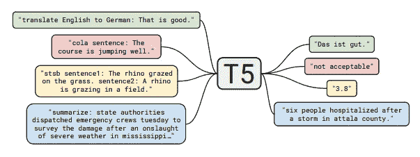

# 数据扩充的抽象概括

> 原文：<https://towardsdatascience.com/abstractive-summarization-for-data-augmentation-1423d8ec079e?source=collection_archive---------53----------------------->


作者图片

## 一个创造性的解决不平衡的阶级分布

类别分布不均衡是机器学习中的一个常见问题。我最近在训练情感分类模型时遇到了这个问题。某些类别比其他类别更普遍，模型的预测质量受到影响。我用来解决这个问题的第一个技术是随机欠采样，其中我从每个类别中随机采样一个子集的行，直到一个上限阈值。我选择了一个合理平衡上面三个等级的天花板。虽然观察到了小的改进，但是该模型仍然远非最佳。

我需要一种方法来处理代表不足的阶层。我不能依赖多类分类中使用的传统技术，如样本和类加权，因为我正在处理多标签数据集。很明显，在这种情况下，我需要利用过采样。

诸如 SMOTE(合成少数过采样技术)之类的技术对于过采样可能是有效的，尽管对于多标签数据集，该问题再次变得更加困难。 [MLSMOTE](https://www.sciencedirect.com/science/article/abs/pii/S0950705115002737) (多标签合成少数过采样技术)已经被提出[1]，但是从文本创建的数字向量的高维性质有时可以使其他形式的数据增强更有吸引力。


[克里斯汀·瓦格纳](https://unsplash.com/@wagner2074?utm_source=unsplash&utm_medium=referral&utm_content=creditCopyText)在 [Unsplash](https://unsplash.com/s/photos/transformers?utm_source=unsplash&utm_medium=referral&utm_content=creditCopyText) 上拍照

## 变形金刚来了！

如果您决定阅读这篇文章，可以肯定地认为您已经了解强大的变形金刚在自然语言处理方面的最新进展。特别是[拥抱脸](https://huggingface.co/)的优秀开发者通过他们的开源贡献打开了这个世界的大门。他们最近的一个版本实现了迁移学习的突破，称为**T**ext-**T**o-**T**ext**T**Transfer**T**transformer 或 [T5](https://huggingface.co/transformers/model_doc/t5.html) 模型，最初由 Raffel 等人提出。艾尔。在他们的论文[中，用统一的文本到文本转换器探索迁移学习的极限](https://arxiv.org/pdf/1910.10683.pdf)【2】。

T5 允许我们通过为输入文本指定前缀来执行各种 NLP 任务。在我的例子中，我对抽象概括感兴趣，所以我使用了前缀`summarize`。



文本到文本转换转换器[2]

## 抽象概括

简而言之，抽象概括是一种技术，通过这种技术，一个文本块被提供给一个 NLP 模型，并返回该文本一个新颖的摘要。这不应该与提取摘要混淆，在提取摘要中，嵌入句子并执行聚类算法来找到最接近聚类质心的句子，即返回现有的句子。抽象概括作为一种数据扩充技术似乎特别有吸引力，因为它能够生成新颖而又真实的文本句子。

## 算法

以下是我使用抽象概括进行数据扩充的步骤，包括说明解决方案的代码段。

我首先需要确定每个代表不足的类需要多少行。因此，为每个特性添加的行数是用上限阈值计算的，我们称之为`append_counts`。计数超过上限的要素不会被追加。特别是，如果给定的特性有 1000 行，上限是 100，那么它的追加计数将是 0。在特征已经被一次热编码的情况下，以下方法很容易实现这一点:

```
def get_feature_counts(self, df):shape_array = {} for feature in self.features:
        shape_array[feature] = df[feature].sum() return shape_array

def get_append_counts(self, df):append_counts = {}
    feature_counts = self.get_feature_counts(df)

    for feature in self.features:
        if feature_counts[feature] >= self.threshold:
            count = 0
        else:
            count = self.threshold - feature_counts[feature]

        append_counts[feature] = count

    return append_counts
```

对于每个特征，从附加索引范围到为给定特征指定的附加计数完成一个循环。这个`append_index`变量和一个任务数组的引入是为了允许多重处理，我们稍后会讨论。

```
counts = self.get_append_counts(self.df)
# Create append dataframe with length of all rows to be appended
self.df_append = pd.DataFrame(
    index=np.arange(sum(counts.values())),
    columns=self.df.columns
)

# Creating array of tasks for multiprocessing
tasks = []

# set all feature values to 0
for feature in self.features:
    self.df_append[feature] = 0

for feature in self.features:
    num_to_append = counts[feature]
    for num in range(
            self.append_index,
            self.append_index + num_to_append
    ):
        tasks.append(
            self.process_abstractive_summarization(feature, num)
        )

    # Updating index for insertion into shared appended dataframe 
    # to preserve indexing for multiprocessing
    self.append_index += num_to_append
```

为唯一具有给定特征的所有行的指定大小的子集计算抽象概括，并将其添加到附加数据帧中，其各自的特征被一位热编码。

```
df_feature = self.df[
    (self.df[feature] == 1) &
    (self.df[self.features].sum(axis=1) == 1)
]
df_sample = df_feature.sample(self.num_samples, replace=True)
text_to_summarize = ' '.join(
    df_sample[:self.num_samples]['review_text'])
new_text = self.get_abstractive_summarization(text_to_summarize)
self.df_append.at[num, 'text'] = new_text
self.df_append.at[num, feature] = 1
```

抽象总结本身是通过以下方式生成的:

```
t5_prepared_text = "summarize: " + text_to_summarize

if self.device.type == 'cpu':
    tokenized_text = self.tokenizer.encode(
        t5_prepared_text,
        return_tensors=self.return_tensors).to(self.device)
else:
    tokenized_text = self.tokenizer.encode(
        t5_prepared_text,
        return_tensors=self.return_tensors)

summary_ids = self.model.generate(
    tokenized_text,
    num_beams=self.num_beams,
    no_repeat_ngram_size=self.no_repeat_ngram_size,
    min_length=self.min_length,
    max_length=self.max_length,
    early_stopping=self.early_stopping
)

output = self.tokenizer.decode(
    summary_ids[0],
    skip_special_tokens=self.skip_special_tokens
)
```

在最初的测试中，对 T5 模型的汇总调用极其耗时，甚至在 GCP 的 NVIDIA Tesla P100 实例上也达到了 25 秒。显然，这需要解决，以使其成为数据扩充的可行解决方案。


照片由[布拉德在](https://unsplash.com/@bradneathery?utm_source=unsplash&utm_medium=referral&utm_content=creditCopyText) [Unsplash](https://unsplash.com/s/photos/time?utm_source=unsplash&utm_medium=referral&utm_content=creditCopyText) 上整理

## 多重处理

我引入了一个`multiprocessing`选项，对抽象概括的调用存储在一个任务数组中，稍后传递给一个子程序，该子程序使用[多处理](https://docs.python.org/2/library/multiprocessing.html)库并行运行调用。这导致运行时间呈指数级下降。我必须感谢大卫·福斯特简洁的 stackoverflow 贡献！

```
running_tasks = [Process(target=task) for task in tasks]
for running_task in running_tasks:
    running_task.start()
for running_task in running_tasks:
    running_task.join()
```

## 简化解

为了方便大家，我将它打包成一个名为 [absum](https://pypi.org/project/absum/) 的库。可以通过 pip: `pip install absum`进行安装。也可以直接从[库](https://github.com/aaronbriel/absum)下载。

在自己的数据集上运行代码只需导入库的`Augmentor`类并运行其`abs_sum_augment`方法，如下所示:

```
import pandas as pd
from absum import Augmentorcsv = 'path_to_csv'
df = pd.read_csv(csv)
augmentor = Augmentor(df)
df_augmented = augmentor.abs_sum_augment()
df_augmented.to_csv(
    csv.replace('.csv', '-augmented.csv'), 
    encoding='utf-8', 
    index=False
)
```

absum 默认使用拥抱脸 T5 模型，但它是以模块化的方式设计的，允许您使用任何预先训练或开箱即用的变压器模型，能够进行抽象概括。它是格式不可知的，只期望一个包含文本和独热编码特征的数据帧。如果存在您不希望考虑的其他列，您可以选择将特定的独热编码特性作为逗号分隔的字符串传递给`features`参数。

还需要特别注意的是`min_length`和`max_length`参数，它们决定了结果汇总的大小。我发现一个有用的技巧是找到你正在处理的文本数据的平均字符数，从稍微小一点的最小长度开始，同时稍微填充它以获得最大长度。所有可用参数在[文件](https://github.com/aaronbriel/absum#Parameters)中有详细说明。

欢迎在评论中添加任何改进建议，或者在 [PR](https://github.com/aaronbriel/absum) 中添加更好的建议。编码快乐！

## 参考

*【1】f . Chartea，A.Riverab，M. del Jesus，F. Herreraac，* [*MLSMOTE:通过合成实例生成处理不平衡多标签学习*](https://www.sciencedirect.com/science/article/abs/pii/S0950705115002737)*【2015】《基于知识的系统》，第 89 卷，2015 年 11 月，第 385–397 页*

*【2】c . raff El，N. Shazeer，A. Roberts，K. Lee，S. Narang，M. Matena，Y. Zhou，W. Li，P. Liu，* [*用统一的文本到文本转换器探索迁移学习的极限*](https://arxiv.org/pdf/1910.10683.pdf) *，《机器学习研究杂志》，21，2020 年 6 月。*

*【3】d .福斯特，* [*Python:如何并行运行 Python 函数？*](https://stackoverflow.com/a/56138825/1741531) *从 stackoverflow.com 取回，2020 年 7 月 27 日。*