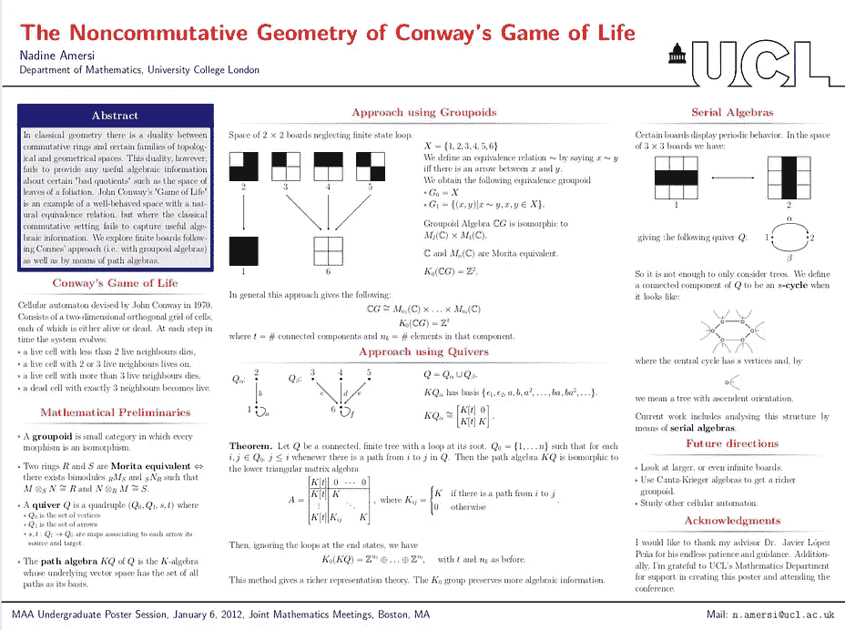
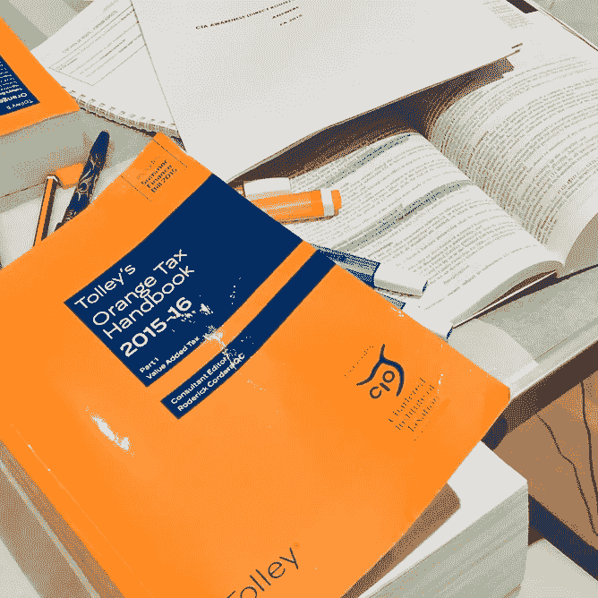
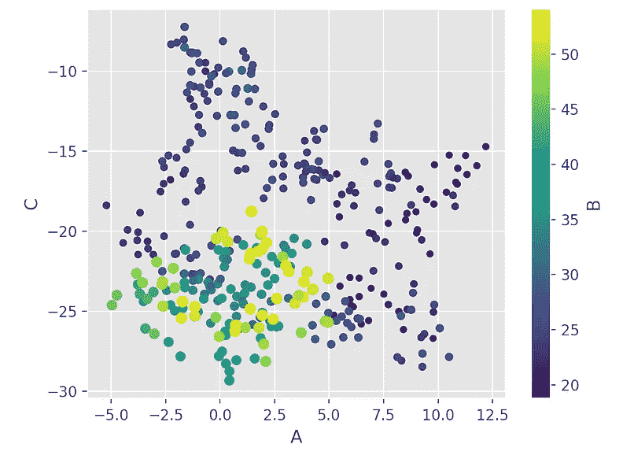
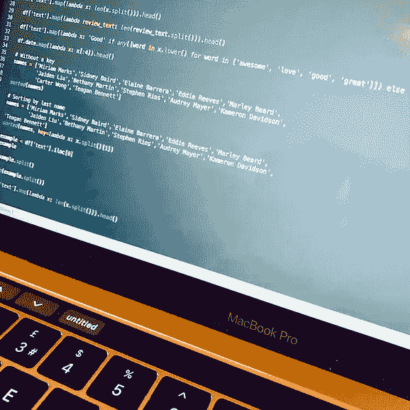

# 学术界、税务和数据科学

> 原文：<https://towardsdatascience.com/academia-tax-and-data-science-54d094e518f3?source=collection_archive---------41----------------------->

在我即将开始为期 10 个月的数据科学训练营之际，我觉得回顾一下引领我来到这里的道路会很有趣。

**一个数学开始**

我于 2012 年毕业于伦敦大学学院(UCL)，获得数学一级荣誉理学硕士学位。我选择这个科目是因为我对这个科目的热情，特别喜欢纯粹的抽象数学模块，如数论。暑假期间，我参加了本科生的研究项目，交了很多好朋友，并最终发表了论文。在我的理学硕士论文中，我分析了康威生命游戏的结构(在数学意义上)，并在波士顿的联合数学会议上以海报的形式展示了我的工作。毕业后，我在帝国理工学院担任研究职位，并开始攻读代数几何博士学位。然而，事情发生了不同的转变，我开始看不到“真实的世界”,我写论文的动机也减弱了。数学的优雅不再足够，我发现自己卡住了。这都是[抽象的废话](https://en.wikipedia.org/wiki/Abstract_nonsense)(我要补充的是，这是一个实际的数学领域。)我的 UCL 同学都在金融、银行或专业服务领域追求收入丰厚的职业，我也想加入职场。

从左到右:1。伦敦大学学院，2。我的毕业照，3。MSCi 论文海报

**税务调查的插曲**

我是偶然进入专业服务领域的，尤其是税务调查和争议解决。我并没有成为税务顾问的强烈愿望，但公司提供了一个“研究生计划”，人们可以在工作的同时学习相关资格。我获得了 ATT 和注册税务师资格，并对英国的税收制度有了全面的了解。起初，在伦敦金融城的企业界工作令人兴奋！我从一家顶级公司跳槽到另一家，一路上获得了晋升。然而，随着我职业生涯的进展，它变得不那么与数字运算有关，而是更多地与管理人员和项目有关。我看着我的资深同事，意识到自己走错了路。同样显而易见的是，税收的“前沿”或技术层面更接近法律，而不是数学，作为一个雄心勃勃、干劲十足的人，我不想停滞不前。

我是在休产假时得到这些启示的。成为一名母亲改变了我的观点，因为我想要一份令我自豪的职业，这将使每天早上离开我的女儿变得更容易忍受。我知道我想用数学和分析技巧来解决问题，税务咨询的世界不再适合我。

从左到右:1。我旧办公室附近的风景，2。为注册税务师考试而学习。公司休假日

**发现数据科学**

在换尿布和不眠之夜之间，我发现了数据科学。听播客、读文章和与我在该领域的朋友交谈，证实了数据科学正是我一直在寻找的。我立即被机器学习的所有不同应用迷住了，但最重要的是，这是一个将使用我的数学背景的领域，在那里我可以有一个有影响和有意义的职业生涯。作为一个喜欢谜题和挑战的人，数据科学的调查方面确实吸引了我。

我开始利用在线资源自学 Python，并报名参加了数据科学 MOOC 课程。这绝对是一个令人开心的时刻！在新的环境中看到我曾经学过的概率和统计定理是令人兴奋的！在编码方面，迄今为止，我已经在不同的地方涉足过编程(高中时是 TI-Basic，雄心勃勃地拿起一本关于 C 的书，一些 MATLAB ),但从未有过具体的目的。编程本身很有趣，但现在它变成了处理数据的工具。

虽然我可以继续自学，但我决定参加一个训练营，主要是为了从结构、导师和社区中受益。由于我已经获得了硕士学位，我不想走上大学的道路，而是专注于尽快使用数据科学工具，并建立一个项目组合。我知道接下来的 10 个月将会是艰苦的工作，但也是值得的！

从左到右:1。我刚出生的女儿和我，2。散点图，3。在我的笔记本电脑上编码