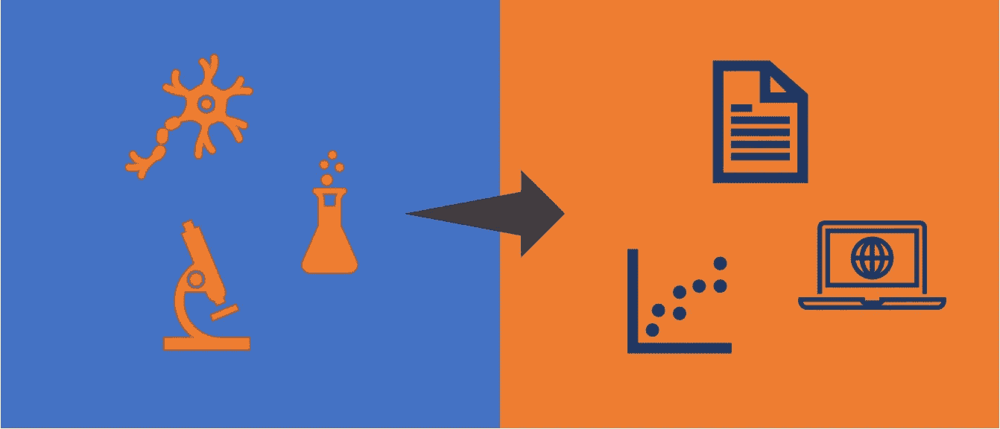
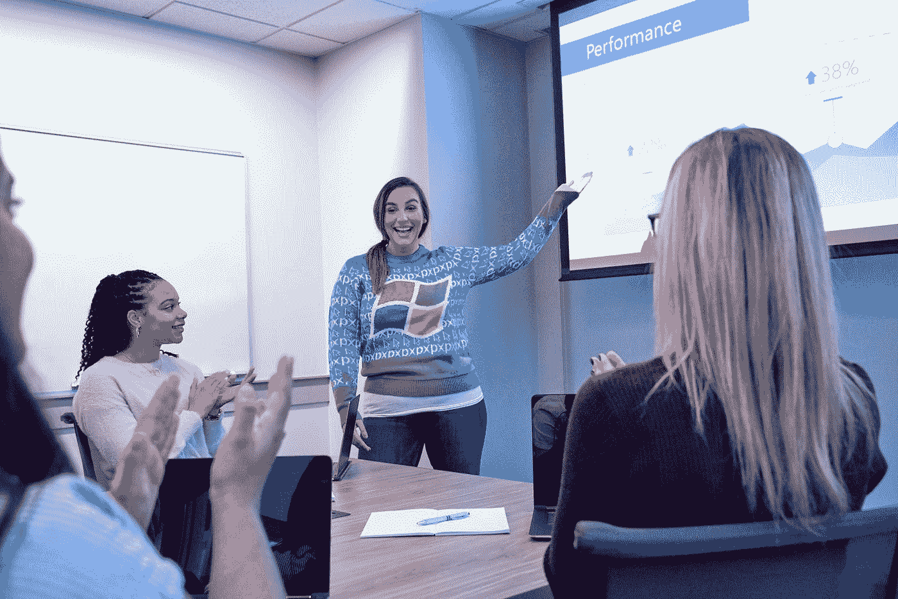

# 从学术界到数据科学:可转移的技能

> 原文：<https://towardsdatascience.com/academia-to-data-science-transferable-skills-306cf052e320?source=collection_archive---------44----------------------->

## 如何利用您的实验室技能成为成功的数据科学家

作者照片

12 周前，我决定辞去学术界博士后研究员的工作，加入了一个为期 12 周的数据科学沉浸式训练营(你猜对了！训练营就要结束了！！🎉).

这个职业转换对我来说不是一个容易的决定。在我之前的[博客](https://medium.com/@ferastwal2/long-story-short-i-left-academia-to-become-a-data-scientist-c38fd803275c)中，我解释了导致我做出这个决定的原因。

作为一个在学术界度过了大部分职业生涯的人，我有点害怕进入数据科学的世界，因为我认为我可能缺乏作为一名数据科学家取得成功的必要技能。

现在，12 周后，我意识到我的怀疑是多么错误。事实上，我很惊讶，我在学术界发展的许多技能是可以转移的，并且是我作为数据科学家研究员取得成功的关键。

**在这里，我将分享我认为非常有用的五大可转换技能。**

# **数据处理**

作为学术界的研究人员，我们每天都在处理数据。这包括数据收集、清理、分析和可视化。拥有这些技能对于成为一名成功的数据科学家非常有帮助(顾名思义！).

当然，你可能仍然会感到害怕，特别是如果你没有任何编码语言的经验，而且非常诚实地说，我一开始也有同样的感觉，但是我很快意识到学习如何编码(特别是使用 python)很容易，但是学习如何处理数据很难。

所以振作起来！你已经知道最难的部分了！🥳

照片由 [Myriam Jessier](https://unsplash.com/@mjessier?utm_source=medium&utm_medium=referral) 在 [Unsplash](https://unsplash.com?utm_source=medium&utm_medium=referral) 上拍摄

# **统计分析**

在某种程度上，这种技能是数据处理技能的延伸。在研究中，对收集的数据进行统计分析是非常常见的。这是我们试图理解我们的数据，揭示有趣的趋势和模式，并分析群体之间的差异。作为一名数据科学家，牢固掌握统计学和统计方法至关重要。

如果你觉得有必要提高你的统计分析技能，这里有一本关于统计学习方法的好书。

在 [Unsplash](https://unsplash.com?utm_source=medium&utm_medium=referral) 上拍摄的 [ThisisEngineering RAEng](https://unsplash.com/@thisisengineering?utm_source=medium&utm_medium=referral)

# 文献评论

数据科学领域瞬息万变。作为一名成功的数据科学家，你需要跟上文献的步伐。

幸运的是，在学术界，我们在如何研究、阅读和跟上当前文献方面获得了广泛的培训和经验。尽管数据科学的文献可能与我们在学术界(就我而言是神经科学)所熟悉的不同，但拥有这些技能将大大加快你的学习过程。

> 伟大的文学作品应该对读者有所裨益:尽管枯燥，但必须加速他们的感知，尽管生硬，但必须增强他们的辨别力，并锤炼他们个人观点的稚嫩-A. E .豪斯曼

[澳门图片社](https://unsplash.com/@macauphotoagency?utm_source=medium&utm_medium=referral)在 [Unsplash](https://unsplash.com?utm_source=medium&utm_medium=referral) 拍摄的照片

# 解决问题

我不记得有哪一次我的实验第一次就非常成功。大多数时候，实验并不像预期的那样工作，我不得不回到绘图板去找出哪里出了问题以及如何解决它。

我在数据科学领域也经历了同样的模式。我在从事不同的项目时遇到了许多障碍，事情并没有马上完美地进行。你解决问题和战略性思考的能力将帮助你识别问题，并在下次尝试时战略性地解决问题。

阿尔瓦罗·雷耶斯在 [Unsplash](https://unsplash.com?utm_source=medium&utm_medium=referral) 上拍摄的照片

# 通讯技能

最后但同样重要的是，有效的沟通技巧。

作为一名数据科学家，如果你不知道如何正确有效地与他人交流，你的工作和发现将毫无意义。

令人欣慰的是，在学术界，我们通过在国家和国际会议上的演讲和海报展示，学会了如何有效地交流和分享我们的发现。我们还希望通过书面出版物定期分享我们的工作。

此外，在学术界，我们不仅熟悉与同行科学家交流科学，也熟悉与公众交流科学。换句话说，我们知道如何为非技术人员简化复杂的概念，这是最重要也是最难掌握的沟通技巧之一。

这里有一篇很棒的[文章](https://www.dataversity.net/how-data-scientists-can-improve-communications-skills/)，里面有一些关于如何提高你作为数据科学家的沟通技巧的提示。

[车窗](https://unsplash.com/@windows?utm_source=medium&utm_medium=referral)在[挡泥板](https://unsplash.com?utm_source=medium&utm_medium=referral)上拍照

# **结论**

从学术界转向数据科学的职业道路可能会非常令人生畏，可能会让你怀疑自己是否有能力成为一名成功的数据科学家。

好消息是，你已经具备了成为数据科学家所需的大部分技能。这些包括数据处理，统计分析，文献回顾，解决问题和沟通技巧。

事实上，曾经有人告诉我，仅仅因为拥有这些技能，我就已经被认为是一名数据科学家了，尽管当时我并不熟悉 python(以及一般的编码)。这说明这些技能对于数据科学是多么重要和关键。

永远记住学习永无止境，不断学习和练习来打磨这些技能。

> “阻碍你的不是你是什么样的人，而是你认为自己不是什么样的人。”——**丹尼斯·威特利**

感谢阅读！请随时在 [LinkedIn](https://www.linkedin.com/in/ferasaltwal/) 、 [Github](https://github.com/ferastwal) 或 [Twitter](https://twitter.com/FerasTwal) 上与我联系！