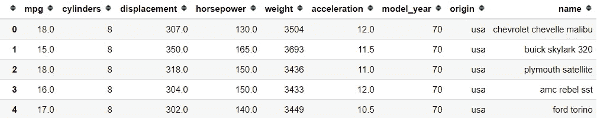
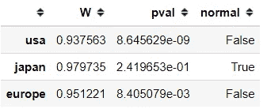
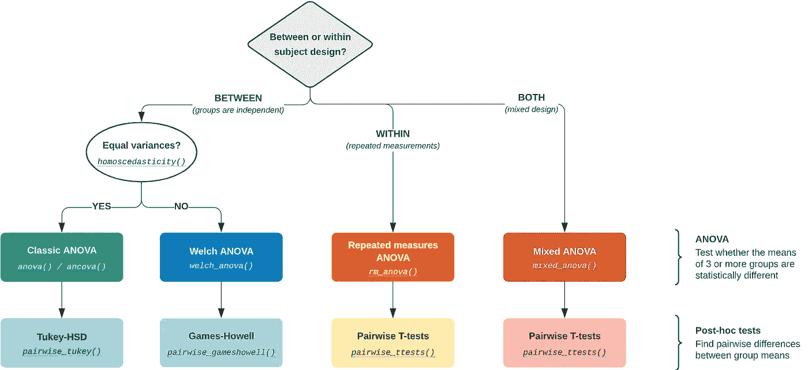
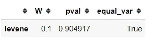
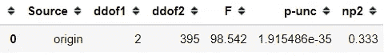
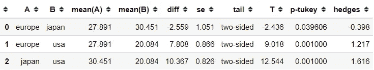

# 用 Pingouin 加速数据科学家复杂的统计测试

> 原文：<https://towardsdatascience.com/accelerate-complicated-statistical-test-for-data-scientist-with-pingouin-f98f29184400?source=collection_archive---------42----------------------->

## 在一个包中快速简单的重要统计测试


[粘土银行](https://unsplash.com/@claybanks?utm_source=medium&utm_medium=referral)在 [Unsplash](https://unsplash.com?utm_source=medium&utm_medium=referral) 拍摄的照片

作为一名数据科学家，我们的工作包括创建一个机器学习模型，并建立**我们对数据**的假设。

了解我们的数据如何相关以及目标统计数据之间的任何差异会对我们的数据分析和模型创建产生很大影响。

如果你想在数据科学领域取得优势，我真的鼓励你学习基本的统计学和假设检验。

不管你在统计测试方面的知识如何，我想介绍一个有趣的开源统计包，我知道它会在你的日常数据科学工作中有用(因为它对我有帮助)——这个包叫做 [Pingoiun](https://pingouin-stats.org/) 。

让我们来看看这份套餐提供了什么，以及它如何为我们的工作做出贡献。

# 平古因

根据 Pingouin 主页，这个软件包是为那些想要简单而详尽的统计功能的用户设计的。

之所以这样设计，是因为有些函数，就像 SciPy 中的 t-test，在我们需要更多关于数据的解释时，只返回 T 值和 p 值。

在 Pingouin 包中，计算是在上面几个步骤中进行的。例如，除了仅返回 T 值和 p 值之外，来自 Pingouin 的 T 测试还返回测试的自由度、效应大小(Cohen 的 d)、均值差异的 95%置信区间、统计功效和贝叶斯因子(BF10)。

让我们用一个真实的数据集来试试这个包。首先，让我们安装 Pingouin 包。

```
#Installing via pip
pip install pingouin#or using conda
conda install -c conda-forge pingouin
```

现在，假设我有来自不同地方的汽车 mpg 数据集(可以从 Seaborn 包中免费获得)。

```
import seaborn as sns
mpg = sns.load_dataset('mpg')
```



作者创建的图像

有了这个数据集，我可能会有一个问题。**不同产地的车有没有 mpg 差异？**(原产地唯一类别为“美国”、“欧洲”和“日本”)。

带着上面的问题，我已经在尝试假设不同处理(车的产地)(mpg)的因变量是有差异的。这是一个典型的假设问题。

我们知道我们需要选择哪种统计测试是有效的，来测试我们头脑中有问题的假设。为了举例，我们将使用单向 ANOVA 检验，这是一种假设检验，用于分析样本中组均值之间的差异。当您要测试的数据有两种以上的处理方式时，可以使用它。

我不会详细解释它，因为本文的目的是向您介绍 Pingouin 包；事实上，我们可能会违反一些假设。

首先，我想检查单个样本数据是否遵循正态分布**(正态性检验)**。我们可以通过下面的代码使用 Pingouin。

```
import pingouin as pgpg.normality(mpg, dv = 'mpg', group = 'origin')
```



作者创建的图像

默认情况下，正态性检验将使用α水平为 0.05 的夏皮罗-维尔克检验。你可以了解更多，但这里重要的是，不是每个治疗(起源)都遵循正态分布。“美国”和“欧洲”的数据不符合正态分布。

在 Pingouin 主页上，他们为我们提供了使用一些测试包的[指南](https://pingouin-stats.org/guidelines.html#anova)。其中一个是单向方差分析测试。



方差分析测试指南(来源:【https://pingouin-stats.org/guidelines.html#anova】T4)

根据上面的指南，我们的测试是组间的，因为数据是独立的。这就是为什么我们需要使用 Pingouin 来检查方差相等性。

```
pg.homoscedasticity(data = mpg, dv = 'mpg', group = 'origin')
```



作者创建的图像

默认的方差检验是使用 Levene 检验，它对于正态性的偏差是稳健的。从测试中，我们可以看到数据具有相等的方差。然后我们可以进行经典的方差分析测试。

```
pg.anova(data = mpg, dv = 'mpg', between = 'origin')
```



作者创建的图像

像往常一样，我们希望看到 p 值作为我们拒绝或不拒绝零假设的指导。上述函数的 p 值为 p-unc，即未校正的 p 值。

根据上面的结果，如果我们假设阿尔法水平为 0.05，我们可以拒绝零假设，这意味着原产地待遇和汽车的 mpg 之间存在差异。

如果你想知道哪个组是不同的，我们可以做事后测试。

```
pg.pairwise_tukey(data = mpg, dv = 'mpg', between = 'origin' )
```



作者创建的图像

根据上面的事后测试，我们使用 p-tukey 作为 p 值。从上面的结果，我们可以看到每一个人的起源都是不同的。

这意味着有证据表明，在美国、日本和欧洲生产的汽车之间的 mpg 存在差异。

这是一个使用 Pingouin 包进行统计测试的例子；你还可以使用更多的统计测试，你可以在这里看到。

# **结论**

Pingouin 是一个简单而详尽的统计软件包，旨在简化您的统计分析。使用一行程序可以生成关于数据的重要信息，您可以使用这些信息来分析或创建预测模型。

# 如果您喜欢我的内容，并希望获得更多关于数据或数据科学家日常生活的深入知识，请考虑在此订阅我的[简讯。](https://cornellius.substack.com/welcome)

> 如果您没有订阅为中型会员，请考虑通过[我的介绍](https://cornelliusyudhawijaya.medium.com/membership)订阅。