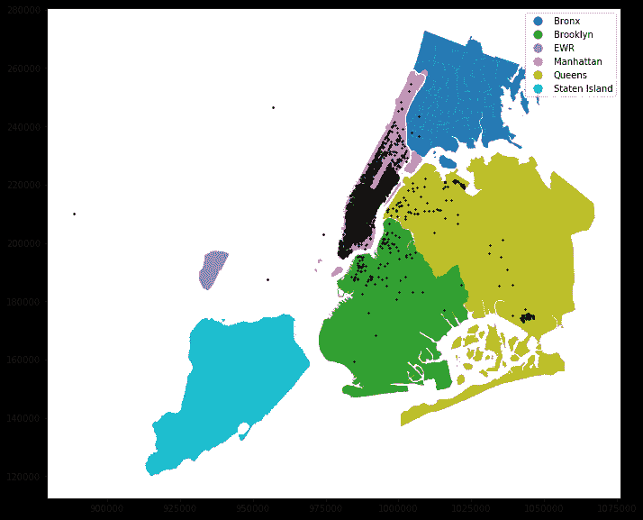
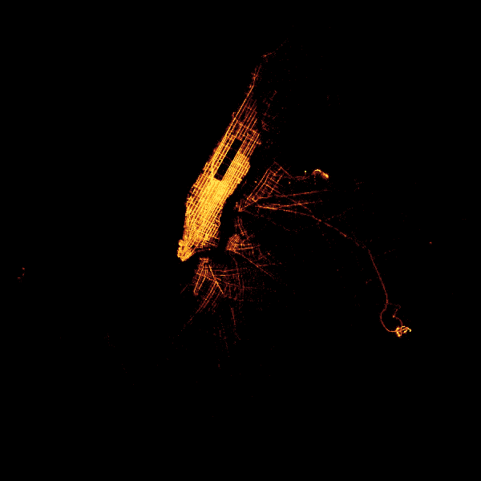

# 利用这些技巧加速地理空间数据科学

> 原文：<https://towardsdatascience.com/accelerate-geospatial-data-science-with-these-tricks-752d8b4e5381?source=collection_archive---------18----------------------->

## 关于如何用代码加速地理空间数据处理的提示和技巧


马修·施瓦茨在 [Unsplash](https://unsplash.com?utm_source=medium&utm_medium=referral) 上的照片

在这个大数据时代，大数据集无处不在，而不是例外。虽然您可以在数据科学中使用一些其他加速技术，但地理数据科学有特殊的技术来增强您的地理数据处理。在这篇文章中，我分享了一些我最喜欢的技巧和诀窍来加速 Python 中地理空间数据的处理。

在整个教程中，我们使用纽约市出租车出行数据集。该数据包含 140 万个点。我们还使用出租车区域数据集来执行一些地理处理任务。我们首先使用 Geopandas 读取数据进行基准测试。

让我们导入本教程中使用的库。

```
import geopandas as gpd
import matplotlib.pyplot as plt
import geofeather
import datashader as ds
import holoviews as hv
```

读取数据需要相当长的时间，这取决于计算资源。在我这边，这花了 1 分 46 秒。


我们可以通过将数据格式(Shapefile)转换为 GeoFeather 格式来加快读取时间。

## 1.使用 GeoFeather 快速读取地理空间数据

现在这将提高你的阅读速度，但只需要一行代码就可以将你的数据转换成 GeoFeather，这要感谢 [Geofeather 库](https://github.com/brendan-ward/geofeather)。让我们将数据转换为 GeoFeather。

```
geofeather.to_geofeather(gdf,'tutorialData/TaxiDataGeoFeather.feather')
```

在我的例子中，转换为 GeoFeather 只需要 51 秒，但仅此而已，下次您可以使用 Geofeather 读取数据，这比从 shapefile 读取数据花费的时间更少。让我们看看。

```
gdf = geofeather.from_geofeather(‘tutorialData/TaxiDataGeoFeather.feather’)
```

使用 Geofeather 阅读只需要 26 秒，而使用 Shapefiles 需要 1 分 46 秒。这是一种很棒的技术，可以帮助您快速试验地理空间数据，而无需等待很长时间。

我也发现有时根据我的需要只阅读几何的一个子集。这在最近发布的 Geopandas 0.70 之前是不可能的。第二个技巧向您展示了如何读取大型数据集的子集几何。

## 2.读取带有几何图形的子集

让我们先读一下滑行区域，并用我们在前面章节中读到的滑行点标出它们。

```
zones = gpd.read_file(“tutorialData/taxizones.shp”)fig, ax = plt.subplots(figsize=(12,10))
zones.plot(“borough”, ax=ax, legend=True)
gdf.sample(5000).plot(ax=ax, markersize=2, color=”black”)
```

下面的地图显示了叠加在出租车区域上的出租车点示例(用行政区着色)。



现在，假设你只需要布鲁克林区，没有必要读取全部数据。在这种情况下，您只需读取带有几何图形的数据子集。您可以通过在使用 Geopandas 读取数据时提供一个掩码来实现这一点。

```
gdf_subset = gpd.read_file(“tutorialData/taxidata.shp”, mask=zones[zones[“borough”].isin([“Brooklyn”])])
```

这只花了 38 秒，而且你只得到你所需要的，仅在布鲁克林多边形内的出租车点数据的子集。

## 3.空间索引可能会促进地理处理

有时，空间索引可能有助于加快地理处理任务的速度。让我们看看多边形中的点(PIP)的空间索引和非空间索引实现之间的速度差异。我们首先将出租车区域分解成区多边形，然后在没有空间索引的情况下进行空间连接。

```
boroughs = zones.dissolve(by=’borough’)sjoined = gpd.sjoin(gdf, boroughs, op=”within”)
```

在没有空间索引的情况下，这个过程需要 2 分 50 秒。让我们看看空间索引是否可以提高性能速度。

在 Geopandas 中创建空间索引非常简单。让我们对两个数据集都这样做。

```
gdf_sindexed = gdf
zones_sindexed = zonesgdf_sindexed.sindex
zones_sindexed.sindex
```

现在我们用空间索引做 PIP 处理。

```
sjoined = gpd.sjoin(gdf_sindexed, boroughs_sindexed, op="within")
```

使用空间索引，该过程需要 2 分 19 秒，与非空间索引处理相比，速度略有提高。空间索引并不总是有用，尤其是在点数据和面具有相同范围的情况下。你可以从这篇[博客文章](https://geoffboeing.com/2016/10/r-tree-spatial-index-python/)中读到关于空间索引何时有效何时无效的详细解释。

## 4.用 Datashader 绘图

当使用其他绘图库，如 Folium 或 Plotly 时，绘制大型数据集通常会以失败告终。Datashader 专用于绘制大型数据集。

> Datashader 是一个图形管道系统，用于快速灵活地创建大型数据集的有意义的表示。

这使您可以在地图上绘制所有数据，而不会因为采集样本而受到影响。让我们用 Datashader 快速轻松地绘制所有 140 万个点。

```
agg = ds.Canvas().points(sjoined, ‘pickup_lon’, ‘pickup_lat’)
img = tf.set_background(tf.shade(agg, cmap=fire),”black”)
img
```

你得到的是所有数据的美丽的点状图。



您可以在 Datashader 中创建带有漂亮底图的交互式地图。它还可以很好地工作 PyViz 数据可视化工具，如 Geoviews，并可以与 Panel 结合使用 Jupyter 笔记本创建漂亮的仪表板。

## 结论

在这篇文章中，我分享了一些我最喜欢的使用 Python 进行地理空间数据科学提升的技术。您可以使用 Geofeather 或仅读取子集来加快读取时间。对于地理处理任务，值得尝试使用空间索引来加快处理时间。最后，在绘制大型数据集时，使用 Datashader 可以提高速度并获得漂亮的地图。

本教程的笔记本在 [Github](https://github.com/shakasom/spatialjoin-python/blob/master/Accelerate%20Geospatial.ipynb) 中。