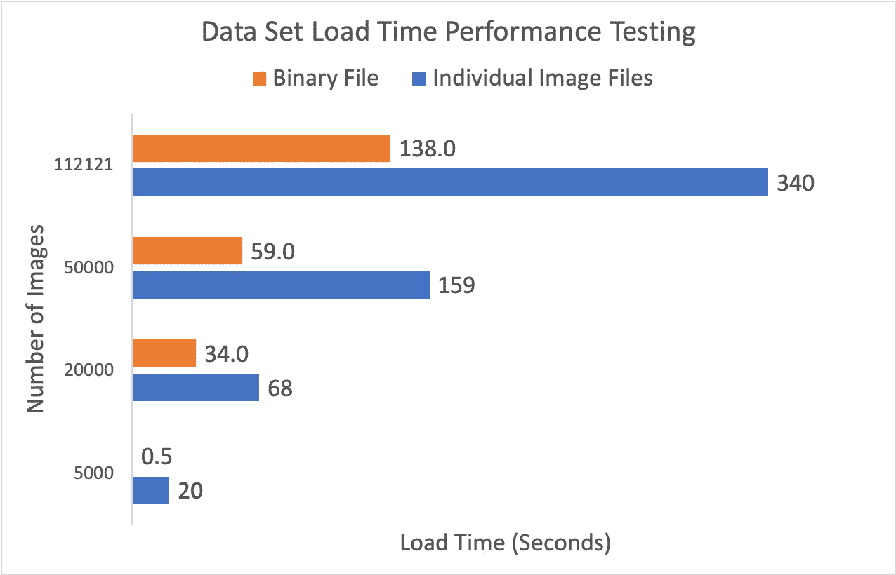

# 加速超参数调谐的简单方法

> 原文：<https://towardsdatascience.com/accelerate-hyperparameter-tuning-217c95ca626e?source=collection_archive---------57----------------------->

## 优化性能

## 更快获得结果

图片由 [alan9187](https://pixabay.com/users/alan9187-2347/?utm_source=link-attribution&utm_medium=referral&utm_campaign=image&utm_content=534120) 来自 [Pixabay](https://pixabay.com/?utm_source=link-attribution&utm_medium=referral&utm_campaign=image&utm_content=534120)

# 介绍

如果使用多个文件来训练神经网络模型，可能会显著减少模型调整时间。

这里有一个常见的场景:你组织和准备你的数据，编写你的神经网络模型的第一个版本，为第一次测试做好一切准备，点击 run，然后你等待。

第一个纪元要花很长时间，因为你的整个数据集都要加载到内存中。最后，在几个时期的训练(甚至几批)之后，你意识到这是行不通的——模型已经过度拟合或者只是表现不佳。所以你调整一个超参数(或十个)，然后等待整个过程再次完成。

在你的结果达到要求之前，你可能会一遍又一遍地这样做。

超参数调优已经是一件苦差事；为什么要花更长时间？图片由[埃利亚斯施。](https://pixabay.com/users/EliasSch-3372715/?utm_source=link-attribution&utm_medium=referral&utm_campaign=image&utm_content=2127669)来自 [Pixabay](https://pixabay.com/?utm_source=link-attribution&utm_medium=referral&utm_campaign=image&utm_content=2127669)

如果您曾经处理过中等数量到大量的数据(比如 10GB 或更多)，那么这可能是一个熟悉的场景。如果您的数据集足够大，您可能需要等待 10 分钟或更长时间才能将数据加载到内存中。即使您正在使用 DataGenerators 和 flow_from_directory()，您最终也会经历相同的延迟，只是在第一个纪元上展开。如果您的大型数据集由成千上万个小文件组成，这种延迟会特别令人痛苦。

在这篇文章中，我将教你如何使用一个简单的方法，对于某些类型的大型数据集，每次开始一个新的超参数测试运行时，可以节省你几分钟的时间。

# 它是如何工作的

在讨论解决方案之前，让我们先来讨论一下问题:磁盘 I/O。在许多情况下，处理大型数据集时的性能瓶颈是将数据从硬盘取出并放入内存所需的时间。在许多数据科学应用中，数据是从分布在硬盘上的数千个小碎片文件中检索出来的。

这方面的一个例子是 [NIH 胸部 X 射线](https://www.kaggle.com/nih-chest-xrays/data/data)数据集【1】，其中包含 112，121 幅图像，总计 42GB 的数据。另一个例子是 [Mozilla Common Voice](https://www.kaggle.com/mozillaorg/common-voice) 数据集[2]，其中包含超过大约 380，000 个 mp3 文件的 13GB。这些数据集只是冰山一角—处理大量数据并不罕见。

从磁盘中读取数千个小文件时，使用的是随机读取操作，与长时间的顺序读取操作相比，这将导致显著的性能损失。[这里有一篇文章，提供了一个很好的基本介绍这个概念。](https://mapr.com/blog/an-introduction-to-disk-storage/)【3】

因此，**我们的目标是最小化随机读取操作。**实现这一点的方法很简单:将所有数据组合成尽可能少的大型二进制文件，这样加载数据所需的 I/O 操作就会从数千次缓慢的随机读取变为几次快速的顺序读取。

无论是用于分类的 2D 卷积网络、1D 回归网络还是介于两者之间的任何网络，只要需要加载大量数据以训练神经网络模型，此解决方案都将改善加载时间。

我们将共同:

1.  调整数据大小并将其填充到统一的文件大小；
2.  一次读取所有调整大小的图像文件；
3.  将数据写入单个二进制文件；
4.  执行一些性能测试，以演示读取几千个图像、几万个图像和几十万个图像的性能优势。

我们来编码。

# 生成二进制文件

本次测试我将使用的数据集为上述 [NIH 胸部 X 线片](https://www.kaggle.com/nih-chest-xrays/data/data)数据集，因为它广泛可用，目前在 [Kaggle](https://www.kaggle.com/nih-chest-xrays/data) 上非常流行。

从数据集构建二进制文件的方法有很多，但在本例中，我们将使用一个简单而强大的方法来演示其功效:NumPy 二进制文件。

首先，为了准备数据集，我将调整所有图像的大小，使其分辨率为 512 x 512，并确保它们是一个单一颜色通道，而且位深度为每个像素 8 位的灰度格式。下面是一些有用的函数:

调整图像大小和填充图像的示例函数。

这三个函数用于将完整图像目录的大小调整为定义的大小，并根据需要添加填充。

> “…在大型数据集上执行超参数调整时，另一种节省时间的方法是预先扩充数据集(在构建二进制文件时)，而不是使用动态扩充。”

创建 NumPy 二进制文件很简单。首先，读取数据和标签，并将它们添加到 NumPy 数组中。这一步可以很容易地作为前一步的一部分添加，或者在数据集预扩充期间添加(这样您就不需要将调整大小后的文件保存到磁盘上)，但是为了清楚起见，我将演示作为一个单独的步骤从图像目录中构建和保存二进制文件:

一个示例函数，用于从图像文件目录及其关联的。csv 标签文件。

应该注意的是，您需要有足够的内存来从这样的数据集创建一个二进制文件。在这种情况下，在调整图像大小并限制其颜色空间后，整个数据集的二进制文件大约为 30GB。因此，您必须至少有这么多的可用内存。

对于大型数据集，您可以将数据集分割成较小的二进制文件。因此，例如，如果您只有 16GB 的内存，使用几个 4GB 的二进制文件来存储数据集以避免达到内存限制可能是值得的。

此外，需要明确的是，在构建标签数组时，我将此视为二进制分类(因此我只选择肺炎类为 1，其他所有类为 0 ),如果我真的试图使用此数据，它将是多个类的分类交叉熵，并且将完成许多其他工作以确保更好地处理数据集——但这些细节对该测试没有影响，并且我通过重用一些旧代码来节省时间。

现在我们可以简单地加载这些数据来训练我们的模型，如下所示:

如何加载您创建的 NumPy 二进制文件

如果您需要扩充数据，可以使用您喜欢的任何方法，包括 Keras 的 ImageDataGenerator:

使用 ImageDataGenerator 和 data gen . flow()Source:[Keras Docs](https://keras.io/api/preprocessing/image/)

然而，在大型数据集上执行超参数调整时，另一种节省时间的方法是预先扩充数据集，而不是使用动态扩充。如果您在构建二进制文件的过程中扩充了数据，那么以后在训练模型时就不需要将 CPU/GPU 时间专门用于这些任务。这意味着每次测试超参数时，您的数据集已经被扩充，因此不需要重新扩充。在多次重复调优的过程中，这一点会变得非常重要。在构建二进制文件的过程中这样做很方便，因为这样一来，您就不需要将文件保存到磁盘，然后重新加载调整过大小的文件来构建二进制文件。

# 将性能与标准方法进行比较

我们将执行四组测试，每组在数据集中使用不同数量的图像。

我们将使用 5，000 幅图像、20，000 幅图像、50，000 幅图像以及完整的 NIH 胸部 X 射线数据集的 112121 幅图像来模拟不同大小的数据集。我已经预先创建了包含每个数量的图像的二进制文件。

每个测试都将包括使用 np.load()加载数据集二进制文件，并且也是基于每个图像文件(就像使用 flow_from_directory()这样的东西所做的那样)。计时将在加载图像之前开始，并在加载完成后结束。请记住，在 flow_from_directory()场景中，图像是动态加载的，因此图像是根据需要批量加载的。这与*略有不同，因为我们一个接一个地加载完整数据集中的每个图像，但是读取的总持续时间应该大约与实际模型训练会话过程中的持续时间相匹配(假设您有足够的内存来存储完整数据集，并且它不是磁盘缓存的，这实际上会影响性能)。*

下图说明了使用 image_flow_from_directory 与使用此二进制文件方法的性能差异。请注意，每个值都是三次尝试的平均值，没有一次是按顺序进行的(以避免内存缓存影响结果)。所有文件(单个图像和二进制文件)都是从 WD My Book USB 3.0 外置硬盘上加载的。

我们加载时间测试的结果。越低越好。图片作者。

如您所见，总体而言，加载二进制文件比加载单个图像文件要快得多，性能优势大致与图像数量成线性关系。

# 结论

在本文中，我演示了如何使用二进制文件在超参数调优期间减少数据集加载时间。这很有价值，因为在超参数调整过程中，每次更改神经网络模型时都会加载数据集。

如我们的测试所示，如果您在一个中等大小的数据集上进行训练，如 NIH 胸部 X 射线数据集，您可以在每次参数迭代中节省几分钟。在 50 次迭代的过程中，这可能需要超过两个小时的时间！

这种方法的缺点是您必须有足够的内存来存储完整的数据集(或者使用多个二进制文件)，并且您必须花时间编写二进制文件的创建脚本。这样做的另一个好处是，此时您还可以选择增加或调整源数据的大小。通过预先扩充您的数据集，您可以获得额外的好处，即不必重复使用 CPU 时间进行动态扩充。

这对你有帮助吗？有哪些可以改进的地方？你知道加速超参数调整迭代的其他方法吗？让我知道！

# 参考

[1] X. Wang 等. ChestX-ray8:医院级胸部 X 线数据库和常见胸部疾病弱监督分类和定位基准。IEEE 2017，[http://open access . the CVF . com/content _ cvpr _ 2017/papers/Wang _ ChestX-ray 8 _ Hospital-Scale _ Chest _ 2017 _ paper . pdf](http://openaccess.thecvf.com/content_cvpr_2017/papers/Wang_ChestX-ray8_Hospital-Scale_Chest_CVPR_2017_paper.pdf)

[2] Mozilla，Common Voice (2020)，【https://voice.mozilla.org/en 

[3] MapR，磁盘存储导论(2019)，【https://mapr.com/blog/an-introduction-to-disk-storage/ 