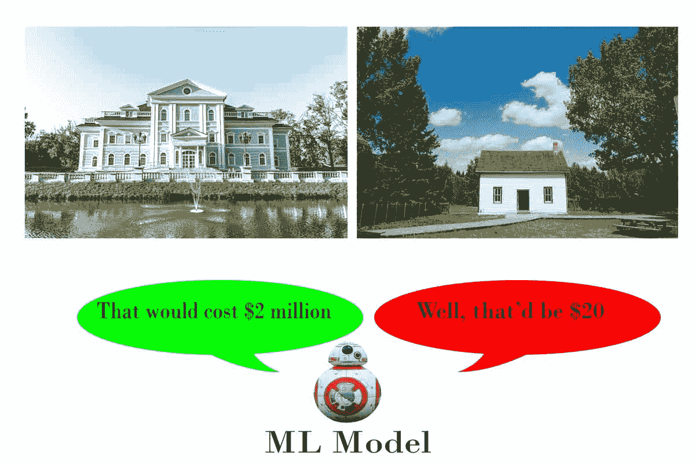
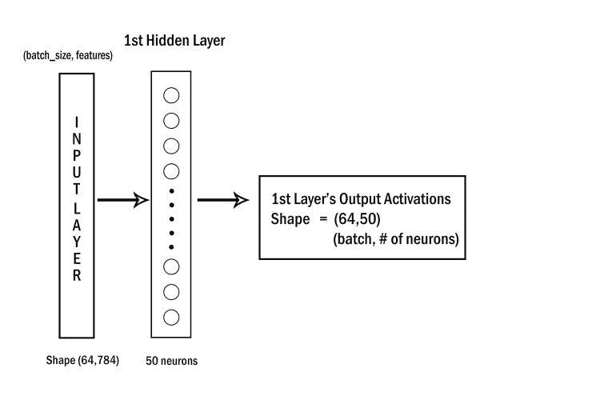
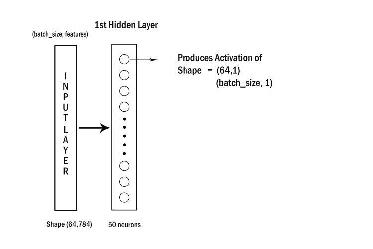
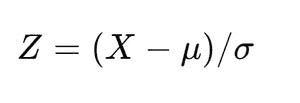
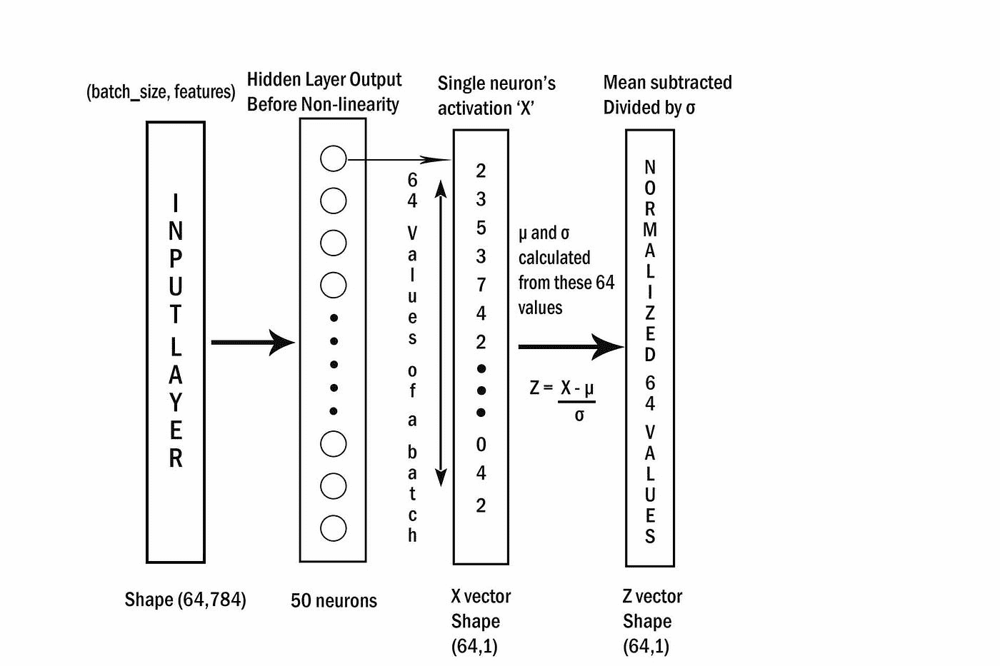
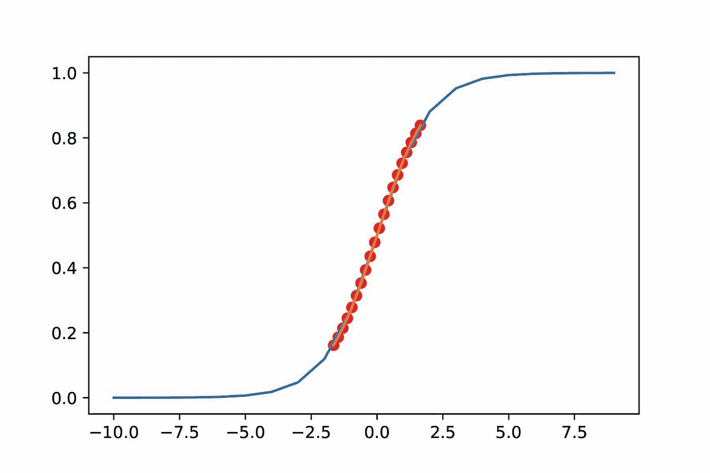
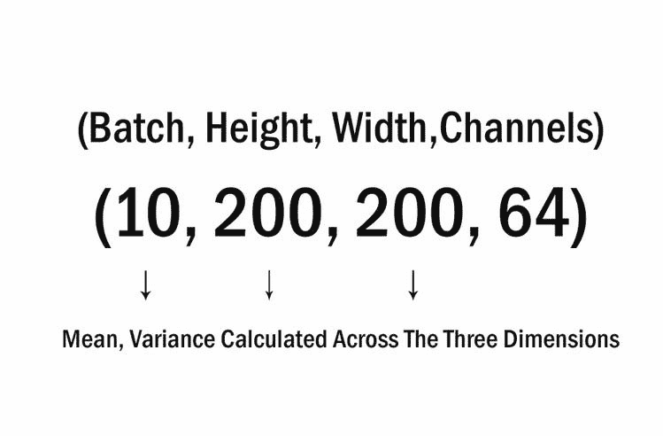
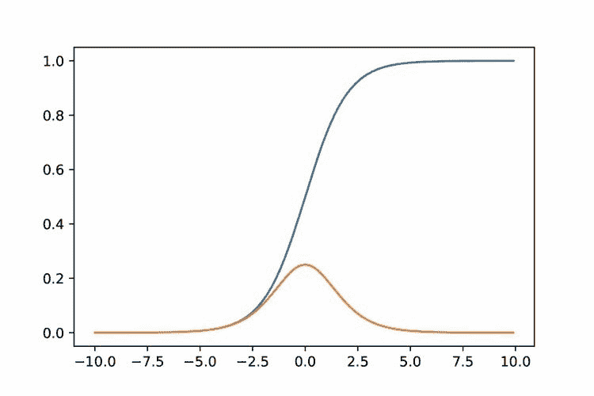

# 通过批量标准化加速模型训练

> 原文：<https://towardsdatascience.com/accelerate-model-training-with-batch-normalization-a8c9374c2d72?source=collection_archive---------22----------------------->

## 什么是批处理规范化，它是如何工作的？是什么使它能够实现更快的训练？这篇文章旨在用有助于发展直觉的插图来回答上述问题。


[**批量归一化加速模型训练**](https://hackerstreak.com/batch-normalization-how-it-really-works/) 图片来源:Sebastiaan 摄影 [stam](https://unsplash.com/@chillarea?utm_source=unsplash&utm_medium=referral&utm_content=creditCopyText) on [Unsplash](https://unsplash.com/?utm_source=unsplash&utm_medium=referral&utm_content=creditCopyText)

Sergey io FFE[、](https://arxiv.org/search/cs?searchtype=author&query=Ioffe%2C+S) [Christian Szegedy](https://arxiv.org/search/cs?searchtype=author&query=Szegedy%2C+C) 在 2015 年发表的批量标准化论文在深度学习社区掀起了风暴。它在发布后成为深度学习中实现最多的技术之一。值得注意的是，它能够加速深度学习模型的训练，并在少于 14 倍的训练步骤中实现相同的准确性，这是一个很大的收获。事实上，这引起了今天人们的关注(谁不想训练得更快呢？).已经有很多类似的论文，如层规范化，实例规范化和其他一些。这些方法试图克服批处理规范化的一些缺点。

让我们开始吧！

# 什么是正常化？

让我们从了解典型的输入数据规范化的作用开始。虽然深度学习模型不需要太多的特征工程，但将输入特征缩放到相同的范围有助于更快地训练模型。最小-最大缩放是一种这样的特征缩放方法，它将所有输入带到 0 到 1 的范围。它由下面的表达式给出。


最小-最大归一化

它只是从每个数据点中减去数据中的最小值，然后除以数据中值的范围。范围就是输入数据分布中的最大值减去最小值。通过下面的例子，您可以直观地理解这是如何改进模型训练的。考虑一个机器学习模型，它以房子的平方英尺和房间数量作为输入，并预测价格。


虽然房屋的面积可能有数百或数千平方英尺，但房间的数量大多在 10 个以下。由于不同输入要素之间范围的巨大差异，模型之间的竞争趋于一致。这是因为与较小的特征相比，模型更重视较大的特征。

还有一点需要注意的是，规范化的特征列不会像非规范化版本那样在值上有很大的变化。例如，一座大厦可能有几千平方英尺的土地，但一所小房子可能只有几百平方英尺。虽然模型应该更重视面积较大的房屋，但过大的差异会阻碍模型的学习。



# 那么什么是批量规范化呢？

# 简短版

在上一节中，我们看到了 ML 模型如何受益于规范化的输入特征。现在，让我们考虑一个全连接深度神经网络作为我们的模型。并且，如果我们为隐藏的层也增加正常化会怎么样？从技术上讲，每个隐藏层的输入都是前一层的输出。对其进行标准化似乎也是正确的，对吗？是的。这就是批处理规范化的作用。

# 长篇版本

在朴素梯度下降中，我们一次输入一个输入，并使用反向传播来更新模型。相比之下，使用小批量梯度下降，我们一次向前和向后传递一组输入示例。而这一捆就是我们所说的“*”。因此，每个隐藏层将看到来自之前层的批量激活。让我们用一个例子来进一步探讨。*

## *MNIST 全连接网络*

*考虑一个具有两个隐藏层的全连接神经网络，并假设我们正在 MNIST 数字数据集上训练它。如果你不熟悉 MNIST，数据集包含 28×28 大小的图像，数字从 0 到 9。手指的图像作为模型的输入，通过将其分解成大小为 784 的长 1D 向量来给出。在成批训练时，多个数字图像向量被堆叠和馈送。鉴于此，输入形状变为(batch_size，784)。*

**

*输入数据的维度*

*上图的批量大小为 2，每个输入中的要素数量为 784(像素)。为了简单起见，让我们假设模型的每一层都有 50 个神经元。因此，第一个隐藏层的激活将是形状(2，50)。因为 2 是我们的批量，50 是神经元的数量。如果我们的批量大小是 64，那么形状将是(64，784)*

**

*第一个隐藏层激活的形状*

*此外，让我们深入检查第一隐藏层的单个神经元的激活。如果只有一个输入，单个神经元将只产生一个激活。但是，如果输入是成批给定的，它会激活 shape (batch_size，1)。使得批量中的每个输入激活 1 次。*

**

## *添加批处理规范化图层*

*通常，在将输入乘以权重之后，网络中的每一层将应用非线性激活函数，如“*”。如果我们要插入一个批量标准化层，我们必须在应用非线性之前添加它。批量标准化层通过应用标准化方法来标准化激活。**

****

**μ是平均值，σ是标准差**

**它从激活中减去平均值，并将差值除以标准偏差。标准差就是方差的平方根。具体来说，我们计算整个批次的平均值和标准偏差，并分别减去和除以。**

**你看，层在反向传播期间调整它们的参数，假设它们的输入分布保持不变。但是所有层都用反向传播来更新，从而改变它们的每个输出。**

**这改变了各层的输入，因为每一层都从前一层获得其输入。这叫做 ***内部协变*** 。因此，这些层经历不断变化的输入分布。重要的是，这种标准化方法标准化了输出激活的分布。**

**因此，当权重改变时，它产生不会变化太多的期望的激活分布。换句话说，它最小化了 ***内部协变量移位*** 并帮助模型更快地学习。**

**尽管这被认为是批量标准化成功的主要因素，但一些论文将其归因于其他因素。[这篇](https://arxiv.org/pdf/1805.11604.pdf)文章讲述了批量标准化层如何平滑损失曲线，从而帮助训练更快。**

## **通过示例了解**

**同样，为了清楚起见，我们只考虑单个神经元的激活，并将批量大小设置为 64。我们的两个隐藏层各有 50 个神经元。正如我们之前看到的，单个神经元的输出将是(64，1)。批次归一化层计算批次中 64 个值的平均值(μ)和标准差(σ)。**

**从 64 个值中减去的就是这个μ值。σ除以从神经元中减去的平均激活。相反，让我们想象一下批处理规范化层是做什么的。**

****注:为简单起见，此解释仅针对一层中单个神经元。****

****考虑所有神经元的批量标准化的输出在形状上与此不同，但所有过程都是相同的。****

****

**单个神经元通过批量标准化层的激活流程**

**如果我们考虑一层中的所有神经元，激活形状将是(64，50)。然后对 50 个神经元中的每一个计算平均值和方差，得到 50 个平均值和 50 个方差值。并且对应于单个神经元的每一列应该用其各自的平均值和方差来归一化。**

# **批量标准化对激活的影响**

**好了，我们已经成功地规范化了一个隐藏层的激活，剩下的就是应用非线性，对吗？**

**不，这还没有结束！**

**嗯，标准化隐藏层的激活有一个问题。如果我们将标准化的激活输入到一个 Sigmoid，模型的表达能力就会降低。为了澄清，归一化的激活是一个 0 均值和单位方差分布。因此，激活落在 s 形非线性的线性区域。我们将继续尝试使用 matplotlib 和 Python 绘制函数。**

```
**import numpy as npimport matplotlib.pyplot as pltdef sigmoid(x):return 1 / (1 + np.exp(-x))x = np.arange(-10,11,1)        #creates a distribution [-10,-9,-8,.........7,8,9,10]x_sig = sigmoid(x)plt.plot(x,x_sig)plt.scatter(x,x_sig)**
```

**把这个数据分布看作是我们将要归一化的激活。下图显示了未标准化数据的 sigmoid 图[-10 到 10]。**

****

**现在，我们将对相同的数据进行归一化，看看数据点落在曲线的什么位置。这是实现这一点的 Python 代码。**

```
**import numpy as npimport matplotlib.pyplot as pltdef sigmoid(x):return 1 / (1 + np.exp(-x))x = np.arange(-10,11,1)        #creates a distribution [-10,-9,-8,.........7,8,9,10]x_sig = sigmoid(x)plt.plot(x,x_sig)      #to plot the blue, unnormalized sigmoid curvex = (x-np.mean(x))/np.std(x) #standardizing the datax_sig = sigmoid(x)plt.scatter(x,x_sig)#plot the standardized values  (red data points)**
```

****

**归一化点落在 s 形曲线的线性区域**

# **批量标准化的参数**

**正如我们所见，批量标准化并没有让模型利用 sigmoid 非线性。这使得乙状结肠层几乎是线性的，我们不希望这样！因此，本文作者给出了一种恢复网络表达能力的方法。他们引入了两个参数来移动和缩放标准化激活。**

****

**γ和β参数通过反向传播学习。x_hat 是标准化激活**

**引入这两个参数是为了使它们能够撤销由批处理规范化层完成的规范化。如果*伽马*被设置为σ并且*贝塔*被设置为平均值，它将完全反规格化激活返回到正常。乍一看，这似乎有悖常理。但是这样做是为了使模型能够以它想要的方式调整归一化，如果这样可以减少损失的话。这带回了当我们正常化激活时失去的表达能力。**

**使用批处理规范化的一个主要优点是它是完全可微的。所以，这意味着你可以通过它反向传播，可以使用梯度下降进行训练。也就是说，我们可以更新*伽玛*和*贝塔*以及模型参数。**

# **卷积的批量规范化**

**卷积图层后的批量归一化略有不同。通常，在卷积层中，输入作为形状的四维张量(批次、高度、宽度、通道)输入。但是，批量标准化层会跨批量、高度和宽度维度对张量进行标准化。对于每个通道，计算其他三个维度的均值和方差。因此，这给出了“C”个平均值和方差值，然后用于归一化。**

****

**对于张量中的每个通道，计算所有其他维度的平均值和方差**

**因此，对于上述示例中的 64 个通道中的每一个，计算 10x200x200 (400000)值的平均值和方差。这为我们提供了 64 个均值和 64 个方差来分别归一化每个通道。**

# **批量标准化的优势**

**批量标准化可以防止网络陷入非线性的饱和区域。它还有助于层中的权重在标准化输入时学习得更快。你看，一个层的大输入值(X)会导致即使很小的权重激活也很大。这将激活推到 sigmoid 或 tanh 非线性的饱和区域。**

****

**在 sigmoid 的饱和区域附近，导数几乎为零**

**饱和激活具有非常小的导数。因此，他们做非常小的梯度步骤，减缓了训练。这种影响随着网络深度的增加而增加。但是批量标准化将激活放在它想要的位置。**

**这可以防止网络因饱和而堵塞。此外，它消除了仔细初始化模型参数的必要性。有时随机初始化会使一些权重值变高，从而使激活达到饱和。但是批处理规范化允许我们不必太在意初始化。**

**作者声称，这也规范了模型，减少了辍学的需要。这种正则化效果是由于用小批量统计(其引入了一些噪声)而不是总体统计进行了归一化。如果批量非常大，正则化效果会减弱。**

**由于梯度对权重尺度的依赖性降低，这允许我们使用更高的学习速率。**

# **参考**

**批量标准化:通过减少内部协变量转移来加速深度网络训练[https://arxiv.org/pdf/1502.03167.pdf](https://arxiv.org/pdf/1502.03167.pdf)**