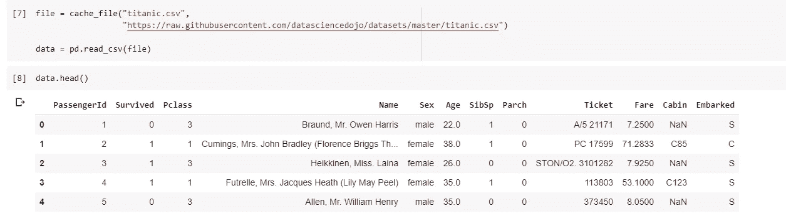
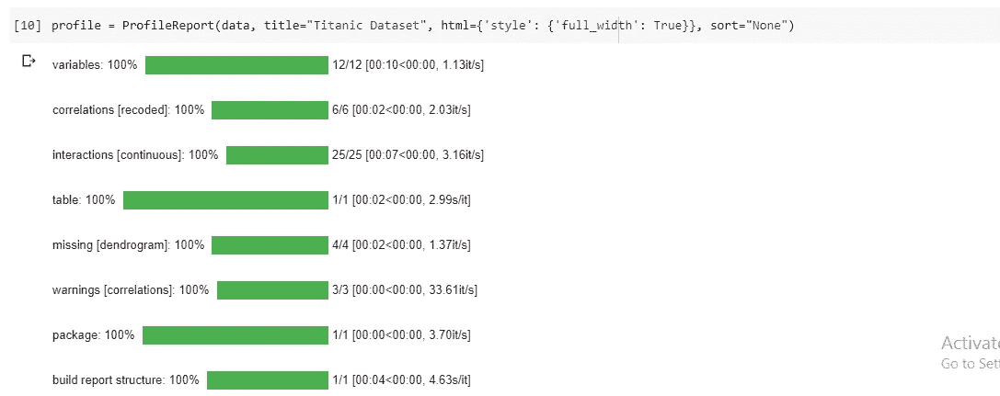
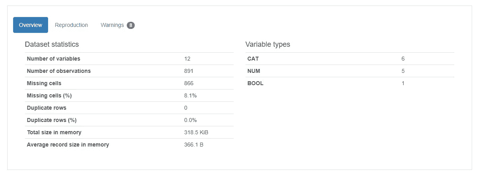
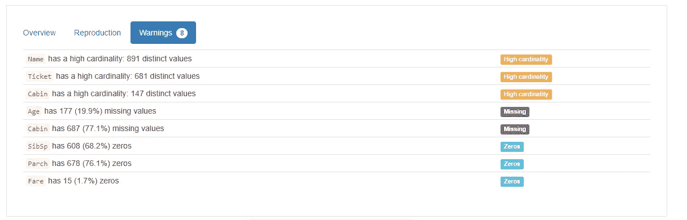
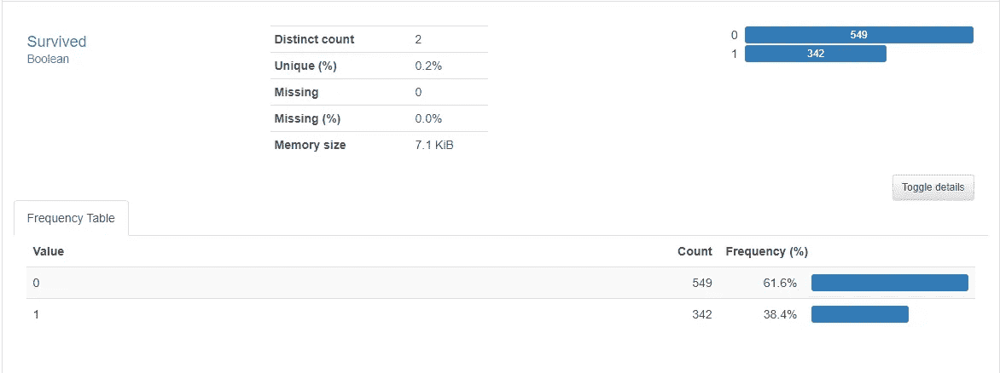
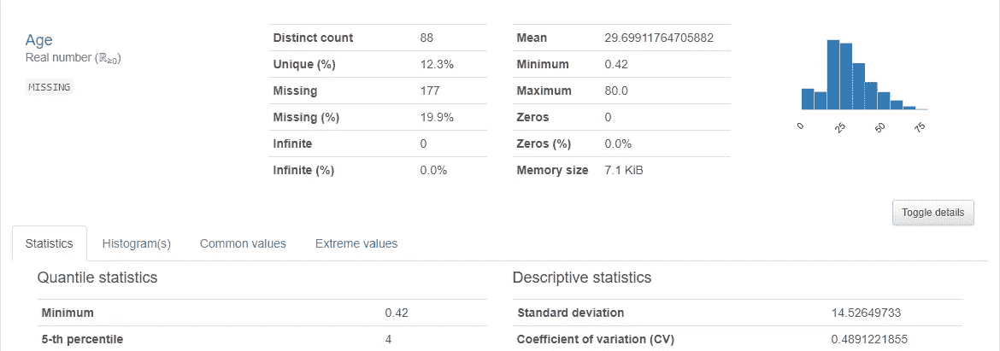
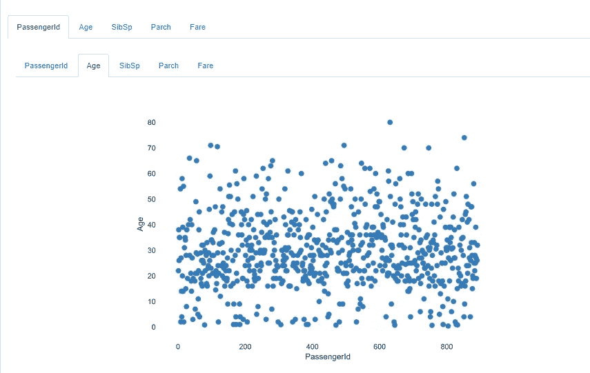
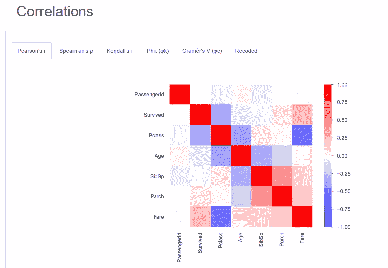

# 使用 Pandas-Profiling 加速您的探索性数据分析

> 原文：<https://towardsdatascience.com/accelerate-your-exploratory-data-analysis-with-pandas-profiling-4eca0cb770d1?source=collection_archive---------10----------------------->

## 探索性的数据分析是乏味的。使用 Pandas-Profiling，通过一行代码自动执行流程并生成详细的交互式报告


由[卢卡斯·布拉塞克](https://unsplash.com/@goumbik?utm_source=medium&utm_medium=referral)在 [Unsplash](https://unsplash.com?utm_source=medium&utm_medium=referral) 上拍摄

当开始一个新的数据科学项目时，第一次接触数据集后的第一步是理解它。我们通过执行探索性数据分析(EDA)来实现这一点。这包括找出每个变量的数据类型、目标变量的分布、每个预测变量的不同值的数量、数据集中是否有任何重复或缺失的值等。

如果您曾经在任何数据集上做过 EDA(我假设您在阅读本文时已经做过)，我不需要告诉您这个过程有多耗时。如果你已经参与了许多数据科学项目(无论是在你的工作中还是通过做个人项目)，你就会知道所有这些过程是多么的重复。但是有了开源库 Pandas-profiling，就不必再这样了。

# 什么是熊猫概况？


Juan Rumimpunu 在 [Unsplash](https://unsplash.com?utm_source=medium&utm_medium=referral) 上拍摄的照片

Pandas-profiling 是一个开源库，可以为任何数据集生成漂亮的交互式报告，只需一行代码。听起来很有趣？让我们看一下文档，以便更好地理解它是做什么的。

Pandas-profiling 从熊猫`DataFrame`生成档案报告。pandas `df.describe()`功能很棒，但是对于严肃的探索性数据分析来说有点基础。`pandas_profiling`用`df.profile_report()`扩展熊猫数据框，进行快速数据分析。

对于每个列，以下统计信息(如果与列类型相关)将显示在交互式 HTML 报告中:

*   **类型推断:**检测数据帧中列的[类型](https://github.com/pandas-profiling/pandas-profiling/blob/master/README.md#types)。
*   **要素:**类型，唯一值，缺失值
*   **分位数统计**如最小值、Q1、中值、Q3、最大值、范围、四分位间距
*   **描述性统计**如平均值、众数、标准差、总和、中位数绝对偏差、变异系数、峰度、偏斜度
*   **最频繁值**
*   **直方图**
*   **相关性**突出显示高度相关的变量(Spearman、Pearson 和 Kendall 矩阵)
*   **缺失值矩阵**，缺失值的计数、热图和树状图
*   **文本分析**了解文本数据的类别(大写、空格)、脚本(拉丁文、西里尔文)和块(ASCII)。

现在我们知道了熊猫烧香是怎么回事，让我们在下一节看看如何在 Jupyter 笔记本或 Google Colab 中安装和使用它。

# 安装熊猫-配置文件:

## 使用画中画

您可以使用 pip 软件包管理器通过以下命令非常容易地安装 pandas-profiling:

```
pip install pandas-profiling[notebook,html]
```

或者，您可以直接从 Github 安装最新版本:

```
pip install [https://github.com/pandas-profiling/pandas-profiling/archive/master.zip](https://github.com/pandas-profiling/pandas-profiling/archive/master.zip)
```

## 使用 Conda

如果你正在使用 conda，那么你可以使用下面的命令来安装

```
conda install -c conda-forge pandas-profiling
```

## 在 Google Colab 中安装

Google colab 预装了 Pandas-profiling，但不幸的是它带有一个旧版本(1.4 版)。如果您正在阅读本文或 GitHub 文档，那么代码将无法在 Google Colab 上运行，除非您安装了最新版本的库(v2.6)。

为此，您需要首先卸载现有的库并安装最新的库，如下所示:

```
# To uninstall
!pip uninstall !pip uninstall pandas_profiling
```

现在要安装，我们需要运行 pip install 命令。

```
!pip install pandas-profiling[notebook,html]
```

# 生成报告:


凯文·Ku 在 [Unsplash](https://unsplash.com?utm_source=medium&utm_medium=referral) 上拍摄的照片

既然我们已经完成了先决条件，让我们进入分析一些数据集的有趣部分。

我将在这个例子中使用的数据集是 [Titanic](https://github.com/datasciencedojo/datasets/blob/master/titanic.csv) 数据集。

## 加载库:

```
import pandas as pd
import pandas_profiling
from pandas_profiling import ProfileReport
from pandas_profiling.utils.cache import cache_file
```

## 导入数据

```
file = cache_file("titanic.csv",
"https://raw.githubusercontent.com/datasciencedojo/datasets/master/titanic.csv")data = pd.read_csv(file)
```



加载数据集

## 生成报告:

要生成报告，请在笔记本中运行以下代码。

```
profile = ProfileReport(data, title="Titanic Dataset", html={'style': {'full_width': True}}, sort="None")
```



生成报告

就是这样。通过一行代码，您已经生成了一个详细的概要文件报告。现在让我们把报告放在笔记本上看看结果。

## 将报表作为 IFrame 包含在笔记本中

```
profile.to_notebook_iframe()
```

这将在笔记本中以 HTML iframe 的形式包含交互式报告。

## 保存报告

使用以下代码将报告保存为 HTML 文件:

```
profile.to_file(output_file="your_report.html")
```

或者使用以下命令获取 JSON 格式的数据:

```
# As a string
json_data = profile.to_json()

# As a file
profile.to_file(output_file="your_report.json")
```

# 结果是:

现在我们知道了如何使用 pandas-profiling 生成报告，让我们看看结果。

## 概述:



概观



警告信息

Pandas_profiling 通过计算预测变量的总缺失单元格、重复行、不同值的数量、缺失值、零值，创建了预测变量的描述性概述。它还会在警告部分标记基数较高或缺少值的变量，如上图所示。

除此之外，它还为每个变量生成详细的分析。我将在本文中浏览其中的一些，查看包含所有代码的完整报告，在文章末尾找到 colab 链接。

## 类别分布:



## 数字特征:



对于数字特征，除了具有详细的统计数据，如平均值、标准差、最小值、最大值、四分位距(IQR)等。它还绘制了直方图，给出了常见值和极值列表。

## 分类特征:

与数字特征类似，对于分类特征，它计算公共值、长度、字符等。


## 互动:

最有趣的事情之一是报告的交互和关联部分。在交互部分，pandas_profiling 库自动为每对变量生成交互**图。通过从两个标题中选择特定的变量，可以得到任何一对的交互图(就像在这个例子中，我选择了 passengerId 和 Age)**



## 相关矩阵:

相关性是一种统计技术，可以显示成对的**变量**是否相关以及相关程度如何。比如身高和体重是相关的；高个子往往比矮个子重。这种关系并不完美。同样身高的人体重相差很大，你很容易想到你认识的两个人，矮的比高的重在哪里。然而，5 英尺 5 英寸的人的平均体重小于 5 英尺 6 英寸的人的平均体重，并且他们的平均体重小于 5 英尺 7 英寸的人，等等。相关性可以告诉你人们体重的变化有多少与他们的身高有关。

相关的主要结果称为**相关系数**(或“r”)。范围从-1.0 到+1.0。r 越接近+1 或-1，这两个变量的关系就越密切。

如果 r 接近 0，说明变量之间没有关系。如果 r 为正，这意味着随着一个变量变大，另一个也变大。如果 r 为负，这意味着一个变大，另一个变小(通常称为“逆”相关)。

当涉及到为所有数字特征生成相关矩阵时，pandas_profiling 库提供了所有流行的选项供我们选择，包括 **Pearson 的 r** 、 **Spearman 的ρ** 等。



相关

现在，我们知道了使用 pandas_profiling 的优点，指出这个库的缺点也是有用的。

# 缺点:

pandas profiling 的主要缺点是使用大型数据集。随着数据量的增加，生成报告的时间也增加了很多。

解决这个问题的一个方法是为数据集的一部分生成概要报告。但是，在这样做的同时，确保数据是随机抽样的，以便它能够代表我们拥有的所有数据，这一点非常重要。我们可以通过以下方式做到这一点:

```
from pandas_profiling import ProfileReport# Generate report for 10000 data points
profile = ProfileReport(data.sample(n = 10000), title="Titanic Data set", html={'style': {'full_width': True}}, sort="None")# save to file
profile.to_file(output_file='10000datapoints.html')
```

或者，如果您坚持要获得整个数据集的报告，您可以使用**最小模式**来完成。在最小模式下，生成的简化报告包含的信息比完整报告少，但是对于大型数据集，可以相对快速地生成简化报告。相同的代码如下所示:

```
profile = ProfileReport(large_dataset, minimal=True)
profile.to_file(output_file="output.html")
```

# 结论:

现在你已经知道什么是 pandas-profiling 以及如何使用它，我希望它能为你节省大量的时间，你可以利用这些时间对手头的问题进行更高级的分析。

如果你想得到完整的工作代码报告，你可以看看下面的笔记本。如果你想看我的其他文章，你可以找到下面的链接。

[](https://colab.research.google.com/drive/1elOweJGpdqQ0C0jX9kRiJUFEPPZOBQBQ) [## 演示

### 泰坦尼克号数据集上的演示

colab.research.google.com](https://colab.research.google.com/drive/1elOweJGpdqQ0C0jX9kRiJUFEPPZOBQBQ) 

熊猫-剖析 GitHub repo:

[](https://github.com/pandas-profiling/pandas-profiling) [## 熊猫简介/熊猫简介

### 从 pandas 数据框架生成配置文件报告。pandas 的 df.describe()函数很棒，但对…来说有点基础

github.com](https://github.com/pandas-profiling/pandas-profiling) 

如果你喜欢这篇文章，你可能也会喜欢我的其他文章。

[](/the-trap-of-tutorials-and-online-courses-2b0c22e0388) [## 教程和在线课程的陷阱

### 教程和在线课程如何制造一种能力的假象，以及如何不落入这个陷阱

towardsdatascience.com](/the-trap-of-tutorials-and-online-courses-2b0c22e0388) [](/machine-learning-case-study-a-data-driven-approach-to-predict-the-success-of-bank-telemarketing-20e37d46c31c) [## 机器学习案例研究:预测银行电话营销成功的数据驱动方法

### 给定客户关系数据，预测客户是否会认购定期存款

towardsdatascience.com](/machine-learning-case-study-a-data-driven-approach-to-predict-the-success-of-bank-telemarketing-20e37d46c31c) [](https://codeburst.io/how-do-i-prepare-for-acm-icpc-and-how-can-i-best-increase-my-chances-of-excelling-in-any-be3da114fbc7) [## 什么是 ACM ICPC 和如何准备它(初学者指南)

### 什么是 ICPC ACM？

codeburst.io](https://codeburst.io/how-do-i-prepare-for-acm-icpc-and-how-can-i-best-increase-my-chances-of-excelling-in-any-be3da114fbc7) 

# 关于我:


嗨，我是苏坎塔·罗伊。一名软件开发人员，一名有抱负的机器学习工程师，前谷歌 2018 年代码之夏的学生和一个巨大的心理学爱好者。如果你对这些感兴趣，你可以在 medium 上关注我，或者在 [LinkedIn](https://www.linkedin.com/in/sukanta-roy-448a5856/) 上与我联系。