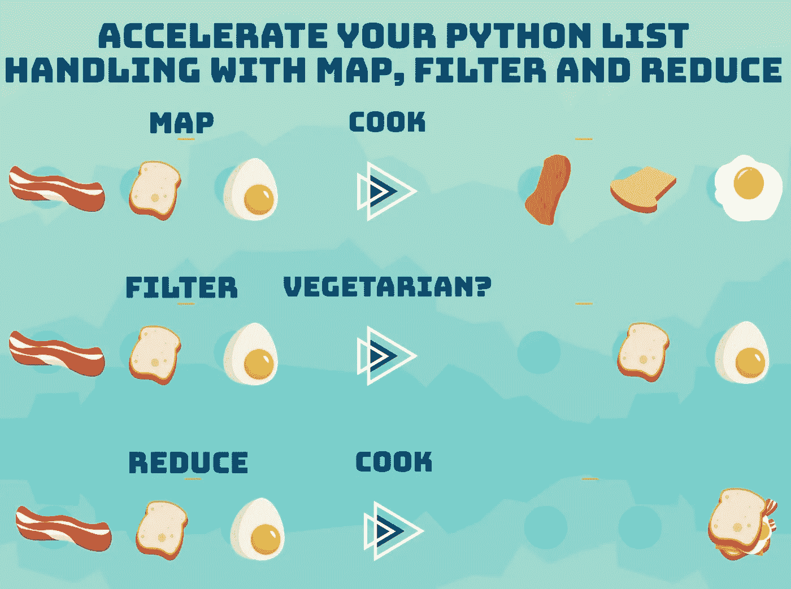

# 纯 Python 中的映射、过滤和归约

> 原文：<https://towardsdatascience.com/accelerate-your-python-list-handling-with-map-filter-and-reduce-d70941b19e52?source=collection_archive---------29----------------------->

## map、filter 和 reduce 的概念改变了游戏规则。这些方法的使用远远超出了 Python 的范畴，是未来的一项基本技能。



映射、过滤和缩小(图片由作者提供)

# **基础知识**

Map、filter 和 reduce 是帮助您处理各种集合的功能。它们是 Spark 和其他各种数据操作和存储框架等现代技术的核心。但是在使用 vanilla Python 时，它们也是非常强大的助手。

# 地图

Map 是一个函数，它将一个集合(如列表['bacon '，' toast '，' egg'])和一个函数(如 upper())作为输入。然后，它将通过这个函数移动集合中的每个元素，并生成一个具有相同元素计数的新集合。让我们看一个例子

```
map_obj = map(str.upper,['bacon','toast','egg'])
print(list(map_obj))
>>['BACON', 'TOAST', 'EGG']
```

我们在这里所做的是使用 map(some_function，some_iterable)函数结合 upper 函数(该函数将字符串中的每个字符大写)。正如我们所看到的，我们为输入列表中的每个元素生成了输出列表中的另一个元素。我们在输出中得到的元素总是和我们将要输入的一样多！这里我们发送 3 个输入，接收 3 个输出，这就是为什么我们称它为 N 对 N 函数。让我们看看如何使用它。

```
def count_letters(x):
    return len(list(x))map_obj = **map**(count_letters,['bacon','toast','egg'])
print(list(map_obj))
>>[6, 5, 3]
```

在这个例子中，我们定义了自己的函数 count_letters()。集合通过函数传递，在输出中，我们有每个字符串的字母数！让我们用一个 lambda 表达式让它更性感一点。

```
map_obj = **map**(lambda x:len(list(x)),['bacon','toast','egg'])
print(list(map_obj))
>>[6, 5, 3]
```

lambda 表达式基本上只是一种定义函数的简写符号。如果你不熟悉它们，你可以在这里查看它们是如何工作的。然而，通过下面的例子应该很容易理解它们是如何工作的。

# 过滤器

与映射相反，映射是一个 N 到 N 的函数。Filter 是一个 N 到 M 的函数，其中 N≥M。这意味着它减少了集合中的元素数量。换句话说，它过滤它们！与 map 一样，符号也是 filter(some_function，some_collection)。让我们用一个例子来验证这一点。

```
def has_the_letter_a_in_it(x):
    return 'a' in x# Let's first check out what happens with map
map_obj = **map**(has_the_letter_a_in_it,['bacon','toast','egg'])
print(list(map_obj))
>>[True,True,False]# What happens with filter?
map_obj = **filter**(has_the_letter_a_in_it,['bacon','toast','egg'])
print(list(map_obj))
>>['bacon', 'toast']
```

正如我们所看到的，它减少了列表中的元素数量。它通过计算函数 has_the_letter_a_in_it()的返回值来实现，并且只返回表达式返回 **True 的值。**

再一次，使用我们最喜欢的 lambda 看起来更性感！

```
map_obj = **filter**(lambda x: 'a' in x, ['bacon','toast','egg'])
print(list(map_obj))
>>['bacon', 'toast']
```

# 减少

让我们见见最后的敌人，也可能是 **3 中最复杂的一个。**不过不用担心，其实挺简单的。这是一个 N 对 1 的关系，意味着无论我们向它注入多少数据，我们都只能得到一个结果。它这样做的方式是通过应用我们要传递给它的函数链。在 3 个中，它是我们必须从 functools 导入的唯一一个。与其他两个相比，最常见的是使用三个参数 reduce(some_function、some_collection、some_starting_value)，起始值是可选的，但提供一个起始值通常是个好主意。让我们看一看。

```
from functools import reducemap_obj = **reduce**(lambda x,y: x+" loves "+y, ['bacon','toast','egg'],"Everyone")
print(map_obj)
>>'Everyone loves bacon loves toast loves egg'
```

正如我们看到的，我们必须使用一个 lambda 函数，它一次接受两个参数，即 x，y，然后通过链表将它们链接起来。让我们想象它是如何遍历列表的

1.  x=“人人”，y=“腊肉”:返回“人人都爱腊肉”
2.  x= "人人爱培根"，y= "吐司":返回"人人爱培根爱吐司"
3.  x= "人人爱培根爱吐司"，y= "鸡蛋" :返回"人人爱培根爱吐司爱鸡蛋"

所以我们有了最后一个元素**“人人都爱培根爱吐司爱鸡蛋”。**这些是更轻松地通过处理流程的基本概念。这里值得一提的是，你不能在每一种编程语言中假设 reduce 函数将按顺序处理元素，例如，在某些语言中，它可能是“‘人人都爱鸡蛋爱吐司爱培根’”。

# **联合收割机**

为了确保我们理解了这些概念，让我们一起使用它们并构建一个更复杂的示例。

```
from functools import reducevals = [0,1,2,3,4,5,6,7,8,9]
# Let's add 1 to each element >> [1,2,3,4,5,6,7,8,9,10]
map_obj = **map**(lambda x: x+1,vals)
# Let's only take the uneven ones >> [1, 3, 5, 7, 9]
map_obj = **filter**(lambda x: x%2 == 1,map_obj)
# Let's reduce them by summing them up, ((((0+1)+3)+5)+7)+9=25
map_obj = **reduce**(lambda x,y: x+y,map_obj,0)
print(map_obj)
>> 25
```

正如我们所看到的，我们可以使用这三者的组合来构建非常强大的东西。让我们转到最后一个例子来说明这在实践中的用途。为此，我们加载了数据集的一个小子集，并将打印出人口超过 1000 万的首都城市！

```
from functools import reduce#Let's define some data
data=[['Tokyo', 35676000.0, 'primary'], ['New York', 19354922.0, 'nan'], ['Mexico City', 19028000.0, 'primary'], ['Mumbai', 18978000.0, 'admin'], ['São Paulo', 18845000.0, 'admin'], ['Delhi', 15926000.0, 'admin'], ['Shanghai', 14987000.0, 'admin'], ['Kolkata', 14787000.0, 'admin'], ['Los Angeles', 12815475.0, 'nan'], ['Dhaka', 12797394.0, 'primary'], ['Buenos Aires', 12795000.0, 'primary'], ['Karachi', 12130000.0, 'admin'], ['Cairo', 11893000.0, 'primary'], ['Rio de Janeiro', 11748000.0, 'admin'], ['Ōsaka', 11294000.0, 'admin'], ['Beijing', 11106000.0, 'primary'], ['Manila', 11100000.0, 'primary'], ['Moscow', 10452000.0, 'primary'], ['Istanbul', 10061000.0, 'admin'], ['Paris', 9904000.0, 'primary']]map_obj = **filter**(lambda x: x[2]=='primary' and x[1]>10000000,data)
map_obj = **map**(lambda x: x[0], map_obj)
map_obj = **reduce**(lambda x,y: x+", "+y, map_obj, 'Cities:')
print(map_obj)
>> Cities:, Tokyo, Mexico City, Dhaka, Buenos Aires, Cairo, Beijing, Manila, Moscow
```

如果你喜欢这篇文章，我会很高兴在 Twitter 或 LinkedIn 上联系你。

一定要看看我的 [YouTube](https://www.youtube.com/channel/UCHD5o0P16usdF00-ZQVcFog?view_as=subscriber) 频道，我每周都会在那里发布新视频。