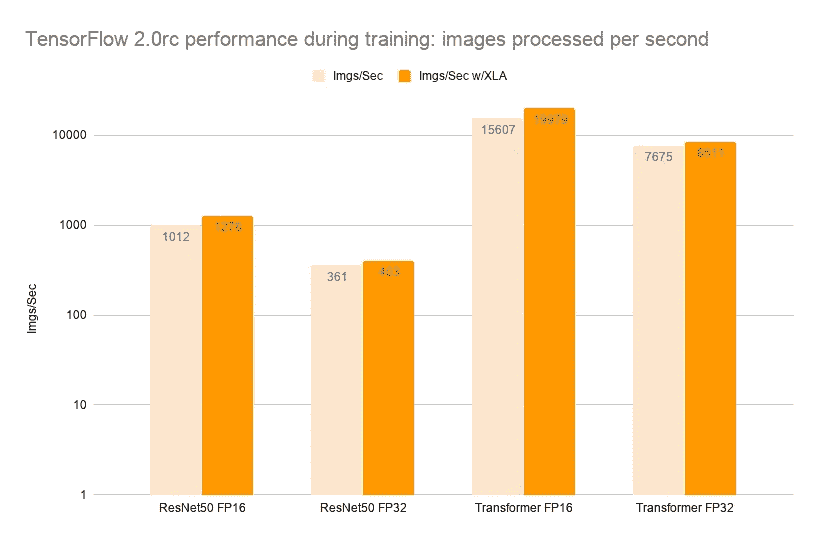
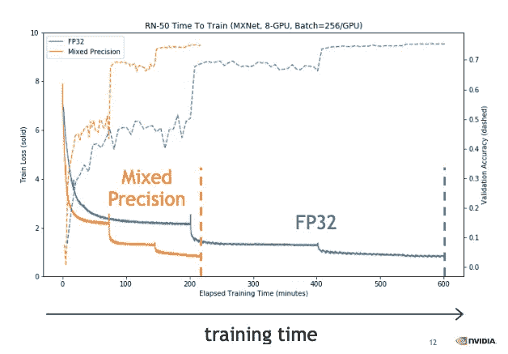
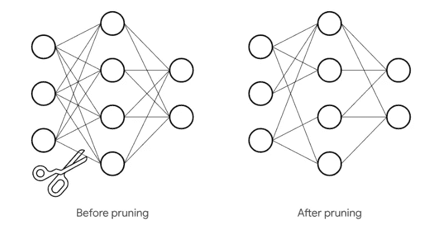
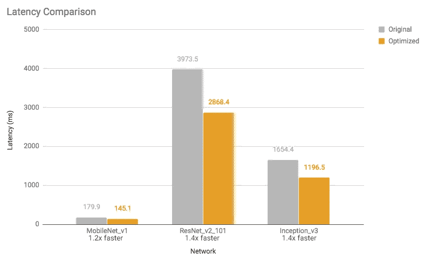
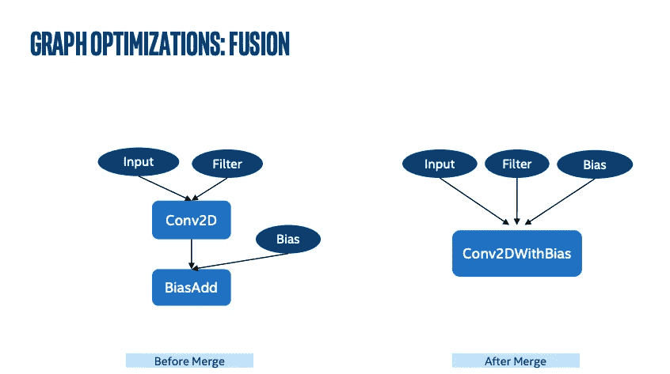

# 在 Tensorflow 上加速您的训练和推理

> 原文：<https://towardsdatascience.com/accelerate-your-training-and-inference-running-on-tensorflow-896aa963aa70?source=collection_archive---------3----------------------->

## 您是否使用默认设置运行 Tensorflow？您可以轻松地将其优化到您的 CPU/GPU，并获得高达 3 倍的加速。

Tensorflow 带有默认设置，可以兼容尽可能多的 CPU/GPU。您可以轻松优化它，以充分利用 CPU(如 AVX)或 GPU(如张量内核)的全部功能，从而实现高达 3 倍的代码加速。

同样，如果你是一家初创公司，你可能无法无限制地访问 GPU，或者在 CPU 上部署一个模型，你仍然可以优化 Tensorflow 代码，以减少其大小，从而在任何设备上更快地进行推理。下面我将讨论几种方法来加速你的训练或推理或两者兼而有之。

## 从源构建张量流

通过 pip 安装 Tensorflow 最流行的方式，但是这样的安装非常慢。为什么？

来自`pip install tensorflow`的默认构建旨在与尽可能多的 CPU 兼容。如果你曾经在运行 Tensorflow 程序时看到过控制台中的日志，你一定看到过这样的警告——“*你的 CPU 支持该 TensorFlow 二进制文件未被编译使用的指令:av x2 FMA”*

这个警告是什么意思？现代 CPU 提供了许多对低级指令集的扩展，如 SSE2、SSE4、AVX 等

> **如果你有一个 GPU** ，你不应该关心 AVX 支持，因为最昂贵的操作将被分派在一个 GPU 设备上(除非明确设置不要)

从源代码本身构建它可能会显著加快 Tensorflow 程序的速度。TensorFlow 实际上警告你。您应该[从针对*您的* CPU 优化的源](https://www.tensorflow.org/install/source)构建 TensorFlow，启用 AVX、AVX2 和 FMA，无论您的 CPU 支持哪个。

## XLA 加速线性代数

加速线性代数，XLA 是一个特定领域的矩阵运算编译器。它可以在不改变源代码的情况下加速张量流模型。

当 TensorFlow 程序运行时，所有操作都由 TensorFlow 执行器单独执行。每个 TensorFlow 操作都有一个预编译的 GPU 内核实现，执行器将被调度到这个内核实现。

XLA 提供了运行模型的另一种模式:它将张量流图编译成一系列专门为给定模型生成的计算内核。因为这些内核是模型特有的，所以它们可以利用特定于模型的信息进行优化。与许多其他优化一样，融合是 XLA 最重要的优化，我将在本文后面详细讨论。



[https://www.tensorflow.org/xla](https://www.tensorflow.org/xla)

结果是速度和内存使用的提高:启用 XLA 后，大多数内部基准测试的运行速度提高了约 1.15 倍。

启用 XLA 很容易-

```
import tensorflow as tf

tf.config.optimizer.set_jit(True)

# ... the rest of your program ..
```

试试 XLA 在 Colab 的例子[这里](https://www.tensorflow.org/xla/tutorials/xla_compile)

## NVIDIA GPUs 上的混合精度

[混合精度](https://arxiv.org/abs/1710.03740)训练通过以半精度格式执行运算，同时以单精度存储最少的信息，以在网络的关键部分保留尽可能多的信息，从而显著提高了计算速度。

使用精度低于 32 位浮点的数字格式有很多好处。首先，它们需要更少的内存，能够训练和部署更大的神经网络。其次，它们需要更少的内存带宽，从而加快了数据传输操作。第三，在精度降低的情况下，数学运算运行得更快，尤其是在支持该精度的张量核 GPU 上。它通过识别需要完全精度的步骤，并仅对这些步骤使用 32 位浮点，而对其他所有步骤使用 16 位浮点来实现这一点。

*   通过使用[张量核，加速数学密集型运算，如线性和卷积层。](https://developer.nvidia.com/tensor-cores)
*   与单精度相比，通过访问一半的字节来加速内存受限的操作。
*   降低训练模型的内存需求，支持更大的模型或更大的小批量。



用于 ImageNet 分类的 ResNet-50 训练—DGX-1 上的 8 个 GPU 与 FP32 训练相比→3 倍加速—同等精度来源— Nvidia

在 NVIDIA GPUs 中，计算能力为 7.0 或更高的 GPU 将从混合精度中获得最大的性能优势，因为它们有特殊的硬件单元，称为张量核心，以加速浮点矩阵乘法和卷积。

**张量流中的混合精度**

[混合精度 API](https://www.tensorflow.org/guide/keras/mixed_precision) 在 TensorFlow 2.1 中提供，带有 Keras 接口。要在 Keras 中使用混合精度，您需要创建，通常称为 *dtype 策略*。Dtype 策略指定了将在其中运行的 dtype 层。这将导致后续创建的层使用混合精度，混合使用 float16 和 float32。

```
from tensorflow.keras.mixed_precision import experimental as mixed_precision
policy = mixed_precision.Policy('mixed_float16')
mixed_precision.set_policy(policy)
# Now design your model and train it
```

> 小鬼。注:提供混合精度的张量核需要张量的某些维度，例如稠密层的维度、Conv 层中的过滤器数量、RNN 层中的单元数量是 8 的倍数。

要比较混合精度与 float32 的性能，请将策略从`mixed_float16`更改为`float32.`，预期性能提升高达 3 倍。

## 通过模型修剪改善推理延迟

我已经在我以前的[博客](/pruning-deep-neural-network-56cae1ec5505)中报道过这个概念。简而言之，修剪是如何工作的

如果你能根据神经元的贡献大小对它们之间的神经元或连接进行排序，那么你就可以从网络中移除排序较低的神经元或连接，从而形成一个更小更快的网络。



**tensor flow 中的修剪**

Tensorflow 提供了[模型优化工具包](https://github.com/tensorflow/model-optimization)，用于剪枝和其他训练后优化。在你的代码中使用它，这里有一个简单的例子-

```
import tensorflow_model_optimization as tfmot

model = build_your_model()  

pruning_schedule = tfmot.sparsity.keras.PolynomialDecay(
                        initial_sparsity=0.0, final_sparsity=0.5,
                        begin_step=1000, end_step=3000)

model_for_pruning = tfmot.sparsity.keras.prune_low_magnitude(model, pruning_schedule=pruning_schedule)

... 

model_for_pruning.fit(...)
```



[https://medium . com/tensor flow/introducing-the-model-optimization-toolkit-for-tensor flow-254 ACA 1 ba 0a 3](https://medium.com/tensorflow/introducing-the-model-optimization-toolkit-for-tensorflow-254aca1ba0a3)

## 将多个操作融合为一个

通常当你运行一个张量流图时，所有的操作都是由张量流图执行器单独执行的。每个 op 都有一个预编译的 GPU 内核实现。融合操作将操作整合到一个内核中，以提高性能。



op 融合示例

比如说-

```
def model_fn(x, y, z): 
  return tf.reduce_sum(x + y * z)
```

没有融合，没有 XLA，该图启动三个内核:一个用于乘法，一个用于加法，一个用于减法。

使用 op fusion，您可以在一次内核启动中计算结果。它通过将加法、乘法和减法“融合”到一个 GPU 内核中来实现这一点。

**与 Tensorflow 2.x 的融合**

更新的 Tensorflow 版本带有 XLA，它为我们进行了融合和其他优化。

```
from tensorflow.contrib.compiler import xla

def model_fn(x, y, z):
  return tf.reduce_sum(x + y * z)

def create_and_run_graph():
  with tf.Session() as sess:
    x = tf.placeholder(tf.float32, name='x')
    y = tf.placeholder(tf.float32, name='y')
    z = tf.placeholder(tf.float32, name='z')
    result = xla.compile(computation=model_fn, inputs=(x, y, z))[0]
    # `result` is a normal Tensor (albeit one that is computed by an XLA
    # compiled executable) and can be used like any other Tensor.
    result = tf.add(result, result)
    return sess.run(result, feed_dict={ ... })
```

融合模式示例:

■ Conv2D + BiasAdd +

■ Conv2D + FusedBatchNorm +

■ Conv2D +挤压+ BiasAdd

■ MatMul + BiasAdd +

将 ops 融合在一起提供了几个性能优势:

○完全消除运营调度开销(廉价运营的重大胜利)

○增加 ILP、矢量化等的机会。

○提高数据访问的时间和空间局部性

例如，MatMul 是逐块计算的，并且当数据在高速缓存中仍然“热”时，可以应用偏置和激活函数。

**与 Tensorflow 1.x 的融合**

在 Tf 1.x 中，与 fused ops 兼容的层具有“fused”参数，该参数需要设置为 True 以使用 fusion 来加快实现。

比如说-

```
#Using TF1.x in TF2.x
b1 = tf**.**layers**.**batch_normalization(
    input_layer, fused**=**True, data_format**=**'NCHW') 

#Or in pure TF1.x
b1 = tf.layers.batch_normalization
```