# 借助 NVIDIA RAPIDS 加速端到端机器学习工作流

> 原文：<https://towardsdatascience.com/accelerating-end-to-end-machine-learning-workflows-with-nvidia-rapids-cf4fafc2073b?source=collection_archive---------39----------------------->

## 在 34 秒内训练一个有 9200 万条记录的模型

从太空探索到机器人，从游戏引擎到医学研究，从训练单个模型到为整个数据中心提供动力，GPU 是我们处理数据过程中不可或缺的一部分。

如果说我们今天比以往任何时候都更需要的是处理我们产生的大量数据的速度。在首席执行官厨房发表的最新 [GTC 2020 主题演讲](https://www.nvidia.com/en-us/gtc/)中，NVIDIA 明确表示，他们希望在所有可能的领域利用 GPU。

在本文中，我们将了解如何利用 NVIDIA 的 RAPIDS 加速端到端的机器学习工作流。如果你还不知道端到端的工作流程是如何工作的，或者到底什么是 RAPIDS，请和我呆在一起，你会很开心的。我们将在本文中讨论以下内容，如果您知道一两个主题，请随意继续。

*   什么是急流？
*   端到端工作流的工作方式
*   预测纽约出租车费用并比较 CPU 和 GPU 所用的时间

另外，在我们开始之前，请注意我使用的机器有以下规格:

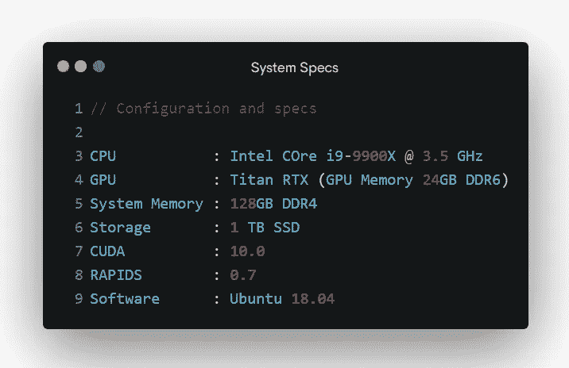

配备泰坦 RTX 图形处理器的英伟达数据科学电脑

# 什么是急流？

好吧，让我们直接开始吧。RAPIDS 是一个特定于市场/领域的库，运行在 [CUDA](https://en.wikipedia.org/wiki/CUDA#See_also) 之上，这是一个并行计算平台和 API，由 NVIDIA 创建，你猜对了。

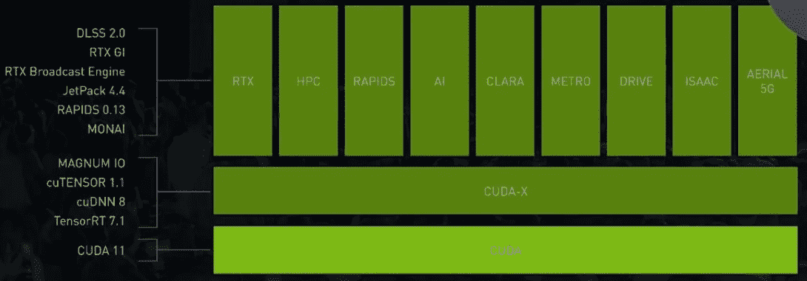

NVIDIA SDK 堆栈— [来自 GTC 2020 主题演讲](https://youtu.be/bOf2S7OzFEg?t=701)

虽然有几个库面向不同的领域，但 RAPIDS 是专门为 GPU 加速数据分析而设计的，后来被数据科学社区采用，以更快地训练他们的机器学习模型。我的意思是谁不喜欢在眨眼之间训练他们的模型呢？对吗？要了解更多关于 RAPIDS 和最近发展的信息，请访问他们的网站和介绍性博客。

# 端到端工作流如何工作

如果你正在阅读如何加速你的机器学习端到端工作流，你很可能会熟悉我将要解释的工作流。如果是这样，你可以跳到下一部分，我们用 CPU 和 GPU 预测纽约市的出租车费用。但是如果你是新来的，想知道更多，请和我呆在一起。

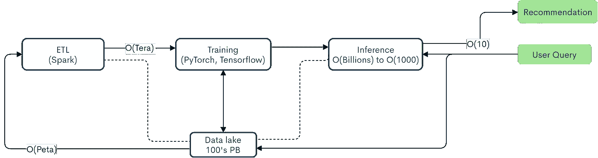

ML Pipeline 展示了如何在 Spark 3.0 中使用 NVIDIA GPUs 加速 ETL([参考](https://youtu.be/tpeGZ7nm0J0?t=155)、[高分辨率](https://www.zenflowchart.com/docs/view/gO3GWpmbkjpJazJn4KRj))

好好看看这张图。有吗？完美。现在让我们一步步理解这一点:

1.  ETL——提取、转换和加载
    这是大多数数据科学家花费时间清理数据的地方。在这一步中，我们做了所有必要的事情来形成一个好的数据集，然后将它输入到我们的机器学习算法中——从创建数据框到进行特征工程，所有这些都属于 ETL。如果你想慢慢开始，并且想知道如何实现基本的 ETL，请阅读[这篇](/your-first-kaggle-competition-submission-64da366e48cb)文章，在这篇文章中，我们执行 ETL 并预测谁在泰坦尼克号上幸存。
2.  **训练** 为了获得最好的结果，我们首先要用数据训练我们的模型，这样当它下次看到类似的东西时，它就知道它在看什么了。这是您的模型进行训练和调整的阶段。
3.  **推理** 然后，我们将模型投入运行，以便在经过几个过程后能够响应用户的查询。比如排名。基于用户的查询，我们对结果进行排序，并将其返回给用户。想想谷歌是如何为每个新的查询呈现一组新的结果的。整洁吧？

为了避免任何误解，要知道这只是端到端工作流如何工作的一般概念。幕后有很多工作。就像电影、戏剧或歌剧一样。

## 对高性能计算的需求

你可能想知道为什么我们需要加快这个过程？我简单说一下原因。

实际情况是，当涉及到计算时，我们上面讨论的所有三个阶段都有自己的一系列挑战。每天都有大量的数据生成和高数据处理要求(数万亿字节的数据集)，只能说 CPU 是不够的。

数据科学家将大部分时间花在清理和处理(即 ETL)上，没有人希望这个过程花费半天或一整天。我知道，我不会。

随着公司快速获取和处理 Pb 级数据，我们比以往任何时候都更需要速度。让我们通过一个例子来更好地理解这一点。

# 预测纽约出租车费用

## 理解数据

首先，你应该比你自己更了解你的数据。纽约市出租车数据集很受欢迎，可以广泛获得，你可以从[这里](https://drive.google.com/file/d/15deppY-lXxMs8mzhueHQnhVKJLjX2-q8/view)下载数据集。它包含从 2014 年 1 月开始的 9 个不同月份的 9 个文件，每个文件大约有 2–2.2 GB 大，是的，每个文件。你大概明白了。我们将一起处理所有文件。

首先，让我们看看那些文件里有什么。数据集中有 17 个列或要素。我已经列出了它们中的每一个，它们是不言自明的。

```
vendor id
pickup_datetime
dropoff_datetime
passenger_count
trip_distance
pickup_latitude
pickup_longitude
rate_code
dropoff_latitude
dropoff_longitude
payment_type
fare_amount
surcharge
mta_tax
tip_ammount
tolls_ammount
total_amount
```

简单吧？很好。你可能会想，记录呢？这 9 个文件总共有 1.24 亿行或记录。对，没错，1.24 亿。准确的说是 124，649，497。你猜完成 ETL 过程需要多长时间？请和我一起寻找答案。

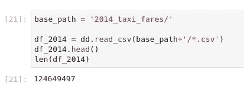

寻找数据的大小

我们将使用 cuDF 和 Dask & XGBoost 来扩展 GPU 数据帧 ETL 风格的操作和模型训练。要了解更多关于 cuDF 的信息，请阅读交流伙伴 George 关于“[如何使用 CuPy 让 Numpy 快 10 倍以上](/heres-how-to-use-cupy-to-make-numpy-700x-faster-4b920dda1f56)”的帖子。为了简单起见，我将在帖子中保持代码最少，但你可以在 RAPIDS 的 GitHub 存储库[这里](https://github.com/rapidsai/notebooks-contrib)找到整个 ipynb 笔记本和许多其他 E2E 示例笔记本。

## 数据清理

因为我们已经知道我们需要清理数据，所以我们将整理我们的数据集。

我们在不同的 CSV 文件中以不同的方式表示相同的列名。例如，一个文件有 rate_code，另一个文件有 RateCodeID，虽然这两种都是普遍接受的表示列名的方式，但我们必须使用其中的一种。我总是选择第一个，因为下划线将单词分开，我的眼睛很容易读懂。永远的团队懒。

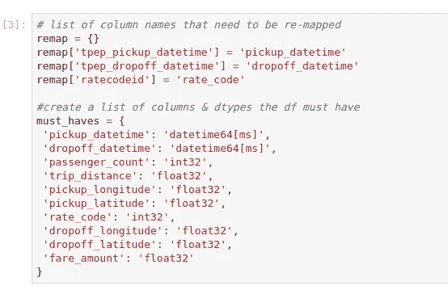

定义我们的列应该具有什么类型

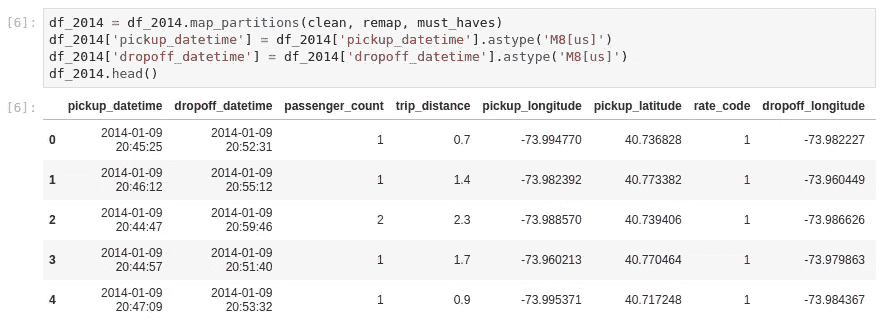

清理后的输出(map_partitions 是一个辅助函数)

## 处理异常值

离群值是存在的。一直都是。打破一些东西，阻止一些东西有效运行，我们必须处理它们。例如，票价低于 0 美元或高于 500 美元，谁会给 500 美元？与乘客计数相同，丢弃带有< 0 and > 6 个条目的条目。

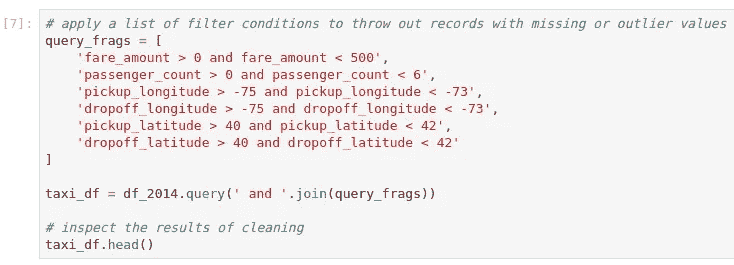

处理异常值

清理完数据集后，我们丢弃了近 700 万条记录，现在有 1.17 亿条记录可供我们从中获得真知灼见。

## 选择训练集

让我们假设你要去纽约旅行，不要只是想象，在 25 日，并希望建立一个模型来预测票价价格将在最后几天给定本月初的数据。

我们正在测量时间，以了解您的集群从工作流的存储桶和 ETL 部分加载数据需要多长时间。此时，我们有 9200 万数据用于训练，剩下的 25%用于测试。

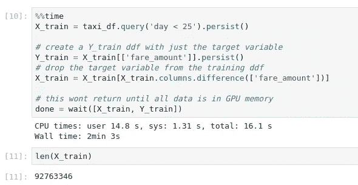

CPU 上的 ETL 时间

墙时间表示 CPU 上的总时间，即 2 分 3 秒或 123 秒。印象深刻吧。但是，如果我告诉你，我们可以实现更快的结果呢？

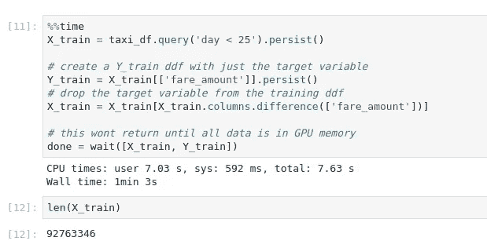

GPU 上的 ETL 时间

在相同的过程中，在启用 1 个 GPU(英伟达泰坦 RTX 24 GB DDR6)后，我们可以在 63 秒内完成相同的工作。将近 2 倍的提升。如果你认为这很棒，那就等着看我给你展示训练时间的提升吧。同时，我还在监视 CPU 的使用情况。所有的核心工作，这是抚慰我的眼睛，不打算说谎。

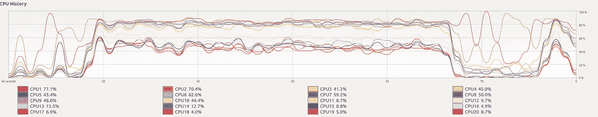

在 CPU 上计算时

## 培养

我们将根据我们的训练数据训练 XGBoost 回归模型，并找出完成整个训练需要多少时间。

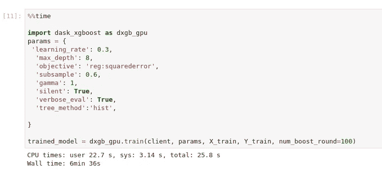

CPU 上的训练时间

时间是 6 分 36 秒，所以是 396 秒。还不错。让我们检查启用泰坦 RTX GPU 后的相同。

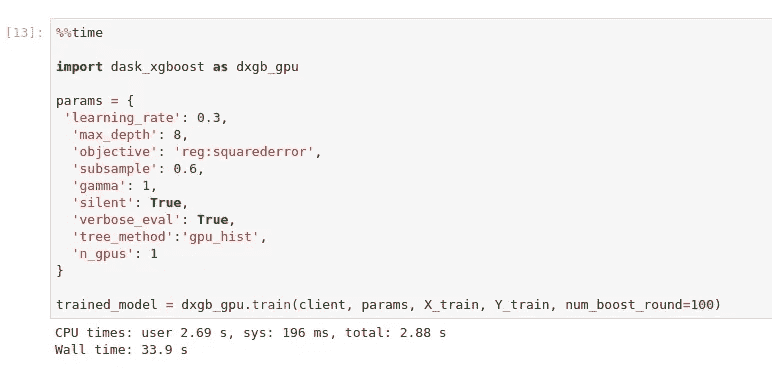

GPU 上的训练时间

什么！我们刚刚在 33.9 秒内用 9200 万条记录训练了我们的整个模型吗？太对了，我们做到了。说实话，一开始我也不信。但没错，这就是现实。仅通过启用 1 个 GPU，速度就提高了 12 倍以上，如果我们使用多个 GPU 呢？

## 预言；预测；预告

因为我们已经有了训练好的模型，现在我们必须用我们给出的 25%的记录来测试它。

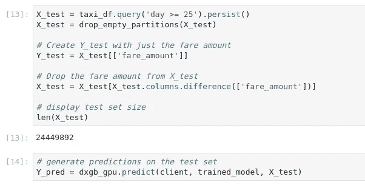

预测本月剩余时间的票价

## 工作指标

衡量我们模型的性能是一个重要的部分。我们将通过计算均方根误差来实现。如果你想了解更多关于成本函数的知识，请阅读由通讯伙伴[卡米尔](https://medium.com/u/263382eeafcd?source=post_page-----cf4fafc2073b--------------------------------)撰写的这篇关于成本函数的文章。

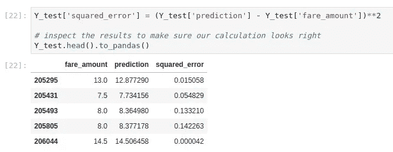

这些结果来自我们在 GPU 上训练的模型

一点也不差。我们还可以做进一步的改进，但这超出了本文的范围。也许改天吧。

# 结论

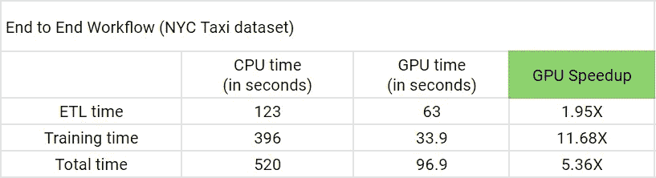

借助英伟达泰坦 RTX GPU 提升性能

随着越来越多的数据以多种形式呈现在我们面前，我们需要能够更快处理数据的工具来获得洞察力，并将这种洞察力转化为更好的决策，从医学研究到空间探索。借助 NVIDIA RAPIDS(软件堆栈)和 NVIDIA GPUs(硬件)，我们可以在端到端机器学习管道上实现近 6 倍的加速。还有，这里有一张野兽的照片。

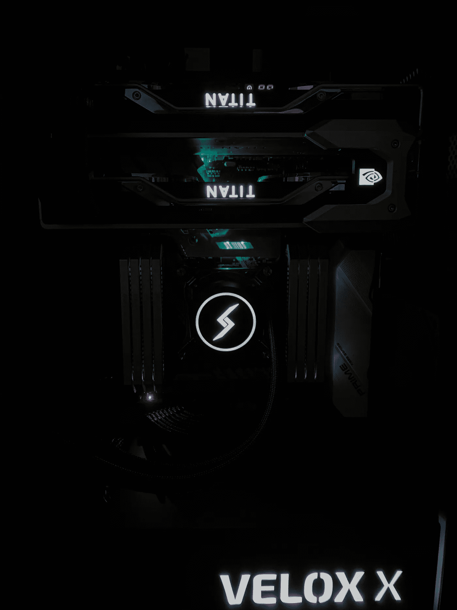

Velox X(数字风暴 X 英伟达)

是不是很美？你可以在这里找到笔记本[这里](https://drive.google.com/file/d/1Y4ABgWMGDCxTB0i0udJ7P5Ozj5uogpby/view)和[这里](https://drive.google.com/file/d/1F7qXE2FGyR9tp1p_2oE8p_maLTNJymey/view)和数据[这里](https://drive.google.com/file/d/15deppY-lXxMs8mzhueHQnhVKJLjX2-q8/view)。

快乐学习。