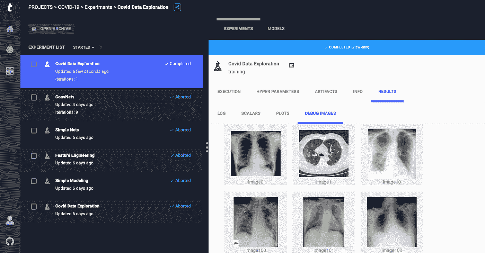
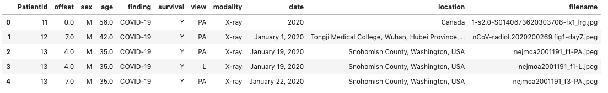
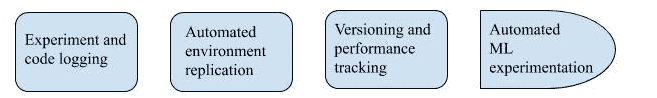
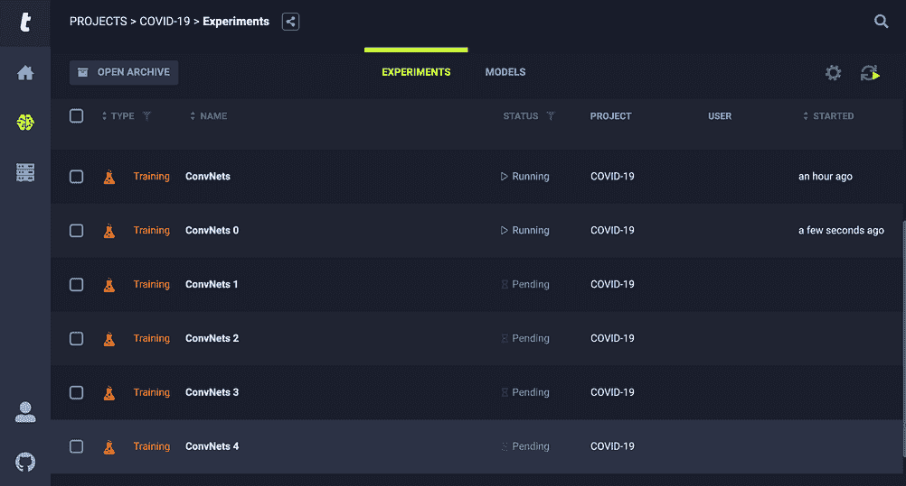
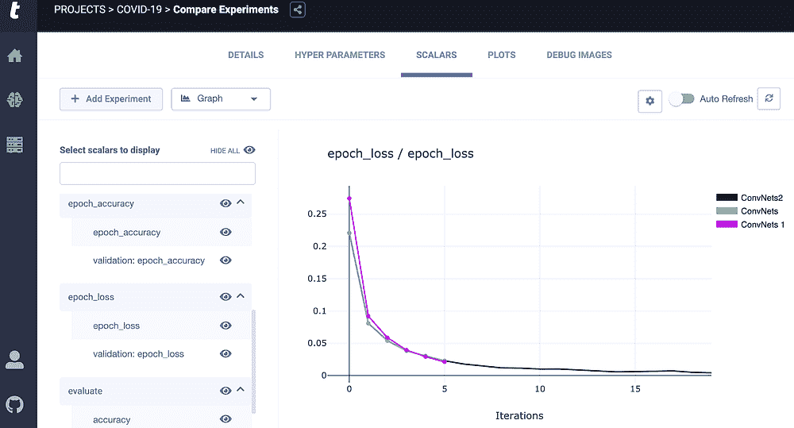

# 用 Allegro Trains 加速我的新冠肺炎深度学习项目

> 原文：<https://towardsdatascience.com/accelerating-my-covid-19-dl-project-with-allegro-trains-c0ef24a55f80?source=collection_archive---------48----------------------->

## 快板火车会带你出村！

[来源](https://www.shutterstock.com/image-photo/carrying-out-description-radiographs-patient-copd-757772383):对慢性阻塞性肺病患者的 x 光片进行描述。

目前由新冠肺炎病毒引起的全球疫情已经威胁到我们人类的神圣性和我们整个社会的福祉。类似于战争时期，疫情也给了我们机会去欣赏那些我们认为理所当然的东西，比如卫生工作者、食品供应商、司机、杂货店店员和许多其他在前线保护我们在这个困难时刻安全的人，致敬！当他们为我们而战的时候，你和我做点事情怎么样？

不幸的是，疫情也给我们带来了来自数据科学家的领域不足的见解，这些见解正变得[普遍](https://blog.datasciencedojo.com/covid19-dunning-kruger-effect-hippocratic-oath-of-a-data-scientist/)。因此，我想避免类似的陷阱，这就是为什么我想从下面的免责声明开始。这篇博客的目的是展示如何使用 [Allegro Trains](https://allegro.ai/trains-open-source/?utm_source=h_blog&utm_medium=referral&utm_campaign=trains_c) 来管理您的机器/深度学习项目，以提高您的生产力并改善工作流程。

**第一站:探索数据集**

我选择这个[新冠肺炎胸部 x 光数据集](https://www.kaggle.com/bachrr/covid-chest-xray)有两个原因。首先，它很小，而且与当前事件相关，所以你可以很容易地跟随我。第二，数据集包含肺部患者的 X 射线/CT 扫描上的数字和分类特征，以便我们可以应用传统的机器学习解决方案以及神经网络。除了声明的目标之外，本博客的任何见解或观察不应用于做出任何决定。考虑到这一点，感谢你和我一起第二次乘坐快板火车。

实验经理枢纽，快板列车

数据集的原始数据帧。

**第二站:组装小零件**

随着数据工程管道、存储和计算能力的复杂性急剧上升，像上面这样的异构数据集已经变得很常见。随之而来的是使用大量算法和数据挖掘技术来揭示洞察力的潜力。这也给我们提出了一个独特的问题，即如何在一把保护伞下管理激动人心的实验。这可能意味着让一个数据工程师团队来构建数据接收的数据管道，让数据科学家来按摩和实验数据，让机器学习工程师来提供可移植、可扩展、最重要的是可操作的模型。建立一个可操作的模型需要整个村庄的力量！

在部署机器学习模型之前采取的常见步骤包括摄取数据，创建一个用于版本控制、数据争论和本地或云上的数据实验的 group Github 存储库，安装依赖项以重现同事的结果，找出最佳模型(这本身并不容易)，打包模型等等。如果你开始发现需要一个高级机器学习基础设施或中枢的新兴模式，那么你可能会有所发现。这就是 Allegro Trains 成为您的 ML/DL 项目管理系统的原因，它可以满足您的版本控制需求、自动化代码和实验跟踪、模型质量控制以及甚至在机器级别上对您的实验进行性能记录。

> 系好安全带，快板火车将带你出村！

迄今为止我发现的训练能力

**第三站:聚焦研究问题**

但首先，让我们回到手头的重要问题。我们也许能找出预测新冠肺炎患者存活率的最佳属性。是年龄吗？性？诊断模式？做出诊断的卫生工作者的专业？我们也有 x 光/CT 扫描显示疾病的进展。在现实生活中，我们需要医疗专业人员为我们提供必要的领域知识，以找出可能的最佳路线，但目前，我们最多只能进行数据争论和视觉探索，调整图像大小和编码，并利用工程技术为建模准备数据。我选择用 Scikit 的随机森林和 [Xgboost](https://github.com/dmlc/xgboost) 集成学习方法进行实验，以确定与存活率最相关的特征。请注意，准确性在这里不是一个好的性能指标，因为数据是不平衡的，不包含健康个体的扫描。因此，我们可以使用 ROC 曲线来确定最佳模型。如果我们在度量优化上更加严格，最小化假阴性或最大化召回将是我们的首要任务。我还尝试了多种架构和转移学习模型，以根据卷积神经网络从患者的 X 射线/CT 扫描中预测预后。可以想象，每个体系结构都有自己的超参数要调整，性能要跟踪。如果你开始对潜在实验的数量感到有点不知所措，不要担心！我们将利用 Trains，以便我们专注于手头最重要的任务，即回答我们的研究问题。

我开始我的项目是通过[在本地建立我自己的服务器](http://t.allegro.ai/git_trains_server_h1),这样火车可以跟踪我们的实验，如下面的标题所示。Trains 自动负责环境复制和日志记录，同时跟踪我们新模型的性能指标以及每个模型的机器资源分配，如 GPU、CPU、IO 速度等。这一点很重要，因为我们不想只根据一个指标来选择最佳模型。也可以选择使用 Allegro AI 的[基于网络的演示服务器](http://t.allegro.ai/demo_server_h1)，它可以让你 24 小时跟踪你的 ML 项目，但我不会推荐它，因为你根本不可能在一天内完成一个 ML 项目。我使用 Keras 作为我选择的深度学习框架，但 Trains 自带对 [Pytorch](/once-upon-a-repository-how-to-write-readable-maintainable-code-with-pytorch-951f03f6a829) 和 [Tensorflow](https://github.com/allegroai/trains/blob/master/examples/tensorboard_toy.py) 的内置支持。Trains 也在跟踪这些包，这样我们就可以协作并复制彼此的工作。

自动实验(左)和实验对比(右)。

**最后一站:总结调查结果**

以上是我使用 Allegro Trains 进行的 [AutoML](https://allegro.ai/docs/tutorials/tutorial_automl/?utm_source=h_blog&utm_medium=referral&utm_campaign=trains_c) 实验的结果。为这些实验中的每一个创建单独的笔记本或者对每个输出进行版本控制会导致项目混乱。但在这里，我能够简单地比较基于几个指标的卷积神经网络的性能，包括 epoch vs loss 优化和 GPU 使用。**项目管理系统的这种类型的抽象只会导致数据驱动的决策。**我能够准确地确定 85%的患者存活成员，事实证明年龄是决定患者存活率的关键因素。神经网络的资源分配远不止基于树的算法的网格搜索。此外，由于数据集较小，random forest 的性能优于预期的 Xgboost。

很高兴为您提供一个高层次的概述，让您了解如何通过在同一中心下自动化您的实验来轻松处理复杂的数据集。我敢打赌，将 Trains 作为项目管理中心，您的迭代速度、工作流和实验将会显著提高。请务必查看我的[第 1 部分](/managing-ml-projects-allegro-trains-vs-github-95c2377dd86c)迷你系列，了解火车相对于 GitHub 的表现。至于我，我已经到站了。我希望我能听到你为了你的深度学习项目需求而进行的[快板训练](https://allegro.ai/trains-open-source/?utm_source=h_blog&utm_medium=referral&utm_campaign=trains_c)的奇妙旅程，随时在 [LinkedIn](https://www.linkedin.com/in/henokyemam/) 上添加我，或者在 [Twitter 上给我大声喊出来。多保重！](https://twitter.com/henokadem)