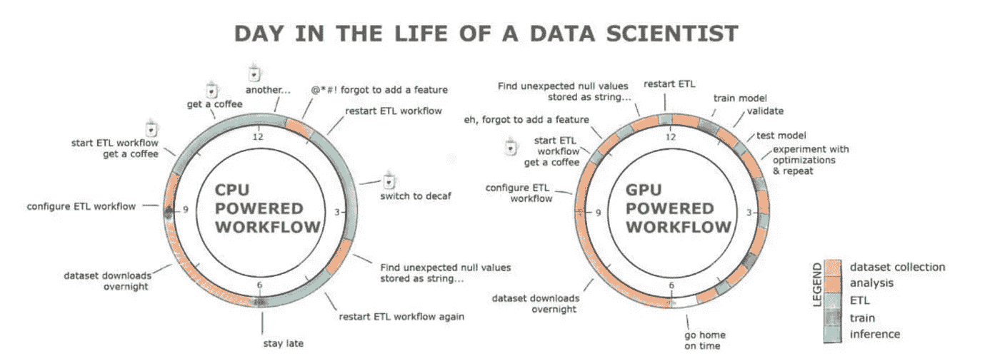
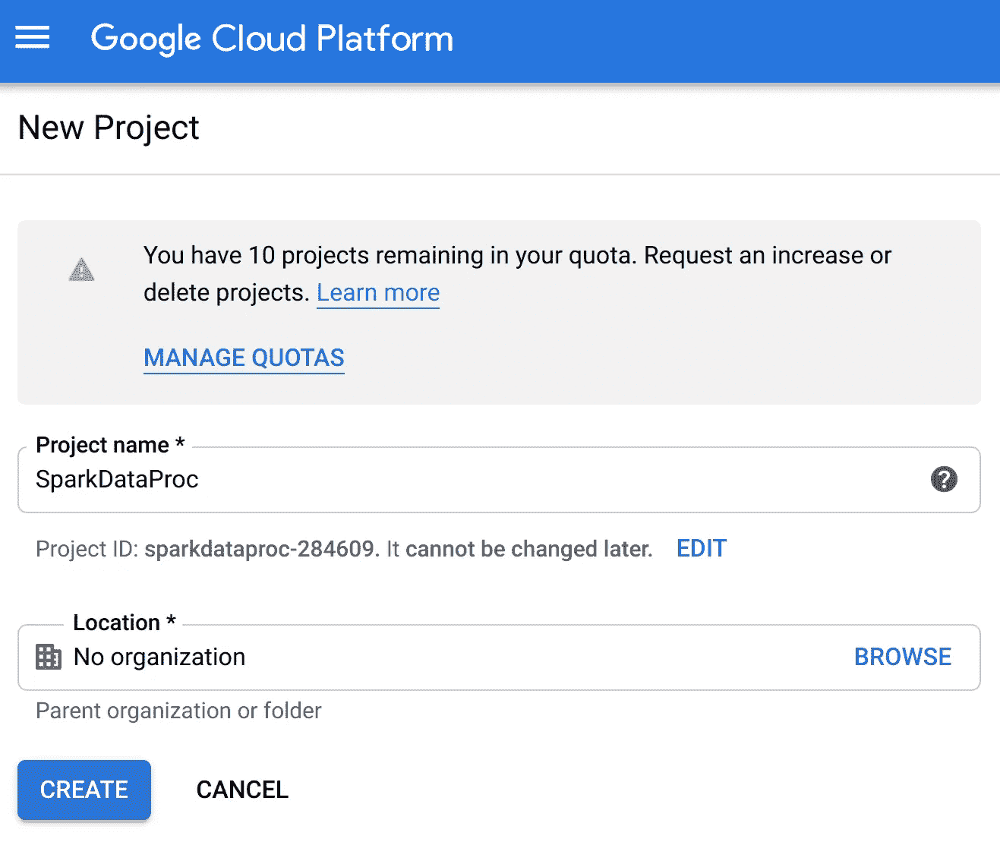
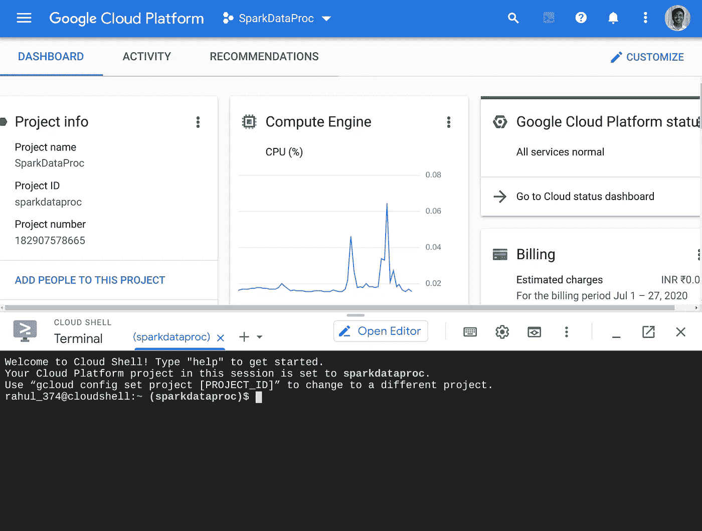
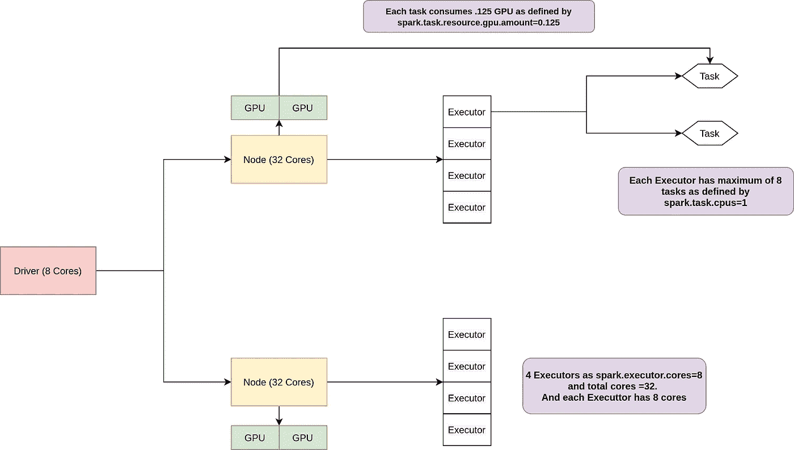
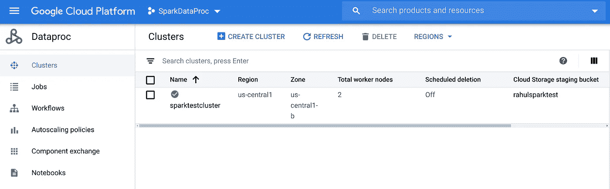
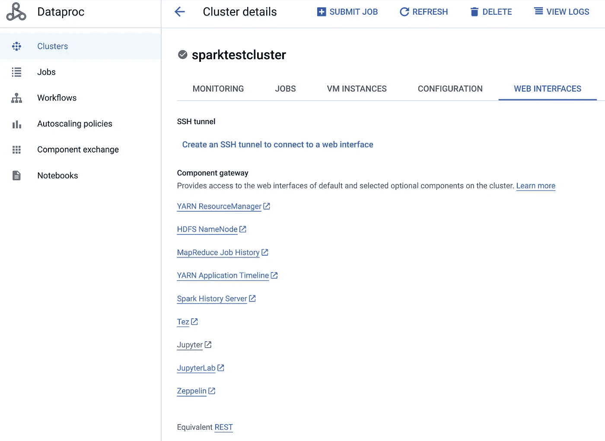
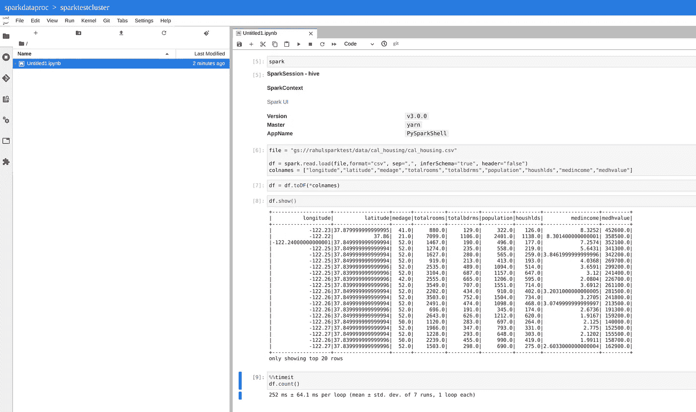
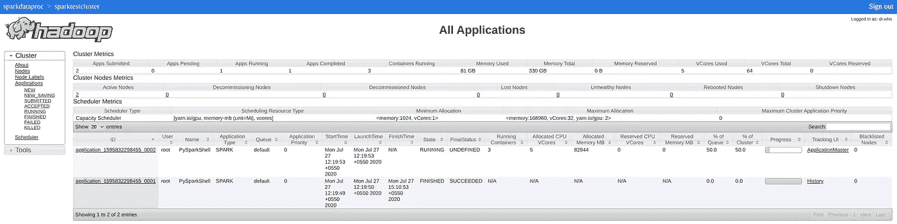
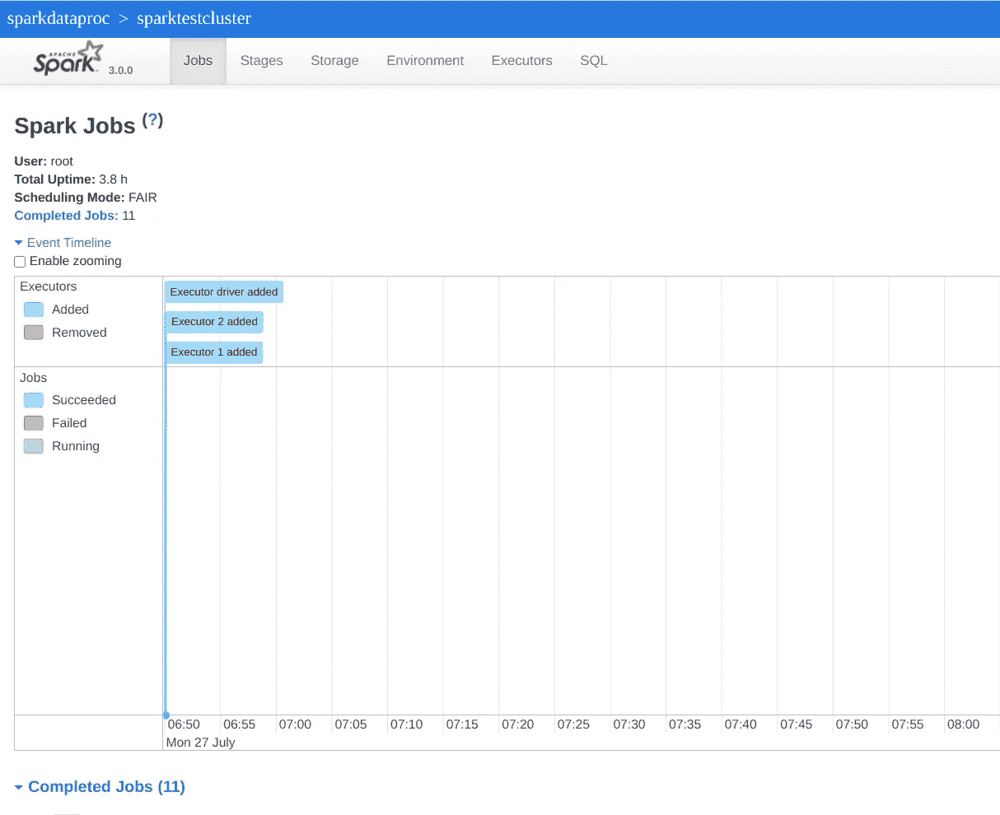

# 用 NVIDIA GPUs 通过 6 个简单的步骤加速 Spark 3.0 Google DataProc 项目

> 原文：<https://towardsdatascience.com/accelerating-spark-3-0-google-dataproc-project-with-nvidia-gpus-in-6-simple-steps-ab8c26d38957?source=collection_archive---------41----------------------->


Genessa panainite 在 [Unsplash](https://unsplash.com?utm_source=medium&utm_medium=referral) 上拍摄的照片

## Spark 3.0 + GPU 来了。它改变了游戏规则

数据探索是数据科学的关键部分。需要很长时间吗？啊。别问了。为 ML 准备数据集不仅需要理解数据集、清理和创建新特征，还需要重复执行这些步骤，直到我们有一个微调的系统。

当我们走向更大的数据集时， [Apache Spark](/the-hitchhikers-guide-to-handle-big-data-using-spark-90b9be0fe89a) 带来了一线希望。它为我们提供了一个可扩展的分布式内存系统来处理大数据。顺便说一句，我们还看到了像 [Pytorch](/moving-from-keras-to-pytorch-f0d4fff4ce79) 和 Tensorflow 这样的框架，它们使用数千个 GPU 核心来固有地并行化矩阵计算。

但过去我们从未见过这两种系统协同工作。我们继续在[深度学习](/stop-worrying-and-create-your-deep-learning-server-in-30-minutes-bb5bd956b8de)中使用 Spark 处理大数据 ETL 任务，使用 GPU 处理矩阵密集型问题。



[来源](https://marketing.thepoweroftwo.solutions/acton/attachment/42621/f-0f867d92-c1d0-4112-afef-26f9cbb51499/1/-/-/-/-/NVIDIA%20&%20Google%20Cloud%20Dataproc%20ebook%20July2020.pdf)

这就是 Spark 3.0 的由来。它为我们提供了一种将 NVIDIA GPUs 添加到 Spark 集群节点的方法。这些节点完成的工作现在可以通过使用 GPU 计算软件平台 [RAPIDS](/minimal-pandas-subset-for-data-scientist-on-gpu-d9a6c7759c7f?source=post_stats_page---------------------------) 的 CPU+GPU 并行处理。

> Spark + GPU + RAPIDS = Spark 3.0

根据 [NVIDIA](https://www.nvidia.com/en-in/deep-learning-ai/solutions/data-science/apache-spark-3/) 的说法，Spark 3.0 的早期采用者已经看到了其当前数据负载的显著更快的性能。这种处理时间的减少可以让数据科学家在更大的数据集上进行更多的迭代，让零售商改善他们的预测，让金融公司增强他们的信用模型，让广告技术公司提高他们预测点击率的能力。

兴奋不已。那么如何才能开始使用 Spark 3.0 呢？幸运的是，Google Cloud、Spark 和 NVIDIA 已经联合起来，为我们简化了集群创建过程。通过 Google Cloud 上的 Dataproc，我们可以在几分钟内拥有一个完全托管的带有 GPU 的 Apache Spark 集群。

***这篇帖子是关于在 Google Cloud 上用 NVIDIA GPUs 建立自己的 Dataproc Spark 集群。***

## 1.创建新的 GCP 项目

在[谷歌云平台](https://cloud.google.com/)上完成初始注册后，我们可以开始一个新项目。在这里，我首先创建一个名为 dSparkDataProc 的新项目。



创建新项目

## 2.在 GCP 项目中启用 API

一旦我们添加了这个项目，我们就可以转到我们的新项目，并通过单击右上角的“激活**云外壳**按钮来启动云外壳实例。这样做将在屏幕底部打开一个终端窗口，我们可以在其中运行下一个命令来设置数据处理集群:



激活**云壳**来放置你的命令

在这之后，我们将需要运行一些命令来在云 shell 中设置我们的项目。我们从在您的项目中启用 dataproc 服务开始。启用 Compute 和 Dataproc APIs 来访问 Dataproc，并启用 Storage API，因为您将需要一个 Google 云存储桶来存放您的数据。我们还设置了默认区域。这可能需要几分钟时间:

```
gcloud services enable compute.googleapis.com
gcloud services enable dataproc.googleapis.com 
gcloud services enable storage-api.googleapis.com
gcloud config set dataproc/region us-central1
```

## 3.创建一些数据并放入 GCS 桶中

完成后，我们可以创建一个新的 Google 云存储桶，在那里我们将把所有数据保存在云外壳中:

```
#You might need to change this name as this needs to be unique across all the users
export BUCKET_NAME=rahulsparktest#Create the Bucket
gsutil mb gs://${BUCKET_NAME}
```

在运行 spark 集群时，我们还可以将一些数据放入桶中，以便以后运行。

```
# Get data in cloudshell terminal
git clone [https://github.com/caroljmcdonald/spark3-book](https://github.com/caroljmcdonald/spark3-book) 
mkdir -p ~/data/cal_housing 
tar -xzf spark3-book/data/cal_housing.tgz -C ~/data# Put data into Bucket using gsutil
gsutil cp ~/data/CaliforniaHousing/cal_housing.data gs://${BUCKET_NAME}/data/cal_housing/cal_housing.csv
```

## 4.设置 DataProc Rapids 集群

为了创建一个使用 NVIDIA T4 GPU 的 DataProc RAPIDS 集群，我们需要一些初始化脚本来实例化我们的集群。这些脚本将安装 GPU 驱动程序( [install_gpu_driver.sh](https://raw.githubusercontent.com/GoogleCloudDataproc/initialization-actions/master/gpu/install_gpu_driver.sh) )并为我们自动创建 Rapids conda 环境( [rapids.sh](https://raw.githubusercontent.com/GoogleCloudDataproc/initialization-actions/master/rapids/rapids.sh) )。由于这些脚本处于开发阶段，所以最好的方法是从 GitHub 源代码中获取脚本。我们可以在我们的云 shell 中使用下面的命令来做到这一点，我们在其中获取初始化脚本并将它们复制到我们的 GS Bucket 中:

```
wget [https://raw.githubusercontent.com/GoogleCloudDataproc/initialization-actions/master/rapids/rapids.sh](https://raw.githubusercontent.com/GoogleCloudDataproc/initialization-actions/master/rapids/rapids.sh)
wget [https://raw.githubusercontent.com/GoogleCloudDataproc/initialization-actions/master/gpu/install_gpu_driver.sh](https://raw.githubusercontent.com/GoogleCloudDataproc/initialization-actions/master/gpu/install_gpu_driver.sh)gsutil cp rapids.sh gs://$BUCKET_NAME
gsutil cp install_gpu_driver.sh gs://$BUCKET_NAME
```

我们现在可以在云 Shell 中使用下面的命令来创建集群。在下面的命令中，我们使用一个预定义的镜像版本(2.0.0-RC2-ubuntu18)来创建我们的 dataproc 集群，它包含了 Spark 3.0 和 python 3.7。我用的是这张图片的旧版本，因为最新版本在运行 Jupyter 和 Jupyter Lab 时有一些问题。你可以在这里得到所有版本[的列表](https://cloud.google.com/dataproc/docs/release-notes)。

```
CLUSTER_NAME=sparktestcluster
REGION=us-central1
gcloud beta dataproc clusters create ${CLUSTER_NAME} \
 --image-version 2.0.0-RC2-ubuntu18 \
 --master-machine-type n1-standard-8 \
 --worker-machine-type n1-highmem-32 \
 --worker-accelerator type=nvidia-tesla-t4,count=2 \
 --optional-components ANACONDA,JUPYTER,ZEPPELIN \
 --initialization-actions gs://$BUCKET_NAME/install_gpu_driver.sh,gs://$BUCKET_NAME/rapids.sh \
 --metadata rapids-runtime=SPARK \
 --metadata gpu-driver-provider=NVIDIA \
 --bucket ${BUCKET_NAME} \
 --subnet default \
 --enable-component-gateway \
--properties="^#^spark:spark.task.resource.gpu.amount=0.125#spark:spark.executor.
cores=8#spark:spark.task.cpus=1#spark:spark.yarn.unmanagedAM.enabled=false"
```



**集群架构**

我们得到的 Dataproc 集群具有:

*   一个 8 核主节点和两个 32 核工作节点
*   两个 NVIDIA T4 GPU 连接到每个工作节点
*   巨蟒、朱庇特和齐柏林飞船启动
*   启用组件网关以访问群集上托管的 Web UIs
*   额外的火花配置调整适用于笔记本电脑环境设置使用属性标志。具体来说，我们设置`spark.executor.cores=8`是为了提高并行性，设置`spark.yarn.unmanagedAM.enabled=false`是因为它当前破坏了 ***SparkUI*** 。

***故障排除:*** 如果您在执行此命令后收到有关限制的错误，您可能需要更改默认 [Google 控制台配额页面](https://console.cloud.google.com/iam-admin/quotas?project=sparkdataproc)中的一些配额。我最终改变的限制是:

*   **GPU(所有区域)**至 12(最少 4 个)
*   **CPU(所有地区)**到 164(最少 72 个)
*   **美国中部的 NVIDIA T4 GPU**1 到 12(最低:4)
*   **美国中央处理器**1 到 164(最少 72 个)

我实际上请求了比我需要的更多的限制，因为增加限制的过程可能需要更长一点的时间，稍后我将启动一些更大的集群。

## 5.在 DataProc Rapids 集群上运行 JupyterLab

一旦您的命令成功(可能需要 10-15 分钟)，您将能够在[https://console.cloud.google.com/dataproc/clusters](https://console.cloud.google.com/dataproc/clusters)看到您的 Dataproc 集群。或者你可以在浏览器上进入谷歌云平台控制台，搜索“Dataproc”，点击“Dataproc”图标(它看起来像三个相连的圆圈)。这将引导您进入 Dataproc 集群页面。



Dataproc 集群页面

现在，如果你点击 sparktestcluster，然后点击“web Interfaces ”,你将能够打开一个 Web 界面(Jupyter/JupyterLab/Zeppelin)。



我们集群的 Web 界面页面

打开 Jupyter Pyspark 笔记本后，如果您遵循本教程，这里有一些示例代码供您运行。在这段代码中，我们加载了一个小数据集，我们看到`df.count()`函数运行了 252 毫秒，这对于 Spark 来说确实很快，但我稍后会发布一篇更详细的基准测试文章，敬请关注。

```
file = "gs://rahulsparktest/data/cal_housing/cal_housing.csv"df = spark.read.load(file,format="csv", sep=",", inferSchema="true", header="false")
colnames = ["longitude","latitude","medage","totalrooms","totalbdrms","population","houshlds","medincome","medhvalue"]df = df.toDF(*colnames)
df.count()
```



是的，我们的 **Jupyter 笔记本**起作用了

## 6.访问 Spark 用户界面

这一切都很好，但我面临的一个主要问题是，我无法使用笔记本中提供的链接访问 Spark UI。我发现有两种方法可以访问 Spark UI 进行调试:

**答:使用网络界面选项:**

我们可以通过首先点击**网络界面**上的**纱线资源管理器**链接，然后点击相应页面上的应用程序主界面来访问 Spark UI:



点击**跟踪界面**栏中的**应用程序主**以获得 Spark 界面

然后，您将到达 Spark UI 页面:



是啊！我们得到了 Spark UI。

B.**使用 SSH 隧道选项:**

访问 Spark UI 的另一个选项是使用隧道。为此，您需要转到 web 界面页面并点击*“创建 SSH 隧道以连接到 Web 界面”。*


使用 SSH 的 Spark 测试集群 Web 界面

这将给你两个你想在本地机器**而不是云 shell 上运行的命令。但是在运行它们之前，您需要将 google cloud SDK 安装到您的机器上，并为您当前的项目进行设置:**

```
sudo snap install google-cloud-sdk --classic# This Below command will open the browser where you can authenticate by selecting your own google account.
gcloud auth login# Set up the project as sparkdataproc (project ID)
gcloud config set project sparkdataproc
```

完成后，我们可以简单地运行第一个命令:

```
gcloud compute ssh sparktestcluster-m --project=sparkdataproc  --zone=us-central1-b -- -D 1080 -N
```

然后在另一个标签/窗口中显示第二个。这个命令将打开一个新的 chrome 窗口，你可以像以前一样点击 Application Master 来访问 Spark UI。

```
/usr/bin/google-chrome --proxy-server="socks5://localhost:1080"   --user-data-dir="/tmp/sparktestcluster-m" [http://sparktestcluster-m:8088](http://sparktestcluster-m:8088)
```

这就是设置由 GPU 加速的 Spark3.0 集群的全部内容。

如果不算调试时间和配额增加请求，我花了大约 30 分钟来完成所有这些步骤。

我完全被在 Spark 上使用 GPU 的概念和它开启的不同实验流所震惊。在接下来的几周里，我会做很多这样的工作，不仅是为了基准测试，也是因为它很有趣。敬请关注。

# 继续学习

此外，如果你想了解更多关于 Spark 和 Spark DataFrames 的知识，我想在 Coursera 上调出 Yandex 关于[大数据基础知识的精彩课程:HDFS、MapReduce 和 Spark RDD](https://click.linksynergy.com/link?id=lVarvwc5BD0&offerid=467035.11468293556&type=2&murl=https%3A%2F%2Fwww.coursera.org%2Flearn%2Fbig-data-essentials) 和[大数据分析:Hive、Spark SQL、DataFrames 和 GraphFrames](https://click.linksynergy.com/link?id=lVarvwc5BD0&offerid=467035.11468293488&type=2&murl=https%3A%2F%2Fwww.coursera.org%2Flearn%2Fbig-data-analysis) 。

我以后也会写更多这样的帖子。让我知道你对他们的看法。在 [**媒体**](https://medium.com/@rahul_agarwal) 关注我，或者订阅我的 [**博客**](http://eepurl.com/dbQnuX) 了解他们。一如既往，我欢迎反馈和建设性的批评，可以通过 Twitter [@mlwhiz](https://twitter.com/MLWhiz) 联系到我。