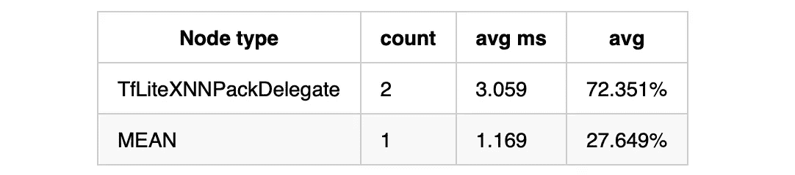
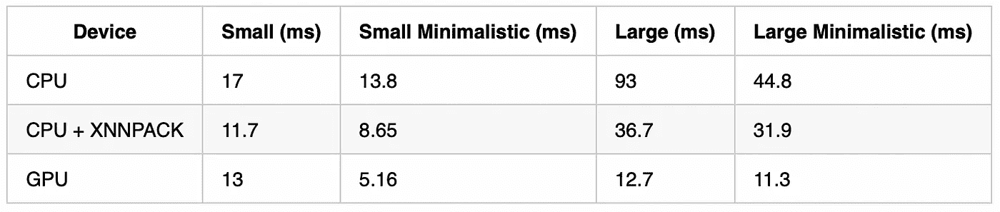
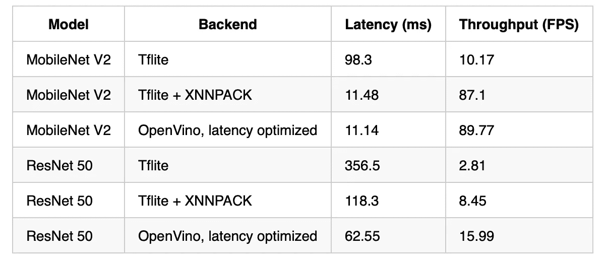
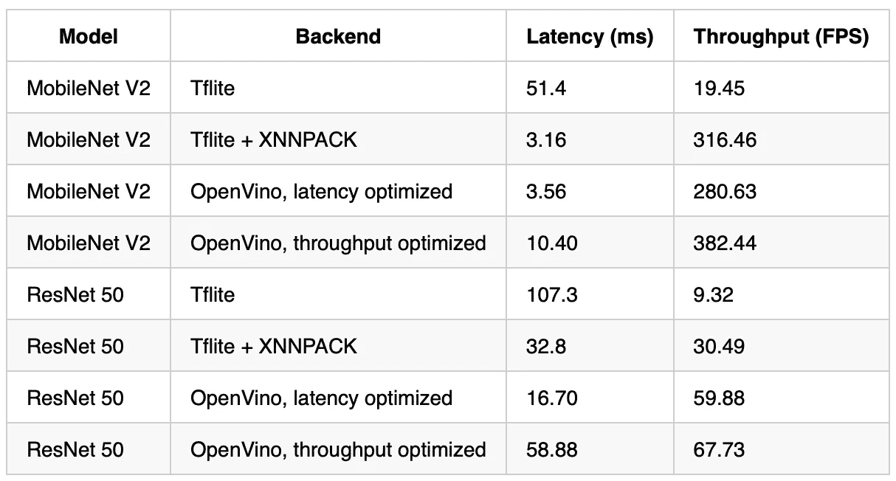

# 使用 XNNPACK 加速 Tensorflow Lite

> 原文：<https://towardsdatascience.com/accelerating-tensorflow-lite-with-xnnpack-ece7dc8726d0?source=collection_archive---------20----------------------->

## 全新 Tensorflow Lite XNNPACK delegate 可在 x86 和 ARM CPUs 上实现最佳性能


SpaceX 在 [Flickr 上的照片](https://www.flickr.com/photos/spacex/49421604803https://www.flickr.com/photos/spacex/49421604803)

TL；DR:新的 Tensorflow Lite XNNPACK delegate 在 x86 和 ARM CPUs 上实现了最佳性能，在某些情况下比默认的 Tensorflow Lite 后端快 10 倍以上。

Tensorflow Lite 是我最喜欢的软件包之一。它能够在一系列硬件上轻松快速地部署，现在提供了一系列代理来加速推理，例如 GPU、Core ML 和 Hexagon。然而，Tensorflow Lite 的一个缺点是，它的设计考虑了移动应用，因此没有针对英特尔和 AMD x86 处理器进行优化。更好的 x86 支持在 Tensorflow Lite 开发[路线图](https://www.tensorflow.org/lite/guide/roadmap)中，但目前 Tensorflow Lite 主要依赖于通过 Neon_2_SSE 桥将 ARM Neon 指令转换为 SSE。

然而，有一个新的 Tensorflow Lite 委托用于基于 CPU 的浮点计算，XNNPACK，它具有 x86 AVX 和 AVX-512 优化功能。在这篇文章中，我将带您使用 XNNPACK 并展示一些基准测试。

# 安装和使用 XNNPACK

XNNPACK 的使用说明可以在[这里](https://github.com/tensorflow/tensorflow/tree/master/tensorflow/lite/delegates/xnnpack)找到。最值得注意的是，现在有一个默认情况下启用 XNNPACK 委托的构建标志。这很方便，因为直到现在还不可能在 Python 中加载 Tensorflow Lite 委托。从源代码构建张量流的命令如下所示:

```
bazel build --define tflite_with_xnnpack=true \ 
  //tensorflow/tools/pip_package:build_pip_package
```

Tensorflow Lite [基准测试工具](https://github.com/tensorflow/tensorflow/tree/master/tensorflow/lite/tools/benchmark#on-android)现在也有一个标志来启用 XNNPACK 委托。例如，要在 x86 机器上进行分析，首先要构建分析器工具:

```
bazel build -c opt --verbose_failures \    
  tensorflow/lite/tools/benchmark:benchmark_model
```

然后使用以下命令运行探查器:

```
bazel-bin/tensorflow/lite/tools/benchmark/benchmark_model \
  --graph=<model path> --warmup_runs=50 --num_runs=1000 \
  --enable_op_profiling=true --use_xnnpack=true
```

# 为 XNNPACK 优化

确保模型适合 XNNPACK 很重要，因为它只支持所有 Tensorflow Lite 运算符的子集。例如，标准的 Keras 实现通常使用显式填充层，并通过 mean 运算符实现顶层全局池层。当使用普通的 TFLite 后端时，这只增加了几个百分点的运行时间，但是 XNNPACK 不支持这些操作，导致了相当大的开销——在具有 8 个线程的 MobileNet V2 的情况下为 30%(见下文)！



通过用卷积运算中内置的填充替换显式填充层，可以轻松修复填充:

```
# Before
x = layers.ZeroPadding2D(padding=((3, 3), (3, 3)), name='conv1_pad')(img_input)
x = layers.Conv2D(64, 7, strides=2, use_bias=use_bias, name='conv1_conv', padding='valid')(x)# After
x = layers.Conv2D(64, 7, strides=2, use_bias=use_bias, name='conv1_conv', padding='same')(img_input)
```

全局平均池层可以由具有大内核的平均池层代替:

```
# Before
x = layers.GlobalAveragePooling2D()(x)
x = layers.Dense(classes, activation='softmax')(x)# After
# Use XNNPACK compatible average pooling
x = layers.AveragePooling2D(pool_size=(7, 7))(x)

# Implement the top dense layer as a convolution, so we don't need to remove spatial dims
x = layers.Conv2D(classes, kernel_size=1)(x)
x = layers.Softmax()(x)
```

请注意，您必须重新训练模型。你可以在本文附带的回购协议中找到这些模型的修复版本[这里](https://github.com/yaysummeriscoming/xnnpack_benchmarks)。

# 基准

## 手臂ˌ武器ˌ袖子ˌ装备

好了，基准测试！首先，我决定在 Galaxy S8 上测试 MobileNet V3:



我用 1 个线程测试了 1000 次迭代，其中有 50 次预热迭代。

如您所见，XNNPACK 在标准 Tensorflow Lite CPU 后端的基础上提供了出色的性能。值得注意的是，XNNPACK 支持较新的 ARM v 8.2-A CPU(如 A55)中包含的 ARM Float 16 指令，可惜我手头没有。GPU 后端仍然更快，尤其是对于更大的模型。但是，它需要 OpenGL ES 3.1 或更高版本，仅在所有 Android 设备的约 2/3 上可用(见市场份额[此处](https://developer.android.com/about/dashboards))。

## x86

现在转到 x86。我决定使用 MobileNet V2 和 ResNet50 与英特尔的 OpenVino 软件包进行比较。为了测试，我使用了一个谷歌云 N2 瀑布湖实例，有 8 个虚拟 CPU。带 1 根线:



和 8 个线程:



如您所见，使用 XNNPACK delegate 的 Tensorflow Lite 的性能令人钦佩，在某些情况下比默认的 Tensorflow Lite 后端快 10 倍以上。性能接近 V2 MobileNet 的 OpenVino，但不及 ResNet 50。不过，我不认为这是一个大问题，因为基于深度方向卷积的架构，如 MobileNet V2，更适合 CPU 部署。XNNPACK 还具有比标准后端更好的跨多个 CPU 内核的伸缩性。请注意，TFLite 基准测试工具对应于 OpenVINO 的延迟模式，因此如果针对吞吐量进行配置，看看 XNNPACK 能够提供什么将会很有意思。

# 摘要

Tensorflow Lite 现在可以通过新的 XNNPACK delegate 提供出色的 x86 性能，在某些情况下超过了英特尔的 OpenVino 包。XNNPACK 的主要缺点是它只为浮点计算而设计。8 位模型量化可以轻松实现 2 倍以上的性能提升，当部署在支持 AVX-512 VNNI 指令的全新英特尔 Cascade Lake CPUs 上时，性能提升甚至更高。对 x86 上 8 位量化的支持在 Tensorflow Lite 路线图中，甚至可能在[的下一个版本](https://github.com/tensorflow/tensorflow/issues/34536)中。

同样，对于移动部署，XNNPACK 优于 Tensorflow Lite 默认后端。虽然 GPU delegate 仍然比 XNNPACK 快，但 XNNPACK 在不支持 GPU 计算的设备上很有用。

我对 XNNPACK 感到特别兴奋，因为它允许用户留在 Tensorflow 生态系统中，从而简化了部署过程。现在可以使用 Tensorflow Lite 转换一次模型并部署到多个平台，从而减少所需的不同软件包的数量。同样值得注意的是，AMD 处理器越来越少见，OpenVino 是英特尔的产品。我试图在谷歌云 N2D EYPC 实例上测试，但不幸的是，我无法增加我的配额。

我希望这篇文章对你有所帮助。复制这些基准的代码位于[这里](https://github.com/yaysummeriscoming/mobilenet_v3_tflite)和[这里](https://github.com/yaysummeriscoming/xnnpack_benchmarks)。