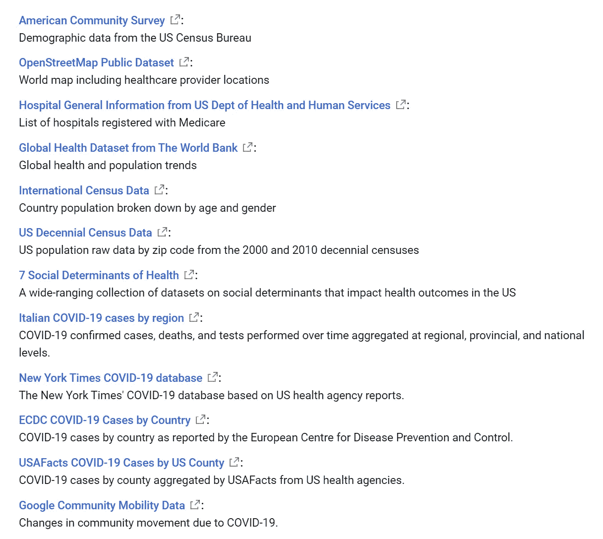
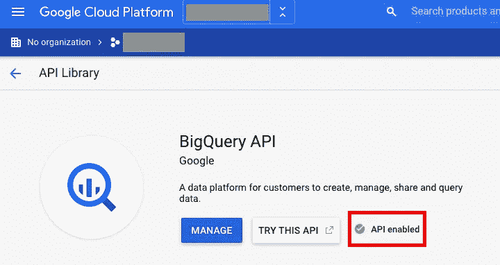
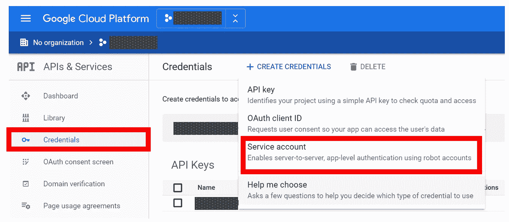
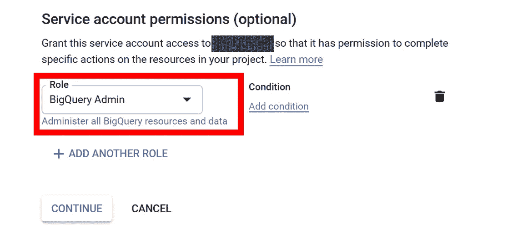
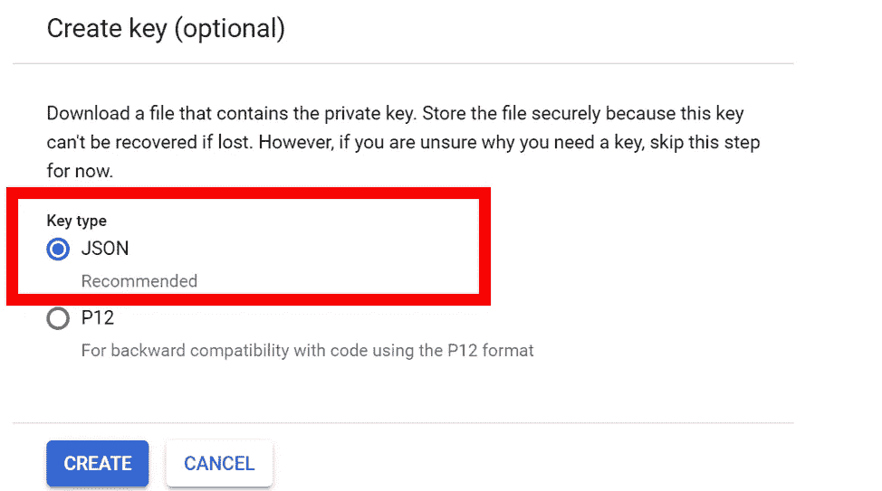
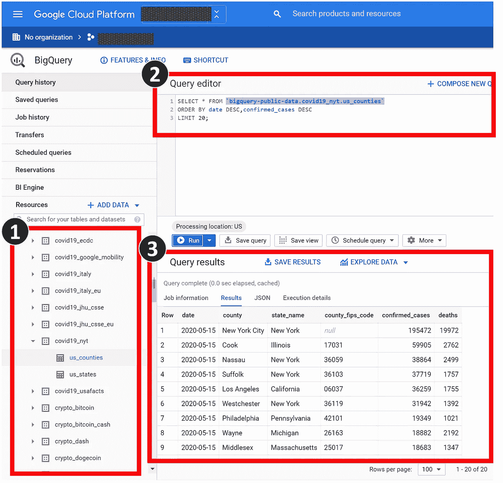
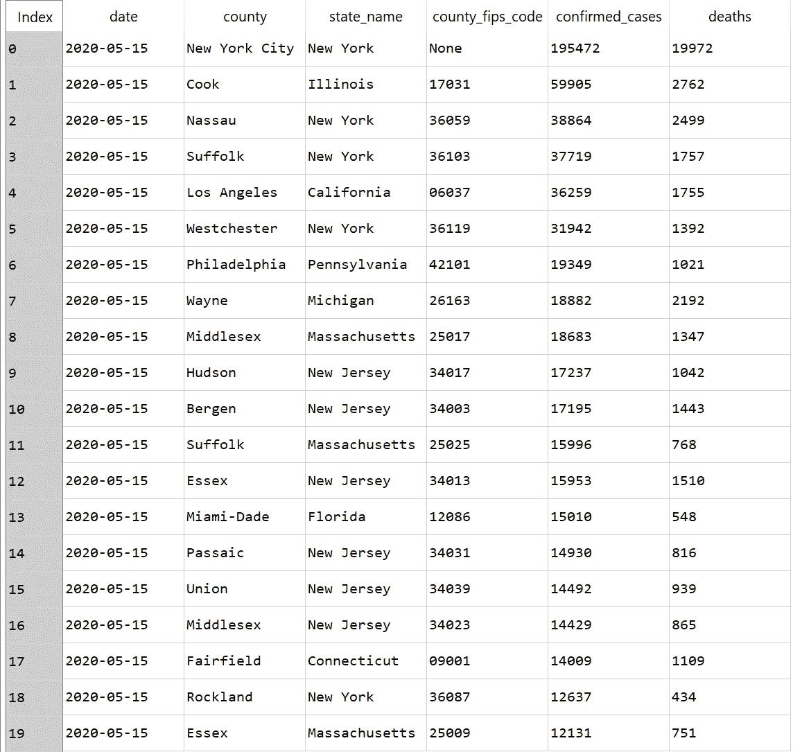

# 使用 Python 访问免费的谷歌云公共数据集

> 原文：<https://towardsdatascience.com/access-free-google-cloud-public-dataset-with-python-42eb378be72c?source=collection_archive---------33----------------------->

## 数据科学基本指南

## 下载免费的谷歌公共数据集到熊猫数据框


**使用 Python** 访问免费的谷歌云公共数据集(插图由 [Chaeyun Kim](https://medium.com/@chaeyunkim) 绘制)

# 谷歌公共数据集简介

G 数据科学家的好消息！谷歌正在制作一个公共数据集的托管存储库，如[约翰·霍普金斯系统科学与工程中心](https://console.cloud.google.com/marketplace/details/johnshopkins/covid19_jhu_global_cases?filter=solution-type:dataset&q=covid&id=430e16bb-bd19-42dd-bb7a-d38386a9edf5)(JHU·CSSE)，来自世界银行的全球健康数据，以及【OpenStreetMap 数据，可以通过他们的[新冠肺炎公共数据集项目](https://console.cloud.google.com/marketplace/details/bigquery-public-datasets/covid19-public-data-program)免费访问和查询，以帮助研究人员、数据科学家和分析师努力抗击新冠肺炎。这些数据集消除了障碍，提供了对关键信息的快速、轻松的访问，消除了搜索和装载大型数据文件的需要。研究人员可以从[谷歌云控制台](https://console.cloud.google.com/marketplace/browse?filter=solution-type:dataset)中访问数据集，以及数据描述和样本查询，以推进研究。我们在该计划中包含的所有数据都将是公开和免费的。* *该计划将持续有效，直至 2020 年 9 月 15 日。*【1】



**截至 2020 年 5 月 15 日可用的免费公共数据集列表**(作者截图来自 [Google](https://console.cloud.google.com/marketplace/details/bigquery-public-datasets/covid19-dataset-list)

## 为什么我这么喜欢？

我自己用数据库存储、管理和更新数据有时既无聊又昂贵。有了谷歌公共数据集，他们就在替我打理这些无聊的部分。至于定价，在新冠肺炎疫情之前，它有每月 1 TB 查询的免费层限制(嗯，已经有很多免费数据了！)支持疫情的情况，再也没有限制了！！因此，我可以愉快地专注于有趣的部分:数据分析、性感的数据可视化、开发 web 应用程序等。

本文将与您分享以下分步指南:

1.  启用 Google Cloud BigQuery API。
2.  为 BigQuery API 创建服务帐户，以向您的 Python 脚本授予权限。
3.  使用 BigQuery Web 界面浏览数据集。
4.  使用 Python 访问数据集，并将其导入熊猫数据框架。

***那么，我们开始吧！***

# 启用 Google Cloud BigQuery API

为了能够访问数据集，你应该注册[谷歌云账户](https://cloud.google.com/)。在您注册之后，或者如果您已经有了一个帐户，请转到您的 Google Cloud [控制台](http://console.cloud.google.com/)，然后激活您的 Google Cloud BigQuery API ( [链接](https://console.cloud.google.com/apis/library/bigquery.googleapis.com))。点击“激活”API 后，可以看到确认的“API 启用”，如下图所示。



**激活 Google BigQuery API** (作者截图)

## 为 BigQuery API 创建服务帐户

为了让 BigQuery API 在以后使用 Python 或其他编程语言访问您的机器，您需要一个新的 Google 服务帐户密钥，步骤如下。*(如果只需要通过 web 界面访问，可以跳过这些步骤)*

*   转到您的 Google API 凭证页面，为这个 BigQuery API 创建 API 键([链接](https://console.cloud.google.com/apis/credentials))。



**创建 Google BigQuery API 服务账号**(作者截图)

*   选择服务帐户权限角色为“BigQuery Admin”



**创建 Google BigQuery API 服务账号**(作者截图)

*   然后，点击*创建键*并选择 *JSON* 类型。请确保您安全地保存这个文件，否则其他人也可能访问您的 API 帐户。我们将在最后一步中再次使用这个文件。



**创建 Google BigQuery API 服务账号**(作者截图)

# 使用 BigQuery Web 界面浏览数据集

用户可以使用 SQL 查询语法检索或查询 Google 公共数据集。首先，您可以尝试观察您可以访问哪些数据集，并通过以下三个步骤通过 [Google BigQuery Web 界面](https://console.cloud.google.com/bigquery)测试 SQL 查询:

1.  探索可用的数据资源。选择其中一个。
2.  **在“查询编辑器”窗口中输入查询语法。**在这一步，你需要 SQL 的基本知识来查询(搜索)数据集。如果您以前从未使用过，请查看有关它的在线文档。有几个是在线的比如 [W3](https://www.w3schools.com/sql/) 。
3.  **浏览您的查询结果。**



**使用 Google BigQuery Web 接口查询 Google 公共数据集的例子——纽约市新冠肺炎案例。**(作者)

# 使用 Python 访问数据集，并将其导入熊猫数据框架。

要使用 Python 访问 BigQuery API，请使用以下命令安装该库:

```
**pip install --upgrade google-cloud-bigquery**
```

创建您的项目文件夹，并将服务帐户 JSON 文件放入该文件夹。然后，创建一个 Python 文件，用你喜欢的编辑器编辑它。你需要做的第一件事是将 Google 应用点的操作系统环境设置为你的 JSON 密钥目录，这可以通过使用`os.environ["xxx"]="yyy"`来完成

```
**os.environ["GOOGLE_APPLICATION_CREDENTIALS"]="Your json directory"**
```

然后，您可以启动 BigQuery 客户机，并使用以下命令启动查询:

```
**client = bigquery.Client()** # Start the BigQuery Client **QUERY = ('SELECT ...')** # Input Query Syntax **query_job = client.query(QUERY)** # Start Query API Request**query_result = query_job.result()** # Get Query Result **df = query_result.to_dataframe()** # Save the Query to Dataframe
```

例如，您可以按照下面的完整 Python 脚本，从纽约时报新冠肺炎数据库中按较晚日期和较高确诊病例的顺序查询美国前 20 名新冠肺炎确诊和死亡病例。

**从谷歌公共数据集查询新冠肺炎数据的示例 Python 脚本——纽约时报新冠肺炎数据库**(作者提供的示例脚本)



**谷歌公共数据集查询结果示例——纽约时报新冠肺炎数据库**(作者举例)

所以，就这样吧！祝贺您，现在您可以访问数据集了，享受您的新数据框架吧！！✌🎉🎉

# 结论

本文涵盖了如何使用 WebUI 和 Python 通过 Google Cloud BigQuery 服务使用和访问数据集的基本步骤。请注意，这篇文章只涵盖了初学者的步骤，还有更多的功能和界面来访问和使用这项服务。你可以在这里查看完整的 BigQuery 文档。

我希望你喜欢这篇文章，并发现它对你的日常工作或项目有用。如果您有任何问题或意见，请随时给我留言。

关于我&查看我所有的博客内容:[链接](https://joets.medium.com/about-me-table-of-content-bc775e4f9dde)

安全**健康**健康**吗！💪**

**感谢您的阅读。📚**

[1] Chad W. Jennings，[新冠肺炎公共数据集计划:使数据可自由访问以获得更好的公共结果](https://cloud.google.com/blog/products/data-analytics/free-public-datasets-for-covid19)(2020 年 3 月 30 日)，谷歌云数据分析