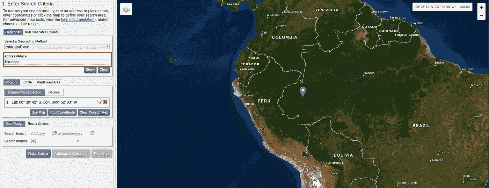
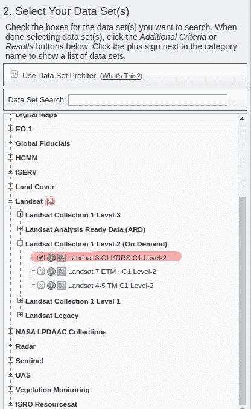
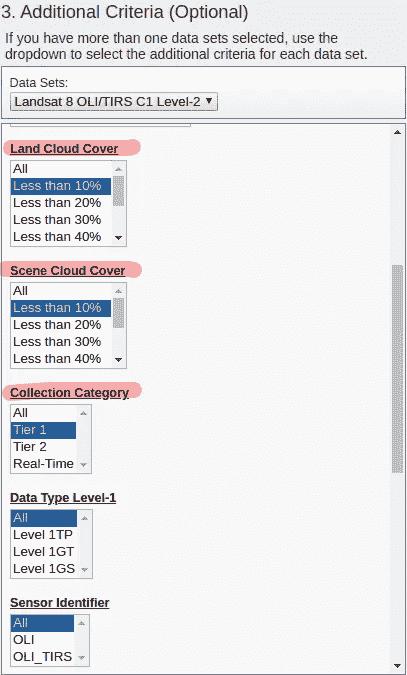
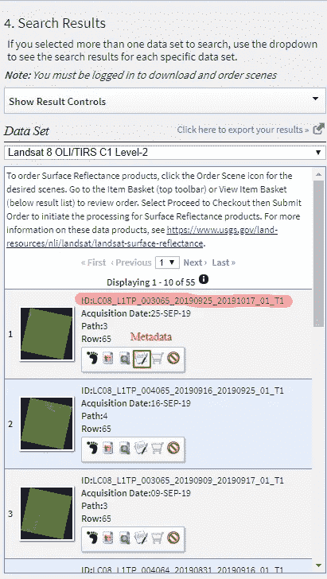
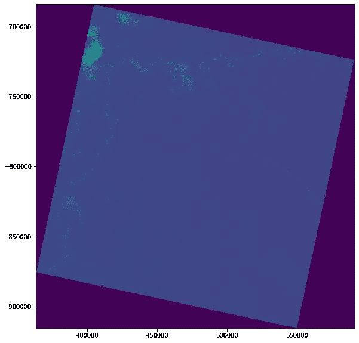
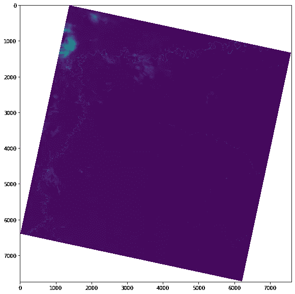
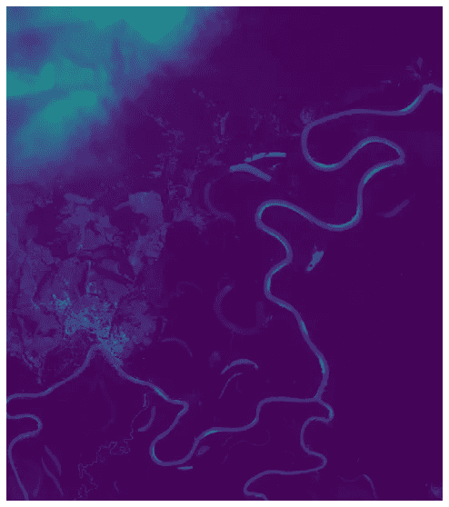
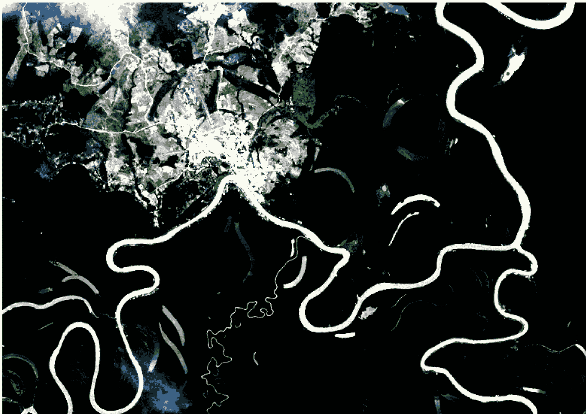

# 使用 AWS 和 Google Colab 访问卫星图像

> 原文：<https://towardsdatascience.com/access-satellite-imagery-with-aws-and-google-colab-4660178444f5?source=collection_archive---------12----------------------->

## 使用 Python 和 Google Colab 加载、试验和下载云优化地理信息系统(COG)。


照片由[达拉斯里德](https://unsplash.com/@dallasreedy?utm_source=medium&utm_medium=referral)在 [Unsplash](https://unsplash.com?utm_source=medium&utm_medium=referral) 上拍摄

在本地下载卫星影像时，访问卫星影像需要大量存储空间。如果您在一段时间内需要多个地块，该过程会占用您的所有存储空间。更糟糕的是，您可能只需要整个图像的一个子集区域。

为了解决这样的问题，地理空间数据的最新进展使用了我们云优化的地理信息系统(COG)。

> 云优化 GeoTIFF (COG)是一个常规的 GeoTIFF 文件，旨在托管在一个 HTTP 文件服务器上，其内部组织可以在云上实现更高效的工作流。它通过利用客户端发出的 [HTTP GET range 请求](https://tools.ietf.org/html/rfc7233)来请求他们需要的文件部分。——[https://www.cogeo.org/](https://www.cogeo.org/)

现在想象一下，能够倒带、前进和停止一个大视频来观看你需要的视频部分。COG 精确地允许你用卫星图像做到这一点。你可以得到一个孔瓷砖，可视化低分辨率，子集和掩盖一个地区，甚至进行任何处理，甚至没有下载它。

本教程将向您展示如何使用 Python 在 Google Colab 中访问存储在 AWS s3 存储中的 Landsat 图像。第一部分讲述了如何找到适合您感兴趣领域的图像，而第二部分向您展示了如何使用 Python 访问、可视化和处理卫星图像。

## 查找您感兴趣的区域的卫星图像

我收到很多关于如何获得感兴趣区域的正确图像的询问。在这种情况下，我们使用 Landsat 图像，因此我将指导您如何获得卫星图像的路径和行。进入 [USGS explorer](https://earthexplorer.usgs.gov/) 网站，通过提供地址或地点(下图中以红色突出显示)找到您感兴趣的地方。一旦你得到结果，点击地址。如果你愿意，可以按日期过滤掉。



下一步是单击数据集并选择数据集。在本教程中，我们使用的是 Landsat 8，所以我们选择了它(下面突出显示的红色)



点击附加标准以过滤云覆盖范围。如下图所示，我们过滤掉小于 10%的云覆盖。



最后，点击结果，找出你所在地区所有可用的图片。一旦您知道您想要用于分析的图像，您就可以复制 ID 或将其记在某处(如下所示)。



你还需要记下卫星图像的路径和行。你可以点击元数据按钮(红色矩形)或者简单地记下 ID: 0030065 的第三部分。

在下一节中，我们将看到如何使用 Python 在 Google Colab 中直接访问数据。Landsat 同时存储在 AWS 和 Google 云平台中，但在本教程中，我们通过 AWS 获取数据。

# 用 AWS 和 Google Colab 访问 Landsat

让我们首先导入我们将要使用的库。我们的主要工具是 Rasterio，它提供了一个易于使用的 API 来处理卫星图像。

```
import numpy as np
import matplotlib.pyplot as plt
import rasterio as rio
from rasterio.plot import show
```

您可以像这样构造您的 URL 路径。

```
fpath = ‘http://landsat-pds.s3.amazonaws.com/c1/L8/003/065/LC08_L1TP_003065_20190925_20191017_01_T1/LC08_L1TP_003065_20190925_20191017_01_T1_B4.TIF'
```

我们可以将上面的 URL 分成不同的部分:

```
[http://landsat-pds.s3.amazonaws.com/c1/](http://landsat-pds.s3.amazonaws.com/c1/)
```

URL 的第一部分总是相同的，并显示 AWS 存储 URL。

```
L8/003/065/
```

L8 表示陆地卫星 8 号。路径:003。第 065 排。URL 的这一部分将根据您正在访问的数据集和感兴趣的区域而变化。

```
LC08_L1TP_003065_20190925_20191017_01_T1
```

这部分是图片的 ID，你可以从上面的图片中得到。

```
LC08_L1TP_003065_20190925_20191017_01_T1_B4.TIF
```

最后，重复图像的 ID，但这次是您想要访问的波段(这里是 B4)和图像的扩展名。TIFF)

现在，我们已经设置了访问 URL，我们可以编写一个简单的函数来使用 Rasterio 打开图像。

```
def rasterio_open(f):return rio.open(f)src_image = rasterio_open(fpath)
```

一次，我们打开光栅图像；您可以使用任何可视化库或仅 Rasterio 的数据可视化方法来绘制它。

```
fig, ax = plt.subplots(1, figsize=(12, 10))show(src_image, ax=ax)plt.show()
```

这是我们访问显示的整个图像。我们只获得了频带 4。我们稍后会看到如何将不同的波段组合起来构建一幅 RGB 图像。



如您所见，我们有显示为黑色的 NaN 值。我们可以通过使用 Numpy 功能来消除这些问题。我们首先通过用 Rasterio 读取图像，将图像转换为 Numpy 数组

```
src_image_array = src_image.read(1)src_image_array = src_image_array.astype(“f4”)src_image_array
```

图像被转换成数组，如下所示。

```
array([[0., 0., 0., …, 0., 0., 0.], [0., 0., 0., …, 0., 0., 0.], [0., 0., 0., …, 0., 0., 0.], …, [0., 0., 0., …, 0., 0., 0.], [0., 0., 0., …, 0., 0., 0.], [0., 0., 0., …, 0., 0., 0.]], dtype=float32)
```

现在，您可以通过将这些空数组赋值为 np.nan 来轻松删除它们。

```
src_image_array[src_image_array==0] = np.nanfig, ax = plt.subplots(1, figsize=(12, 10))show(src_image_array, ax=ax)plt.show()
```

我们现在在边上没有空值了。



通常，您可能只对图像的一个子集感兴趣。在下一节中，我们将介绍如何使用 Rasterio 的窗口功能对图像进行子集化。

## 子集化图像

要只访问图像的特定部分，可以用行、列、宽度和高度过滤掉图片。比方说，我们不想要整个图像，而是要一个 750 X 850(宽和高)的 1200 列和 1200 行的图像。

```
# Window(col_off, row_off, width, height)
window = rio.windows.Window(1200, 1200, 750, 850)subset = src_image.read(1, window=window)fig, ax = plt.subplots(1, figsize=(12, 10))show(subset, ax=ax)
ax.set_axis_off()plt.show()
```

现在图像缩小到一个子集，在城市 Eirunepe 附近，如下图所示。



最后，下一节将展示如何创建一个 RGB 图像并将其下载到本地。

## 创建 RGB 并下载

我们首先通过为每个波段提供一个单独的 URL 来访问每个波段。注意，除了。TIF 分机。这些是波段，在这种情况下，因为我们想要创建一个 RGB 图像，所以我们访问波段 4(红色)、波段 3(绿色)和波段 2(蓝色)。

```
rpath = ‘http://landsat-pds.s3.amazonaws.com/c1/L8/003/065/LC08_L1TP_003065_20190925_20191017_01_T1/LC08_L1TP_003065_20190925_20191017_01_T1_B4.TIF'gpath = ‘http://landsat-pds.s3.amazonaws.com/c1/L8/003/065/LC08_L1TP_003065_20190925_20191017_01_T1/LC08_L1TP_003065_20190925_20191017_01_T1_B3.TIF'bpath = ‘http://landsat-pds.s3.amazonaws.com/c1/L8/003/065/LC08_L1TP_003065_20190925_20191017_01_T1/LC08_L1TP_003065_20190925_20191017_01_T1_B2.TIF'red = rio.open(rpath)green = rio.open(gpath)blue = rio.open(bpath)
```

我们创建一个 RGB 图像，方法是打开一个空图像，并用上面打开的三个波段填充它。

```
# Create an RGB imagewith rio.open(‘RGB.tiff’,’w’,driver=’Gtiff’, width=red.width, height=red.height,count=3,crs=red.crs,transform=red.transform, dtype=red.dtypes[0]) as rgb:rgb.write(blue.read(1),1)rgb.write(green.read(1),2)rgb.write(red.read(1),3)rgb.close()
```

图像现已存储。你可以用 Rasterio 打开或者下载到本地。



使用 QGIS 可视化的图像子集

## 结论

在本教程中，我们介绍了如何查看和找到您感兴趣的领域的正确数据。我们还了解了如何使用 Python 和 AWS 存储来访问 Landsat 图像。

本教程的代码可以在这个 Colab 笔记本上找到。

[](https://github.com/shakasom/rs-python-tutorials/blob/master/Cloud_Optimized_Geotiffs.ipynb) [## shaka som/RS-python-教程

### 此时您不能执行该操作。您已使用另一个标签页或窗口登录。您已在另一个选项卡中注销，或者…

github.com](https://github.com/shakasom/rs-python-tutorials/blob/master/Cloud_Optimized_Geotiffs.ipynb)