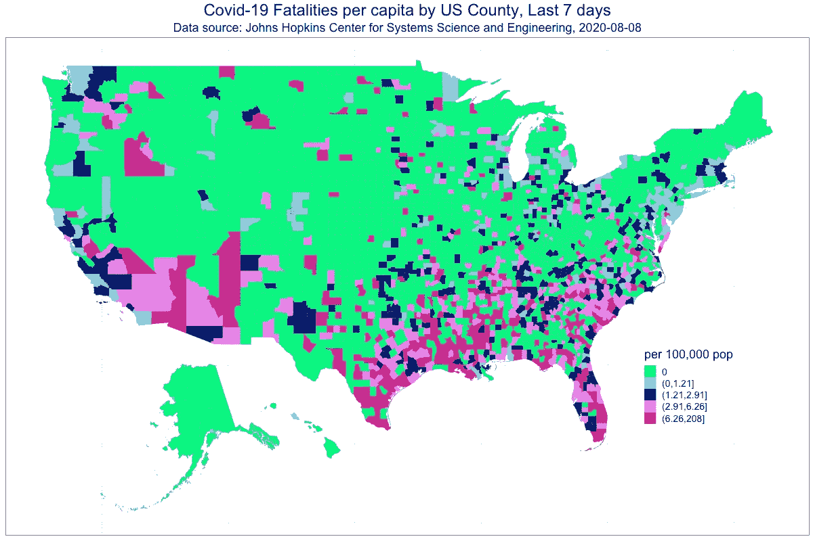

# 自己访问和检查新冠肺炎数据

> 原文：<https://towardsdatascience.com/accessing-and-examining-covid-19-data-on-your-own-e9d9b4fbc09b?source=collection_archive---------64----------------------->

## 构建一个 choropleth 图，显示美国各县过去七天的人均新冠肺炎死亡人数

***编者按:*** [*走向数据科学*](http://towardsdatascience.com/) *是一份以数据科学和机器学习研究为主的中型刊物。我们不是健康专家或流行病学家，本文的观点不应被解释为专业建议。想了解更多关于疫情冠状病毒的信息，可以点击* [*这里*](https://www.who.int/emergencies/diseases/novel-coronavirus-2019/situation-reports) *。*

# **数据和疫情**

对于此时地球上的大多数人来说，经历一次全球性的疫情是一次前所未有的经历。有时，我会想到 1918 年至 1920 年的下一次全球疫情与今天之间的时期。这 100 年里，在你能想到的几乎所有领域，包括数据和技术，都发生了一些迄今为止世界上最引人注目的变化。我想知道那些生活在 1918 年的人是如何获得关于疫情及其传播的信息的？今天，我们有许多信息来源可用，并随时可以访问数据显示，包括预测模型，描述和预测疫情的轨迹。但是，作为一名数据科学家，您可能会发现，即使在查看了可用内容之后，您仍有一些问题没有得到解答，并且希望能够自己监控快速发展的情况。幸运的是，通过约翰·霍普金斯系统科学与工程中心([https://systems.jhu.edu/research/public-health/ncov/](https://systems.jhu.edu/research/public-health/ncov/))的深入研究，你可以获得全球范围内每日的新冠肺炎病例数和死亡人数，也可以获得美国各州、县或地区的数据。然后，您可以使用这些信息来设计数据报告和显示，以便更好地做出困难的决策。例如，在本报告中，我将向您展示如何:

1.在 Github 上访问约翰霍普金斯大学的新冠肺炎数据，

2.执行一些简单的数据操作来转换数据，并且

3.使用 albersusa R 软件包构建一个 choropleth 图([https://rud . is/b/2016/03/29/easy-composite-u-s-choropleths-with-albers USA/](https://rud.is/b/2016/03/29/easier-composite-u-s-choropleths-with-albersusa/))，以显示美国各县过去七天的人均新冠肺炎死亡人数。

# **访问 Github 上的每日新冠肺炎数据**

您可以从加载下面的包开始。注意，如果没有安装 albersusa 包，可以使用 devtools 包中的 install_github()函数来安装。

```
# Data on COVID-19 from Johns Hopkins Center for Systems Science and Engineering
# https://systems.jhu.edu/research/public-health/ncov/
# https://github.com/CSSEGISandData/COVID-19# Blog post to demonstrate chloroplot package
#https://rud.is/b/2016/03/29/easier-composite-u-s-choropleths-with-albersusa/rm(list = ls())
library(tidyverse)
library(rgeos)
library(maptools)
library(ggplot2)  
library(ggalt)
library(ggthemes)
library(albersusa) # devtools::install_github("hrbrmstr/albersusa")
library(scales)
library(gtools)
```

可以使用以下方法读取数据。请注意，在相同或相邻的目录中，还有美国病例、全球病例和死亡病例的数据集。

```
# read time series data on US deaths by county
urlfile='[https://raw.githubusercontent.com/CSSEGISandData/COVID-19/master/csse_covid_19_data/csse_covid_19_time_series/time_series_covid19_deaths_US.csv'](https://raw.githubusercontent.com/CSSEGISandData/COVID-19/master/csse_covid_19_data/csse_covid_19_time_series/time_series_covid19_deaths_US.csv')
cov19_us_dat<-read_csv(url(urlfile))
```

数据每天更新。在本例中，我们只想使用最近 8 天的数据(因为我们需要减去——您将在下面看到)。我们还保存了 fips 代码(用于标识美国各县)和每个县的人口，以便我们可以计算人均值。

```
# Collect data consisting of the last 8 days
tot_days <- ncol(cov19_us_dat)
begin_day <- tot_days - 7
fips <- cov19_us_dat$FIPS
pop <- cov19_us_dat$Population
us_recent <- cov19_us_dat[,begin_day:tot_days]
```

请注意，这些文件中的数据是累积形式的，所以如果我们想要每天的计数，我们需要从前一天减去每天的总数。下面是一个简单的方法。

```
# Convert cumulative data to new values each day
us_daily <- us_recent[,-1] — us_recent[,-8]
us_fatal <- data.frame(fips, pop, us_daily)
colnames(us_fatal) <- c(‘fips’, ‘population’,colnames(us_daily))
```

最后，有几个数据处理步骤:

1.仅保存位于美国 50 个州或 DC 的县的 fips 代码。

2.处理一些实际上比前一天减少的累积计数(可能是由于数据澄清或调整)。

3.将人口转换为每 10 万人的数量。

4.计算人均比率的十分位数。选择分组到 10 个箱中是一种判断，随着数据随时间的变化，可能会有更好的选择。请注意，前 5 个十分位数的县在过去 7 天内没有出现死亡病例，因此最终只有 5 组。

5.当读入 fips 代码时，除非您能始终如一地将它们存储为“字符”类型，否则它们可能会转换为“整数”类型并丢失前导零。str_pad 函数可以解决这个问题。

6.南达科塔州奥格拉拉拉科塔的 fips 代码显然发生了变化，需要手动解决，以避免在南达科他州中部的地块上出现大的白色方块。

```
us_fatal <- us_fatal %>%
filter(fips %in% (1001:56045)) %>%
mutate(sum = rowSums(.[3:9]),
       sum = ifelse(sum > 0, sum, 0),
       pop_100_000 = population/100000,
       percap = sum/pop_100_000,
       percap_quint = quantcut(percap, q=10, dig.lab = 3),
       fips = as.character(fips),
       fips = str_pad(fips, 5, 'left','0'))  

# replace fips for Oglala Lakota, SD (formerly Shannon, SD)
us_fatal$fips <- replace(us_fatal$fips, us_fatal$fips == "46102", "46113")
```

设置打印颜色的一个选项:

```
# Set up plot colors according to the number of levels of quintiles (many 0's)
no_colors <- length(unique(us_fatal$percap_quint))
quin_colors <- c("springgreen", "skyblue", "navy","violet","violetred")
start_color <- 5 - no_colors + 1
plot_colors <- quin_colors[start_color:5]
```

最后，使用 ggplot()创建图形:

```
cmap <- fortify(counties_composite(), region=”fips”)gg <- ggplot()
gg <- gg + geom_cartogram(data=cmap, map=cmap,
 aes(x=long, y=lat,map_id=id),show.legend = FALSE,
 color=”#2b2b2b”, size=0.05, fill=NA)
gg <- gg + geom_cartogram(data=us_fatal, map=cmap,
 aes(fill=percap_quint, map_id=fips),
 color=”#2b2b2b”, size=0.05)
gg <- gg + scale_fill_manual(name=”per 100,000 pop”, values = plot_colors)
gg <- gg + labs(title=’Covid-19 Fatalities per capita by US County, Last 7 days’,
 subtitle=paste(‘Data source: Johns Hopkins Center for Systems Science and Engineering, ‘, Sys.Date(), sep=’’))
gg <- gg + theme_bw()
gg <- gg + xlab(NULL)
gg <- gg + ylab(NULL)
gg <- gg + theme(axis.ticks.x = element_blank())
gg <- gg + theme(axis.ticks.y = element_blank())
gg <- gg + theme(axis.text.x = element_blank())
gg <- gg + theme(axis.text.y = element_blank())
gg <- gg + theme(legend.position=c(0.85, 0.30))
gg <- gg + theme(plot.title=element_text(size=24, hjust = 0.5))
gg <- gg + theme(plot.subtitle=element_text(size=18, hjust = 0.5))
gg <- gg + theme(legend.text=element_text(size=14))
gg <- gg + theme(legend.title=element_text(size=18))png(paste(“choro.png”, sep = “”), width = 1200, height = 800, units = “px”)
gg
```

