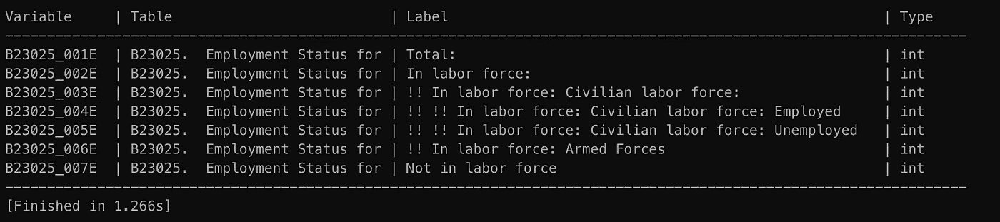

# 使用 Python 访问人口普查数据

> 原文：<https://towardsdatascience.com/accessing-census-data-with-python-3e2f2b56e20d?source=collection_archive---------16----------------------->

## 公共数据项目

随着 2020 年人口普查的进行和即将到来的选区重新划分，访问和理解公共人口普查数据比以往任何时候都更加重要。这篇文章将指导你使用一个名为 [*CensusData*](https://pypi.org/project/CensusData/) 的 Python 包将数据导入 Pandas


# 普查数据集

通过 *CensusData* 有 5 个数据集可用，包括经典的十年一次的人口普查以及 4 个不同的美国社区调查(ACS)估计。

## 什么是美国社区调查？

ACS 始于 2005 年，取代了过去每十年与传统人口普查一起发送给家庭子集的长表格人口普查。相反，ACS 是在滚动的基础上进行的，每月发送给大约 350 万个家庭。这个子集然后被用来创建整个人口的估计。ACS 上的问题也更加深入，包括教育、就业和互联网接入等主题。

## 五个数据集

*   *ACS 1 年评估(2012–2018)*针对人口超过 65，000 的地区，更新最频繁，但“分辨率”最低，因为它不包括人口较少的地区，且样本量最小
*   *ACS 1 年补充评估(2014–2017)*补充数据集，重点关注 20，000+人口较少的地区
*   *ACS 3 年估计值(2010-2012 年至 2011-2013 年)*针对人口超过 20，000 的地区，非常接近 1 至 5 年的中间值。目前由人口普查局打折，但旧版本仍然可以访问。
*   *ACS 五年估计值(2005–2009 年至 2014–2018 年)*所有区域的数据，最高分辨率和最大样本量，但最少当前数据
*   *2010 年人口普查摘要文件 1* 统计美国的每一个居民，每 10 年更新一次。

## 笔记

*   跨越多年的估计数是总量
*   永远不要比较重叠范围的估计值，例如，比较 ACS 2010–2012 年到 2011–2013 年的 3 年

# 设置和搜索表格

通过您的终端使用 pip 可以轻松完成安装。

```
pip install censusdata
```

现在你可以在人口普查网站上查找你感兴趣的表格，例如这里的[是 ACS 的](https://www.census.gov/programs-surveys/acs/technical-documentation/summary-file-documentation.html)。或者您可以使用 *CensusData* 的搜索方法

```
import pandas as pd
import censusdatasample = censusdata.search('acs5', 2015,'concept', 'transportation')
```

以下是来自文档的搜索参数的详细信息:

*   **src** ( *str* ) —人口普查数据来源:acs1 年估计数为“ACS 1”，acs5 年估计数为“ACS 5”，acs3 年估计数为“ACS 3”，ACS 1 年补充估计数为“acsse”，sf1 数据为“SF1”。
*   **年** ( *int* ) —数据的年份。
*   **字段** ( *字符串* ) —要搜索的字段。
*   **标准** ( *字符串* ) —搜索标准。
*   **tabletype** ( *str，可选* ) —从中提取变量的表格类型(仅适用于 ACS 数据)。选项包括“详细信息”(详细信息表)、“主题”(主题表)、“配置文件”(数据配置文件表)、“c 配置文件”(比较配置文件表)。

因此，在上面的搜索查询中，我们正在寻找从 2015 年开始的 5 年 ACS 估计值，其中包含“运输”这一概念。现在，这个搜索将返回一个包含变量名、概念和符合搜索标准的标签的三元组列表。这个列表可能相当大。

```
print(len(sample))>>>3630
```

让我们详细检查两个第一元组，以理解它们告诉我们什么。

```
print(sample[0])>>>('B08006_001E', 'B08006\.  Sex of Workers by Means of Transportation to Work', 'Total:')print(sample[2])>>>('B08006_002E', 'B08006\.  Sex of Workers by Means of Transportation to Work', 'Car, truck, or van:')
```

第一个元素是*变量名*，包含两个元素，父表和子表名称。两个条目共享同一个父表‘b 08006’，它对应于第二个元素*概念*，‘b 08006。上班交通工具上的工人性别。最后一个元素是对应于它们的子表的标签。

## 打印表格和查找地理位置

一旦知道了感兴趣的父表，就可以使用 print table 命令清楚地读出所有子表。

```
censusdata.printtable(censusdata.censustable('acs5', 2015, 'B23025'))
```



包含在图像中，因为它不适合介质格式

为了下载一些人口普查数据，您需要的最后一部分是您感兴趣的地区的地理代码。我们可以使用地理方法来探索这些信息。

```
states = censusdata.geographies(censusdata.censusgeo([('state', '*')]), 'acs5', 2015)
```

该查询将返回一个 dictionary 对象，其中每个键都是一个州的名称。下面是前两个元素的示例。

```
{'Alabama': censusgeo((('state', '01'),)), 
'Alaska': censusgeo((('state', '02'),))}
```

因此，为了找到纽约的代码，我们需要打印相应的值。

```
print(states['New York']
>>>Summary level: 040, state:36
```

我们感兴趣的是第二个值 36，它可以用来获取该州的所有县代码。

```
counties = censusdata.geographies(censusdata.censusgeo([('state', '36'), ('county', '*')]), 'acs5', 2015)print(counties)
>>>Summary level: 040, state:36
{'Queens County, New York': 
        censusgeo((('state', '36'), ('county', '081'))), 
'Rensselaer County, New York': 
        censusgeo((('state', '36'), ('county', '083'))),
'Richmond County, New York': 
        censusgeo((('state', '36'), ('county', '085'))),
...}
```

## 下载数据

现在我们已经拥有了下载第一组人口普查数据所需的一切！

```
data = censusdata.download('acs5', 2015,
           censusdata.censusgeo([('state', '36'),
                                 ('county', '081'),
                                 ('block group', '*')]),
          ['B23025_001E', 'B23025_002E', 'B23025_003E',
           'B23025_004E', 'B23025_005E',
           'B23025_006E', 'B23025_007E'])
```

该查询将把请求的数据存储为 Pandas 数据帧，可以使用标准的 Pandas 方法访问该数据帧。

```
print(data.head)
```

恭喜你！你已经正式访问了公开的美国人口普查数据。

## 参考资料:

[https://jtleider.github.io/censusdata/](https://jtleider.github.io/censusdata/)

[https://www.census.gov/en.html](https://www.census.gov/en.html)