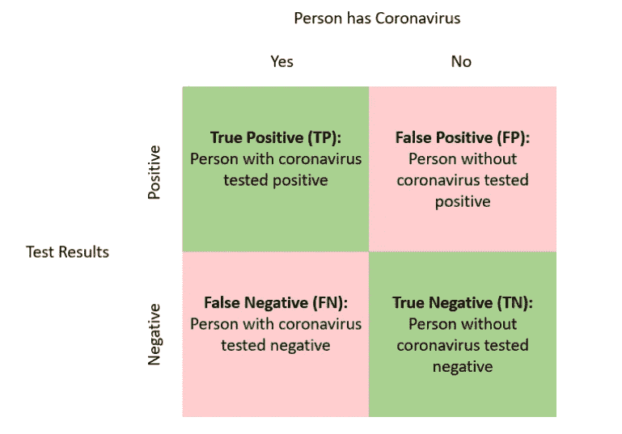
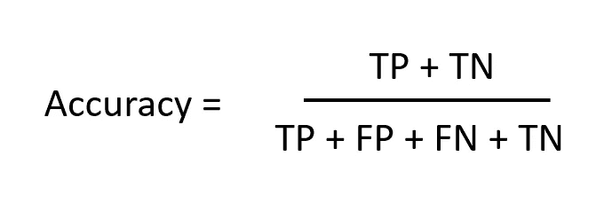
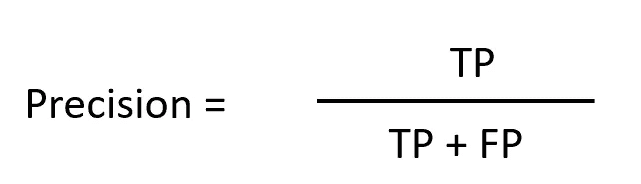
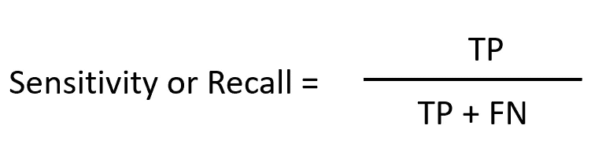
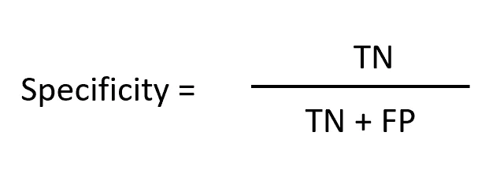

# 冠状病毒测试的准确性

> 原文：<https://towardsdatascience.com/accuracy-of-coronavirus-tests-6bc85f700c0e?source=collection_archive---------7----------------------->

## 你如何衡量冠状病毒测试的可靠性？

在我最近阅读的一篇文章中写道，

> “研究人员发现，在研究组的 167-3%的患者中，有 5 名患者进行了胸部 [CT 扫描](https://www.medicinenet.com/cat_scan/article.htm)特征提示新冠肺炎，通过 RT-PCR 初步检测为 [SARS](https://www.medicinenet.com/severe_acute_respiratory_syndrome_symptoms/symptoms.htm) -CoV-2 感染阴性。”—医药网

幸运的是，测试假阴性的患者被隔离，重复测试帮助他们确认他们患有新冠肺炎(新型冠状病毒感染)。那么假阴性是什么意思？医学研究人员如何衡量这些测试的准确性？

迪米特里·卡拉斯泰列夫在 [Unsplash](https://unsplash.com?utm_source=medium&utm_medium=referral) 上的照片

在科学领域，有几种方法可以评估测试的可靠性。一些最常见的指标被称为“准确度”、“精密度”、“灵敏度(召回)”和“特异性”。这些是优化测试可靠性的一些最常用的指标。在我们深入研究一个科学家如何衡量医学测试可靠性的虚构例子之前，让我们先了解一下混淆矩阵的基础知识。

# 混淆矩阵

混淆矩阵是一个表格，用于分类一个测试是否准确。这张桌子被分成四个格子——

1.  一项测试可以准确预测一个人是否患有冠状病毒(TP)
2.  一项测试可以准确预测这个人是否没有冠状病毒(TN)
3.  一项测试错误地预测一个人是否患有冠状病毒(FP)
4.  一项测试会错误地预测一个人是否没有冠状病毒(FN)。下面是一幅插图

# 让我们继续这个例子…

如果您有一个 1000 人的随机样本来测试您的冠状病毒测试的可靠性，并且 100 人(10%)患有冠状病毒，您希望优化什么指标？错误预测的代价是什么？这是所有医学研究者都必须经历的一些问题。随着这些测试变得越来越普遍，我相信了解这些测试是如何工作的是很重要的。越来越多的人将参加考试，我们将开始在新闻文章中看到错误的统计数据，所以我希望这篇文章可以帮助你更多地了解这些考试。

# 准确(性)

准确性将测试正确预测的所有人除以随机样本中的所有人。这听起来可能是一个很好的指标，但在不平衡的样本中，它可能不是一个很好的指标。例如，如果测试被打破，并预测每个人都没有冠状病毒。它仍然是 90%。

当随机样本有一个平衡组，而您试图预测的目标接近 50%时，此指标更适用。

简单来说，**正确答案在样本的所有人中，有多少人的测试显示了正确的结果。**

# 精确

精度将测试正确预测的所有人除以测试结果为阳性的所有人。当样本不平衡时，精确度比准确度更好。

**精确帮助你回答，在测试呈阳性的人中，有多少人实际上患有冠状病毒？**

# 敏感性又名回忆

敏感度和召回率是可以互换的，但这两个术语都是经常使用的，所以了解这两个术语是有好处的。敏感性往往伴随着特异性，而回忆则伴随着精确性。该指标将测试正确预测的所有人分为所有冠状病毒携带者。

**敏感性/回忆帮助你回答，在患有冠状病毒的人群中，有多少人检测呈阳性？**

问自己一个问题:你希望人们认为他们没有冠状病毒，而事实上，他们有吗？告诉一个冠状病毒携带者自己没有的代价是什么？

通常你不得不选择优化精确度或者召回率，因为当你增加一个的时候，通常会减少另一个。反之亦然。看看 Google 的这篇文章:[精准 vs 召回。](https://developers.google.com/machine-learning/crash-course/classification/precision-and-recall)还有其他衡量两种指标协调性的指标，如 F1 分数，但我不会在本文中赘述。

# 特征

特异性将测试正确预测为健康的所有人除以所有健康的人。

**特异性帮助您回答，您希望该测试在多大程度上正确预测一个人没有冠状病毒？**

问自己一个问题:你会因为一个错误的测试而隔离自己吗？

# **总结**

这些都是医疗决策者必须自问的重要问题。我不确定是否所有的医学测试都是完美的，所以如果你开始看到关于这些测试如何不正确工作的新闻。回头看看这篇文章，试着猜测医学研究者试图优化什么。如果我是一名医生，我会认为回忆是最重要的一项，即使我们必须以假阳性为代价来优化这一指标——假检测结果告诉一些健康人他们患有冠状病毒。此外，新闻文章将开始报道准确的数字。确保通过自己做一些研究来了解这些测试的可靠性。

希望你能带走一些有用的信息。

# 如果您有任何问题或反馈，请随时在下面留下您的问题或反馈，或者在 LinkedIn 上联系我。

中:[https://medium.com/@](https://medium.com/@kennykim.90)测试学习

领英:【https://www.linkedin.com/in/kennyk1m/ 

# 资源

 [## 冠状病毒检测准确吗？-医药网健康新闻

### 新型冠状病毒的新病例在全球范围内持续增加，截至 2014 年，全球已确诊 73，332 例新冠肺炎病例

www.medicinenet.com](https://www.medicinenet.com/script/main/art.asp?articlekey=228250)  [## 分类:精度和召回|机器学习速成班

### 预计时间:9 分钟精度试图回答以下问题:什么比例的积极…

developers.google.com](https://developers.google.com/machine-learning/crash-course/classification/precision-and-recall) 

***编者按:*** [*走向数据科学*](http://towardsdatascience.com/) *是一份以数据科学和机器学习研究为主的中型刊物。我们不是健康专家或流行病学家，本文的观点不应被解释为专业建议。想了解更多关于疫情冠状病毒的信息，可以点击* [*这里*](https://www.who.int/emergencies/diseases/novel-coronavirus-2019/situation-reports) *。*