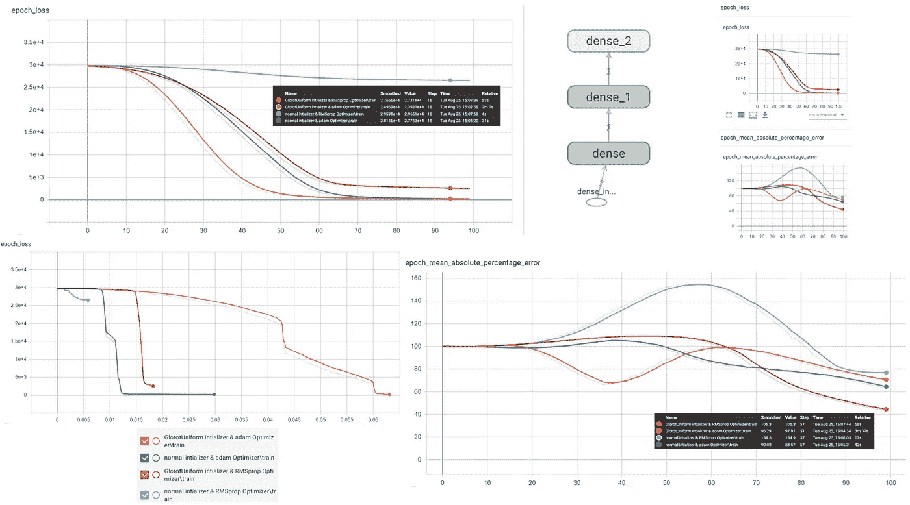
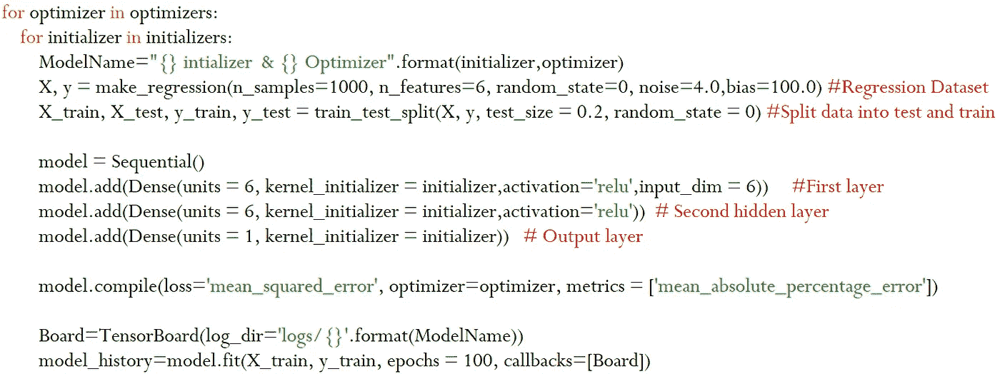
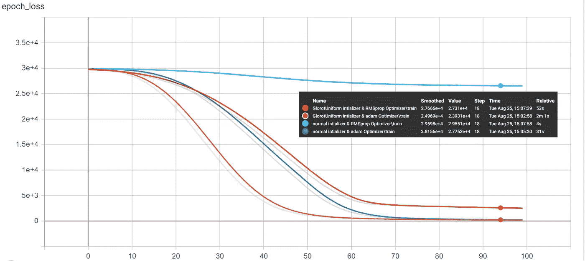
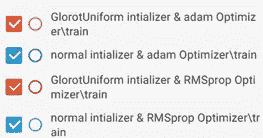
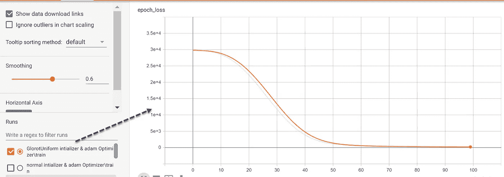
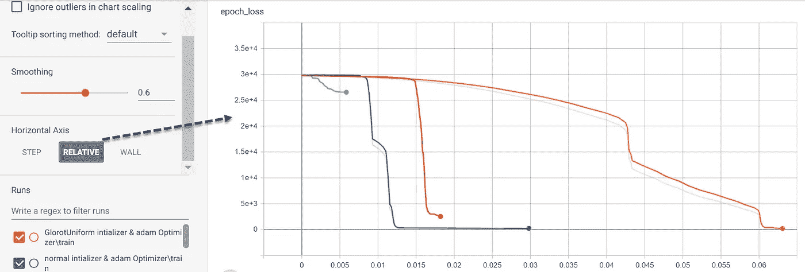

# 深度学习中的准确性可视化—第 1 部分

> 原文：<https://towardsdatascience.com/accuracy-visualisation-in-deep-learning-part-1-b42d32b07913?source=collection_archive---------52----------------------->

## [内部 AI](https://towardsdatascience.com/data-visualization/home)

## 张量板是最强大的开箱即用工具之一，可用于模型性能可视化和焦点优化调整。



深度学习模型性能可视化(文章中描述的代码的输出)

> “一个眼神胜过千言万语。”

我们都想以最优的方式训练深度学习模型，提高哪怕是预测精度的最后两位小数。我们在深度学习模型中有如此多的参数要调整，从优化器及其参数、激活函数、层数/过滤器等开始。找到所有这些参数的正确组合就像大海捞针。

幸运的是，我们可以利用超参数来调整模型的性能和准确性，但是我们需要对参数组合有一个广义的理解来尝试和测试。

Tensor board 是最强大的内置工具之一，可用于基于不同指标可视化单个模型的性能，也可用于不同模型之间的比较。它可以指导确定我们可以进一步尝试超参数调整的大概参数组合。

在这篇文章中，我将讨论深度学习模型可视化，结合优化器和简单回归的激活函数。它将使我们能够了解如何快速丢弃不合适的组合，并将我们的性能调优工作集中在几个潜在的参数上。

***第一步:*** 我们将使用**Scikit learn**make _ regression 方法生成一个用于回归测试的随机数据集，并使用 train_test_split 将数据集分成训练集和测试集。

```
from sklearn.datasets import make_regression
from sklearn.model_selection import train_test_split
```

***第二步:*** 在下面的代码中，我们导入了张量板和深度学习 Keras 包。我们将使用 Keras 建模和张量板可视化。

```
from tensorflow.keras.callbacks import TensorBoard
from keras.models import Sequential
from keras.layers import Dense
```

***第三步:*** 在本文中，我们将使用“adam”和“RMSprop”优化器，以及“GlorotUniform”和“normal”权重初始化器。我们在列表中提到了这些，并将按顺序调用组合来训练模型。

```
optimizers=["adam","RMSprop"] #Optimisers
initializers=["GlorotUniform","normal"] # Activation function
```

**第五步:**在下面的代码中，我们嵌套了 FOR 循环，用优化器和权重初始化器的不同组合来训练深度学习模型，并将结果记录在张量板中进行分析。

每个模型都用权重初始化器和优化器名称命名，以识别每个模型的结果和图形。

由于本文的主要目标是学习深度学习模型结果的可视化，因此我们将使用一个非常简单的模型，该模型具有一个输入、隐藏和输出层。

我们将使用均方误差作为所有模型的损失函数，并测量平均绝对百分比误差。如果你不知道这些统计指标，那么我建议你参考维基百科获得详细的解释。



**步骤 6:** 我们可以在代码执行后查看结果并进行分析。我们需要在 windows 中打开命令提示符或者在 mac 中打开终端来启动张量板。通过命令提示符/终端导航到保存日志的文件夹目录，然后键入以下命令。

```
tensorboard --logdir=logs/
```


它将实例化张量板，并显示我们需要在浏览器中输入的地址，以查看结果。


张量板登录页面

在当前示例中，我们可以通过在浏览器中键入 [http://localhost:6006/](http://localhost:6006/) 来访问张量板。

在一个合并图中，我们可以看到随着优化器和权重初始化器的不同组合的迭代次数的增加，均方误差的变化。



不同模型的每个时期的损失值

它指示不适合当前数据集和建模的优化器和权重初始化器。在当前示例中,“RMSprop”和“normal”优化器组合的均方损失下降速度比其他组合慢。基于这种来自观想的知识，我们可以集中精力微调剩余的组合，通过不调整在广泛层面上表现不好的组合来节省时间。

同样，随着迭代次数的增加，我们可以查看不同组合的平均绝对百分比误差的变化。


不同模型的每个历元的平均绝对百分比误差值



基于型号名称的过滤器选项

我们还可以使用过滤器来查看一个或多个模型组合的图表。

给模型起一个有意义的名字是很重要的，因为它有助于正确放置过滤器，避免分析过程中的混淆。在当前示例中，权重初始化器和优化器的组合是模型的名称。



为一个模型过滤的每个历元的损失值

我们也可以下载图形，损失函数数据分别为 SVG 和 CSV 格式。CSV 格式的损失函数数据使我们能够使用 excel 快速执行高级分析。


下载图表和数据的选项

除了根据时代进展可视化结果之外，我们还可以通过单击鼠标来查看模型的相对性能。



每个时期的损失值相对比较

在本文中，我们已经学习了张量板的基础知识，并看到了一些可视化选项，可用于在瞬间掌握不同模型的更好的细节。我们还看到了我们可以使用张量板可视化来专注于微调潜在模型的方式。在下一篇文章中，我们将看到一些深度学习模型的高级可视化。

如果你想学习可视化的探索性数据分析(EDA)，请阅读文章 [5 探索性数据分析(EDA)的高级可视化](/5-advanced-visualisation-for-exploratory-data-analysis-eda-c8eafeb0b8cb)

如果你像我一样是熊猫的忠实粉丝，那么你会发现文章 [5 熊猫数据预处理的强大可视化](/5-powerful-visualisation-with-pandas-for-data-preprocessing-bbf6a2033efd)读起来很有趣。