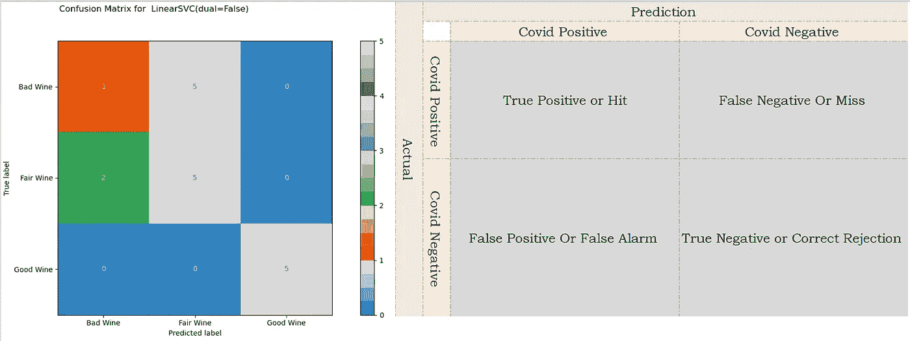
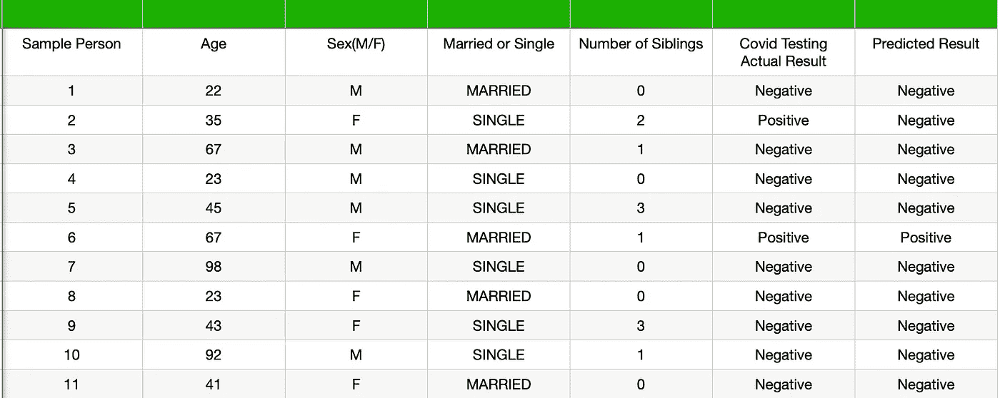
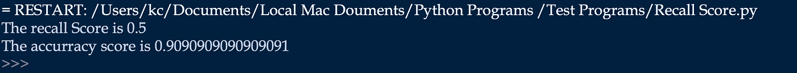
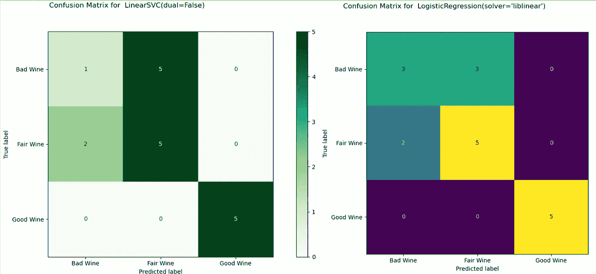

# 准确性可视化:监督机器学习分类算法

> 原文：<https://towardsdatascience.com/accuracy-visualisation-supervised-machine-learning-classification-algorithms-af13d18fcc6c?source=collection_archive---------39----------------------->

## [内部 AI](https://towardsdatascience.com/data-visualization/home)

## 分类算法结果的可视化报告提供了错误分类和准确度估计的快照。更快地解释和规避一般的准确性分数陷阱。



测量任何回归或分类算法的预测准确性在建模期间的不同阶段都至关重要，当模型在生产中运行时也是如此。

我们有几种方法来衡量分类算法的准确性。在***Scikit*-*learn***包中，我们有几个评分，比如召回评分，准确率评分等等。然后我们有现成的总结报告。在我看来，这些指标中的大多数都有一个或多个与冗长相关的限制，难以理解，在数据集中的不平衡类别的情况下，有可能误解准确性，需要引用少量分数来获得整体视图等。

为了更好地理解这种限制，让我们考虑一下表中所示的例子。我们几乎没有与样本人群以及他们是否为 COVID 阳性相关的参数。因为我们有更多的人是 COVID 阴性，而不是病毒感染者，因此，我在这个例子中考虑了类似的分布。



用于解释的假想样本数据

在此数据集上训练的分类算法预测了最后一列中所示的结果。分类模型的准确率接近 90%。它给我们的印象是，该模型在预测结果方面相当不错。

```
from sklearn.metrics import recall_score
from sklearn.metrics import classification_report
from sklearn.metrics import accuracy_score# 0- Healthy , 1-  Covidy_true = [0, 1, 0,0,0, 1,0,0,0,0,0]
y_pred = [0, 0, 0,0,0, 1,0,0,0,0,0]print("The recall Score is" , recall_score(y_true, y_pred))
print("The accurracy score is" , accuracy_score(y_true, y_pred))
```

实际上，该模型预测 COVID 阳性病例的概率只有 50%。仅基于一个度量或者在不了解分类模型出错的领域的情况下部署这样的模型可能是非常昂贵的。



在考虑了召回率和准确率以及业务用例之后，我们可以充分理解适合生产使用的模型。

像混淆矩阵这样的视觉指标在几个方面胜过其他指标。我们可以即时了解模型在分类方面的性能，以及模型的优势和需要微调的方面。基于业务用例，我们可以从假阳性、假阴性、真阳性和真阴性计数中快速判断模型是否准备好进行部署。

让我们学习用混淆矩阵来形象化和解释线性回归和逻辑回归的结果。

*步骤 1:* 我们将使用本文中的 **Scikit** - **learn** 内置数据集 WINE 进行讨论，使用 Matplotlib 进行可视化。在下面的代码中，我们导入了将在程序中使用的模块。

```
from sklearn.datasets import load_wine
from sklearn.model_selection import train_test_split
from sklearn.preprocessing import StandardScaler 
from sklearn.linear_model import LogisticRegression
from sklearn.svm import LinearSVC
import matplotlib.pyplot as plt
from sklearn.metrics import plot_confusion_matrix
```

*第二步:*将葡萄酒数据集中的特征(属性)分为自变量和因变量。自变量(输入特征)用“X”表示，因变量用“y”表示。使用 train_test_split 方法分为训练集和测试集。

```
X,y = load_wine(return_X_y=True)X_train, X_test, y_train, y_test = train_test_split(X, y, test_size=0.10,random_state=0)
```

*第三步:*sklearn 中的大多数监督算法需要以零为中心的标准正态分布输入数据，并且具有相同数量级的方差。由于葡萄酒数据集中的独立变量值具有不同的比例，因此我们需要在建模之前对其进行缩放。

如果你想了解更多关于***Scikit*-*Learn***包中自变量和不同定标器的定标，那么请参考我的文章[Feature Scaling-Effect Of Dive Dive Dive Dive](/feature-scaling-effect-of-different-scikit-learn-scalers-deep-dive-8dec775d4946)。

```
SC_X=StandardScaler()
X_train_Scaled=SC_X.fit_transform(X_train)
X_test=Scaled=SC_X.transform(X_test)
```

*第 4 步:*在下面的代码中，定义了一个带有参数的分类器列表

```
classifiers=[ LinearSVC(dual=False),LogisticRegression(solver="liblinear",max_iter=100)]
```

*第五步:*用每个分类器依次训练模型，根据训练集中实际和预测的因变量值绘制混淆矩阵。

```
for clf in classifiers:
    clf.fit(X_train, y_train)
    y_pred = clf.predict(X_test)
    fig=plot_confusion_matrix(clf, X_test, y_test, display_labels=["Bad Wine","Fair Wine","Good Wine"])
    fig.figure_.suptitle("Confusion Matrix for  " + str(clf))
    plt.show()
```

乍一看，我们可以看到，与逻辑回归相比，线性 SVC 中从左上角到右下角对角线的数字总和更高。这立即表明线性 SVC 在识别真正的阳性记录方面表现得更好。



基于文中讨论的代码的混淆矩阵

不同的度量分数可以指示准确性，但是使用混淆矩阵，我们可以立即看到算法错误分类的类别。在当前的例子中，两个分类器都没有准确地对大多数劣质酒进行分类。这种详细程度的信息有助于执行模型的焦点微调。

我们已经看到，混淆矩阵以一种清晰的方式提供了关于不同类别的分类模型预测模式的更好的细节。在单个混淆矩阵中，我们可以获得假警报(假阳性)和正确拒绝率等细节，并根据业务案例决定模型是否可接受。