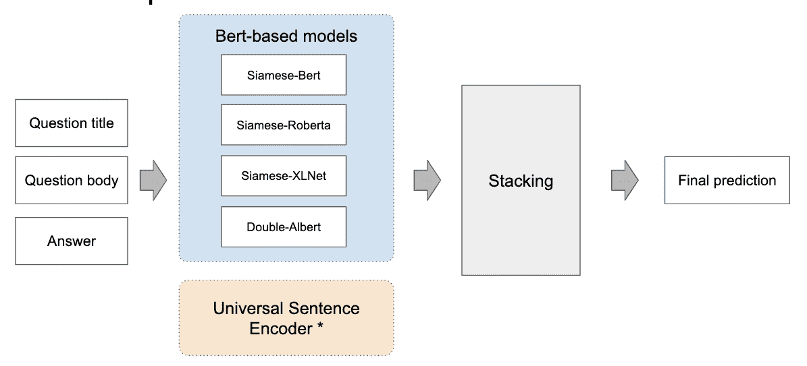
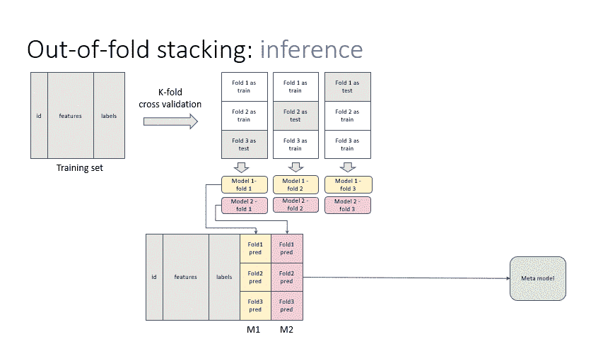

# 使用 BERT 精确标注主观问答内容

> 原文：<https://towardsdatascience.com/accurately-labeling-subjective-question-answer-content-using-bert-bffe7c6e7c4?source=collection_archive---------38----------------------->

## 关于 Kaggle 问答理解竞赛第六名解决方案的 NLP 教程

来源:https://www.kaggle.com/c/google-quest-challenge/overview

# 介绍

Kaggle 在 2020 年初发布了 [Q & A 理解比赛](https://www.kaggle.com/c/google-quest-challenge/overview)。该竞赛要求每个团队构建 NLP 模型来预测问题和答案对的主观评分。我们在所有 1571 支队伍中名列第六。除了在 Kaggle 上发布的[获胜解决方案博客](https://www.kaggle.com/c/google-quest-challenge/discussion/130243)之外，我们还写了这个更适合初学者的教程来介绍比赛以及我们是如何赢得金牌的。我们也在[这个](https://github.com/robinniesert/kaggle-google-quest) Github 仓库中开源我们的代码。你也可以在我的[博客](https://www.sun-analytics.nl/posts/2020-08-04-accurately-labeling-subjective-question-answer-content-using-bert/)里找到这篇文章。

# 数据

比赛从 70 个栈溢出式网站收集问题和答案对，问题标题，正文和答案作为文本特征，还有一些其他特征，如 url，用户 id。目标标签是 30 个维度，值在 0 到 1 之间，用于评估问题和回答，如问题是否重要，回答是否有帮助等。评分者接受的指导和培训很少，目标很大程度上依赖于他们的主观解释。换句话说，目标分数只是来自评分者的常识。目标变量是对多个评价人的分类进行平均的结果。也就是说，如果有四个评定者，一个将其归类为正面，另三个归类为负面，则目标值将为 0.25。

下面是这个问题的一个例子

*   **问题标题** : *用伸缩管代替微距镜头，我损失了什么？*
*   **问题正文** : *在玩了便宜的微距摄影之后(阅读:反转镜头，安装在直镜头上的反转镜头，被动伸缩管)，我想进一步了解这一点。关于……的问题*
*   **回答** : *我刚买了延长管，所以瘦子来了。…使用试管时，我失去了什么…？相当多的光！增加镜头末端到传感器的距离……*

训练集和测试集分布如下

# 评估指标

[本次比赛采用斯皮尔曼等级相关系数](https://en.wikipedia.org/wiki/Spearman%27s_rank_correlation_coefficient)作为评价指标。

直观上，皮尔逊相关是 X 和 Y 的线性相关的度量，对于斯皮尔曼的秩相关，我们不使用 X 和 Y 的值，而是在公式中使用 X 和 Y 的秩。它是 X 和 y 之间单调关系的度量。如图所示，图表中给出的数据，pearson 为 0.88，spearman 为 1。

为什么这次 kaggle 比赛要用 spearman？考虑到标签的主观和噪声性质，Spearman 相关往往对异常值更稳健，例如 pearson 相关。还因为目标值是基于评分者常识的问答理解。假设我们有 3 个答案，我们评估这些答案是否写得很好。答案 A 得分 0.5，答案 B 得分 0.2，答案 C 得分 0.1，如果我们宣称答案 A 比答案 B 好 0.3，有意义吗？不完全是。在这里，我们不需要精确的值差。知道 A 优于 B and B 优于 c 就足够了

来源:[https://en . Wikipedia . org/wiki/Spearman % 27s _ rank _ correlation _ coefficient](https://en.wikipedia.org/wiki/Spearman%27s_rank_correlation_coefficient)

# NLP 管道

(*图片作者*)

一般的 NLP 管道如上图所示。典型的非基于神经网络的解决方案可能是:

*   使用 TF-IDF 或单词嵌入来获得基于令牌的向量表示
*   将标记向量平均为获取文档向量表示
*   使用随机森林或 lightGBM 作为分类器或回归器

由于 2017 年和 2018 年 transformer 和 BERT 的出现，NLP 一直在经历一个“ImageNet”时刻。BERT 已经成为 NLP 竞赛的主要算法。在这个博客中，我们不介绍伯特。这里有[这里有](https://jalammar.github.io/illustrated-transformer/)，这里有[这里有](http://jalammar.github.io/illustrated-bert/)，这里有[这里有](http://mccormickml.com/2019/07/22/BERT-fine-tuning/)等几个不错的教程。

现在，我们可以使用 BERT 来重构 NLP 管道:

*   使用 BERT 单词块标记器生成(子)单词标记
*   从 BERT 生成每个令牌的嵌入向量
*   通过神经网络池层对令牌向量进行平均
*   使用前馈层作为分类器或回归器

# 金牌解决方案

## 整体情况

如下图所示，我们使用四个基于 BERT 的模型和一个通用句子编码器模型作为基础模型，然后将它们堆叠起来生成最终结果。在这篇博客的剩余部分，我们将只关注 transformer/BERT 模型。关于通用语句编码器的更多信息，可以访问原文[这里](https://static.googleusercontent.com/media/research.google.com/en//pubs/archive/46808.pdf)，代码可从[这里](https://www.kaggle.com/aerdem4/qa-use-save-model-weights)获得。

(*图片作者*)

## 基于 BERT 模型的体系结构

下面的动画展示了一个基本模型的工作原理。这里的代码是[这里是](https://github.com/robinniesert/kaggle-google-quest/tree/master/models)。

1.  问题标题和问题正文连接在一起作为输入。使用 BERT 记号化器得到子词，然后生成 BERT 嵌入。接着是平均池层，我们得到每个问题标题和正文对的向量表示。注意，我们对非屏蔽令牌的令牌嵌入进行了平均。这是我们与普通方法不同的地方，在交叉验证方面做了一点改进。附加其他分类或数字要素，然后通过格鲁激活和缺失与线性图层连接。
2.  类似地，我们有一个镜像结构，问题标题和答案对作为输入。我们有两个选择。如果镜像 BERT 模型可以分担第一个 BERT 模型的权重，我们称之为“连体”结构。它也可以使用单独的重量，那么我们称之为“双”结构。连体结构通常具有更少的参数和更好的泛化能力。我们对连体和双结构进行了实验，并根据交叉验证分数选择了最佳的 N 基模型。
3.  上述两种结构的输出被连接，并连接到前向层，以获得 30 维目标值的预测。

[Huggingface](https://huggingface.co/models) 打包了大多数最新的 NLP 模型 Pytorch 实现。在我们的解决方案中，选择了 4 个由 Huggingface 实现的基于 BERT 的模型。分别是暹罗[罗伯塔](https://huggingface.co/transformers/model_doc/roberta.html)基地，暹罗 [XLNet](https://huggingface.co/transformers/model_doc/xlnet.html) 基地，双[阿尔伯特](https://huggingface.co/transformers/model_doc/albert.html)基地 V2，暹罗[伯特](https://huggingface.co/transformers/model_doc/bert.html)基地 uncased。

(*图片作者*)

## 培训和实验设置

我们有两个阶段的训练。阶段 1 是端到端的参数调优，阶段 2 只调“头”。

在第一阶段:

*   用 huggingface AdamW optimiser 训练 4 个时代。这里的代码是[这里的](https://github.com/robinniesert/kaggle-google-quest/blob/master/train.py)
*   二元交叉熵损失。
*   单周期 LR 计划。使用余弦预热，然后是余弦衰减，同时具有动量的镜像时间表(即余弦衰减后是余弦预热)。这里的代码是[这里的](https://github.com/robinniesert/kaggle-google-quest/blob/master/one_cycle.py)
*   回归头的最大 LR 为 1e-3，变压器主干的最大 LR 为 1e-5。
*   累计批量为 8

在第二阶段:

*   冻结变压器主干，并以 1e-5 的恒定 LR 微调回归头额外 5 个周期。这里的代码是[这里的](https://github.com/robinniesert/kaggle-google-quest/blob/master/finetune.py)
*   大多数型号的 CV 增加了约 0.002。

## 堆垛

堆叠是卡格勒人“事实上”的集体策略。下面的动画演示了训练和预测过程。示例中有 3 个折叠。为了获得每个折叠的元训练数据，我们对 2 个折叠进行迭代训练，并对剩余的折叠进行预测。并且整个非折叠预测被用作特征。然后，我们训练堆叠模型。

在预测阶段，我们将测试数据输入到所有非折叠基础模型中以获得预测。然后，我们对结果进行平均，传递到堆叠模型以获得最终预测。

(*图片作者*)

(*图片作者*)

# 其他技巧

## 分组文件夹

让我们先来看看为什么普通的 KFold split 在这个比赛中效果不好。在数据集中，一些样本是从一个问答线程中收集的，这意味着多个样本共享相同的问题标题和正文，但答案不同。

如果我们使用正常的 KFold split 函数，对相同问题的回答将分布在训练集和测试集中。这会带来一个信息泄露的问题。更好的拆分是将同一问题的所有问题/答案对放在一起，放在训练集或测试集中。

幸运的是，sk-learn 已经提供了一个函数 [GroupKFold](https://scikit-learn.org/stable/modules/generated/sklearn.model_selection.GroupKFold.html) 来生成不重叠的组进行交叉验证。问题体字段是用来表示分组的，如下面的代码。

## 后处理

正如许多其他团队所做的那样，一个后处理步骤对性能有着巨大的影响。总的想法是基于向下舍入预测到某个分数 1/d 的倍数。

因此，如果 d=4，x = [0.12，0.3，0.31，0.24，0.7]，这些值将被舍入为[0.0，0.25，0.25，0.0，0.5]。对于每个目标列，我们在[4，8，16，32，64，None]中对 d 值进行网格搜索。

在我们的集合中，我们进一步开发了这种技术，首先对单个模型预测应用舍入，然后再对模型预测进行线性组合。在这样做的过程中，我们确实发现，对每个模型使用单独的舍入参数，超出倍数的分数提高将不再转化为排行榜。我们通过在所有模型中使用相同的 d_local 来减少舍入参数的数量，从而解决了这一问题:

所有集合参数(2 个舍入参数和模型权重)都是使用小网格搜索设置的，该搜索优化了出折叠的 spearman 等级相关系数度量，同时忽略了具有重复问题的行的问题目标。最终，这种后处理将我们的 10 倍组折叠 CV 提高了约 0.05。

**孙喆，罗宾·尼塞特，艾哈迈德·艾尔丹姆和覃晶**