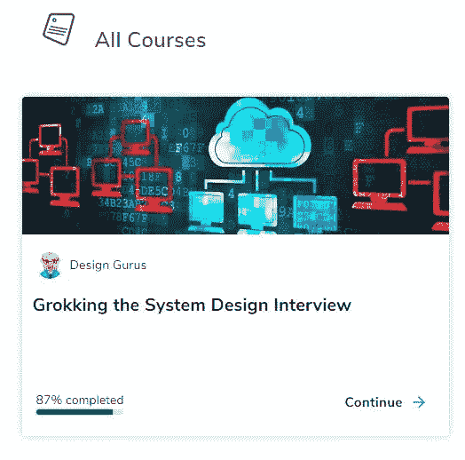

# ace FAANG 系统设计面试

> 原文：<https://towardsdatascience.com/ace-system-design-interview-in-faang-d9e479e25bf0?source=collection_archive---------13----------------------->

艾萨克·史密斯在 [Unsplash](https://unsplash.com?utm_source=medium&utm_medium=referral) 上拍摄的照片

(这个帖子也在[我的博客](https://kylelix7.github.io/)里)

如今，系统设计在技术面试中很常见。如果编码面试验证编码的能力，那么系统设计面试验证构建的能力。它验证候选人是否能够构建一个能够大规模运行和容错的系统。有很多很棒的资源，比如[探索系统设计](https://www.educative.io/courses/grokking-the-system-design-interview?aff=VEzk)或[设计数据密集型应用](https://amzn.to/3w3KfLK)，它们为您提供了关于系统设计最佳实践的很棒的例子和细节。但是在我与许多人交谈后，我感觉他们中的许多人倾向于记住每个例子的答案。因此，我发现写下这些经验法则的总结对你在真正的面试中做出反应是至关重要的。以下是我的总结。

# 隐藏物

缓存解决什么问题？

对硬盘等永久性存储设备的访问速度很慢。在需要频繁读取数据库或文件的应用中，性能瓶颈通常来自于对磁盘的访问速度。因此，我们倾向于将频繁访问的数据添加到内存中，因为访问内存要快得多。

有什么限制？

1.  内存通常不足以容纳整个数据集。因此，应用程序开发人员需要有选择地将数据子集保存在缓存中
2.  如果失去动力，记忆也就失去了

什么时候不应该使用缓存？

如果数据写入量很大，不要使用它，因为如果您需要一致的结果，缓存将在每次写入操作中失效。这使得性能更差？

# 批量写入

如果应用程序写得太多会怎么样？

我们知道如何减少在应用程序和永久存储之间添加缓存的读取。对于写入，我们可以批处理写入操作，并且一次性完成。例如，我们可以跟踪内存中的所有写操作，并在发生 100 次写操作时应用它们。

代价是读数不会一致。紧随写操作之后的读操作可能无法获得最新更新。

# 分片

什么是碎片？

它本质上是将数据分成不同的分区。这有助于跨不同机器扩展数据库，以提高可伸缩性、性能、可用性等。

# 可用性/冗余

在设计系统时，通常会复制每个组件，如应用服务器、数据库等。这确保了没有单点故障。它通过增加冗余大大提高了可用性。

# 负载平衡器

我们引入冗余组件来避免单点故障。同时，多台机器可以分担请求的负载。我们应该如何将请求分发到不同的服务器？这是负载平衡器的职责。它通常位于客户机和服务器之间。它将请求从客户端路由到服务器，以确保所有服务器都有相同的负载量。负载均衡器中可以使用很多算法，如循环法、最少连接法、最少响应时间法等。

# SQL 与 NoSQL

SQL 和 NoSQL 数据库在数据存储方式上有很大不同。在 SQL 中，数据模型是关系型的，这意味着所有行都有相同的列/属性。而 NoSQL 有非常灵活的模式。每个文档可以有不同的属性。

关于一致性还有一个很大的区别。SQL 支持强一致性。这意味着所有数据库节点同时拥有相同的数据副本，而 NoSQL 大多支持最终一致性。这意味着对数据库节点的写入是异步的。它不能保证所有节点在给定时间都有相同的数据。但最终，所有节点都将进行所有写入更新。这也使得 NoSQL 在许多情况下更加高效。

在 [Grokking 系统设计](https://www.educative.io/courses/grokking-the-system-design-interview?aff=VEzk)中有更深入的细节 SQL vs. NoSQL 和 CAP 定理。

最后，我希望这个总结可以帮助你在面试和工作中获得建立系统的想法。

以前的帖子:

[Ace 系统设计 FAANG 面试](/ace-system-design-interview-in-faang-d9e479e25bf0?source=your_stories_page---------------------------)

[我如何选择了 6 个月的代码并获得了 FAANG offer](/how-i-leetcode-for-6-months-and-land-a-job-at-amazon-b76bdfc79abb?source=your_stories_page---------------------------)

[这些都是帮我找到方工作的资源](/these-are-all-the-resources-that-help-me-land-a-fang-job-452341dd6bed?source=your_stories_page---------------------------)

[通过系统设计面试的步骤](/steps-to-ace-the-system-design-interview-1908ffb77b9b?source=your_stories_page---------------------------)

[系统设计面试:如何设计一个系统来处理长时间运行的作业](https://blog.usejournal.com/system-design-interview-prep-how-to-handle-long-running-job-asynchronously-with-long-polling-34d8b2a890e1)

[Ace FAANG 系统设计面试:数据库、NoSQL、SQL](/sql-relational-database-or-nosql-ace-the-faang-system-design-interview-2d17439ecb3b?source=your_stories_page---------------------------)

[系统设计面试准备:缓存](/system-design-interview-prep-should-you-put-the-data-in-cache-56936697ee54)

[我关于金融和科技的帖子](https://medium.com/@fin.techology/my-posts-about-finance-and-tech-7b7e6b2e57f4?source=your_stories_page---------------------------)

[从 CRUD web 应用开发到语音助手中的 SDE——我正在进行的机器学习之旅](https://medium.com/@fin.techology/from-crud-app-dev-to-sde-in-voice-assistant-my-ongoing-journey-to-ml-4ea11ec4966e?)

[全栈开发教程:将 AWS Lambda 无服务器服务集成到 Angular SPA 中](/full-stack-development-tutorial-integrate-aws-lambda-serverless-service-into-angular-spa-abb70bcf417f)

[全栈开发教程:用运行在 AWS Lambda 上的无服务器 REST API 提供交易数据](/full-stack-development-tutorial-serverless-rest-api-running-on-aws-lambda-a9a501f54405)

[全栈开发教程:在 Angular SPA 上可视化交易数据](/full-stack-development-tutorial-visualize-trading-data-on-angular-spa-7ec2a5749a38)

[强化学习:Q 学习简介](https://medium.com/@kyle.jinhai.li/reinforcement-learning-introduction-to-q-learning-444c951e292c)