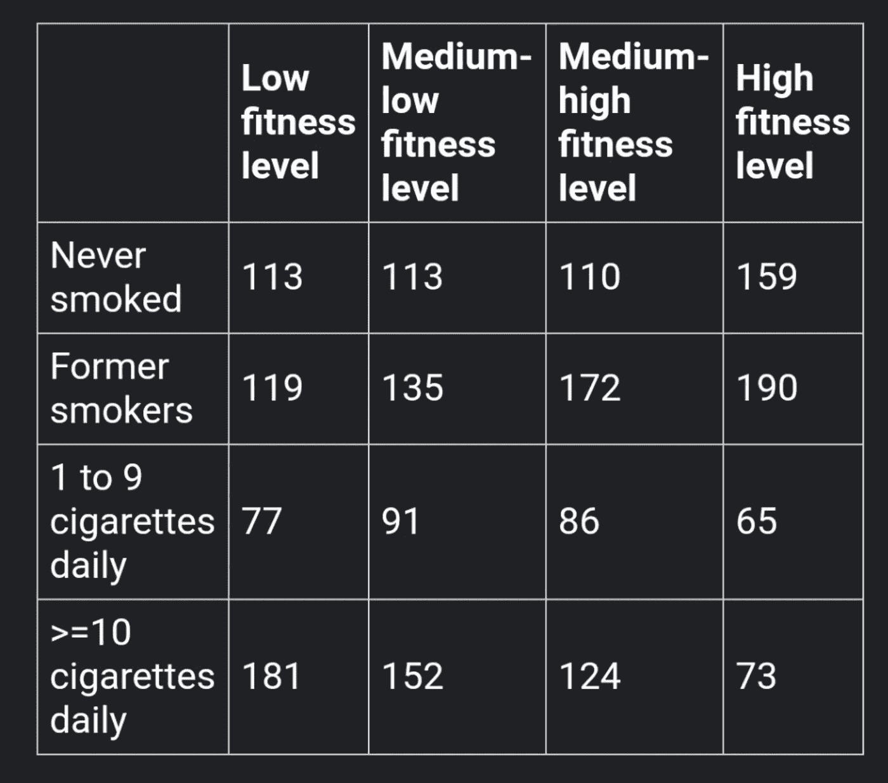

# 面试高手:卡方检验

> 原文：<https://towardsdatascience.com/ace-the-interview-the-chi-squared-test-e6d37f681ea4?source=collection_archive---------31----------------------->

## 这个技术面试问题不会再难倒你了。

阿格尼耶斯卡·科瓦尔茨克在 [Unsplash](https://unsplash.com/s/photos/star-wars?utm_source=unsplash&utm_medium=referral&utm_content=creditCopyText) 上拍摄的照片

这一切都是在我练习技术面试题的时候开始的。我作为数据科学硕士学生的第一个学期结束了，带着甜蜜的宽慰，我参加了一个简短的(但值得尊敬的)网飞·本德，然后转入技术面试准备。我很自信。甚至自大。就像刚刚拯救了银河系还很酷的韩·索罗。

GIPHY 的 Gif

哦，那种骄傲自大很快就要消失了。

# **吸气≤≥排汗**💦

*技术面试官:“给定所附数据表，确定健身水平和吸烟习惯之间是否存在关系。”*

来源:[资料面试问题](https://www.interviewqs.com/)(推荐免费简讯)

**我的大脑:***蟋蟀*

当我通过我的分段统计知识寻找答案时，我的心怦怦直跳。回归还是分散？*但是轴心是什么呢？*逻辑回归涉及分类变量… *但这也没有意义。*

也就没有分散，因为*我*就是*那个分散注意力的人。我新获得的自信开始融化得比沥青上的冰淇淋甜筒还快。*

我可能在举手之前盯着这个问题看了 20 分钟，所以如果你放弃(或以某种方式回答)得比这个快，那就恭喜你了。如果这是一个真正的技术面试，我知道我会面对种植硬核。现在让我们来讨论一下这个问题的答案，以防你看了之后和我一样被难倒。

# **“正确”的方法**

> Pearson 的卡方检验用于确定来自单一总体的两个分类变量之间是否存在显著关联。

这是其中一次，如果你不知道具体的测试使用，强硬的饼干，我只是不知道用什么，因为没有班级(还)教过我。

事实证明，当你有两个分类变量时，假设检验实际上也很容易——或者我应该说 *chi* (请原谅这个糟糕的双关语)。**皮尔逊卡方检验用于确定来自单一人群的两个分类变量之间是否存在显著关联。**

要查看这两个分类值是否相互关联，我们所要做的就是使用这个单一测试。有了这些知识，让我们再回到这张图:

来源:[资料面试问题](https://www.interviewqs.com/)

# 分析

根据该图，我们可以看到分类变量是 **(1)吸烟水平和(2)健康水平。**我们将使用皮尔逊卡方检验来确定它们之间是否存在显著的关联。像往常一样，我们首先制定一个无效和替代假设，并设置我们的显著性水平:

**(1)假设**

*   **卡方下为空-** 这两个变量相互独立。
*   **卡方下的替代-** 这两个变量是*而不是*相互独立的。

**(2)显著性水平**

*   **α = 0.05** (业界蛮标准的；0.01 或 0.1 也是常见的取值)。

如果 p 值*小于*0.05，我们将拒绝零假设，支持替代方案(吸烟和健康水平显著相关)。如果 p 值大于 0.05，基于我们的分析结果，我们将无法拒绝零(吸烟不影响健康水平，反之亦然)。

**(3) R 代码**

# **结果**

在 0.05 的标准显著性水平下，我们发现 p 值非常显著(在 R 中给出为 6.339e-11，在人类语言中翻译为. 00000000006339)。基于此，我们可以*拒绝空的*而支持另一种选择——在这种情况下，健康水平和吸烟*似乎确实相关。*

*就这样，面试问题被 a 了。*

GIPHY 的 Gif

最后，如果你想更深入地探究卡方的数学解释，我发现这些网站([这里](https://www.statisticshowto.com/probability-and-statistics/chi-square/)和[这里](https://stattrek.com/chi-square-test/independence.aspx))非常有帮助。

# **结论**

非常感谢你今天阅读了我这篇以星球大战为主题的小文章。如果你目前也在数据科学求职的广泛过程中导航，如果你最近找到了你的梦想工作，或者如果你只是所有数据驱动的事物的偶然观察者，请让我知道。

(如果你是一名人力资源经理，想招聘一名年轻、机智的初级数据科学家，你可以在作者简历中找到我的 LinkedIn😉)

 [## 阅读这本书，抓住你的第一份数据科学工作

### 这本书里的 5 个技巧改变了我研究数据科学的方式，并启发了我成为一名中型作家的旅程。

towardsdatascience.com](/read-this-book-to-snag-your-first-data-science-job-553fd301d00a)  [## 我是如何进入 12 个数据科学硕士项目的

### SOP，统计数据，所有的东西。

towardsdatascience.com](/how-i-got-into-12-data-science-masters-1eeddae21ba7) 

## **参考文献**

[1]资料面试问题:【https://www.interviewqs.com/?ref=ddi_email 

[2]R 中独立性的卡方检验:[http://www . sth da . com/English/wiki/Chi-Square-Test-of-independency-in-R # compute-Chi-Square-Test-in-R](http://www.sthda.com/english/wiki/chi-square-test-of-independence-in-r#compute-chi-square-test-in-r)

[3] R data.table 文档:[https://cran . R-project . org/web/packages/data . table/vignettes/datatable-intro . html](https://cran.r-project.org/web/packages/data.table/vignettes/datatable-intro.html)

[4]独立性卡方检验:[http://www . r-tutor . com/elementary-statistics/good-fit/卡方检验-独立性](http://www.r-tutor.com/elementary-statistics/goodness-fit/chi-squared-test-independence)

[5]卡方统计:如何计算/分布:[https://www . statisticshowto . com/probability-and-statistics/卡方/](https://www.statisticshowto.com/probability-and-statistics/chi-square/)