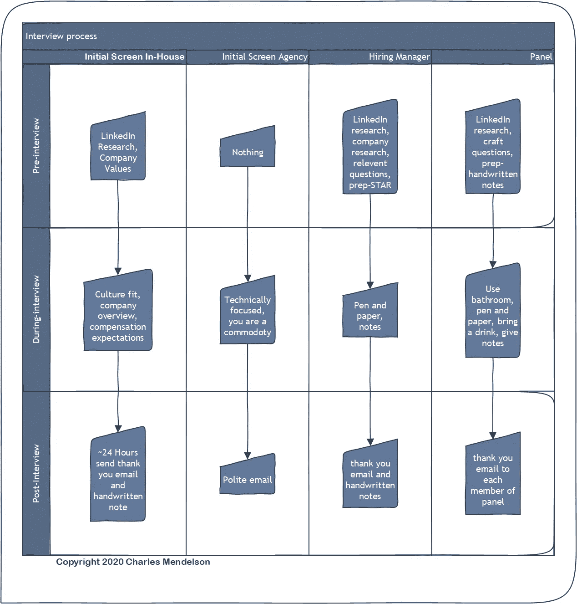

# 赢得数据科学工作面试

> 原文：<https://towardsdatascience.com/ace-your-data-science-job-interview-50be866c95df?source=collection_archive---------34----------------------->

## 获得下一份数据科学工作的社会工程技巧

蒂姆·高在 [Unsplash](https://unsplash.com/s/photos/job-interview?utm_source=unsplash&utm_medium=referral&utm_content=creditCopyText) 上拍摄的照片

# **TLDR:**

让自己值得信任，以故事的形式回答问题，发一封感谢信，在 LinkedIn 上调查你的面试官。

# **简介**

大多数人认为工作面试的目的是展示你有多棒…这是不正确的；求职面试的目的是展示你有多值得信任。我们可以用进化心理学的视角来理解这一点。在祖先的条件下，评估一个陌生人有多值得信任远比他们有多能干重要。如果我们考虑一下面试过程，基于有限的互动次数和相当有限的信息，他们正试图决定是否要每周花 40 多个小时与你一起工作。建立信任远比展示能力更有价值。

大多数分析师、数据科学家和其他专业技术人员花时间培养他们的硬技能。本文假设你的硬技能对于你要面试的职位来说已经足够了，因此将重点放在与工作面试相关的软技能上。

工作面试是一项技能，就像所有的技能一样，你会通过练习变得更好，如果你最近没有做，就会萎缩。如果你准备好转换角色，我建议你去申请那些你真的不想要，但可能会让你去面试的工作，只是为了在真实的面试环境中练习。在面试一份你真正想要的工作之前，你需要理清头绪。

# **典型面试流程概述:**

虽然具体情况因雇主而异，但我的经验是，大多数地方都遵循一个总体结构来进行面试。

1.第一阶段是电话面试，通常是和招聘人员一起。

2.第二阶段是与招聘经理的面试。

3.第三轮是涉及更多利益相关者的小组访谈。

有时第三轮会持续几天，有时你必须和招聘经理进行两次电话面试，有时没有第三轮。这篇文章中的建议仍然适用。

## **整个过程中会用到的战术:**

用故事的形式回答问题。想出 4-5 个关于你做过的项目或工作的故事，并在 STAR 框架中概括出来。

*   情境:简要地为你的故事搭建舞台
*   任务:你试图解决的具体问题是什么？
*   行动:描述你是如何解决问题的
*   结果:讨论您的解决方案产生的影响。

这是我回答“你最大的优点是什么？”这个问题的真实例子

> “由于我的 excel 技能和使用 excel 处理大量数据源的能力，我被聘用到了现在的职位。不幸的是，我需要处理的数据量超出了 Excel 的技术限制。我问公司的其他分析师我应该看什么工具，其中一个推荐 Python。当我开始这项工作时，我不知道如何编程，但在 3 个月内，我已经开始自动化我自己工作流程的大部分，一个月后，我构建了一个应用程序，自动化了一个业务功能，每月需要大约 10 个小时的手动工作。”

## **分解那个故事:**

*   情境:我是一个新角色，受雇使用一项特定的技术。
*   任务:我需要综合数据，但技术不适合这项任务。
*   行动:我学到了一项新技术。
*   结果:在很短的时间内，我向公司交付了一个有价值的自动化产品。

我的问题的答案实际上是我适应能力强，学得快，但这个故事更生动地证明了这一点。

## **领英研究:**

在你面试之前，在 LinkedIn 上找一个你正在面试的人，看看你们是否有任何共同点。也许你们去了同一所学校，或者看看你们是否志愿参加类似的组织。如果他们写了文章或博客并阅读了它们。看看他们分享的内容，了解他们是谁。不要在面试中明确提及他们的 LinkedIn 个人资料，而是将这些信息作为一个镜头来聚焦你的答案。这并不总是有回报，但当它真的有回报时。这个故事展示了:

> 我在面试一个职位，面试官问我有什么爱好。在我的研究中，我看到他们是一个致力于户外运动的非营利组织的董事会成员。在我的回答中，我告诉他当我可以的时候，我喜欢去远足，几年前我去爬乞力马扎罗山。接下来他告诉我他是如何在乞力马扎罗山山顶向他的妻子求婚的。利用这项研究，我建立了一种融洽的关系，这种关系支撑了整个面试过程。

## **感谢邮件:**

约在任何面试后 24 小时内，发送一封带有以下模板的跟进电子邮件:

> 亲爱的(你面试过的人)，
> 
> 我真的很喜欢我们昨天的谈话，我真的很兴奋能在 xyz 公司(在此输入公司名称)探索机会。我特别喜欢讨论(在这里插入你谈论的具体事情)。如果你有任何问题或者我能以任何方式帮助你，请让我知道。我希望你今天过得愉快，
> 
> (你的名字在这里)

## **手写备注:**

除了电子邮件，你还想寄一封手写的便条(通过普通邮件寄到他们的办公室地址),内容基本相同。如果你在做现场面试，你可以预先写好感谢信，在面试后给每封信添加一个具体的细节，如果办公室接待员有的话，把它们留给他们。即使在后新冠肺炎时代，当他们可能几个月都收不到信的时候，你还是应该寄一封手写的信。

除了销售和营销人员，几乎没有人会在面试后发手写的便条。

手写便笺有三种方式可以帮助您:

如果他们和另一个候选人一起去，面试官更有可能记住你，如果你给他们一张手写的便条，如果另一个机会来了，他们更有可能联系你。

如果招聘过程花费了很长时间，而当你手写的通知到达时，他们还没有做出决定，这可能会让你再次成为首选。不管他们雇佣谁，他们都会花很多时间在一起，而且人们更喜欢和有礼貌、有思想的人在一起。

如果手写的便条是在他们雇用你之后收到的，你的新同事会认为你非常优秀。

最后一点:我们很多人都在家工作，所以不要查看面试官住在哪里，然后把它寄到他们家，那会让人毛骨悚然。

## **写下进展顺利的事情:**

面试结束后，立即写下面试中进展顺利的地方。你会很容易记起哪些事情做得不好，所以你不需要纠结于此。即使你没有进入下一轮，你也可以利用这段经历来学习你做得好的地方。

# **分解招聘流程的各个阶段:**

作者图片

## **初始画面战术:**

最初的筛选通常是由代理公司或公司内部的招聘人员完成的，你的面试方式将取决于他们是什么样的招聘人员。

## **如果他们是内部招聘人员:**

面试前:

除了 LinkedIn 的研究，看看该公司的网站，找到他们的企业价值观页面。确保你理解他们的价值观，问他们基于价值观的问题。也开始更全面地研究公司，确保你了解他们的产品和他们卖什么。目标是诚实、直率、和蔼可亲。

## **面试时:**

内部招聘人员试图做两件事；首先，他们试图评估你的文化适应度有多好。内部招聘人员是公司文化的先锋。他们还试图确定你是否适合这个角色。他们经常会问你对这家公司了解多少，并且会对这家公司在这个过程中所做的事情做一个大致的概述。招聘人员通常也会在现在就开始薪酬对话，即使是模糊的对话，因为如果他们期望的薪酬和你期望的薪酬之间存在巨大的不匹配，他们不想浪费任何人的时间。他们不想让你在整个面试过程中发现你需要比他们愿意支付的多 30%。最后，他们将概述接下来的步骤和时间表。

## **面试后:**

面试后大约 24 小时，给招聘人员发电子邮件，附上上面概述的模板和手写的便条。

## **如果他们是中介招聘人员:**

**面试前:**

你不需要做任何事。在过去的一年里，我和招聘机构谈了大约 20 次，基本上不需要任何准备就能得到相同的谈话内容。你也不需要在 LinkedIn 上研究他们。

## **面试时:**

机构招聘人员将你视为一种商品，他们试图弄清楚他们是否能轻易地把你卖掉。这些面试往往很短，会问你的经验和技能，确保你有足够的时间让招聘经理和你谈话。他们也想看看你是否适合他们可能有的其他角色。

## **面试后:**

在你和他们交谈大约 24 小时后，发一封礼貌的跟进邮件，感谢他们花时间和你交谈。你不需要给招聘机构发手写的便条。

## **与招聘经理的第一次面试:**

最初的电话筛选之后通常是与招聘经理的电话面试(现在可能是通过 Zoom)。本次访谈的技术范围各不相同；经理可能非常精通技术，或者他们可能是不熟悉技术方面的职业经理。这并不重要，因为这次面试是关于可信度的。

# **与招聘经理第一次面试的策略:**

## **面试前:**

公司调查:尽可能多地调查这家公司。如果它们是公开交易的，看看它们在证券交易委员会的披露。阅读他们的新闻稿，看看该公司的社交媒体帖子，看看他们有什么新闻。在 Glassdoor 上查找它们，订阅它们的电子邮件简讯。如果你还没有这样做，也看看该公司网站的文化价值观部分。

**问题**:利用你已经做过的调查，问一些关于公司面临的挑战的具体问题，以及你面试的职位将如何帮助解决这些挑战。你所做的研究将会影响你要问的问题。问一些表明你想帮助他们的问题。

## **面试时:**

带上纸和笔，写下你的问题。如果你的 LinkedIn 研究中出现了任何相关的东西，用简短的要点概括出来。面试是高压环境，你很容易忘记有用的信息。

你也可以用星星点点的方式来讲述你的故事，尤其是如果你以前没有在采访中用过的话。

面试时也要做笔记。记笔记迫使你集中注意力，活在当下。这也让你看起来很认真地对待这个过程。

最后，你可以在任何面试中使用的最重要的话:“我要花一分钟考虑一下。”如果你发现自己不知所措，或者不知道如何回答问题，你可以暂停一下。

## **面试后:**

面试后大约 24 小时，给招聘经理发电子邮件，附上上面概述的模板和手写的便条。

# **小组面试概述:**

如果你通过了与经理的面试，下一轮是与各种利益相关者的一系列面试。我的经验是，你通常会面试团队的其他成员，招聘经理的上级，团队以外的人，以及招聘经理。小组面试是一项耐力测试，目标是成为小组一致认可的候选人。如果他们不信任你，他们不会雇用你。准备好你的 3-5 个故事。对不同的小组成员使用它们是可以的，他们不会在意你是否告诉他们同样的故事。

# **小组面试的策略:**

## **小组面试前:**

LinkedIn research 将是你在这里最好的朋友，因为它会让你知道每个人会和你谈些什么。根据每个面试官的角色，为他们设计合适的问题。如果一个小组成员是部门的高管或高级成员，问他们关于公司面临的挑战或正在出现的战略机遇的问题。如果他们是数据科学家同事，问他们关于技术堆栈的具体问题，以及他们当前面临的问题。这些问题的目的还是为了建立信任。你想把自己表现成一个花时间去了解他们的人。

如果面试是在现场进行的，给你的每一位面试官写一封简短的手写感谢信，然后把它们放进你的包里。

## **小组面试时:**

在面试前不久，使用洗手间。你不想被生物必需品分散注意力。

遵循招聘经理初次面试时的所有建议。带上一个笔记本，记下笔记、故事梗概和问题。带点喝的，这可能会花很长时间，这和耐力一样重要。

出去的时候，把手写的便条交给办公室经理、接待员或陪同你离开办公室的人。

## **小组面试后:**

面试后大约 24 小时，根据模板向每个单独面试过你的人发送感谢信。不要用一个邮件链发给所有人。

如果你在三个工作日内没有得到任何消息，那就去问问招聘人员进展如何。

# **如果进程停止该怎么办:**

招聘过程可能需要很长时间。有一次，我在提交申请 9 周后被录用了。另一份工作要求我在面试招聘经理 8 周后参加小组面试(我拒绝了，因为那周我刚开始一份新工作)。

如果这个过程停滞不前，每周跟招聘人员跟进一次，目标是保持头脑中的第一印象。

发送以下电子邮件。

> 亲爱的(招聘人员)，
> 
> 我只是想给你一个简短的说明，看看接下来的步骤是什么。我对这个机会感到非常兴奋，期待您的回复。
> 
> 谢谢你的时间，
> 
> (你的名字在这里)。

始终跟进招聘人员，这是他们的工作。

如果流程停滞不前，这并不意味着事情出错了，这只是意味着出现了一些他们需要处理的问题。

有一次，我面试了一位招聘经理，三周后又面试了另一位招聘经理。后来我发现第一个招聘经理离开了公司，我的第二次面试是和他们的替代者。

# **变焦面试(或类似):**

在后 COVID 时代，许多采访已经转向通过电话会议进行。所有上述建议仍然适用，还有一些关于电话会议的具体建议。

用中性的背景为面试设置一个安静的空间。避免背后光线太强。如果可以的话，设置一个离你脸部 45 度的光源来进一步照亮你。

面试前 30 分钟，测试你所有的设备，以确保它工作正常，你有充足的照明。

# **最终备注:**

面试是一个社会工程过程，把它当作一个社会工程来对待，你将会在一个更好的位置上获得成功。

## 关于作者:

Charles Mendelson 是 PitchBook 的营销数据分析师。在过去的五年里，他一直在销售和营销机构工作，并在许多工作面试中取得了成功(但失败的机会更多)。他还获得了哈佛扩展学校的心理学硕士学位。如果你在寻找一个会议或研讨会的演讲者，或者如果你想问任何问题，你可以在 LinkedIn 上联系他:他有时会在那里发表文章。