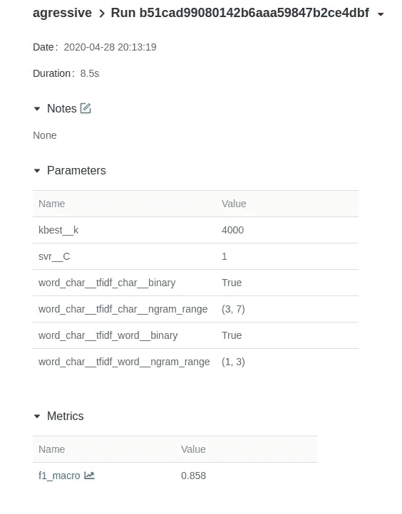
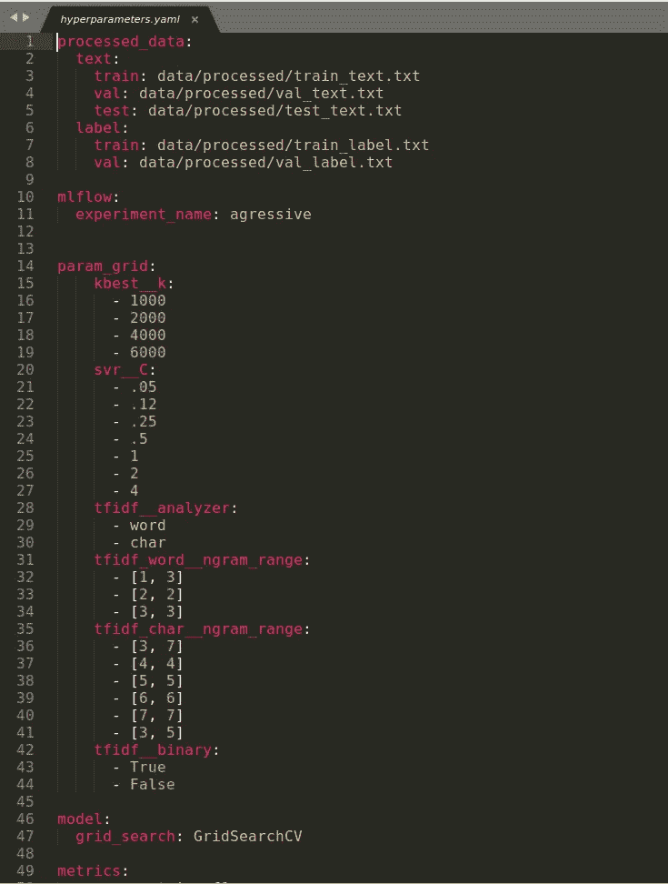
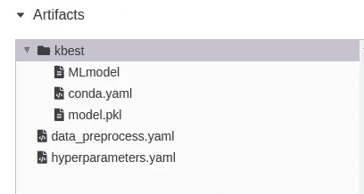

# 使用这两个工具在您的机器学习项目中实现可重复性

> 原文：<https://towardsdatascience.com/achieve-reproducibility-in-machine-learning-with-these-two-tools-7bb20609cbb8?source=collection_archive---------39----------------------->

## 你能打包你的机器学习模型，并根据你的需要挑选一个最好的吗？


在 [Unsplash](https://unsplash.com?utm_source=medium&utm_medium=referral) 上 [Curology](https://unsplash.com/@curology?utm_source=medium&utm_medium=referral) 拍摄的照片

# 动机

在机器学习中，由于没有所谓的最佳模型，所以您可能需要训练不同的模型，并尝试不同的参数，直到找到精度最高的模型。实验次数越多，你就越有可能找到高性能的模型。

但是你可能会对创建许多实验感到气馁，因为:

*   参数和结果的变化太多，您无法跟踪
*   即使您可以通过仔细记录输入和输出来跟踪更改，您如何确保对未来的数据使用相同的模型呢？

以上问题是可复制性的动机。在机器学习中，**再现性**是能够重新创建一个机器学习工作流程，以达到与原始工作相同的**输出。这时候我们需要一些工具来有效地记录输入和输出以及保存我们的模型。**

如果你能把你所有的实验，日期，关于数据，参数，结果和模型的信息记录在一个像这样的地方，是不是很好？



我最喜欢的实现这个目标的工具是 Hydra 和 MLflow。让我们了解如何:

*   创建强大的配置文件来跟踪 Hydra 的输入。
*   使用 MLflow 轻松记录输出和服务模型。

# 九头蛇的强大配置

首先，什么是配置文件，我们为什么需要它？配置文件包含定义构建或运行程序的设置或首选项的纯文本参数。在数据科学中，配置文件可以用来定义数据和数据的参数。



超参数的 config.yaml 文件示例

例如，我们可以使用配置文件来记录实验的数据、超参数、模型和度量。

为了读取配置文件，我们将使用 [Hydra](https://hydra.cc/) 。为什么是九头蛇？有了 Hydra，我们可以动态地构建您的配置，使我们能够轻松地获得每次运行的完美配置。要安装 Hydra，只需运行

```
pip install hydra-core --upgrade
```

在带有参数的主函数之前添加 Hydra 作为装饰器，该参数是指向配置文件的路径。只需将`config`或任何其他名称作为主函数的参数。假设我们想要读取我们的训练数据，我们可以使用`config.processed_data.text.train`

想要重用代码但改变数据？我们只需要改变配置文件中的数据路径！

# 日志记录和服务模型的 MLflow

[**MLflow**](https://mlflow.org/) 是一个管理 ML 生命周期的开源平台，包括实验、再现和部署。我在这里介绍了如何使用 MLFlow 作为优化超参数的工具之一:

[](/how-to-fine-tune-your-machine-learning-models-with-ease-8ca62d1217b1) [## 如何有效地微调你的机器学习模型

### 发现为您的 ML 模型寻找最佳参数非常耗时？用这三招

towardsdatascience.com](/how-to-fine-tune-your-machine-learning-models-with-ease-8ca62d1217b1) 

MLflow 还可以轻松高效地为我们的模型提供服务。安装 MLflow 与

```
pip install mlflow
```

现在，我们的参数、指标和模型被保存了。要访问它们，只需运行

```
mlflow ui
```

您将看到一个跑步列表。单击跑步，查看每次跑步的相关信息


在页面末尾的工件部分，我们可以看到保存关于我们的输入和我们训练的模型的信息的配置文件。



要使用模型，当单击工件中列出的模型名称时，找到模型的完整路径。然后用该路径加载模型。

# 组合九头蛇和 MLflow

最后，我们可以像这样把这两个强大的工具结合在一起

为了将所有内容放在一起，我们使用一个配置文件来保存输入，并使用 Hydra 来调用这些输入。我们使用 MLflow 来记录输出和模型。现在，我们可以自由地创建许多实验，同时仍然能够跟踪、比较和再现结果！

如果您仍然不了解如何将 MLflow 和 Hydra 整合到您的数据科学项目中，您可以在[我的 NLP 项目](https://github.com/khuyentran1401/Machine-learning-pipeline)中找到本文提到的工作流示例。

# 结论

恭喜你！您已经学习了如何使用 Hydra 和 MLflow 为您的机器学习模型提供再现性。我鼓励您进一步探索这两个工具，以创建符合您目的的高效管道。纪念

> 花在组织上的每一分钟，都是一小时的收获

通过组织代码的结构，您将节省机器学习工作流程中的调试时间。有了这两个工具，我发现我的工作流程变得不那么混乱了，我希望你也一样。

我喜欢写一些基本的数据科学概念，并尝试不同的算法和数据科学工具。你可以在 LinkedIn 和 Twitter 上与我联系。

如果你想查看我写的所有文章的代码，请点击这里。在 Medium 上关注我，了解我的最新数据科学文章，例如:

[](/how-to-create-a-drop-down-menu-and-a-slide-bar-for-your-favorite-visualization-tool-3a50b7c9ea01) [## 如何为你最喜欢的可视化工具创建下拉菜单和滑动条

### 使用 Python Widget，您可以用 3 行代码升级可视化

towardsdatascience.com](/how-to-create-a-drop-down-menu-and-a-slide-bar-for-your-favorite-visualization-tool-3a50b7c9ea01) [](/how-to-share-your-jupyter-notebook-in-3-lines-of-code-with-ngrok-bfe1495a9c0c) [## 如何用 Ngrok 用 3 行代码分享你的 Jupyter 笔记本

### 想象一下，让你的朋友在远程机器上使用你的本地 Jupyter 笔记本

towardsdatascience.com](/how-to-share-your-jupyter-notebook-in-3-lines-of-code-with-ngrok-bfe1495a9c0c) [](/how-to-monitor-and-log-your-machine-learning-experiment-remotely-with-hyperdash-aa7106b15509) [## 如何使用 HyperDash 远程监控和记录您的机器学习实验

### 培训需要很长时间才能完成，但你需要去洗手间休息一下…

towardsdatascience.com](/how-to-monitor-and-log-your-machine-learning-experiment-remotely-with-hyperdash-aa7106b15509)