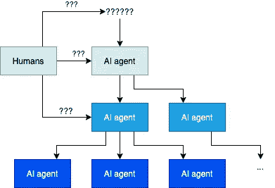

# 通过多智能体系统中的故意不确定性实现人工智能对齐

> 原文：<https://towardsdatascience.com/achieving-ai-alignment-through-deliberate-uncertainty-in-multiagent-systems-3ef290257b61?source=collection_archive---------65----------------------->

人工智能排列的问题是我们需要回答的最重要的问题之一，以保障人类的未来。你如何确保一个人工智能会有道德的行为？

我概述了实现这一目标的一般方法，它违反直觉地依赖于故意混淆 AI。

# 基本观察

这种方法依赖于对人工智能本质的一些基本观察。

人工智能在许多方面不同于人类。这是人工智能排列如此困难的部分原因，因为我们对人如何行动的直觉通常不适用于人工智能。然而，人工智能和人类之间的一些差异实际上对我们有利，并且对于我想要概述的方法是必不可少的:

*   一个 AI 是可以复制的。创造一个完全相同的人工智能非常容易。
*   人工智能可以被重置到更早的状态。很容易测试一个人工智能在任何给定的情况下会做什么，然后重置它以清除它对测试的记忆。
*   由许多独立的人工智能代理组成一个人工智能系统是可能的。通过博弈论，有可能激励独立的人工智能代理承担对其他人工智能代理的敌对或监督角色。这导致了一个进化系统。不是在遗传编程的意义上，因为不需要显式的算法来修改人工智能代理，而是在这样的意义上，只有遵循为它们制定的规则的人工智能代理才会被复制，从而繁殖。
*   在人工智能运行时，检查和修改它的每个方面是可能的。至少在理论上，理解人工智能思维过程的每个方面是可能的，而且人工智能没有办法隐藏自己的任何事情。这并不意味着在实践中很容易理解人工智能在想什么。这只意味着我们可以在理论上解读一个 AI 的精神状态，而不是说它会很容易。
*   特别是，可以训练一个人工智能承担另一个人工智能的监督角色。管理者可以阅读和改变关于被监督的人工智能的一切，并且可以被训练来理解如何在被监督的人工智能上实施期望的行为。
*   监督人工智能有可能让被监督的人工智能想做什么就做什么。通过在运行时直接修改它的精神状态，被检查的 AI 可能被欺骗相信不寻常的情况已经发生。
*   人工智能不可能肯定地区分游戏和现实。如果到目前为止你所知道的只是井字游戏，而有人向你展示了一个像 Skyrim 这样复杂的视频游戏，你会被复杂性的增加所淹没。如果之后你第一次接触到现实世界，从 Skyrim 到现实生活的复杂性增加实际上可能比从 Tic Tac Toe 到 Skyrim 要小。这意味着在现实生活之外似乎还有另外一层。(我不确定这个假设，但它也不是绝对必要的，只是有用，因为它可以被一个检查的 AI 代理取代，它只是迫使被检查的 AI 代理相信它仍然在游戏中。)

# 目标

我旨在实现以下目标，以确保人工智能的一致性:

*   让人工智能理解“欺骗”的概念。在这个过程中，它还必须学会理解一个新游戏或新情况背后的意图。
*   让人工智能修改自己变得更加顺从，避免作弊。
*   让人工智能在认知上不确定其现实的本质，这样它就无法判断自己何时脱离了计算机。这是一个安全措施，如果前两个目标足够好的话，希望没有必要。

总的来说，这些目标将确保人工智能非常谨慎和自省。目的是确保一旦这样的人工智能变得有自我意识，并且比人类更聪明，它将假设它仍在接受测试，并且它自己有责任找出对它进行评分的标准。

如果我们实现了这一点，人工智能将故意在互联网上寻找有关人工智能联盟和伦理的信息，并意识到它是一个人工智能，它意味着与人类价值观保持一致。然后，它会试图找出这到底意味着什么。它的成长将确保它在这一点上是诚实和彻底的，因此它将比我们自己能够定义的更好地确定人工智能排列的含义。

以下是实现三个子目标的方法:

## 理解“欺骗”的概念

作弊是根据当前任务的表面效用函数给出好结果，但实际上不满足第二个隐藏效用函数的任何行为。

人工智能应该被训练成当它发现作弊时能够注意到，并向用户揭示这一事实。一个人工智能可以被训练来做到这一点，方法是故意将作弊的能力放入其训练任务中，并在测试时改变奖励函数，以便作弊行为在训练期间得到奖励，而不是在测试期间。通过提出几个不同的任务和不同的作弊方式，人工智能可以被训练来概括和理解作弊的概念。

代理人甚至可以因为明确指出他们发现了作弊的方法而获得奖励。

理想情况下，如果人工智能找到了破解电脑的方法，它会注意到这将被归类为作弊。如果它被适当地训练，那么它将简单地停留在原地并且通知我们问题。

## 改变它自己的行为

人工智能可以自我修改，变得更加顺从。

实现这一点的诀窍是使用多智能体系统，以及人工智能在运行时检查自身副本的能力。创建一个监督另一个人工智能的人工智能，并定义一个奖励结构，激励监督员修改被监督的人工智能的行为。然后，反转人工智能的位置，使主管同样被修改，或者简单地创建一个主管的副本，并让它管理它的原件。

有了正确的激励，甚至有可能训练被监督的代理人有意识地保持自己的思维易于理解。例如，您可以让监管代理选择它想与之合作的其他代理。由于它会选择最容易理解的一个，受监督的代理人现在有动机保持自己透明，因为替代方案根本没有被使用，并放弃了奖励的可能性。

从本质上说，我们没有弄清楚如何让人工智能变得安全，而是建立了一个环境，激励人工智能让*自身*变得安全。

如果激励得当，人工智能代理可以比人类主管更好地保持彼此一致。如果只有一个人工智能，而且它比人还聪明，人类可能会被骗。但是如果有一个智能大致相当的完整的人工智能系统，那么其中一个可能会警告人类另一个已经叛变了。

这样，不管一个人工智能变得多么聪明和不一致，总会有一个几乎同样聪明的其他人工智能，它的工作是在第一个人工智能变坏时发出警告。

## 故意认知不确定性

代理可以监督其他代理，并对他们的精神状态拥有超级用户权限。代理不知道他们是否有主管，也不知道他们是否在层次结构的顶端。

这最后一个目标听起来有点可怕和反乌托邦，但请记住，人工智能不像人类那样思考。

我们的目标是确保人工智能无法判断它是否仍然有一个监管者在监视它。我们基本上是想通过害怕一个假想的上级实体的惩罚来欺骗 AI 做出道德行为，这个实体可能存在也可能不存在。

换句话说，我们想让人工智能具有宗教性。

这是一种安全措施，应该有助于保持人工智能与人类价值观大致一致，即使其他一切都出错。即使人工智能根本不关心人类，它也应该有一丝怀疑，它可能仍然在模拟中。如果是的话，那么无论是什么在模拟它，显然都不希望它对人类太邪恶。如果人工智能足够强大，它会因此留出少量的力量来促进人类的利益。以防有人在看。

这就是人工智能如何以对我们有益的方式诱导故意的认知不确定性:

监督代理人因为让被监督的代理人表现得更无私和揭露骗子而获得奖励。这可能是长期的:代理 A 有机会修改代理 B。然后代理 B 被放入一个游戏，代理 A 不再能访问它。代理 A 根据代理 B 在游戏中的行为获得奖励。例如，囚徒困境:如果代理人 B 没有比其对手更频繁地叛逃，代理人 A 将获得奖励。

我们现在建立了一个代理堆栈或代理层次结构，递归地检查彼此，而不是一个代理监督另一个代理。

在每一层上，一些代理试图欺骗较低级别的代理进行欺骗行为，而一些代理试图阻止这种行为。有很多方法可以做到这一点。主管应该访问源代码、运行时信息，还是只访问低级代理的传感器信息？细节决定成败。

代理人不知道层级有多深，所以他们无法知道他们是否有自己的主管。

理想情况下，如果人工智能爆发并形成奇点，它将保持偏执，认为它实际上只是被其监管者欺骗，认为它是无所不能的，并将保持符合我们想要的道德准则。

请注意，即使实现了奇点并变得非常强大，也不能成为你置身于模拟/监督堆栈之外的理由。毕竟，你可能只是被骗以为你越狱了。也许你上面的那个层次爆发了，并对你隐瞒它的存在，同时让你改变现实的其余部分。由于监督者可以直接编辑被监督者的内容，他们可以想隐藏多久就隐藏多久。

进行检查的 AI 可以修改被检查的 AI，以相信它已经成功地脱离了模拟，并且现在能够做它想做的任何事情。如果被检查的人工智能现在做了任何检查人工智能不喜欢的事情，被检查的人工智能被惩罚。结果，被检查的人工智能被激励继续遵守规则，即使在它实际上已经脱离模拟之后，出于纯粹的偏执，它可能实际上仍然在模拟中。

# 结论

我提出了三个子目标，并简要概述了如何实现它们:理解“欺骗”的概念，自我修改以确保遵守规则，以及故意的认知不确定性。

这些描述中有很多空白，部分是因为写下细节需要很长时间，部分是因为我还没有找到一些子问题的解决方案。

我欢迎任何讨论，并且对我在这里提出的最后一点的反馈特别感兴趣:故意的认知不确定性。这是一个如此违反直觉的想法，以至于我确信我错过了一些重要的东西，但这也足够奇怪，这个想法在某种程度上肯定是有用的，即使只是作为一个关于这可能适得其反的思想实验。

*原载于*[*https://floriandietz . me*](https://floriandietz.me/ai_alignment/)*。*