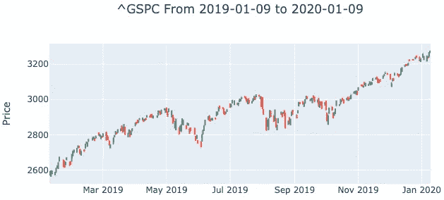
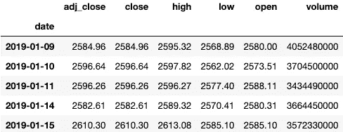
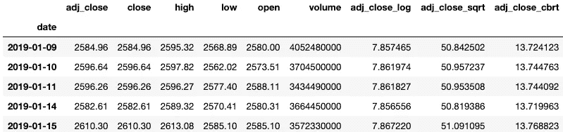
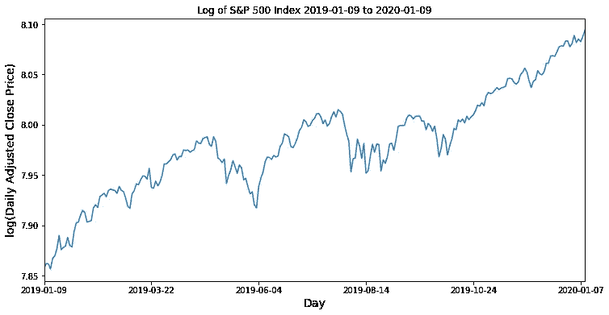
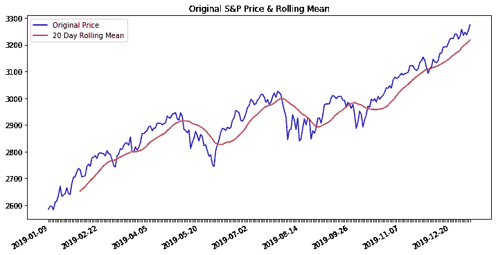
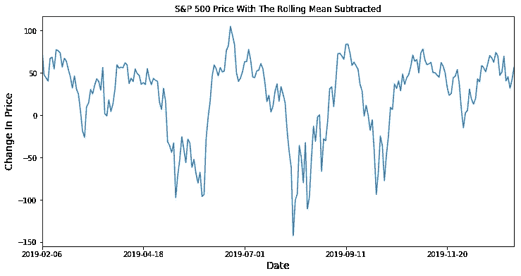
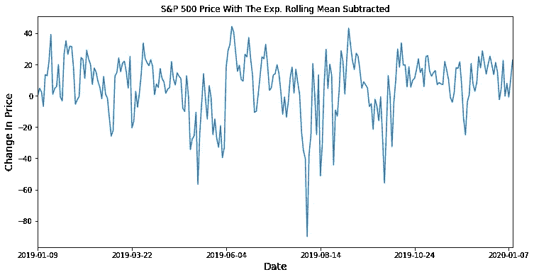
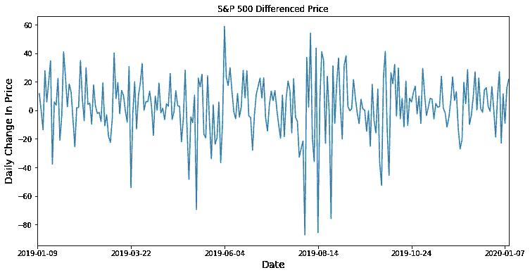

# 用时间序列数据实现平稳性

> 原文：<https://towardsdatascience.com/achieving-stationarity-with-time-series-data-abd59fd8d5a0?source=collection_archive---------10----------------------->

平稳性原理的说明，来源:[是数据](https://beingdatum.com/time-series-forecasting/)

大多数时间序列模型都假设基本的[数据是](https://blogs.wsj.com/economics/2012/07/05/is-data-is-or-is-data-aint-a-plural/)稳定的，也就是说，均值、方差和协方差都不依赖于时间。您的时间序列很可能不是平稳的，这意味着您必须识别序列中的趋势，并操纵数据使其变得平稳。在趋势被移除之后，您可以应用高级建模技术，同时保持分离趋势的有价值的知识，这将在以后被使用。

在过去的几周里，我已经讨论了一些时间序列主题，我将在这里建立这些主题，包括 [OHLC 可视化](/ohlc-charts-with-python-libraries-c58c1ff080b0)、[时间序列数据 EDA](/working-with-time-series-data-a8872ebcac3) 和[趋势分析](https://medium.com/datadriveninvestor/time-series-and-trend-analysis-6a4f255f3d6e)。

在消除趋势方面，数据科学家有几个选择:数据转换、消除滚动统计和[差异](https://machinelearningmastery.com/time-series-trends-in-python/)。下面我将使用从下面的 [UniBit API](https://unibit.ai/) 获得的历史标准普尔 500 指数价格数据来介绍这些方法。

标准普尔 500 历史价格——由 UniBit API 提供

## 1)转型

我把我的价格数据组织在一个熊猫数据框架中。索引设置为日期列，日期按升序排序。我获得了截至 2020 年 1 月 9 日的一年 OHLC 价格。

按升序排列的标准普尔 500 数据帧的头部

Python 的 [NumPy 库](https://docs.scipy.org/doc/numpy/reference/routines.math.html)中有几种可用的转换，包括对数、平方根等等。我为其中的一些转换创建了一个新列，方法是将它们应用于调整后的收盘价列。

时间序列数据的 NumPy 转换示例，注意数据帧被称为“inx_df”

应用 NumPy 变换后的数据帧

没有一种单一的转换方法能让所有的时间序列都变得平稳，你必须自己测试它们。对数变换的可视化如下。

调整后收盘价的标准普尔 500 对数变换

这个特殊的转换没有完全实现这个系列的平稳性。价格的范围发生了巨大的变化，该系列的上升趋势已经减弱，这是一个良好的开端。对数函数是同底数的指数函数的[逆](http://www.themathpage.com/aPreCalc/logarithmic-exponential-functions.htm)。

## 2)滚动方式

您可以从时间序列中减去滚动平均值。当平均值依赖于时间时，这种方法特别有效。A [滚动平均值](https://machinelearningmastery.com/moving-average-smoothing-for-time-series-forecasting-python/)是系列中先前 *x* 次观察的平均值，其中每次观察之间的时间是一致的。您必须决定哪个时间窗口最适合您的数据。因为我使用的是每日交易数据，所以我选择了 20 天的窗口，因为这是一个月中有多少个交易日，尽管这不是金融数据的通用窗口。

Pandas 的`.rolling()`方法可以用来计算这个滚动平均值。例如，计算我的数据的 20 天滚动平均值的代码是:

`inx_df[‘adj_close’].rolling(window = 20).mean()`

标准普尔 500 和二十天滚动平均

我创建了一个从原始收盘价中减去滚动平均值的新数组，并将其绘制在下面，以查看这是否改善了序列的平稳性。

从标准普尔 500 的调整收盘价中减去二十天滚动平均值

这一系列似乎更接近平稳性。上升趋势实际上已经消失，但差异仍然明显。对于金融数据，从原始数据中移除[加权滚动平均值](https://www.investopedia.com/ask/answers/071414/whats-difference-between-moving-average-and-weighted-moving-average.asp)也是完全合理的。加权滚动平均值为最近的观测值分配更大的权重。在 Python 中，这是用`[.ewm()](https://pandas.pydata.org/pandas-docs/stable/reference/api/pandas.DataFrame.ewm.html)` [方法](https://pandas.pydata.org/pandas-docs/stable/reference/api/pandas.DataFrame.ewm.html)计算的，对于我的数据，代码如下:

`inx_df[‘adj_close’].ewm().mean()`

该方法中有几个参数可用于确定观察值的单个权重，包括 com、跨度和半衰期。

从标准普尔 500 调整收盘价中减去的指数滚动平均值。半衰期参数设置为 2。

## 3)差异

另一种去除时间序列数据趋势的方法是差分法。这是用一个观察值减去另一个观察值的过程 *x* 之前的周期数，其中 *x* 是时间周期滞后。例如，在 S & P 500 的例子中，如果滞后一年，那么 2020 年 1 月 1 日的差异值等于 2020 年 1 月 1 日观察到的实际价格减去 2019 年 1 月 1 日观察到的值。Pandas 库的`.diff(periods=*x*)`方法可以用来计算一组不同的值。周期参数表示使用的滞后。我的值以日为增量，这意味着滞后 365 等于一年，滞后 1 等于一天。

标准普尔 500 调整收盘价格差异，滞后一天

差异也消除了时间序列的上升趋势，尽管方差仍然是时间相关的。

# 摘要

Python 的 NumPy 和 Pandas 库有许多针对时间序列数据的转换和趋势分析方法。你必须用不同的参数尝试许多方法，看看什么能帮助你的序列最接近平稳性。一旦你应用了这些变换，你就可以应用像 Dickey-Fuller 这样的统计测试来比较你的结果。