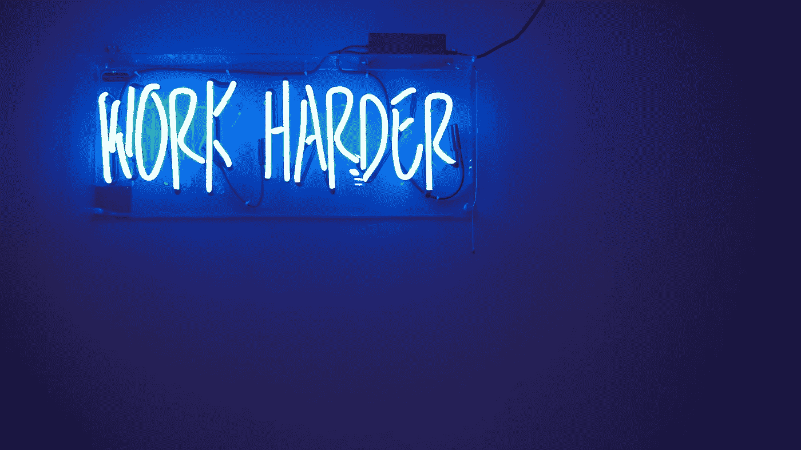
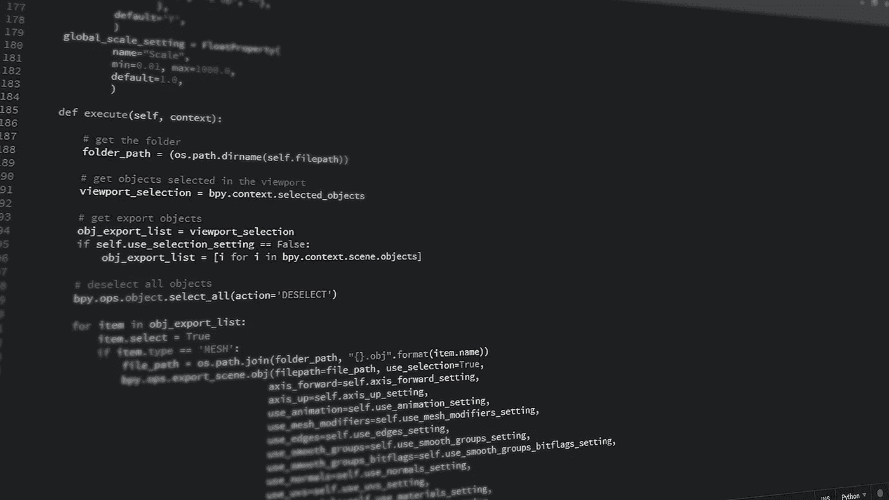

# 完成数据科学带回家的作业

> 原文：<https://towardsdatascience.com/acing-the-data-science-take-home-assignment-530a93164e52?source=collection_archive---------15----------------------->

## 带回家的作业是否符合他们的目的，以及如何征服他们。

照片由[詹姆斯·庞德](https://unsplash.com/@jamesponddotco?utm_source=unsplash&utm_medium=referral&utm_content=creditCopyText)在 [Unsplash](https://unsplash.com/s/photos/battle?utm_source=unsplash&utm_medium=referral&utm_content=creditCopyText) 拍摄

如今，许多公司在数据科学家招聘流程中包括带回家的任务。在这个博客中，我将分享我对这个测试的想法和一些我发现在面对它们时很方便的技巧。

# 什么是带回家的作业？

类似于软件工程师的编码测试，带回家的作业是一个初步的筛选，帮助招聘人员找到具有最佳技能/承诺的候选人，以进行下一轮面试。它通常发生在筛选阶段之后，第一次技术面试之前。

在任务中，**候选人得到一个数据集，并被要求在通常的一周内做“一些事情”**。“某些东西”可以是清晰的，有透明的评估标准，但有时可能非常模糊。题目和难度差别很大，看公司的喜好和水准。

举例来说，以下是我去年在寻找数据科学家工作时遇到的一些任务:

*   建立一个模型，并在[虹膜数据集](https://archive.ics.uci.edu/ml/datasets/iris)上可视化分类区域。
*   建立一个住房图像分类模型和一个演示服务。
*   从[西雅图 Airbnb 数据集](https://www.kaggle.com/airbnb/seattle)中，为 Airbnb 想出一个业务问题，并解决它。
*   给定以前在线广告和点击客户的 id，为下一次广告活动提出一个策略。

可交付成果通常是源代码和一些解释作品的简短幻灯片。

# 带回家的作业是一件好事吗？

我要坦率地说，我个人认为，总的来说，带回家的作业花费了求职者和雇主太多的时间和精力，而不是总能很好地达到目的。**总之就是坏**。

**对候选人**不利，原因有三:

*   候选人大约需要 10 个多小时才能完成作业。考虑到这只是招聘过程的早期阶段，这是一笔很大的投资。
*   在为任务付出巨大努力后，候选人通常只会收到一封简短的拒绝邮件，没有任何反馈。这种沮丧会对候选人的动机和信心产生负面影响。
*   有了这样的风险，**这项任务创造了一个进入壁垒，阻止候选人探索新的机会，或者同时申请多家公司**。想象一下:如果你申请了 4 家公司，并在同一周内收到了他们的任务，这将意味着 40 个小时的工作，就像一份全职工作一样。

**这对招聘人员**也不利，因为:

*   寻找数据集，设计作业，评估提交的答案将花费大量的时间和精力。
*   许多优秀的候选人不愿意从事如此耗时的工作。所以，**通过试图过滤掉不合格的候选人，被招募的人可能也送走了精英**。

与数据科学作业相比，软件工程师的编码测试要好得多。它很容易设置测试(现在许多平台都提供这项服务)，很容易判断候选人的提交情况(如果代码运行，它就运行，如果不运行，那么它就不运行)，并且只需要双方花费不超过 90 分钟的时间。

# 通过数据科学作业的锦囊妙计

带回家的作业很糟糕。然而，由于数据科学家仍然是一个相对较新的角色，许多组织尚未设计一个标准化的程序来正确测试候选人的技能。因此，带回家的作业成了标准。作为候选人，你必须服从。

在这个环节中，我将分享一些我认为非常有用的行动技巧，以便轻松地完成任务

## 在任务之前

照片由[乔丹怀特菲尔德](https://unsplash.com/@whitfieldjordan?utm_source=unsplash&utm_medium=referral&utm_content=creditCopyText)在 [Unsplash](https://unsplash.com/s/photos/work-harder?utm_source=unsplash&utm_medium=referral&utm_content=creditCopyText) 上拍摄

*   **通过做 Kaggle 或个人数据科学项目来实践**。这项任务非常类似于一场 Kaggle 竞赛，有时更简单。所以这些是做模拟测试的最好地方。实践它们将装备你的信心和经验，以征服这一轮。
*   **准备好你的工作框架**。无论数据集如何，大多数数据科学解决方案都遵循相同的模式:探索性分析、数据处理、特色工程、模型构建、超参数调整、培训和验证。知道了这一点，你就可以准备一个模板化的笔记本，把所有的会话都准备好。当数据到达时，你不再不知所措和惊慌失措，而是确切地知道接下来的步骤。
*   **准备实用功能**。在实践数据科学的时候，你会意识到有一些函数被反复使用。这些功能可以是加载和可视化数据、处理缺失值、生成要素等。您应该尝试将这些功能一般化，并将它们存储在您的 Github 上。在分配过程中，您可以简单地重用这些函数，而不是从头开始编写所有代码。这将大大节省你的时间和精力。
*   **研究招聘公司**。想出一个数据科学任务很难，所以许多公司倾向于坚持一个小问题池。因此，在[玻璃门](https://www.glassdoor.sg/index.htm)上研究这家公司可能会给你一些启发。关于可能问题的暗示也可能来自公司的业务性质。例如:一家电子商务公司可能存在与推荐相关的问题，一家咨询公司可能存在典型的机器学习问题，等等。

## 在任务期间

图片来自 [Pixabay](https://pixabay.com/?utm_source=link-attribution&utm_medium=referral&utm_campaign=image&utm_content=1084923) 的 [Johnson Martin](https://pixabay.com/users/JohnsonMartin-724525/?utm_source=link-attribution&utm_medium=referral&utm_campaign=image&utm_content=1084923)

*   **阐明数据集和预期**。不要在收到数据后就直接开始编码。询问关于作业如何评分的问题，或者如果你对数据集有任何疑问。在花接下来的 10 个小时解决这个问题之前，你需要确保你非常清楚这个问题。
*   **直奔主题**。为了给招聘经理留下深刻印象，你可能会尝试进行广泛的探索性分析，绘制漂亮的图表，彻底研究每种可能算法的利弊，等等。**不要。这将会分散你对最终目标的注意力:提供解决方案。了解数据集后，进入下一个处理步骤，然后是模型，然后是预测。**当所有的核心步骤都完成了，模型达到了令人满意的性能，那么你就可以去做额外的工作了**。否则，你的作品可能会有许多美丽的数字，和一个可怕的准确性。**
*   **遵循软件工程** [**编码标准**](https://www.geeksforgeeks.org/coding-standards-and-guidelines/#:~:text=A%20coding%20standard%20gives%20a,increases%20efficiency%20of%20the%20programmers.) 。成为一名数据科学家并不意味着你可以编写蹩脚的代码。在你完成实验并最终确定你的解决方案后，**重构你的代码**。让你的代码可读，给变量和函数起一个合适的名字，写下解释的注释，等等。
*   **恰当地呈现自己的作品，讲好故事**。你在完成任务方面做得很好，现在是推销的时候了。说明你的工作流程，你对模型的选择，你为什么认为你的模型取得了很好的业绩，你还尝试了哪些东西等等。记住这一点:招聘人员只有非常有限的时间来看你的工作，所以**让你的解释尽可能简短明了，并让它成为一次愉快的阅读体验**。
*   **尽可能使用** [**笔记本**](https://nbviewer.jupyter.org/url/norvig.com/ipython/Probability.ipynb)**。笔记本可以让你用漂亮的流程和格式展示你的代码、分析、图表和解释。这会让雇主更容易理解和欣赏你的工作。**

**举个例子， [**这里的**](https://github.com/dmnguyen92/Predicting-Airbnb-host-revenue-in-Seattle) 是我提交的通过任务轮次的代码之一。**

## ****任务完成后****

****

**由[马库斯·温克勒](https://unsplash.com/@markuswinkler?utm_source=unsplash&utm_medium=referral&utm_content=creditCopyText)在 [Unsplash](https://unsplash.com/s/photos/review?utm_source=unsplash&utm_medium=referral&utm_content=creditCopyText) 拍摄的照片**

*   **彻底检查你的工作。通过了一轮分配并不意味着你已经永远地与它分道扬镳。你的工作很有可能成为下一轮面试的讨论话题。因此，准备好流畅地解释你做的每一步是什么和为什么。尤其是，**确保你对你的模型背后的算法了如指掌**。用一些你不了解的东西，比根本不了解它们还要糟糕。**
*   **看看你是否喜欢解决交给你的问题，因为这可能很好地反映了你加入公司后的未来任务。这是因为为了测试应聘者的兼容性，很多公司在这份作业中都给出了自己的真实数据和真实问题。**
*   ****征求反馈**。如果你通过了这一轮，不要被过分宣传，如果你不幸被拒绝，也不要哭着跑开。保持冷静，征求对工作的反馈，这样你就能在技术上有所成长。你已经努力工作并提交了一份尊重的回答，因此你应该得到同样尊重的反馈。**

# ****结论****

**综上所述，我认为把带回家的作业纳入面试过程是不理想的，对公司和应聘者都是如此。然而，如果不得不面对它们，你可以通过优化时间和精力来克服它们:**

*   **分配任务前:通过做 Kaggle 获得经验，准备好你的框架和效用函数，并对你申请的公司做一些研究。**
*   ****在分配**任务期间:澄清你的疑问，然后在做额外探索之前直接进入解决方案，遵循良好的编码标准，并恰当地展示你的工作。**
*   **任务完成后:彻底检查你的工作，看看你将来是否喜欢做类似的任务，并寻求反馈。**

**我希望我的一些建议能对你处理带回家的作业有所帮助。**

**谢谢你的阅读。**