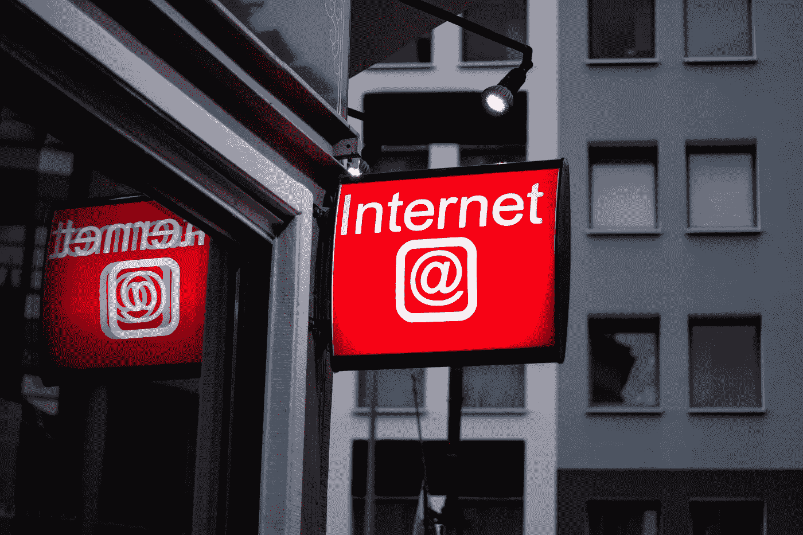
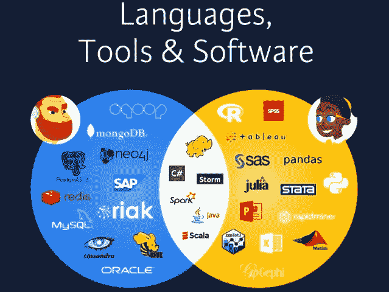
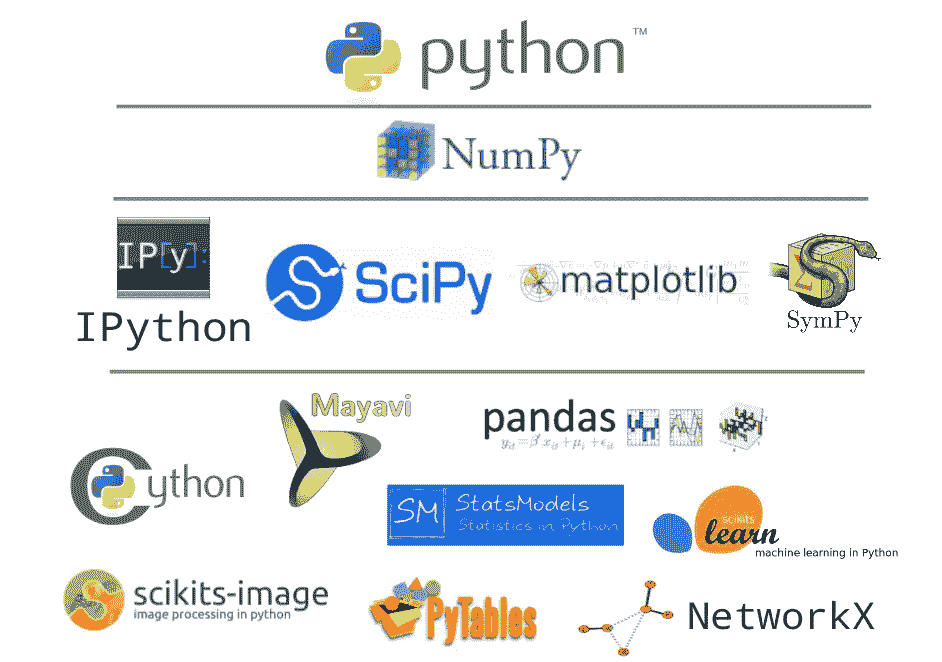

# 威瑞森媒体数据科学访谈

> 原文：<https://towardsdatascience.com/acing-the-verizon-media-data-science-interview-d4fb72670e0e?source=collection_archive---------62----------------------->

## 要成为一名数据科学家，需要通过几个面试阶段

莱昂·塞伯特在 [Unsplash](https://unsplash.com/?utm_source=unsplash&utm_medium=referral&utm_content=creditCopyText) 上拍摄的照片

## 一些历史

[*威瑞森媒体*](https://fios.verizon.com/) 是*威瑞森通信*集团成立两年的子公司，负责开发在线、数字媒体和广告服务。这家子公司是在威瑞森收购两家公司之后成立的，这两家公司在上世纪 90 年代中期互联网繁荣时期为在线通信和网络浏览引入了一系列广泛使用的数字服务——AOL 和 Yahoo！

直到 2019 年初，AOL 和雅虎！成为威瑞森*公司的一部分，被称为*誓言公司*，后来被命名为*威瑞森媒体*。今天，*威瑞森媒体*作为公司的主要媒体和在线广告部门，运营着无数知名的数字品牌，此外还收购了两个品牌，包括*赫芬顿邮报*和 *TechCrunch* 。就像任何其他坐拥大量消费者数据的数字媒体和营销服务公司一样，他们乐于寻求合格数据科学家的专业知识。这是他们在法国巴黎总部的入门级数据科学职位的数据科学面试。*

## **总体要求**

威瑞森媒体的数据科学家的工作描述非常典型。一个人应该至少拥有计算机科学、会计或任何相关专业的学士学位。一个人还应该在**商业智能**和规范分析以及**数据可视化**方面拥有专业知识，并使用 Tableau 等工具。新员工应该能够进行预测建模，在 **Python 或 R** 中实现**机器学习(ML)算法**，了解云环境中的数据仓库，例如**亚马逊网络服务** ( **AWS)或谷歌云平台**。一个人应该了解**数据库管理和查询**，因此有一个体面水平的 **SQL** 技能是好的。

虽然该角色被宣传为数据科学家，但这些要求很容易成为数据工程师和数据分析师的预期职责。这有一些影响-新员工将需要作为数据科学家戴上一顶以上定义明确的帽子，并可能拥有完成各种数据相关任务的知识，以避免团队不得不雇用整个新员工来提供特定的专业知识。一个多方面的角色可能最终对一个人的发展都有好处。

面向数据工程师(左)和数据科学家(右)的典型维恩数据堆栈图。来源:[数据营](https://www.datacamp.com/community/blog/data-scientist-vs-data-engineer)

因此，我们需要进行广泛的研究，以设计和实施商业解决方案，进行复杂的统计和计算分析，将 ML 算法应用于客户数据，以优化数字服务和营销平台，并将研究和分析的结果传达给商业利益相关者。这是一个很高的要求，一个人对这个角色的总体适应性将在最初的电话筛选中得到判断。

## **第一阶段:电话屏幕面试**

下一步可能是电话面试。在 30 分钟的电话筛选中，候选人被要求提供他们在数据分析和数据科学方面的专业知识的背景信息。像往常一样，我们的目标是了解他们的技能、职业兴趣和以往的经验。在这一阶段，除了一两个简短的问题来测试一个人在解释数学和/或统计概念方面的舒适程度和能力之外，这些问题不太可能非常专业。例如，人们可能被要求向外行人解释一对事件的独立性和互斥性之间的区别。这只是众多问题中的一个，可以证明候选人对一个概念理解得足够好，能够向没有相同知识基础的人阐述或阐明这个概念。

## **第二阶段:带回家的作业**

课后测试的第一部分将进一步评估一个人与软件工程师和利益相关者交流概念的能力。作业可能会在 Jupyter 笔记本和/或 Python 脚本中提交，其中包含以下问题:

*   向工程师解释什么是降维，并提供实例。
*   你会如何向一位企业高管解释无监督学习是如何运作的，以及它如何被用来利用营销技巧？
*   向同一个主管解释 90%的置信区间。

这项任务还要求候选人在数据建模部分展示他们作为数据科学家或机器学习工程师的技术能力。为此，需要熟悉以下概念和工具，

统计数据:

*   二元和边际分布
*   正态(高斯)和偏斜分布

预测建模:

*   时间序列

Python 实现:

*   数据可视化:Seaborn 和 Matplotlib
*   笨笨和笨笨
*   Tensorflow、Scikits-learn、PyTorch APIs

面向数据科学家/分析师的典型 Python 技术堆栈

带回家的作业意味着要在几个小时到一周内完成，这完全取决于一个人的承诺。

## **第三阶段:现场面试**

要通过这项带回家的任务，需要一个人正确完成*给出的每个*问题，或者让招聘团队领导满意。成功通过后，面试过程中的最后一个阶段就在候选人和工作机会之间。这是现场面试，也可以在线进行。在这一阶段，当一个人回答关于制定技术和业务战略的问题时，他与组织内不同层次的人交流复杂概念的能力将再次得到验证。最后的面试将为团队提供一个机会，让他们感受候选人的工作和沟通风格，以及他们的团队合作能力。

## **第四阶段:报价**

通过了前两个阶段，最后的面试应该是一帆风顺的。当然，正如面试中常见的情况一样，获得最终职位需要很多运气。

## **结论**

好吧，我们可以在这里结束。总之，我概述了威瑞森媒体的数据科学家职位的要求，以及面试过程中最终获得工作机会的各个阶段。我希望这些信息能在你求职的某个阶段对你有所帮助，并给你至少一个数据点来改进你最终数据科学面试策略的回归模型。