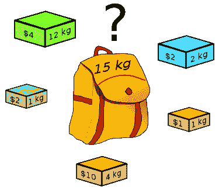
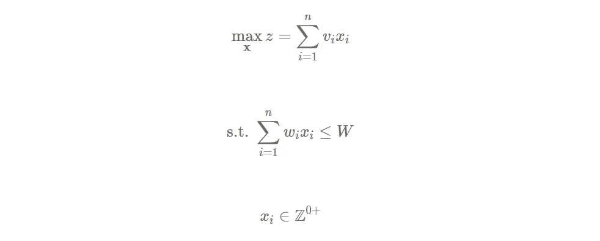
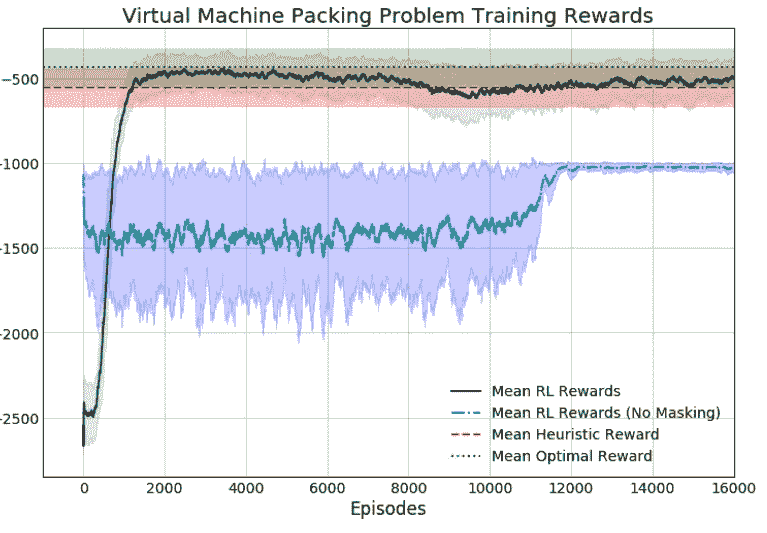

# 使用 RLlib 进行动作屏蔽

> 原文：<https://towardsdatascience.com/action-masking-with-rllib-5e4bec5e7505?source=collection_archive---------14----------------------->

## 改善强化学习的参数动作

RL 算法通过反复试验来学习。代理人在早期搜索状态空间，并采取随机行动来了解什么会带来好的回报。非常简单。

不幸的是，这并不是非常有效，特别是如果我们已经知道一些关于在某些州什么是好与坏的行为。幸运的是，我们可以使用**动作屏蔽**——一种将坏动作的概率设置为 0 的简单技术——来加速学习和改进我们的策略。

# TL；速度三角形定位法(dead reckoning)

我们通过对背包打包环境的动作屏蔽来实施约束，并向[展示如何使用 RLlib](https://www.datahubbs.com/action-masking-with-rllib/) 来实现这一点。

# 强制约束

让我们用经典的 [**背包问题**](https://en.wikipedia.org/wiki/Knapsack_problem) 来开发一个具体的例子。

背包问题(KP)要求你打包一个背包，在不超载的情况下使包里的价值最大化。如果你收集了如下所示的物品，最佳包装将包含三个黄色盒子和三个灰色盒子，总共 36 美元和 15 公斤(这是**无界背包问题**，因为你可以选择的盒子数量没有限制)。



来源:维基百科

通常，这个问题是使用[动态编程](https://www.datahubbs.com/what-is-dynamic-programming/)或数学编程来解决的。如果我们按照数学程序建立它，我们可以写出如下模型:



在这种情况下， *x_i* 可以是任何大于等于 0 的值，代表我们放入背包的物品数量。 *v_i* 和 *w_i* ，分别为项目的值和权重。

用简单的语言来说，这个小模型是在说我们想要最大化背包中的价值(我们称之为 *z* )。我们通过找到最大数量的物品( *x_i* )和它们的值( *v_i* )而不超过背包的重量限制( *W* )来做到这一点。这个公式被称为整数规划(IP ),因为我们有整数决策变量(我们不能打包项目的一部分，只能打包完整的整数值),并使用像 CPLEX、Gurobi 或 GLPK(最后一个是免费和开源的)这样的求解器来求解。

强制实施这些约束是模型的一部分，但它并不是 RL 的一部分。RL 模型可能需要包装绿色的 12 公斤的盒子几次，然后才知道它不能包装那个和黄色的 4 公斤的盒子，通过受到几次大的负面奖励。过度打包的负面回报是一个“软约束”，因为我们没有明确禁止算法做出这些糟糕的决定。但是，如果我们使用动作屏蔽，我们可以确保模型不会做出愚蠢的选择，这也将有助于它更快地学习更好的策略。

# 金伯利进程环境

让我们通过使用`[or-gym](https://github.com/hubbs5/or-gym)`库打包一个背包来实现这一点，该库包含一些来自运筹学领域的经典环境，我们可以用它们来训练 RL 代理。如果你熟悉 OpenAI Gym，你会以同样的方式使用它。可以用`pip install or-gym`安装。

一旦安装完成，导入它并构建`Knapsack-v0`环境，这就是我们上面描述的无界背包问题。

```
import or_gym
import numpy as np
env = or_gym.make('Knapsack-v0')
```

该环境的默认设置有 200 种不同的物品可供选择，最大承重为 200 公斤。

```
print("Max weight capacity:\t{}kg".format(env.max_weight))
print("Number of items:\t{}".format(env.N))[out]
Max weight capacity: 200kg
Number of items: 200
```

这很好，但是 200 个项目看得太清楚了，所以我们可以通过一个`env_config`字典来更改其中的一些参数，以匹配上面的示例。此外，我们可以通过将`mask: True`或`mask: False`传递给配置字典来打开和关闭动作屏蔽。

```
env_config = {'N': 5,
              'max_weight': 15,
              'item_weights': np.array([1, 12, 2, 1, 4]),
              'item_values': np.array([2, 4, 2, 1, 10]),
              'mask': True}env = or_gym.make('Knapsack-v0', env_config=env_config)print("Max weight capacity:\t{}kg".format(env.max_weight))
print("Number of items:\t{}".format(env.N))[out]
Max weight capacity: 15kg
Number of items: 5
```

现在我们的环境与上面的例子相匹配。简单看一下我们的状态。

```
env.state[out]
{'action_mask': array([1, 1, 1, 1, 1]),
 'avail_actions': array([1., 1., 1., 1., 1.]),
 'state': array([ 1, 12,  2,  1,  4,  2,  4,  2,  1, 10,  0])}
```

当我们将 action mask 选项设置为`True`时，我们得到一个字典输出，作为包含三个条目`action_mask`、`avail_actions`和`state`的状态。这对于`or-gym`库中的所有环境都是相同的格式。掩码是一个二进制向量，其中 1 表示允许一个动作，0 表示它将打破某些约束。在这种情况下，我们唯一的约束是重量，所以如果一个给定的项目将推动模型超过重量，它将收到一个大的，负的惩罚。

可用操作对应于代理可以选择打包的五个项目中的每一个。状态是传递给神经网络的输入。在这种情况下，我们有一个连接了项目权重和值的向量，并在末尾添加了当前权重(初始化环境时为 0)。

如果我们继续并选择 12 公斤的物品进行包装，我们应该看到动作屏蔽更新，以消除包装任何其他物品，使模型超过重量限制。

```
state, reward, done, _ = env.step(1)
state{'action_mask': array([1, 0, 1, 1, 0]),
 'avail_actions': array([1., 1., 1., 1., 1.]),
 'state': array([ 1, 12,  2,  1,  4,  2,  4,  2,  1, 10, 12])}
```

如果你看一下`action_mask`，那正是我们所看到的。环境正在返回信息，我们可以使用这些信息来阻止代理选择 12 公斤或 4 公斤的物品，因为这将违反我们的约束。

这里的概念很容易应用。在您完成通过策略网络的转发后，您可以使用掩码来更新非法操作的值，使它们成为较大的负数。这样，当你把它传递给 softmax 函数时，相关的概率将会是 0。

现在，让我们转向使用 RLlib 来训练模型以遵守这些约束。

# RLlib 中的动作屏蔽

RLlib 中的动作屏蔽需要构建一个直接处理逻辑的定制模型。对于带有动作屏蔽的定制环境，这并不像我希望的那样简单，所以我将一步一步地指导您。

我们需要先进口很多东西。如果你熟悉这个库的话，`ray`和我们的`ray.rllib.agents`应该是显而易见的，但是我们还需要`tune`、`gym.spaces`、`ModelCatalog`、一个 Tensorflow 或 PyTorch 模型(取决于你的偏好，对于这个我只坚持使用 TF)，以及一个我们编写的`or_gym`库中名为`create_env`的实用程序，以使这个更加平滑。

```
import ray
from ray.rllib import agents
from ray import tune
from ray.rllib.models import ModelCatalog
from ray.rllib.models.tf.tf_modelv2 import TFModelV2
from ray.rllib.models.tf.fcnet import FullyConnectedNetwork
from ray.rllib.utils import try_import_tf
from gym import spaces
from or_gym.utils import create_envtf = try_import_tf()
```

# 构建自定义模型

我们需要明确地告诉神经网络如何处理状态字典中的不同值。为此，我们将基于 RLlib 的`TFModelV2`模块构建一个定制模型。这将使我们能够构建一个定制的模型类，并向模型添加一个`forward`方法以便使用它。在`forward`方法中，我们应用如下所示的遮罩:

```
class KP0ActionMaskModel(TFModelV2):

    def __init__(self, obs_space, action_space, num_outputs,
        model_config, name, true_obs_shape=(11,),
        action_embed_size=5, *args, **kwargs):

        super(KP0ActionMaskModel, self).__init__(obs_space,
            action_space, num_outputs, model_config, name, 
            *args, **kwargs)

        self.action_embed_model = FullyConnectedNetwork(
            spaces.Box(0, 1, shape=true_obs_shape), 
                action_space, action_embed_size,
            model_config, name + "_action_embedding")
        self.register_variables(self.action_embed_model.variables()) def forward(self, input_dict, state, seq_lens):
        avail_actions = input_dict["obs"]["avail_actions"]
        action_mask = input_dict["obs"]["action_mask"]
        action_embedding, _ = self.action_embed_model({
            "obs": input_dict["obs"]["state"]})
        intent_vector = tf.expand_dims(action_embedding, 1)
        action_logits = tf.reduce_sum(avail_actions * intent_vector,
            axis=1)
        inf_mask = tf.maximum(tf.log(action_mask), tf.float32.min)
        return action_logits + inf_mask, state def value_function(self):
        return self.action_embed_model.value_function()
```

为了完成这个过程，我们首先初始化模型并传递我们的`true_obs_shape`，它将匹配`state`的大小。如果我们坚持使用简化的 KP，这将是一个有 11 个条目的向量。我们需要提供的另一个值是`action_embed_size`，它将是我们动作空间的大小(5)。从这里，模型根据我们提供的输入值初始化一个`FullyConnectedNetwork`并注册这些值。

实际的屏蔽发生在`forward`方法中，我们从环境提供的观察字典中解包屏蔽、动作和状态。状态产生我们的动作嵌入，它与我们的掩码相结合，以提供具有我们所能提供的最小值的逻辑。这将传递给 softmax 输出，从而将选择这些操作的概率降低到 0，有效地阻止代理采取这些非法操作。

一旦我们有了自己的模型，我们需要用`ModelCatalog`注册它，这样 RLlib 就可以在训练中使用它。

```
ModelCatalog.register_custom_model('kp_mask', KP0ActionMaskModel)
```

此外，我们需要注册自定义环境，以便可以使用 RLlib 调用。下面，我有一个叫做`register_env`的小助手函数，我们用它来包装我们的`create_env`函数和 tune 的`register_env`函数。Tune 需要基类，而不是像我们从`or_gym.make(env_name)`获得的环境实例。所以我们需要使用如下所示的 lambda 函数将它传递给`register_env`。

```
def register_env(env_name, env_config={}):
    env = create_env(env_name)
    tune.register_env(env_name, lambda env_name: env(env_name, env_config=env_config))

register_env('Knapsack-v0', env_config=env_config)
```

最后，我们可以初始化 ray，并将模型和设置传递给我们的培训师。

```
ray.init(ignore_reinit_error=True)trainer_config = {
    "model": {
        "custom_model": "kp_mask"
        },
    "env_config": env_config
     }
trainer = agents.ppo.PPOTrainer(env='Knapsack-v0', config=trainer_config)
```

为了证明我们的约束有效，我们可以通过将其中一个值设置为 0 来屏蔽给定的动作。

```
env = trainer.env_creator('Knapsack-v0')
state = env.state
state['action_mask'][0] = 0
```

我们屏蔽了动作 0，所以根本看不到代理选择 0。

```
actions = np.array([trainer.compute_action(state) for i in range(10000)])
any(actions==0)[out]
False
```

我们做到了！我们已经成功地用 RLlib 中的自定义模型限制了我们的输出，以加强约束。您也可以使用与`tune`相同的设置来约束动作空间并提供参数化动作。

# 面具有用

屏蔽可以非常有效地将代理从有害的局部最小值中释放出来。[在这里，我们为](https://arxiv.org/abs/2008.06319) `[or-gym](https://arxiv.org/abs/2008.06319)`构建了一个虚拟机分配环境，其中带有屏蔽的模型快速找到了一个优秀的策略，而没有屏蔽的模型则陷入了局部最优。我们尝试了很多奖励功能来摆脱这种困境，但是没有任何效果，直到我们应用了一个遮罩！

