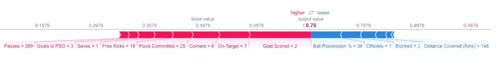
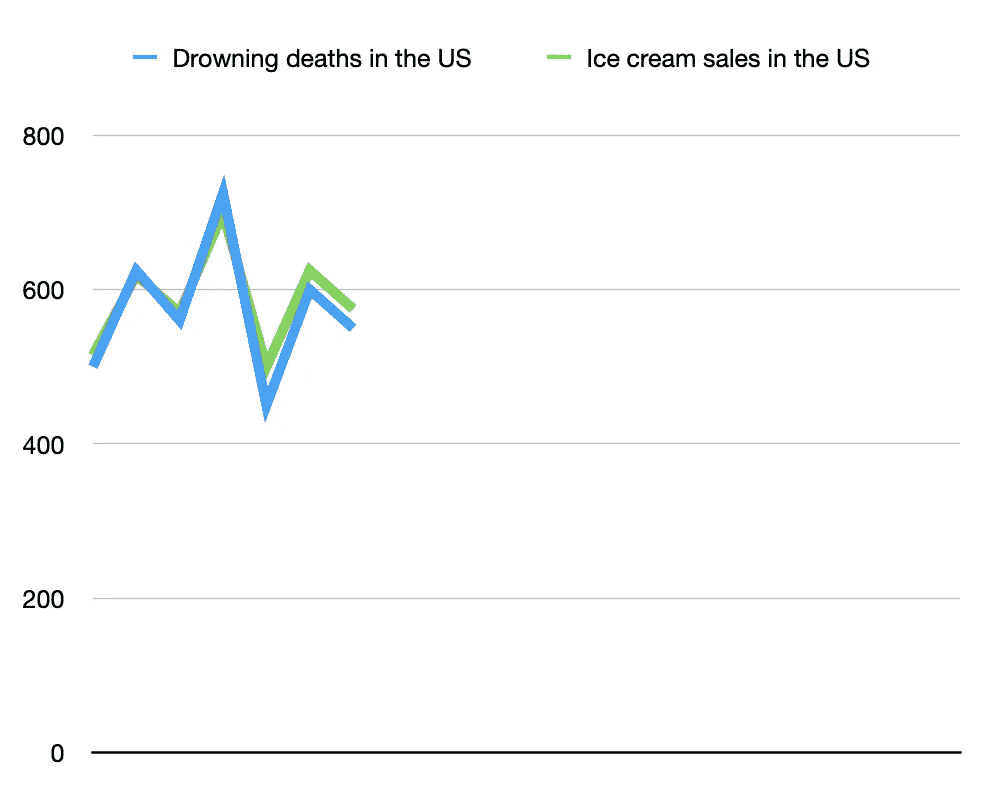

# 使用机器学习的动作规则发现

> 原文：<https://towardsdatascience.com/action-rules-discovery-using-machine-learning-1cba6cd680d7?source=collection_archive---------39----------------------->

## **从数据中提取可操作的规则和提升估计值**


来源:[https://images . unsplash . com/photo-1522163182402-834 f 871 FD 851？ixlib = r b-1 . 2 . 1&ixid = eyjhchbfawqiojeymdd 9&auto = format&fit = crop&w = 1593&q = 80](https://images.unsplash.com/photo-1522163182402-834f871fd851?ixlib=rb-1.2.1&ixid=eyJhcHBfaWQiOjEyMDd9&auto=format&fit=crop&w=1593&q=80)*根据对蓝海瀚的许可*

**在本文中，我们将讨论:**

*   可解释的机器学习，相关性与因果性，用例
*   一个结合了预测和因果推理的强大 python 包，一个端到端的*动作规则发现*模型

链接到我的其他文章

1.  [深度核和高斯过程](/deep-kernels-and-gaussian-processes-for-few-shot-learning-38a4ac0b64db)
2.  [tensor flow 中的自定义损失函数](/custom-tensorflow-loss-functions-for-advanced-machine-learning-f13cdd1d188a)
3.  [用增强树进行预测和推断](/prediction-and-inference-with-boosted-trees-and-shapley-values-4ffef46b969a)
4.  [Softmax 分类](/the-softmax-function-neural-net-outputs-as-probabilities-and-ensemble-classifiers-9bd94d75932)
5.  [气候分析](/analyzing-climate-patterns-with-self-organizing-maps-soms-8d4ef322705b)

**简介**

假设你是一个在企业工作的数据魔术师，任务是提出一个客户流失预测模型，以预测哪些客户有退订你的企业提供的服务的风险。你在 [Colab Pro](https://colab.research.google.com/signup) 上的一些 P100 GPU 上快速旋转一个深度神经网络，获得一些高预测精度，喝一杯康普茶，然后就可以收工了。第二天下午，你的老板打电话给你，说虽然预测能力很有用，但她需要知道哪些因素导致了客户流失的可能性，以及影响的程度。

您修改模型，而不是深度神经网络，使用 LightGBMs 的集合，结合对单个提升树计算的 [Shapley 值](https://github.com/slundberg/shap)，以给出如下的因子推断输出:



进球越多=流失越多…是这样吗？[https://github.com/slundberg/shap](https://github.com/slundberg/shap)在蓝海瀚的许可下

你有了另一个康普茶，满足于发现了(也相当有力地)模型认为哪些因素导致了流失，然后就到此为止。

就在你周五下午下班之前，你的老板 Zoom 再次打电话给你，告诉你尽管因素推断见解很棒，但我们仍然不知道这些因素是否实际上*导致了*流失或保留。她提醒你，相关性并不意味着因果关系，而且她也不知道模型所暗示的哪些因素实际上是因果关系，而不是巧合或虚假的相关性。



虚假相关的一个例子

作为一个痴迷的数据魔术师，你在网上搜索，无意中发现了一块隐藏的宝石，它能做你老板要求的一切。

有一个监督机器学习的分支叫做**提升建模**，它处理回答诸如“X 干预/行动会在多大程度上影响结果 Y？”给定包含关于干预 X 和结果 Y 的数据的历史记录数据集。X 对 Y 的影响是一个称为**提升**的量(如果 Y 是概率，通常是百分比)。在本文中，我们将简要介绍由[1]创建的名为 **actionrules** 的包，以及如何应用它来发现动作规则并量化它们对结果的影响。

**动作规则**

我们将简要介绍一些关于分类规则**、**动作规则**、**支持**、**置信度的定义，并看看如何估计提升。

分类规则 r_n 定义为:

*r*_ n =[(x1，n∧x2，n ∧ … ∧ X_m，n ) → Y_n]

其中元组(X_1，n ∧ X_2，n ∧ … ∧ X_m，n)是来自 n 个输入列的特定值 X_m。这个元组被称为**前件**或 ant，结果 Y_n 被称为**后件**。例如:

[(年龄= 55 岁∧吸烟=是∧体重= 240 磅)→心脏病风险=是]

是一个分类规则。分类规则通过称为**支持度**和**置信度**的两个数字进一步量化。支撑物被定义为

sup(ant → Yn) :=规则数(ant → Yn)

这是匹配条件(ant → Yn)的分类规则的数量，或者是匹配前因和后果的规则的数量。置信度定义为

conf(ant→Yn)= sup(ant→Yn)/sup(ant)

或者(ant → Yn)的支持度除以只有匹配前件的规则总数。

操作规则是分类规则的扩展:

*a*_ n =[*f*∧(X→X ')]→(Y→Y ')

其中 *f* 是一组**固定的**或不可改变的属性。对于动作规则，我们考虑固定属性和非固定或**灵活**属性的结合，从初始集合 X 到 X’的改变将改变结果 Y 到 Y’。一个具体例子是

[(年龄= 55 ∧(吸烟=是→否∧体重= 240 磅→190 磅)→心脏病风险=否]

原则上说，如果我们的受试者年龄固定，戒烟并因节食/锻炼而减轻体重，他们将不再有患心脏病的风险。我们可以再次使用置信度和支持度来量化通过某种方法发现的动作规则的质量。对动作规则的支持考虑了构成动作规则的两个分类规则 *r* _1 = (X→Y)和*r*_ 2 =(X’→Y’)，并被定义为

sup(*a*_ n)= min(sup(*r*_ 1)，sup( *r* _2))

并且动作规则的置信度被定义为

conf(*a*_ n)= conf(*r*_ 1)* conf(*r*_ 2)。

直观上，动作规则的支持度只能等于其分类规则之一的最小支持度，并且动作的置信度将小于或等于分类规则的任何一个置信度。

最后，**隆起**定义为

隆起= P(结果|治疗)-P(结果|无治疗)。

一般来说，任何提升模型都会尝试估计上述两种条件概率。

**代码示例**

动作规则发现算法的细节可以在源代码[1]中找到，但是简单地说，动作规则包包含了基于启发式的分类和动作规则发现算法，以监督的方式运行(意味着我们必须拥有/指定目标或结果标签)。我们将在一家名为 telco.csv 的电信公司的玩具客户流失数据集上运行动作规则模型。

[https://github . com/hhl 60492/action rules/blob/master/notebooks/data/telco . CSV](https://github.com/hhl60492/actionrules/blob/master/notebooks/data/telco.csv)

根据 Kaggle 数据集页面[2]:

数据集包括以下信息:

*   上个月内离开的客户—这一列称为流失
*   每位客户已注册的服务—电话、多条线路、互联网、在线安全、在线备份、设备保护、技术支持以及流媒体电视和电影
*   客户账户信息——他们成为客户的时间、合同、支付方式、无纸化账单、每月费用和总费用
*   客户的人口统计信息—性别、年龄范围，以及他们是否有伴侣和家属

首先，我们使用控制台安装 **actionrules** 包:

```
pip install actionrules-lukassykora
# you can also call the following command in a Jupyter Notebook
# !pip install actionrules-lukassykora
```

接下来导入相关的包

```
import pandas as pd
from actionrules.actionRulesDiscovery import ActionRulesDiscovery
```

读入数据集并检查头部

```
dataFrame = pd.read_csv(“telco.csv”, sep=”;”)
dataFrame.head()
```

现在实例化动作规则模型并对数据运行模型拟合

```
import time actionRulesDiscovery = ActionRulesDiscovery()
actionRulesDiscovery.load_pandas(dataFrame)start = time.time()# define the stable and flexible attributes
actionRulesDiscovery.fit(stable_attributes = [“gender”, “SeniorCitizen”, “Partner”],
 flexible_attributes = [“PhoneService”, 
 “InternetService”, 
 “OnlineSecurity”, 
 “DeviceProtection”, 
 “TechSupport”,
 “StreamingTV”,
 ],
 consequent = “Churn”, # outcome column
 conf=60, # predefined List of confs for classification rules
 supp=4, # predefined List of supports for classification rules
 desired_classes = [“No”], # outcome class
 is_nan=False,
 is_reduction=True,
 min_stable_attributes=1, # min stable attributes in antecedent
 min_flexible_attributes=1 # min flexible attributes in antecedent
 )end = time.time()
print(“Time: “ + str(end — start) + “s”)
```

在 MacBook Pro 1.4 GHz 英特尔酷睿 i5 处理器上，运行时间大约为 9 秒

接下来，我们统计发现的操作规则的数量:

```
print(len(actionRulesDiscovery.get_action_rules()))
```

结果发现了 8 条行为规则。现在让我们来看看实际的规则是什么:

```
for rule in actionRulesDiscovery.get_action_rules_representation():
    print(rule)
    print(“ “)
```

我们发现的一个规则的例子

```
r = [(Partner: no) ∧ (InternetService: fiber optic → no) ∧ (OnlineSecurity: no → no internet service) ∧ (DeviceProtection: no → no internet service) ∧ (TechSupport: no → no internet service) ] ⇒ [Churn: Yes → No] with support: 0.06772682095697856, confidence: 0.5599898610564512 and uplift: 0.05620874238092184.
```

我们发现了一个有趣的现象，没有互联网服务的单身(合作伙伴=否)电信客户流失的可能性约为 5.6%，支持度为 6.7%，信心为 55%。

从商业角度来看，这表明我们可能需要在短期内降低向单一客户(合作伙伴:否)积极营销附加互联网服务的力度，以减少客户流失，但我们最终需要设计一个更好的针对未来人口的营销策略，因为我们仍然希望像电信公司一样销售尽可能多的附加互联网服务。

上面有代码示例和结果的笔记本在这里:

[https://github . com/hhl 60492/action rules/blob/master/notebooks/Telco % 20-% 20 action % 20 rules . ipynb](https://github.com/hhl60492/actionrules/blob/master/notebooks/Telco%20-%20Action%20Rules.ipynb)

请随意使用灵活的属性、置信度和支持最小值，因为修改这些超参数会产生不同的结果。

**结论**

我们看到了如何定义分类规则和动作规则、每个规则的置信度和支持值、固定属性和可变属性之间的差异，以及如何使用监督学习和 actionrules Python 包对动作规则建模的示例。

找到具有高度支持、信心和高度提升的行动规则，可以给业务涉众新的洞察力，让他们知道要采取哪些行动才能使某个结果最大化。

**参考文献:**

[1]s kora、Luká和 Tomákli EGR。"动作规则:Python 中的反事实解释."RuleML 挑战 2020。CEUR WS。[http://ceur-ws.org/Vol-2644/paper36.pdf](http://ceur-ws.org/Vol-2644/paper36.pdf)

[https://www.kaggle.com/blastchar/telco-customer-churn](https://www.kaggle.com/blastchar/telco-customer-churn)