# 深度学习中的激活函数:从 Softmax 到 sparse max——数学证明

> 原文：<https://towardsdatascience.com/activation-functions-in-deep-learning-from-softmax-to-sparsemax-math-proof-50c1eb293456?source=collection_archive---------17----------------------->

## 封闭解的稀疏最大求导及其损失函数

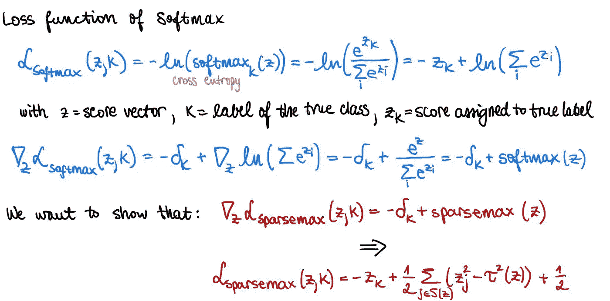

这篇文章有三个目的。第一部分讨论了 sparsemax 背后的动机及其与 softmax 的关系，总结了首次引入该激活函数的原始研究论文，并概述了使用 sparsemax 的优势。第二部分和第三部分致力于数学推导，具体寻找一个封闭形式的解决方案以及一个适当的损失函数。

# 1 .Sparsemax 概述

在论文[“从 Softmax 到 Sparsemax:注意力和多标签分类的稀疏模型”](https://arxiv.org/abs/1602.02068)中，Martins 等人通过引入 **Sparsemax** 提出了广为人知的 softmax 激活函数的新替代方案。

虽然 softmax 是输出 K 个概率的归一化概率分布的多类分类的合适选择，但在许多任务中，我们希望获得更稀疏的输出。Martins 等人引入了一种新的激活函数，称为 sparsemax，它输出多项式分布的稀疏概率，从而从分布的质量中滤除噪声。这意味着，sparsemax 将为某些类分配一个恰好为 0 的概率，而 softmax 将保留这些类，并为它们分配非常小的值，如 10⁻。Sparsemax 在大型分类问题中特别有用；例如，在自然语言处理(NLP)任务中，softmax 层对非常大的词汇集上的多项式分布进行建模。

然而，在实践中，将 softmax 函数变为稀疏估计器并不是一项简单的任务。获得这样的变换，同时保留 softmax 的一些基本属性(例如，评估简单、区分成本低并且容易变换为凸损失函数)证明是相当具有挑战性的。机器学习中绕过它的传统方法是使用 L1 罚函数，该罚函数允许关于输入变量和/或神经网络深层的某种程度的稀疏性。虽然这种方法相对简单，但 L1 惩罚影响神经网络的*权重*，而不是作为稀疏概率的目标*输出*。因此，Martins 等人认识到需要一个补充激活函数，*即* sparsemax，他们将其公式化为一个可解的二次问题，并在一组约束下找到一个解，以获得与 softmax 相似的性质。

在深入研究 sparsemax 实现背后的证据之前，让我们首先讨论这篇论文中几个重要的高级发现。以下要点总结了一些主要要点:

*   **Sparsemax 是分段线性激活函数**

虽然 softmax 形状相当于传统的 s 形，但 sparsemax 在一维上是“硬”s 形。此外，在二维中，sparsemax 是具有整个饱和区(0 或 1)的分段线性函数。这里有一张图可以帮助你想象 softmax 和 sparsemax。

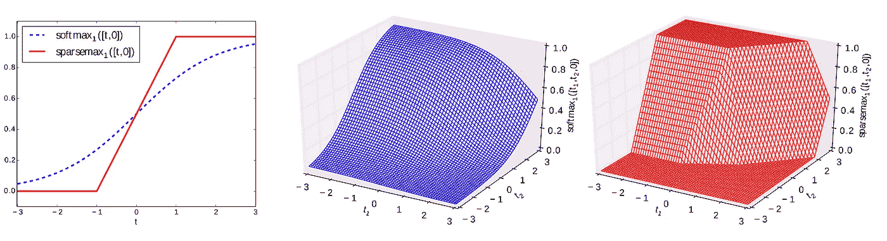

来自[“从 Softmax 到 Sparsemax:注意力和多标签分类的稀疏模型”](https://arxiv.org/abs/1602.02068)

*   **Sparsemax 损失与分类 Huber 损失相关**

二元情况下导出的稀疏最大损失函数与用于分类的修正 Huber 损失直接相关(定义见 [Zhang，Tong。基于凸风险最小化的分类方法的统计行为和一致性。《统计年鉴》，第 56-85 页，2004 年](https://projecteuclid.org/download/pdf_1/euclid.aos/1079120130)和[邹、惠、朱、纪和哈斯蒂、特雷弗。边缘向量、容许损失和基于边缘的多类分类器。斯坦福大学技术报告，2006 年](http://ww.web.stanford.edu/~hastie/Papers/margin.pdf))。也就是说，如果 *x* 和 *y* 是 sparsemax 之前的两个分数，使用 sparsemax 层和 sparsemax 损失，其中 *t = x - y* ，并且不失一般性地假设正确的标签是 *1* ，我们可以表明:

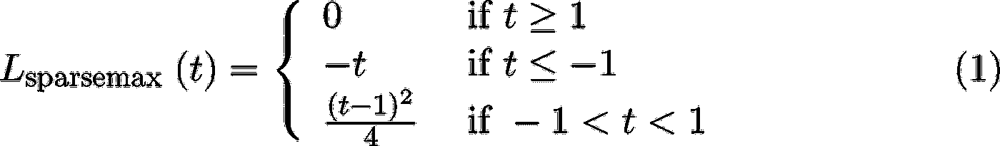

这是一个很好的性质，证明了 sparsemax 的理论基础；胡伯损失是 L1 和 L2 损失之间的权衡，这正是我们试图从 softmax 激活中获得的，同时包括稀疏性。此外，这种与 Huber 损失的相似性可以通过将该损失与其他标准分类损失进行比较来证明:

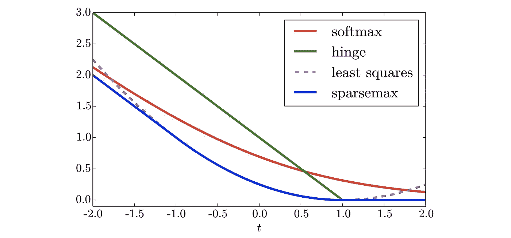

来自[“从 Softmax 到 Sparsemax:注意力和多标签分类的稀疏模型”](https://arxiv.org/abs/1602.02068)

在上图中，你可以看到对于 t 的负值，*即*对于大误差的情况，损耗与误差成线性比例关系，类似于铰链损耗。然而，随着 t 收敛于 1，*即*误差减小，我们观察到平方关系，类似于最小平方损失。

*   **随着类别数量的增加，Sparsemax 可以提高性能**

sparsemax 框架已经被证明在具有大量标签的数据集上表现得特别好。在下面的示例中，您可以在表 1 中看到几个数据集及其详细信息，在表 2 中可以看到不同激活函数*，即* sigmoid、softmax 和 sparsemax 的微观平均/宏观平均 F1 分数。我们观察到，随着标签数量的增加(*即*较低的行)，与 softmax 相比，sparsemax 的性能提升变得越来越明显。

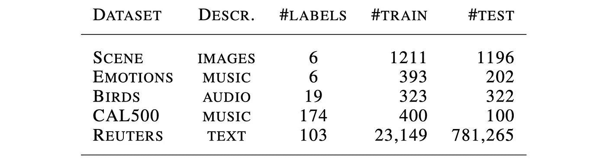

表 1:数据集描述([来源](https://arxiv.org/abs/1602.02068))

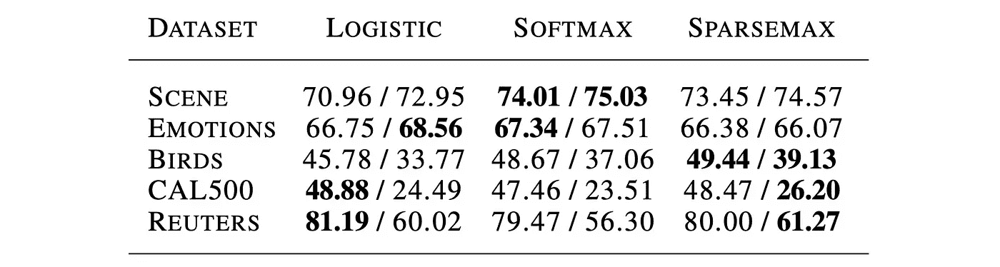

表 2:数据集上的性能基准(s[source](https://arxiv.org/abs/1602.02068)

*   **Sparsemax 可用于注意力模型，以提高潜在的性能和更好的可解释性**

稀疏输出的想法也可以在具有注意力机制的深度学习模型中得到利用，这是一种在潜在的大量实体上计算注意力权重的神经网络。这种注意机制在翻译或语言建模等 NLP 任务中被证明是特别有效的，这导致了所谓的*转换器*、*即利用自我注意的*非递归模型架构的创建(更多详细信息请参见 [Attention Is All You Need，Vaswani et al .，2017](https://arxiv.org/abs/1706.03762) )，广泛用于 BERT 等最先进的语言模型(参见[BERT:Devlinet al .的《深度双向转换器的语言理解的预训练》与 softmax 相比，从 sparsemax 获得严格的零概率具有完全消除一些隐藏状态(词)的影响的优势，如果它们被判断为不相关的话，soft max 中所有不相关状态的无穷小贡献的总和最终会累积，并会影响模型性能。此外，零概率，我们放大了注意力的一个主要优势:可解释性。使用稀疏分数有助于清理注意力地图，并阐明注意力系统是如何工作的。](https://arxiv.org/abs/1810.04805)

然而，从经验上看，该论文报告了由于自然语言推理任务中的稀疏注意力而导致的仅小的性能提高。

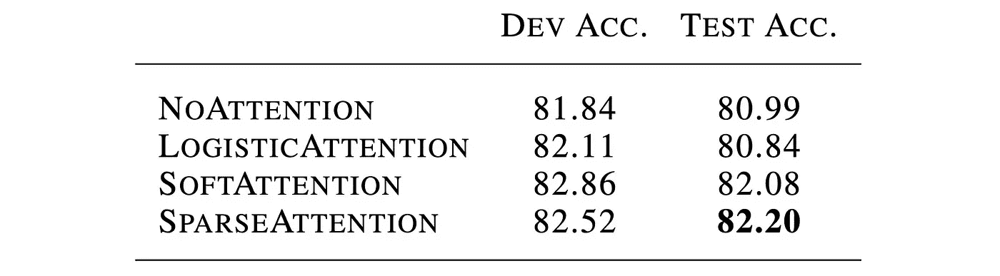

表 3:注意力模型在 SNLI 数据集上的性能(来自[论文](https://arxiv.org/abs/1602.02068)

现在，我们已经强调了 sparsemax 的一些优点和论文的主要发现，让我们继续进行 sparsemax 背后的两个重要推导:即，找到其封闭形式的解以及其损失函数的方程。

# 2.稀疏最大激活函数

## Softmax 综述

Softmax 是 sigmoid 对多类分类的推广。它使用 logit 变换将所有分数*z*映射到概率*T3]p∈[0，1]:*

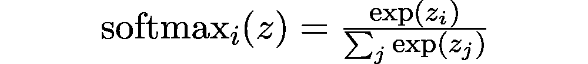

概念上，对于一组 *K* 类， *softmax* 是将ℝᴷ的向量映射到δᴷ的概率分布，*即*映射到 *K -1* 维概率单纯形的函数。更准确地说:

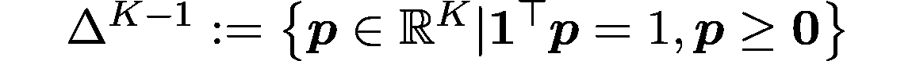

值得注意的是，只有 *K-1* 自由度是必要的，因为概率总和总是 1。

Softmax 被定义为完全支持，*即*非零值输出，数学定义为

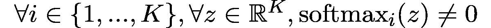

修改这个属性以允许零输出，这将使我们能够获得稀疏概率。

## Sparsemax 的定义

作者将稀疏最大激活函数公式化为二次约束优化问题:

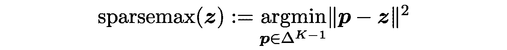

这相当于将其定义为 *z* 到概率单纯形*δᴷ**上的欧几里德投影。稀疏性是由在投影期间命中单纯形边界的概率高引起的，因此使得某些维度为零。*

## *封闭解*

*sparsemax 的上述定义可以以其封闭形式的解决方案写成*

*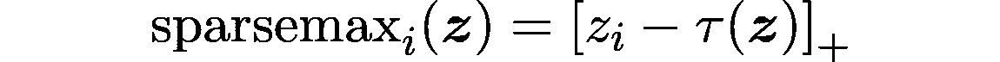**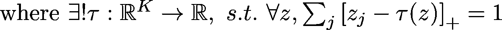*

*𝜏代表阈值函数。我们将在第 3 节一步一步地正式推导这个方程。*

*类似地，𝜏也可以用它的封闭解表示为*

*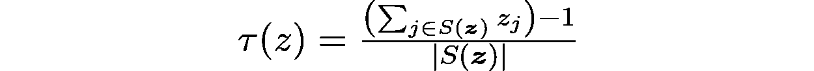**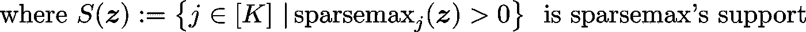*

*下面算法 1 的伪代码总结了这组等式，可以帮助更好地理解向量 *z* 的 sparsemax 计算背后的步骤:*

*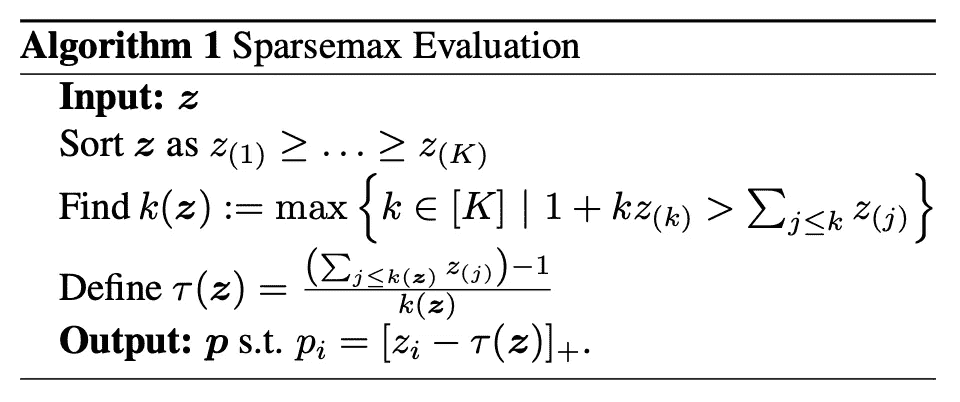*

*来自[“从 Softmax 到 Sparsemax:注意力和多标签分类的稀疏模型”](https://arxiv.org/abs/1602.02068)*

*具有挑战性的部分是确定阈值𝜏*(z)*；我们将在第 3 节的证明中回到这一点。最后，每个类别 *i* 的输出概率是 *z* 减去阈值𝜏 *(z)，如果值为正，则为*，如果值为负，则为 0。*

## *稀疏最大损失函数*

*最后，我们还想导出对应于 sparsemax 的损失函数；这将是第 4 节的一部分。虽然闭式解的第一个证明是直接从 sparsemax 的原始定义中确定的，但损失函数是一个偏好问题，可以采取不同的形式。我们来解释一下原因。*

*可以看出，结合 softmax 使用交叉熵损失(*即*多项式分布上的负对数似然)，损失函数简化为*

*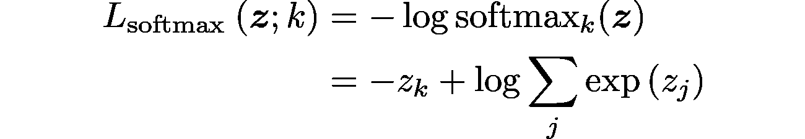*

*其中 *k* 等于真实标签的索引。*

*使用交叉熵损失和 softmax 的组合所带来的优点是将梯度简化为*

*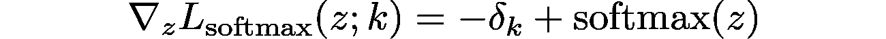**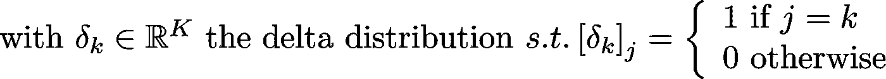*

*这意味着在反向传播期间，评估 *softmax(z)* 对于正向和反向传递都是足够的，并且不需要额外的计算。这种行为也是我们希望在 sparsemax 框架中保持的属性。*

*然而，根据经验，这种设置对于 sparsemax 来说是不可行的。尝试将 sparsemax 与交叉熵相结合所产生的一个问题是，该损失函数现在需要完全支持，*，即*仅非零值输出。但是由于损失函数取概率的对数，如果一个概率严格为零，那么它的*对数*就没有定义。这就是为什么交叉熵损失不能用于稀疏最大激活函数。作者建议找到一个可微分的损失函数，它将满足一个类似的梯度表达式，即*

*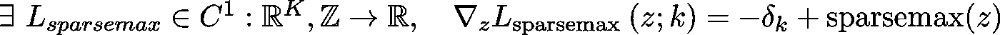*

*通过添加进一步的约束，即当 *S(z)={k}* ，*即*只有正确的类是非零时获得的最小 sparsemax 损失为 0，我们可以表明 sparsemax 损失函数具有以下形式*

*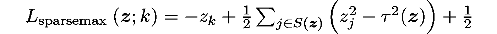*

# *3.证明 Sparsemax 闭型解的推导*

## *目标*

*该证明的目的是证明以下等价性:*

*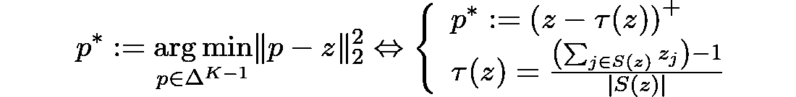*

*换句话说，我们要解决概率 *p* 和分数 *z* 之差的平方欧氏范数的 *arg min* 优化问题。这可以理解为从得分向量 *z.* 中选择*δᴷ**中最近的点**

## **关于卡鲁什-库什-塔克(KKT)条件的提醒**

**卡鲁什-库恩-塔克(KKT)条件是数学优化中的一个概念。在给定一组特定约束的情况下，它们表示为了满足非线性规划解的一阶必要条件。在我们的 sparsemax 设置中，我们想找到某个函数 *f :* ℝⁿ → ℝ在一定条件下的极小点。**

**然后优化问题可以写成如下:找到使函数 *f* 最小化的 *x* ，使得 g *(x)* 和 h *(x)* 上的条件得到满足，*即:***

**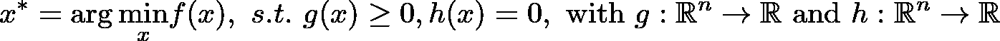**

**为了解决这个问题，我们首先需要定义拉格朗日函数 *L(x，μ，λ)* :**

**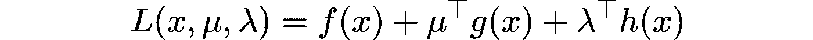**

**KKT 方法(在较高层次上)声明，给定拉格朗日函数 *L，*如果 *(x*，μ *)* 是 *L* 的鞍点，具有*μ ≥0* 和互补松弛度*μᵢgᵢ(x*)≥0·∀I∈[0，n]* ，那么 *x** 是上述优化问题的最优向量。**

**具体地说，我们简单地寻找拉格朗日函数的梯度等于零的值，即:**

**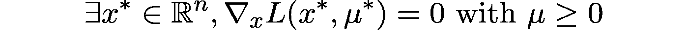**

## **衍生物**

**鉴于 sparsemax 是一个约束优化问题，我们用早期的符号*【KKT】*，*即*与 *f* ， *g* 和 *h* 重写它如下:**

**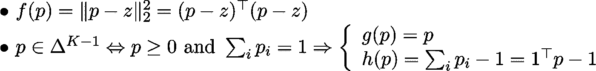**

**那么拉格朗日函数的形式就是**

**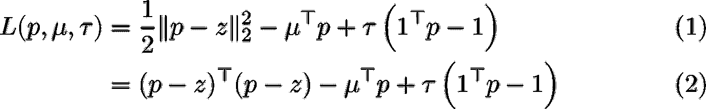**

**我们现在可以对关于 *x* 的拉格朗日函数进行微分:**

**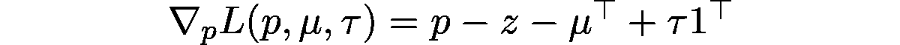**

**解变成了三个方程的系统:**

**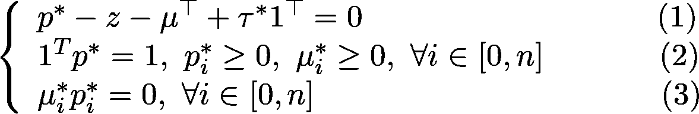**

**第一个方程(1)来自拉格朗日函数的梯度为零。第二个等式(2)来自于原始松弛条件，即 *μ≥0* 以及来自于 *p* 是正概率向量。最后，等式(3)是互补的松弛条件。**

**随后，我们基于等式(2)和(3)区分两种情况。对于每个维度*I∈【0，n】*，或者 *pᵢ* > 0* 从而*μᵢ*=0*或者 *μᵢ* > 0* 从而 *pᵢ*=0* 。更准确地说，这意味着我们考虑两种情况:支持面的元素 *S(z)* ，其中 *p > 0，*和支持面外的元素 *S(z)* ，其中 *p=0。***

**当我们继续这个 *sparsemax* 的证明时，我们需要记住我们的目标是两件事:确定非零概率的值，以及确定概率为 0 的条件。因此:**

**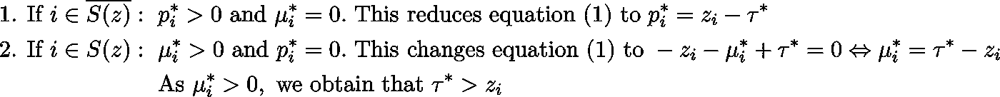**

**在 1。第二。， *zᵢ* 要么比𝜏*大，因此 *pᵢ** 等于它们的正差值，要么 *pᵢ** 为零。因此， *pᵢ*=(zᵢ -* 𝜏 *(z))⁺.***

**此外，从等式(2)我们知道 *∑ ᵢ pᵢ*=1* 并且存在|S(z)|非零 *pᵢ** ，因此:**

**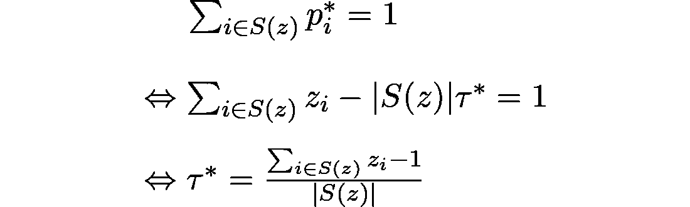**

**这就结束了 sparsemax 闭型解推导的第一个证明。**

# **4.证明二:Sparsemax 损失函数的推导**

## **目标**

**第二个证明的目标是证明以下等价性:**

**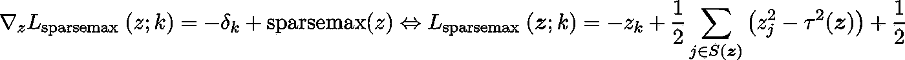**

**换句话说，我们想要导出 sparsemax 的损失函数的梯度与 sparsemax 损失函数本身之间的等价性。**

## **前题**

**在开始证明之前，我们需要定义一些重要的符号并建立两个重要的结果:**

**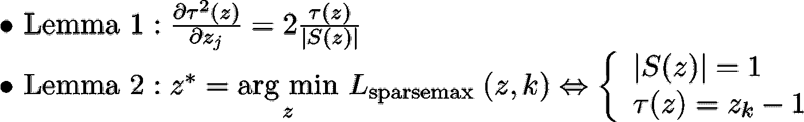**

**对于引理 1，我们可以直接计算𝜏关于 *z* 的偏导数。**

**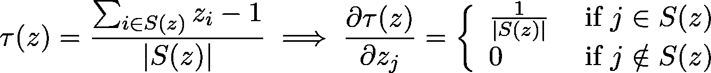**

**实际上，如果 *z ᵢ* 在 *S(z)* 中，那么它将出现在分子和中，并且它的导数将与| *S(z)* |成反比；否则，导数将为空。**

**接下来，使用链式法则，我们可以推断出𝜏对 *z* 的导数:**

**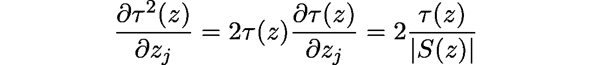**

**注意，如果 *j∉ S(z)* ，那么𝜏 *(z)=0* 。**

**在引理 2 中，我们感兴趣的是所谓的*过度自信* *稀疏最大值*，*即*当预测将 100%的权重仅分配给真实类 *k* 时。在这种情况下，我们有 *spar semax(z，k)=δ_k* 。这有两个后果，即:**

**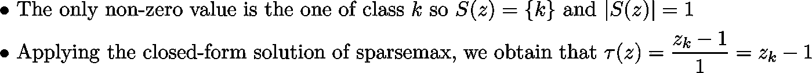**

## **衍生物**

**我们想要获得 *sparsemax* 的损失函数，使得**

****

**首先，让我们看看非矢量形式的 sparsemax 相对于 *zᵢ* 的偏导数:**

**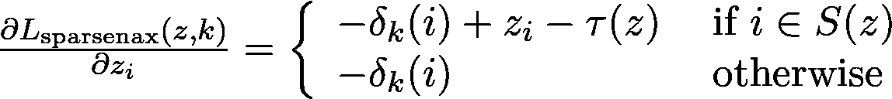****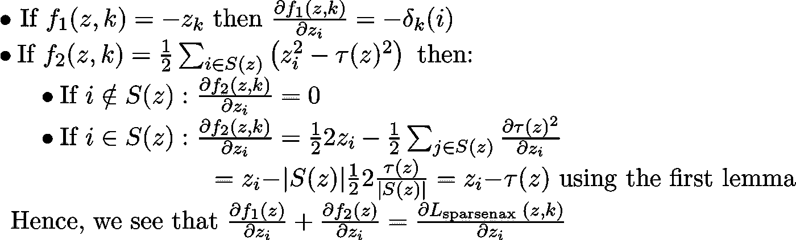**

**我们于是可以推断，对于 *K∈* ℝ *:***

**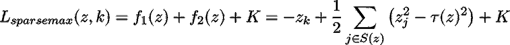**

**剩下的最后一步是确定积分常数。我们可以简单地选择 *K=0* ，梯度仍然是正确的，但是我们可能会有一个更合适的解决方案。这就是我们使用上面定义的第二个引理的地方。在完美预测的情况下，我们希望损失等于零，类似于 softmax 或其他损失函数，如 MAE/MSE。**

**更准确地说，我们需要满足以下要求:**

**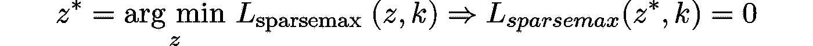**

**因此:**

**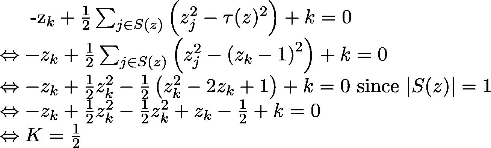**

**最后，我们得出:**

**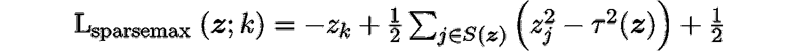**

**这就结束了关于 sparsemax 损失函数的推导的第二个证明。**

# **5.结论**

**在这篇文章中，我们介绍了 sparsemax 激活函数背后的思想和数学公式，它允许比传统 softmax 更稀疏的输出域。我们首先总结了 Martins 等人论文中的一些关键发现，从经验上得出结论，随着类别数量的增加，sparsemax 可以提高分类模型的性能。此外，性能提升以及更好的解释能力在用 sparsemax 训练的 NLP 注意力模型中普遍存在。最后，文章的主要部分致力于 sparsemax 背后的两个重要证明；即导出封闭形式的解和基本的损失函数。**