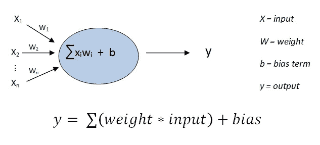
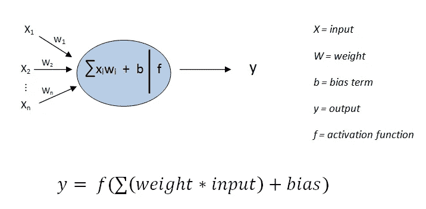
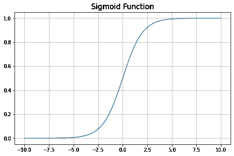
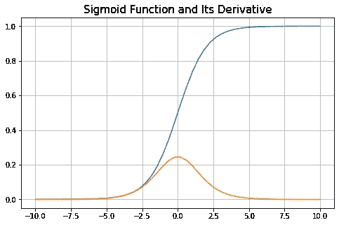
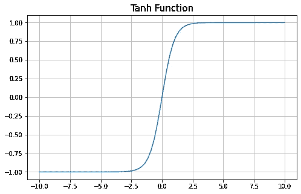
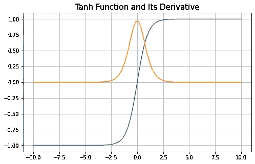
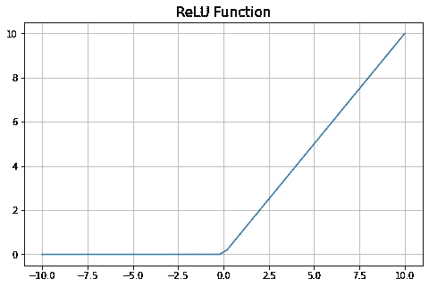
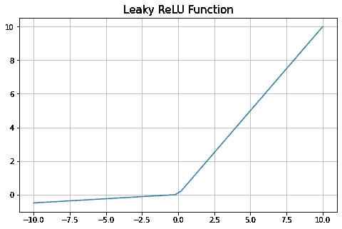
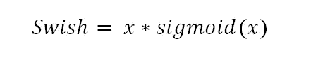
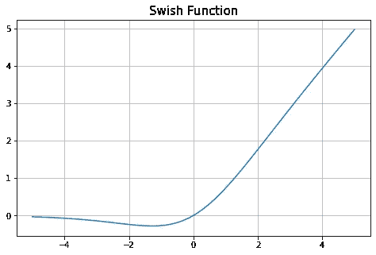

# 神经网络中的激活函数

> 原文：<https://towardsdatascience.com/activation-functions-in-neural-networks-eb8c1ba565f8?source=collection_archive---------62----------------------->

## 为什么我们需要激活函数，是什么让它们如此特别


尼尔·托马斯在 Unsplash 上拍摄的照片

神经网络之所以如此特殊，是因为它们能够模拟输入和输出之间高度复杂的关系。我们无法用线性模型实现这些复杂的关系。因此，神经网络需要能够表示**非线性**。这就是我们在神经网络中使用激活函数的原因。如果没有激活函数，神经网络可以被认为是一个线性模型包。

激活功能增加了神经网络的学习能力。用神经网络解决的许多任务包含非线性，例如图像、文本、声波。因此，我们需要非线性来解决深度学习领域中最常见的任务，如图像和语音识别、自然语言处理等。

没有激活功能的神经元只是输入和偏置的线性组合。



没有激活功能的神经元

这只是一个神经元。神经网络中典型的隐藏层有许多神经元。然而，没有激活函数，我们有许多不同的输入线性组合。通过添加额外的隐藏层，我们得到输入的线性组合的线性组合，而不会给我们带来非线性的复杂性。然而，当我们向神经元添加激活函数时，我们就摆脱了线性的诅咒，能够模拟复杂的非线性关系。



具有激活功能的神经元

有许多不同的激活功能可用。每一个都有自己的优点和缺点以及具体的特点。我们不仅对激活函数本身感兴趣，而且对它的导数也感兴趣。原因是神经网络实际“学习”的方式。

输入乘以权重并加上偏差。然后应用激活函数得到输出。这个过程被称为**正向传播**。将神经网络的输出与实际目标值进行比较，并计算差值(或损失)。关于损失的信息被反馈到神经网络，并且权重被更新，从而减少损失。这个过程被称为**反向传播。**使用基于导数的**梯度下降算法**更新权重。因此，激活函数的导数也应该携带关于输入值的信息。

有许多激活功能可用。我们将涵盖神经网络中最常用的非线性激活函数。

# **乙状结肠**

我们熟悉逻辑回归中的 sigmoid 函数。著名的 S 形函数将输入值转换为 0 到 1 之间的范围。


我们来画一下。我们首先创建一个 numpy 数组，并对其应用 sigmoid 函数。

```
import numpy as np
import pandas as pdx = np.linspace(-10,10,50)
y = 1 / (1 + np.exp(-x))
```

然后用 matplotlib 绘图。

```
import matplotlib.pyplot as plt
%matplotlib inlineplt.figure(figsize=(8,5))
plt.title("Sigmoid Function", fontsize=15)
plt.grid()
plt.plot(x, y)
```



每个神经元的输出在 0 和 1 之间标准化。上图的中间区域显示，x(输入)的微小变化会导致 y(输出)的相对较大变化。Sigmoid 函数擅长检测这些区域中的差异，这使其成为良好的分类器。因此，它通常用于二元分类任务。

不幸的是，没有什么是完美的。sigmoid 函数有一个缺点。随着我们远离中心，x 值的变化对 y 值的影响很小或没有影响，让我们来看看 sigmoid 函数的导数。我们可以使用 numpy 的梯度函数来计算导数:

```
x = np.linspace(-10,10,50)
dx = x[1]-x[0]
y = 1 / (1 + np.exp(-x))
dydx = np.gradient(y, dx)
```

然后我们在同一张图上绘制 y 和 dydx:

```
plt.figure(figsize=(8,5))
plt.title("Sigmoid Function and Its Derivative", fontsize=15)
plt.grid()
plt.plot(x, y)
plt.plot(x, dydx)
```



我们可以看到，当我们远离中心时，导数趋向于零。在评论这个图之前，让我们记住神经网络是如何学习的。神经网络的学习意味着更新权重以最小化损失(实际值和预测值之间的差异)。基于梯度更新权重，梯度基本上是函数的导数。如果梯度非常接近零，则以非常小的增量更新权重。这导致神经网络学习速度非常慢，永远无法收敛。这也被称为**消失梯度**问题。

# **双曲正切**

Tanh 与 sigmoid 函数非常相似，只是它是围绕原点对称的。输出值限制在(-1，+1)的范围内。

```
x = np.linspace(-5,5,80)
y_tanh =2*(1 / (1 + np.exp(-2*x)))-1plt.figure(figsize=(8,5))
plt.title("Tanh Function", fontsize=15)
plt.grid()
plt.plot(x, y_tanh)
```



Tanh 是以**零点为中心的**，这样渐变就不会被限制在一个特定的方向上移动。因此，它比 sigmoid 函数收敛得更快。

tanh 的导数类似于 sigmoid 的导数，但是更陡。



从导数线可以看出，tanh 也有消失梯度的问题。

# **ReLU(整流线性单元)**

对于大于 0 的输入，relu 函数的输出等于输入值。对于所有其他输入值，输出为 0。

```
x = np.linspace(-10,10,50)
y_relu = np.where(x < 0, 0, x)plt.figure(figsize=(8,5))
plt.title("ReLU Function", fontsize=15)
plt.grid()
plt.plot(x, y_relu)
```



Relu 使得仅激活网络中的一些神经元成为可能，这使得计算效率比 tanh 和 sigmoid 更高。所有的神经元都被 tanh 和 sigmoid 激活，这导致了密集的计算。因此，relu 比 tanh 和 sigmoid 收敛得更快。

对于大于 0 的输入值，relu 的导数为 1。对于所有其他输入值，导数为 0，这导致一些权重在反向传播期间永远不会更新。因此，神经网络不能学习负输入值。这个问题被称为**将死再禄**问题。使用泄漏 relu 函数的一种解决方案。

# **泄漏的 ReLU**

除了正输入值之外，它与 relu 相同。对于负值，leaky relu 输出一个非常小的数字，而 relu 只给出 0。



# **Softmax**

Softmax 获取实数的输入值，并将其归一化为概率分布。概率与输入值的指数成正比。考虑一下，神经网络的输出层有 10 个神经元。Softmax 函数采用这 10 个输出并创建概率分布。10 个值的概率加起来是 1。

Softmax 激活用于具有多个类别的分类任务。

# **唰**

[Swish](https://arxiv.org/abs/1710.05941v1) 是一个自门控激活功能，与我们迄今为止讨论过的功能相比相对较新。这是由谷歌的研究人员发现的。在计算效率方面，它与 relu 相似，但在更深的模型上比 relu 表现得更好。正如研究人员所说，“在许多具有挑战性的数据集上，swish 往往比 relu 更好地工作”。



让我们画出 swish 的曲线图。

```
x = np.linspace(-5,5,50)
y_swish = x*(1 / (1 + np.exp(-x)))plt.figure(figsize=(8,5))
plt.title("Swish Function", fontsize=15)
plt.grid()
plt.plot(x, y_swish)
```



Swish 在 0 处没有锐边，不像 relu 在训练时更容易收敛。

我们已经讨论了 6 种不同的激活函数。它们在某些方面都各有利弊。激活函数对计算复杂性和模型的收敛性有影响。因此，更好地理解它们是如何表现的，以便我们可以根据任务选择最佳的激活函数。通常，激活函数的期望属性是:

*   计算成本低
*   零居中
*   可微的。激活函数的导数需要携带关于输入值的信息，因为权重是基于梯度更新的。
*   不会导致消失梯度问题

感谢您的阅读。如果您有任何反馈，请告诉我。