# 激活、卷积和池化—第 4 部分

> 原文：<https://towardsdatascience.com/activations-convolutions-and-pooling-part-4-5dd7f85aa9f7?source=collection_archive---------54----------------------->

## [FAU 讲座笔记](https://towardsdatascience.com/tagged/fau-lecture-notes)深度学习

## 联营机制

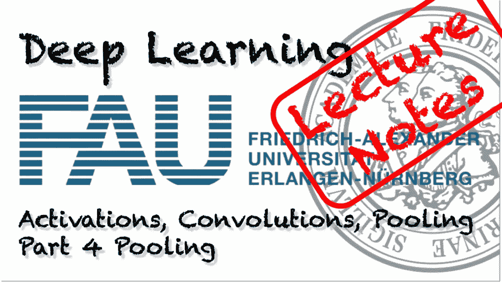

FAU 大学的深度学习。下图 [CC BY 4.0](https://creativecommons.org/licenses/by/4.0/) 来自[深度学习讲座](https://www.youtube.com/watch?v=p-_Stl0t3kU&list=PLpOGQvPCDQzvgpD3S0vTy7bJe2pf_yJFj&index=1)

**以上是 FAU 的 YouTube 讲座** [**深度学习**](https://www.youtube.com/watch?v=p-_Stl0t3kU&list=PLpOGQvPCDQzvgpD3S0vTy7bJe2pf_yJFj&index=1)****的** [讲义。这是与幻灯片匹配的讲座视频&的完整抄本。我们希望，你喜欢这个视频一样多。当然，这份抄本是用深度学习技术在很大程度上自动创建的，只进行了少量的手动修改。如果你发现了错误，请告诉我们！](https://towardsdatascience.com/tagged/fau-lecture-notes)**

# 航行

[**上一讲**](/lecture-notes-in-deep-learning-activations-convolutions-and-pooling-part-3-d7faeac9e79d) **/** [**观看本视频**](https://youtu.be/VcJU4ZvauLQ) **/** [**顶级**](/all-you-want-to-know-about-deep-learning-8d68dcffc258) **/** [**下一讲**](/regularization-part-1-db408819b20f)

欢迎回到深度学习！所以今天，我想和你谈谈实际的池实现。池层是许多深层网络中的一个重要步骤。这背后的主要思想是你想减少空间域的维数。

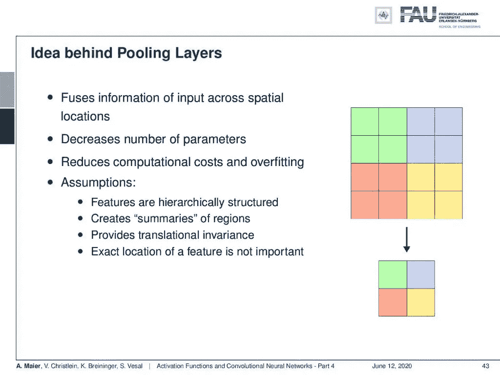

汇集通过归约技术减少了空间信息。 [CC 下的图片来自](https://creativecommons.org/licenses/by/4.0/)[深度学习讲座](https://www.youtube.com/watch?v=p-_Stl0t3kU&list=PLpOGQvPCDQzvgpD3S0vTy7bJe2pf_yJFj&index=1)的 4.0 。

在这个小例子中，我们将绿色矩形、蓝色矩形、黄色矩形和红色矩形中的信息汇总为一个值。因此，我们有一个必须映射到单个值的 2x2 输入。这当然减少了参数的数量。它引入了层次结构，并允许您使用空间抽象。此外，它减少了计算成本和过拟合。当然，我们需要一些基本的假设，其中一个假设是特征是分层结构的。通过池化，我们减少了输出大小，并引入了信号中固有的层次结构。我们讨论过眼睛是由边缘、线条和脸组成的，就像眼睛和嘴一样。这必须存在，以使联营成为一个明智的操作，包括在您的网络中。

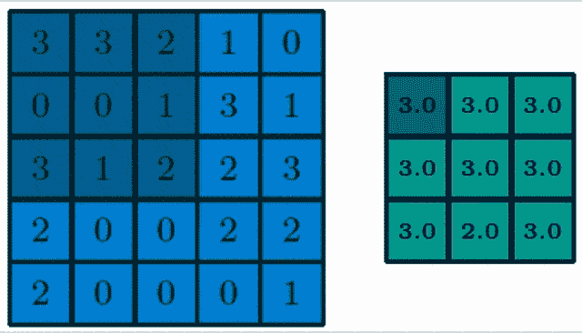

最大汇集选择感受野中的最大指数。 [CC 下的图片来自](https://creativecommons.org/licenses/by/4.0/)[深度学习讲座](https://www.youtube.com/watch?v=p-_Stl0t3kU&list=PLpOGQvPCDQzvgpD3S0vTy7bJe2pf_yJFj&index=1)的 4.0 。

在这里，您可以看到一个 3x3 层的池，我们选择最大池。因此，在最大池中，只有最大数量的受体场才会真正传播到输出中。显然，我们也可以大踏步地工作。通常，步幅等于邻域大小，这样我们每个感受野得到一个输出。

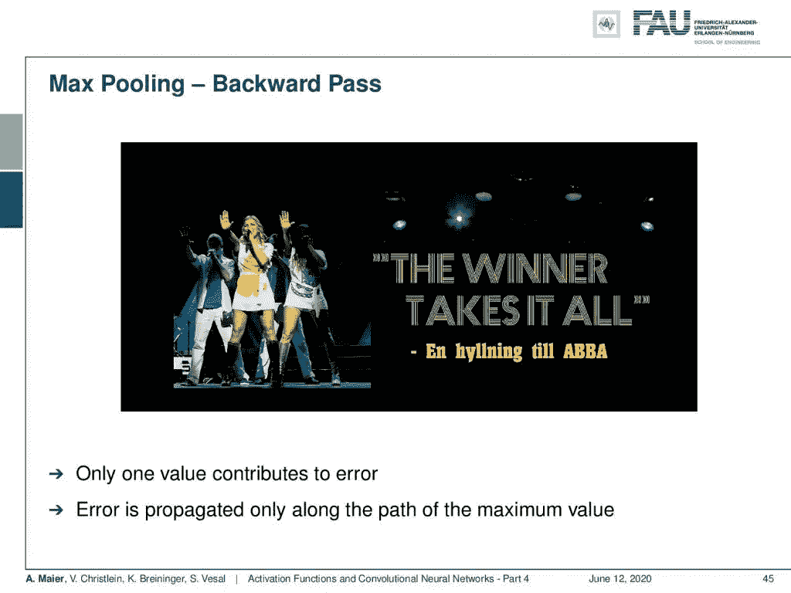

最大汇集仅考虑每个感受野中的最大值。ABBA 的粉丝请点击[这里](https://www.youtube.com/watch?v=iyIOl-s7JTU)。来自[深度学习讲座](https://www.youtube.com/watch?v=p-_Stl0t3kU&list=PLpOGQvPCDQzvgpD3S0vTy7bJe2pf_yJFj&index=1)的 4.0CC 下的图片。

这里的问题当然是最大值运算增加了额外的非线性，因此我们还必须考虑如何解决梯度过程中的这一步。本质上，我们再次使用次梯度概念，其中我们简单地传播到产生最大输出的单元中。所以，你可以说赢家通吃。

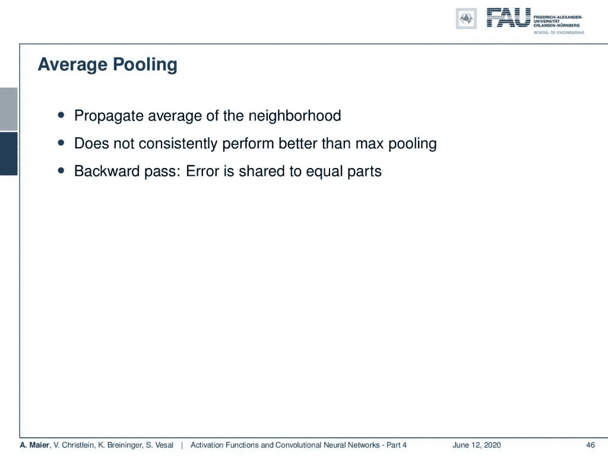

平均池是最大池的常见替代方法。 [CC 下的图片来自](https://creativecommons.org/licenses/by/4.0/)[深度学习讲座](https://www.youtube.com/watch?v=p-_Stl0t3kU&list=PLpOGQvPCDQzvgpD3S0vTy7bJe2pf_yJFj&index=1)的 4.0 。

另一种选择是平均分摊。这里，我们简单地计算邻域的平均值。但是，它的性能并不总是优于最大池。在反向传播过程中，误差被简单地平均分配并反向传播到相应的单元。

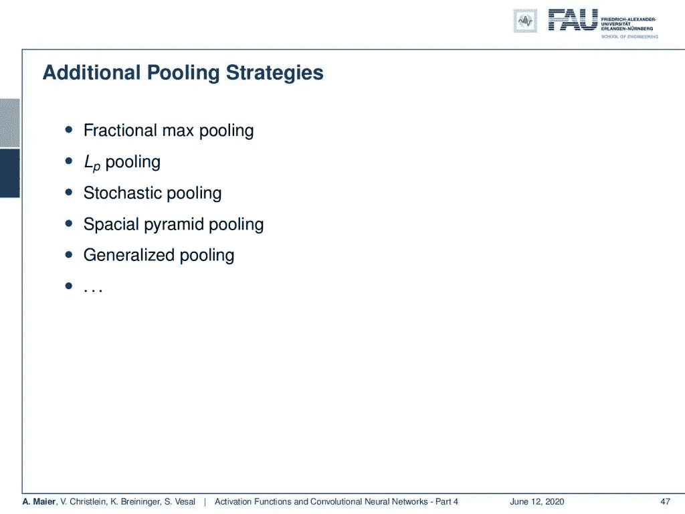

许多其他的池选择是可用的。 [CC 下的图片来自](https://creativecommons.org/licenses/by/4.0/)[深度学习讲座](https://www.youtube.com/watch?v=p-_Stl0t3kU&list=PLpOGQvPCDQzvgpD3S0vTy7bJe2pf_yJFj&index=1)的 4.0 。

还有许多池策略，如部分最大池，Lp 池，随机池，特殊金字塔池，广义池，等等。对此有一套完全不同的策略。我们已经讨论过的两种选择是步长卷积和 atrous 卷积。这变得非常流行，因为这样你就不必把最大池编码作为一个额外的步骤，并且减少了参数的数量。通常，人们现在使用 S 大于 1 的步进卷积，以便同时实现卷积和池化。

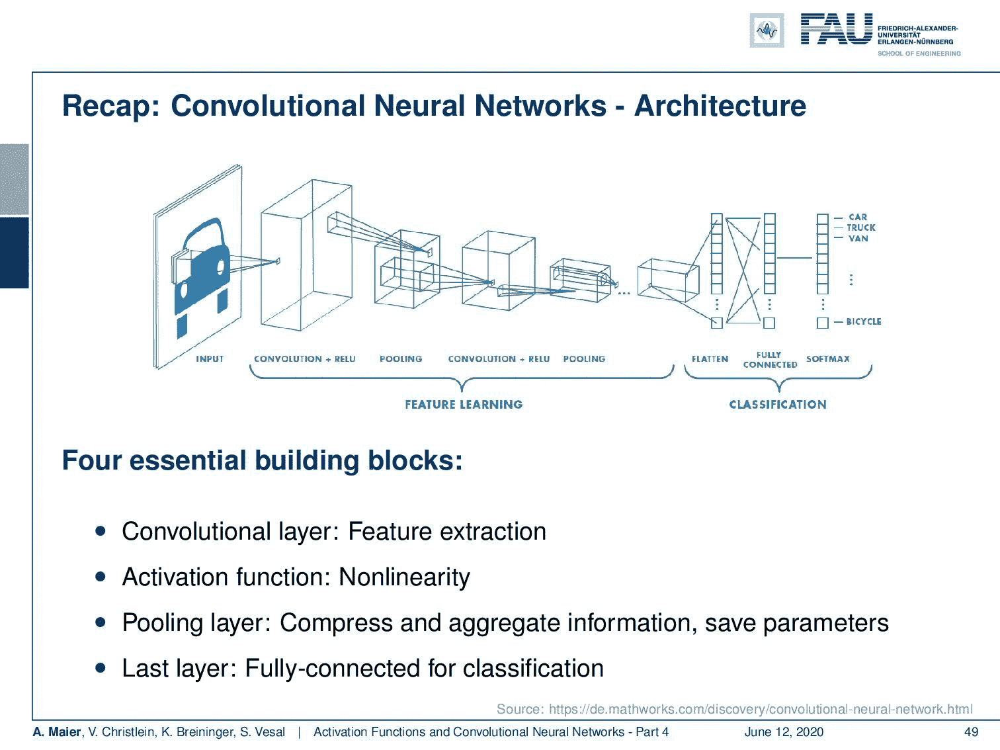

深层网络的典型设计选择。来自[深度学习讲座](https://www.youtube.com/watch?v=p-_Stl0t3kU&list=PLpOGQvPCDQzvgpD3S0vTy7bJe2pf_yJFj&index=1)的 [CC BY 4.0](https://creativecommons.org/licenses/by/4.0/) 下的图片。

让我们回顾一下我们的卷积神经网络正在做什么。我们讨论了卷积产生的特征图和汇集减少各自特征图的大小。然后，再次回旋和汇集，直到我们在一个抽象的表现结束。最后，我们有这些完全连接的层，以便进行分类。实际上，我们可以取消最后一个模块，因为我们已经看到，如果我们将其重新格式化为通道方向，那么我们可以将其替换为 1x1 卷积。随后，我们只是应用这个来得到我们的最终分类。因此，我们可以进一步减少构建模块的数量。我们甚至不再需要完全连接的层了！

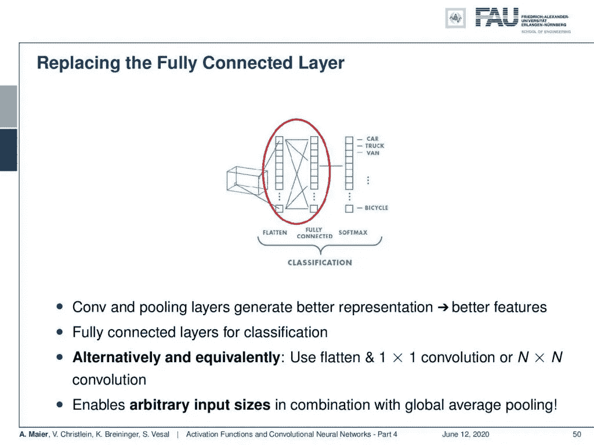

1x1 回旋能够代替完全连接的层。 [CC 下的图片来自](https://creativecommons.org/licenses/by/4.0/)[深度学习讲座](https://www.youtube.com/watch?v=p-_Stl0t3kU&list=PLpOGQvPCDQzvgpD3S0vTy7bJe2pf_yJFj&index=1)的 4.0 。

现在，一切都变得完全卷积，我们可以通过卷积和合并步骤来表达整个操作链。所以，我们甚至不再需要完全连接的层了。使用 1x1 卷积的好处是，如果您将它与所谓的全局平均池结合起来，那么您基本上也可以处理任意大小的输入图像。这里的想法是，在卷积处理结束时，只需映射到信道方向，然后计算所有输入的全局平均值。这是可行的，因为您有一个预定义的全局池操作。然后，您可以将其应用于任意大小的图像。因此，我们再次受益于汇集和卷积的思想。

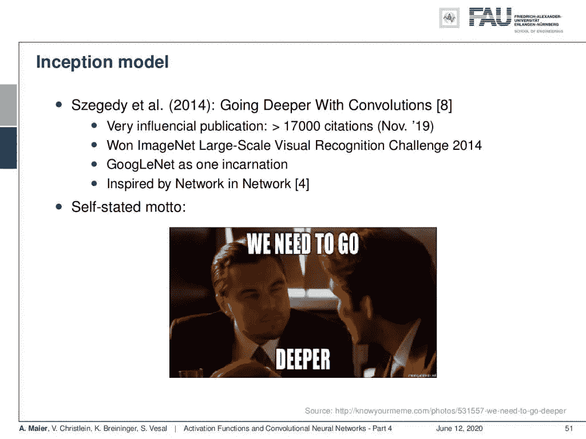

为了更深入，我们将很快研究进一步的想法。 [CC 下的图片来自](https://creativecommons.org/licenses/by/4.0/)[深度学习讲座](https://www.youtube.com/watch?v=p-_Stl0t3kU&list=PLpOGQvPCDQzvgpD3S0vTy7bJe2pf_yJFj&index=1)的 4.0 。

一个有趣的概念是初始模型，我们将在这堂课的后面更详细地讨论它。这种方法来自于论文“用回旋走得更深”[8]遵循我们自己的座右铭:“我们需要走得更深！”。该网络赢得了 2014 年 ImageNet 挑战赛。一个例子是 GoogLeNet，它是受参考文献[4]启发的化身。

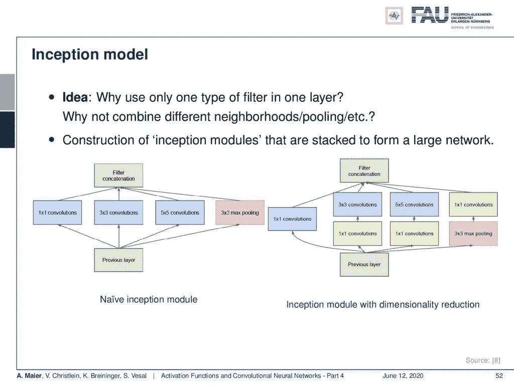

初始模块允许网络自己学习卷积和汇集的顺序。来自[深度学习讲座](https://www.youtube.com/watch?v=p-_Stl0t3kU&list=PLpOGQvPCDQzvgpD3S0vTy7bJe2pf_yJFj&index=1)的 [CC BY 4.0](https://creativecommons.org/licenses/by/4.0/) 下的图片。

他们提出的想法解决了必须交替固定卷积和合并步骤的问题。为什么不允许网络在它想汇集和想卷积时自己学习呢？所以，主要的想法是，你把并行 1x1 卷积，3x3 卷积，5x5 卷积，和最大池。然后，你把它们连接起来。现在，有趣的是，如果你并行提供所有四个操作，这基本上意味着下一层可以选择最信任的输入，以构建深度网络。如果这样做，您可以进一步扩展，例如在 3x3 和 5x5 卷积中。您可能希望在实际评估通道之前先对其进行压缩。然后，您会在右侧找到配置。这结合了额外的维度减少。尽管如此，这种并行处理允许网络学习自己的池化和卷积层序列。

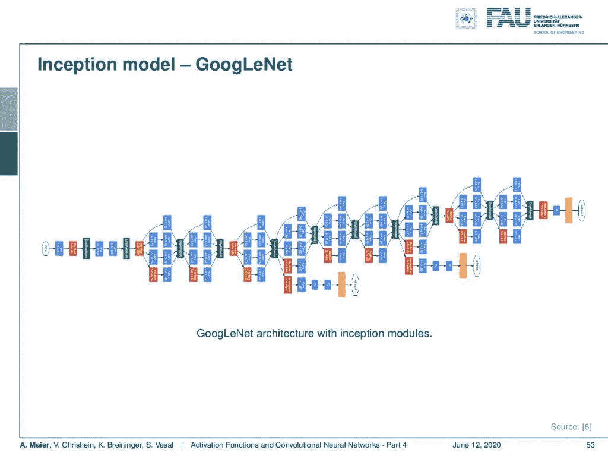

完整的 GoogLeNet 架构将很快被更详细地描述。 [CC 下的图片来自](https://creativecommons.org/licenses/by/4.0/)[深度学习讲座](https://www.youtube.com/watch?v=p-_Stl0t3kU&list=PLpOGQvPCDQzvgpD3S0vTy7bJe2pf_yJFj&index=1)的 4.0 。

然后，你得到像这样的模型。这已经是一个相当深入的模型，其中包含许多有趣的进一步创新，我们将在讨论不同的网络架构时讨论这些创新。

在这个深度学习讲座中，更多令人兴奋的事情即将到来。来自[深度学习讲座](https://www.youtube.com/watch?v=p-_Stl0t3kU&list=PLpOGQvPCDQzvgpD3S0vTy7bJe2pf_yJFj&index=1)的 [CC BY 4.0](https://creativecommons.org/licenses/by/4.0/) 下的图片。

所以下一次在深度学习中，我们想谈谈如何防止网络只是记忆训练数据。有没有办法强制特征独立？如何确保我们的网络也能识别不同姿势的猫？此外，一个非常好的方法可以帮助你，以及我们如何修复内部协变量移位问题。这些都是重要的观点，我认为答案确实值得在这里提出。

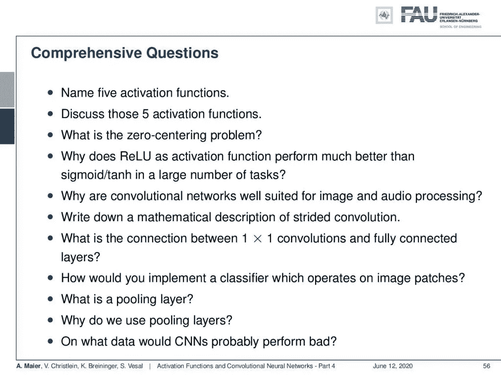

综合问题可以帮助学生准备考试。 [CC 下的图片来自](https://creativecommons.org/licenses/by/4.0/)[深度学习讲座](https://www.youtube.com/watch?v=p-_Stl0t3kU&list=PLpOGQvPCDQzvgpD3S0vTy7bJe2pf_yJFj&index=1)的 4.0 。

此外，我有几个综合性的问题或任务。说出五种激活功能。讨论这五种激活功能。零点对中问题是什么？写下步长卷积的数学描述。1x1 卷积和全连接层有什么联系？什么是池层？为什么我们需要这些池层？所以，在某个特定的时间点，有人会问你很多有趣的事情。如果你有任何问题，你可以在评论中发表或通过电子邮件发送。所以，我希望你喜欢这个讲座，我们下次再见！

如果你喜欢这篇文章，你可以在这里找到更多的文章，或者看看我们的讲座。如果你想在未来了解更多的文章、视频和研究，我也会很感激你在 YouTube、Twitter、脸书、LinkedIn 上的鼓掌或关注。本文以 [Creative Commons 4.0 归属许可](https://creativecommons.org/licenses/by/4.0/deed.de)发布，如果引用，可以转载和修改。

# 参考

[1] I. J. Goodfellow、d . ward-Farley、M. Mirza 等人，“最大网络”。载于:ArXiv 电子版(2013 年 2 月)。arXiv:1302.4389[统计 ML】。
[2]，，，，任等，“深入挖掘整流器:在 ImageNet 分类上超越人类水平的表现”。载于:CoRR abs/1502.01852 (2015)。arXiv: 1502.01852。
[3]君特·克兰鲍尔(Günter Klambauer)，托马斯·安特辛纳(Thomas Unterthiner)，安德烈亚斯·迈尔(Andreas Mayr)，等，“自归一化神经网络”。在:神经信息处理系统的进展。abs/1706.02515 卷。2017.arXiv: 1706.02515。
【四】、和水城颜。“网络中的网络”。载于:CoRR abs/1312.4400 (2013 年)。arXiv: 1312.4400。
[5]安德鲁·马斯、奥尼·汉南和安德鲁·吴。“整流器非线性改善神经网络声学模型”。在:过程中。ICML。第 30 卷。1.2013.
[6] Prajit Ramachandran，Barret Zoph，和 Quoc V. Le。“搜索激活功能”。载于:CoRR abs/1710.05941 (2017 年)。arXiv: 1710.05941。
【7】Stefan elf wing，内池英治，多亚贤治。“强化学习中神经网络函数逼近的 Sigmoid 加权线性单元”。载于:arXiv 预印本 arXiv:1702.03118 (2017)。
[8]克里斯蒂安·塞格迪、、·贾等，“用回旋深化”。载于:CoRR abs/1409.4842 (2014 年)。arXiv: 1409.4842。