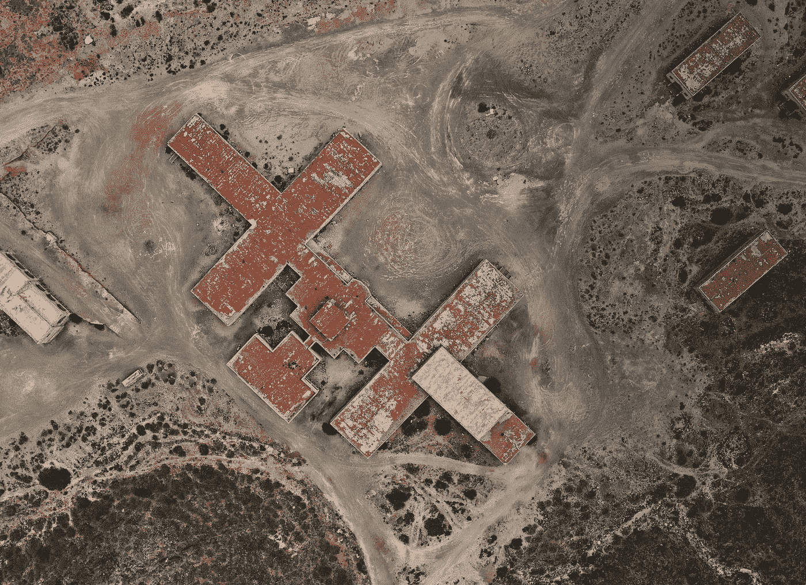

# 主动和半监督机器学习:8 月 17-28 日

> 原文：<https://towardsdatascience.com/active-and-semi-supervised-machine-learning-aug-17-28-77eaa9dbc311?source=collection_archive---------57----------------------->

## 主动学习时事通讯

## 关于主动(偶尔半监督或弱监督)深度学习的最新 arXiv 预印本精选

照片由 [Siora 摄影](https://unsplash.com/@siora18?utm_source=unsplash&utm_medium=referral&utm_content=creditCopyText)在 [Unsplash](https://unsplash.com/s/photos/reading?utm_source=unsplash&utm_medium=referral&utm_content=creditCopyText) 上拍摄

这是我新的主动学习时事通讯的创刊号(每周或每两周出版一期，取决于前一周相关预印本的数量)。我过去也做过类似的事情:去年秋天出现在 Scaleway 博客上的 arXiv 系列的 ***。这是迫使自己跟上深度学习领域新东西的一种很好的方式，但是，由于这个领域如此活跃，最终变得太耗时了。尽管我最喜欢的科幻作家曾经说过***

> 专业化是为了昆虫，

不是每个人都能达到罗伯特·A·海因莱因的高标准。阅读 arXiv 当然是专业化派上用场的地方。巧合的是，在过去的几个月里，我选择关注主动学习，因为这是一个非常有实际意义的领域，因为计算越来越便宜，但数据标记仍然很昂贵。要了解主动学习领域最前沿的研究，请继续阅读！

我们列表中的第一个是*使用深度神经网络进行文本分类的主动学习调查*:

 [## 基于深度神经网络的文本分类主动学习综述

### 自然语言处理(NLP)和神经网络(NNs)在最近几年都经历了重大变化…

arxiv.org](https://arxiv.org/abs/2008.07267) 

它首先概述了主动学习背后的基本思想、进行主动学习的不同方式(例如，基于池的与基于流的等)、使用的常用术语，然后列出了几个不同类别的查询策略(即，模型用来决定接下来要标记哪些训练样本的逻辑选择)。通过大量的参考资料，预印本为那些有兴趣将人工智能应用于 NLP 的人提供了一个很好的起点。

如今新冠肺炎无处不在，arXiv 也不例外。*使用 X 射线胸部图像校正半监督新冠肺炎检测的数据不平衡*查看(这并不奇怪)在不平衡的一组(一些)新冠肺炎图像与(大量)非 Covid 图像上进行的半监督学习。不平衡的数据集和极其昂贵的注释是医学数据的两个标志，因此将这两者放在一起看是有意义的。

 [## 使用 X 射线胸部图像校正半监督新冠肺炎检测的数据不平衡

### 冠状病毒(新冠肺炎)是一种国际流行病，它已经在全世界迅速传播。的…

arxiv.org](https://arxiv.org/abs/2008.08496) 

该模型本身是谷歌的 [*MixMatch 的变体:半监督学习的整体方法*](https://arxiv.org/abs/1905.02249) ，可以追溯到 2019 年——很像问题中的病毒。

在一个相关的医学笔记中，我们已经将*逐渐应用于乳腺超声图像中的质量检测的弱监督和主动学习*:

 [## 逐步将弱监督和主动学习应用于乳腺超声中的肿块检测…

### 我们提出了一种方法，有效地利用弱注释图像数据的目标检测任务的乳房…

arxiv.org](https://arxiv.org/abs/2008.08416) 

这里我们有作者所说的(a)强注释数据，其中注释是双重的:围绕肿块+良性与恶性分类标签的边界框，以及(b)弱注释数据，其仅带有图像级标签。在强注释数据上训练的模型然后被用于以熟悉的主动学习方式迭代地向用户查询一批周注释图像的边界框。

通过[按委员会查询](https://medium.com/scaleway-cloud/active-learning-part-1-the-theory-239b7a43ddb5?source=friends_link&sk=8c9e99904ab4de20035f15a046948a54)的主动学习的一个相当普通的应用，以及另一个涉及蒙特卡罗批量标准化的查询策略。不过这个问题很有趣:空中或卫星图像中的变化检测。我从来没有认真考虑过地图是如何保持更新的，但我的想法是，一般来说，地图是随着增量更新而更新的，而不是不断地从头开始重新创建。接下来的任务是检测变化。问题是，手动查找这些(通常是罕见的、稀疏分布的)变更需要检查整个映射区域🗺。祝你好运标签*那套*训练套装！幸运的是，主动学习有助于:

 [## 遥感中用于数据有效变化检测的深度主动学习

### 我们在深度神经网络模型的背景下研究主动学习，用于变化检测和地图更新…

arxiv.org](https://arxiv.org/abs/2008.11201) 

由[木星联盟](https://unsplash.com/@jupiterunion?utm_source=unsplash&utm_medium=referral&utm_content=creditCopyText)在 [Unsplash](https://unsplash.com/s/photos/aerial-photography?utm_source=unsplash&utm_medium=referral&utm_content=creditCopyText) 拍摄的照片

在*学习以半监督的方式学习*中，作者解决了基于图像的项目验证问题(例如人脸识别——或者任何你旨在学习特征嵌入的任务，这种特征嵌入会将相同类型的实例聚集在一起，而将其他实例远离)。现在这里有一个转折:在它们的有标签和无标签数据集中的对象类的集合是**不相交的**。也就是说，模型被要求找出关于看不见的类别的数据的东西(因为缺乏更好的术语)——在某种程度上，保留那些类别的结构。很酷，不是吗？

 [## 学会以半监督的方式学习

### 为了解决来自标记和未标记数据的半监督学习，我们提出了一种新的元学习方案。我们…

arxiv.org](https://arxiv.org/abs/2008.11203) 

下一个引起我注意的预印本专注于增量学习:一种机器学习方法，其中模型不断用新数据更新，同时还负责保留先前学习信息的知识。在广泛的应用中，这无疑是一个现实的场景。为了更加现实，假设只有一部分新的流数据被注释(因此需要主动学习),我们也不要对类分布做任何假设。所以我们得到了增量主动不平衡…我们应该叫它什么？

 [## 不平衡数据集的主动类增量学习

### 增量学习(IL)允许人工智能系统适应流式数据。大多数现有算法使两个强…

arxiv.org](https://arxiv.org/abs/2008.10968) 

是的，听起来没错。

最后，在非 arXiv，但仍然非常活跃的学习中，新闻:上周我做了一个 20 分钟的演讲，题为“为什么一些数据比其他数据更平等”，作为开放数据科学大会热身的一部分。该讲座现已在他们的网站上以免费点播网上研讨会的形式发布:

 [## 点播网络研讨会:ODSC 欧洲 2020 虚拟训练营热身

### Beehive Media 创始人比尔·山德“从数字到叙事:将原始数据转化为引人注目的视觉故事…

aiplus.odsc.com](https://aiplus.odsc.com/courses/odsc-europe-2020-virtual-bootcamp-warm-up) 

我的部分大约在 23:00 开始。看看吧，一两周后见:)

页（page 的缩写）如果你是主动学习的新手，这里有几篇我以前的文章可以帮你入门:

 [## 主动学习:理论

### 主动学习仍然是机器学习中的一种利基方法，但这种情况必将改变。

medium.com](https://medium.com/scaleway-cloud/active-learning-part-1-the-theory-239b7a43ddb5)  [## PyTorch 的主动学习

### 通过这个循序渐进的影像分类教程，了解如何节省高达 50%的数据标注成本

medium.com](https://medium.com/scaleway-cloud/active-learning-with-pytorch-dc6805956b0f)