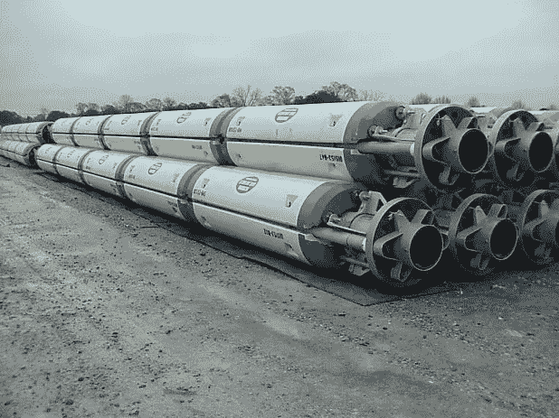
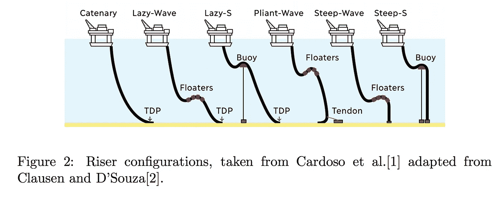

# 主动和半监督机器学习:8 月 31 日至 9 月 11 日

> 原文：<https://towardsdatascience.com/active-and-semi-supervised-machine-learning-aug-31-sep-11-f985d593bd99?source=collection_archive---------43----------------------->

## 主动学习时事通讯

## 关于主动(偶尔半监督或弱监督)深度学习的最新 arXiv 预印本精选

前一期:

 [## 主动和半监督机器学习:8 月 17-28 日

### 关于主动(偶尔半监督或弱监督)深度学习的最新 arXiv 预印本精选

towardsdatascience.com](/active-and-semi-supervised-machine-learning-aug-17-28-77eaa9dbc311) 

过去几周，活跃和半监督的机器学习社区出现了大量行动。以下是一些个人最喜欢的，而不是详尽的列表，分为两部分: ***主动学习*** 和 ***半监督学习*** g

这些钻井石油立管和机器学习有什么关系？请继续阅读，寻找答案！图片来源:[wikipedia.org](https://en.wikipedia.org/wiki/Drilling_riser#/media/File:Drilling_Riser.jpg)

# 主动学习

 [## 主动学习:理论

### 主动学习仍然是机器学习中的一种利基方法，但这种情况必将改变。

medium.com](https://medium.com/scaleway-cloud/active-learning-part-1-the-theory-239b7a43ddb5) 

如今，可解释的人工智能是一件大事。在 *ALEX:基于主动学习的模型可解释性增强*中，作者使用了一种新颖的查询策略:对“难以解释”的实例进行优先排序。(他们使用[SHAP 框架](https://arxiv.org/abs/1705.07874)来确定后者。)他们的目标是找到一个在性能和模型可解释性两方面都得到优化的分类器，至少在 MNIST 上，作者在这两方面都取得了成功:

 [## ALEX:基于主动学习的模型可解释性增强

### 一种主动学习(AL)算法试图用最少的标记样本构建一个有效的分类器

arxiv.org](https://arxiv.org/abs/2009.00859) 

现在，这绝不是一种批评，但与我看到的大多数关于机器学习主题的预印本不同，这篇论文是以完全学术的风格撰写的。有点像回到我还是物理学家的时候，那时一切*可能*已经变成了数学陈述，*就是*。举个小例子来说明我的意思:

> “此参数近似中的误差 **θ** (真实函数相关性θ)预计会随着训练集中对数 M 的增加而变小，即 **θ** → θ as M → ∞。”

或者换句话说:训练样本越多，模型概括得越好。无论如何，我只是觉得有趣的是，当我第一次开始阅读 ML 论文而不是物理论文时，我认为它们缺乏严谨性曾经让我沮丧，而现在我更可能注意到相反的情况。人是怎么变的！

让我们说，一个主动学习系统不是简单地要求你标记它选择的数据，而是要求你验证或纠正模型的预测。作为一个主观的人，你更相信哪个人工智能，是你没有发言权的人工智能，还是在训练过程中得到你反馈的人工智能？根据*中介绍的研究，为交互式机器学习征求人在回路中的用户反馈会降低用户信任和对模型准确性的印象*(我想标题已经给出了答案)，典型的人在回路中对模型的性能不太信任，不管他们的反馈是否提高了模型的性能。

 [## 为交互式机器学习征求人在回路中的用户反馈会降低用户的信任度…

### 混合主动性系统允许用户交互地提供反馈，以潜在地提高系统性能。人类…

arxiv.org](https://arxiv.org/abs/2008.12735) 

仔细想想，这是有道理的:能够纠正模型预测的人(尤其是那些信心分数低的人)看到了模型最糟糕的一面，因此失去了信心。

在高光谱成像中，需要大量训练数据的问题甚至更加尖锐。简而言之，输入的维度越高，模型越大，就需要越多的数据来训练它。在*用于高光谱图像分类的主动深度密集连接卷积网络中提出了一种有趣的主动学习方法:*

 [## 用于高光谱图像分类的主动深度密集连接卷积网络

### 过去，基于深度学习的方法在高光谱图像分类中的受欢迎程度大幅上升…

arxiv.org](https://arxiv.org/abs/2009.00320) 

这里的查询策略是基于预测损失值的。

终身学习，或者说持续学习，不仅仅是我们所有人都应该以某种形式做的事情，也是人工智能的[子领域。这种想法是，生产中的模型可能需要通过对新数据进行微调来保持最新——随着后者变得可用，不断地进行微调。然而，从一开始就积累所有的训练数据并在整个集合上不断地重新训练并不是最实际的做法。挑战在于适应新的现实(现实=数据)，同时不忘记以前学到的东西。如果你习惯于标准的模型训练协议，你可能会明白为什么这会带来一个问题:一旦你在一个新的数据集上重新训练你的网络，它对旧数据集的记忆和金鱼的记忆一样有价值。在最近的预印本*中回顾了一些对抗所谓“灾难性遗忘”的技术，这是一个深度神经网络持续学习的整体观:被遗忘的课程和通往主动开放世界学习的桥梁:*](https://arxiv.org/abs/1802.07569)

 [## 深度神经网络持续学习的整体观:遗忘的课程和桥梁…

### 目前的深度学习研究以基准评测为主。一种方法被认为是有利的，如果它…

arxiv.org](https://arxiv.org/abs/2009.01797) 

作者认为，虽然主动学习可以被视为旨在实现持续学习的反向操作(选择数据以供未来包含，而不是在面对新数据时保留已学习的表示)，但这两个领域之间仍有桥梁需要搭建。

这里有一个好玩的，*通过基于池的主动学习自动选择模拟案例加速工程设计:*

 [## 通过基于池的模拟案例自动选择加速工程设计…

### 许多工程设计问题的通用工作流程需要对设计系统的评估进行调查…

arxiv.org](https://arxiv.org/abs/2009.01420) 

显然，[号近海石油立管](https://en.wikipedia.org/wiki/Drilling_riser)的设计过程包括运行大量的海流和海浪模拟。引用预印本作者的话，

> 许多这些组合可能是多余的，因为许多这些模拟的隔水管中的机械张力可以从其他模拟的结果中估算出来。...这里的挑战在于找到信息最丰富的案例。

自然地，这使得石油立管设计成为主动学习的绝佳选择！与计算机视觉和 NLP 中更熟悉的应用不同，这里未标记的数据对应于尚未运行的模拟池，而标记训练实例相当于运行模拟(如果可能，工程师希望避免这种昂贵的操作)。

我第一次在报纸上看到这样的数字。图片来源:【arxiv.org 

其他一些荣誉奖颁发给:

*   *深度主动学习的调查，*30 页的领域概述，一些问题，应用和开放问题，近 200 个参考资料可供深入研究:

 [## 深度主动学习综述

### 主动学习(AL)试图通过标记最少的样本来最大化模型的性能增益。深…

arxiv.org](https://arxiv.org/abs/2009.00236) 

*   主动学习在工程中的另一个应用，这次是在[超材料](https://en.wikipedia.org/wiki/Metamaterial)的设计中:

 [## 偏微分方程深度代理的主动学习:在超曲面设计中的应用

### 偏微分方程的代理模型广泛用于超材料的设计，以快速评估…

arxiv.org](https://arxiv.org/abs/2008.12649) 

*   一种有趣的新的主动学习方法，作者称之为*主动学习++* ，它不仅向标注器查询样本的标签，还查询输入特征的重要性排序(根据标注器)。所涉及的模型是逻辑回归(适合手头的结构化数据集)，但我必须承认，我发现作为例子的任务有点畏缩。这个人的收入是根据他们的教育和工作经历，以及种族和性别来预测的。注释者应该如何对这样的特性进行排序呢？“我认为这个人每年挣 N 美元的主要原因是他们是 XX 种族和 YY 性别”？无论如何，注释者提供标签之外的信息的想法很有趣，所以值得一提的是:

 [## 主动学习++:使用本地模型解释合并注释者的基本原理

### 我们提出了一个新的主动学习框架——主动学习++,它既可以利用标注者的标注，也可以利用学习者的兴趣

arxiv.org](https://arxiv.org/abs/2009.04568) 

*   另一个争议较小的问题是，这是一个基于池的不确定性采样在天文调查中的应用:

 [## 用于在大型光谱勘测中发现感兴趣对象的主动深度学习方法

### 目前 LAMOST 望远镜的档案包含数百万个管道处理的光谱，这些光谱可能从未被…

arxiv.org](https://arxiv.org/abs/2009.03219) 

# 半监督学习

 [## 基于遗传神经网络的半监督学习

### 关于猫和狗的 PyTorch 故事

medium.com](https://medium.com/scaleway-cloud/semi-supervised-learning-with-gans-a-tale-of-cats-and-dogs-3c90acfe91c9) 

数据注释花费巨大的领域之一是医学。我们列表中的下一个预印本关注使用未标记数据和知识蒸馏对糖尿病视网膜病变的*分类。*

 [## 使用未标记数据和知识蒸馏对糖尿病视网膜病变进行分类

### 知识提炼允许将知识从预先训练的模型转移到另一个模型。然而，它的缺点是…

arxiv.org](https://arxiv.org/abs/2009.00982) 

糖尿病视网膜病变是一种由糖尿病引起的眼睛疾病，但论文中的思想很容易应用于任何图像分类问题。知识提炼是一种方法，包括将知识从一个模型(老师)转移到另一个模型(学生，通常是一个较小的网络)。以定期监督的方式训练教师，然后将软标签(教师对训练集的输出)用作训练学生的标签。预印本的主旨是，除了已标记的集合，你还可以在提取过程中使用老师对未标记图像的软标签，最终得到一个更好的模型。

在你离开之前，这里有两份关于半监督深度学习在医学领域应用的预印本:

 [## 基于双任务一致性的半监督医学图像分割

### 基于深度学习的半监督学习(SSL)算法已经在医学图像方面取得了令人鼓舞的结果…

arxiv.org](https://arxiv.org/abs/2009.04448)  [## 具有不纠缠表示的半监督病理分割

### 自动病理分割在临床实践中仍然是一种有价值的诊断工具。然而，收集训练…

arxiv.org](https://arxiv.org/abs/2009.02564) 

一周(或两周)后见！