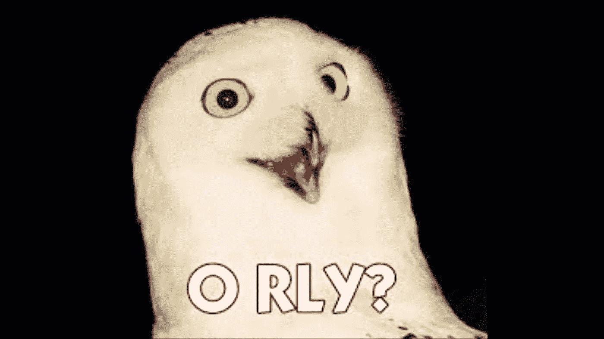
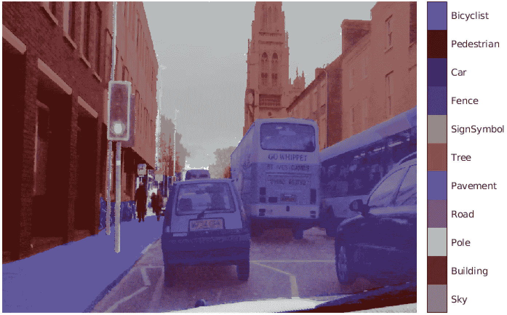

# 主动和半监督机器学习:10 月 12 日至 23 日

> 原文：<https://towardsdatascience.com/active-and-semi-supervised-machine-learning-oct-12-23-6bfe5470253d?source=collection_archive---------58----------------------->

## [主动学习简讯](https://towardsdatascience.com/tagged/active-learning-news)

## 关于主动(偶尔半监督或弱监督)深度学习的最新 arXiv 预印本精选

前一期:

 [## 主动和半监督机器学习:9 月 28 日至 10 月 9 日

### 关于主动(偶尔半监督或弱监督)深度学习的最新 arXiv 预印本精选

towardsdatascience.com](/active-and-semi-supervised-machine-learning-sep-28-oct-9-50813688c616) 

[你也可以在这里找到迄今为止我所有的主动学习简讯](https://towardsdatascience.com/tagged/active-learning-news)。

照片由[大卫·伊斯坎德尔](https://unsplash.com/@diskander?utm_source=unsplash&utm_medium=referral&utm_content=creditCopyText)在 [Unsplash](https://unsplash.com/s/photos/reading?utm_source=unsplash&utm_medium=referral&utm_content=creditCopyText) 上拍摄

我想提到的第一个资源实际上是大约一个月前发表在 TDS 上的另一篇博文:

 [## 利用深度半监督学习从研究到生产

### 半监督学习(SSL)已经在深度学习研究社区中蓬勃发展——我们分享从学习中获得的经验…

towardsdatascience.com](/from-research-to-production-with-deep-semi-supervised-learning-7caaedc39093) 

尽管我很喜欢一份最新的预印本，里面有一些前沿的研究成果，但没有什么能打败那些将上述研究应用于现实世界问题的人的反馈。博客文章 [Uizard](https://uizard.io/) 背后的团队讨论了几个实用的要点，主要是在对象检测的背景下，但我发现最有趣的是下面这个:

伪标签是由在标记的(和/或先前伪标记的)训练样本上训练的模型对未标记的数据做出的高置信度预测。伪标记(也称为自我训练)可用于自动化大部分数据注释过程，从而大幅降低相关的标记成本。然而，它容易出错:特别是，模型在早期发现的任何偏差，很可能只会在以后被放大。解决这个问题的方法之一是人工验证伪标签。通常情况下，验证比从头开始贴标签更省时，因此采用这种方法仍然有很大的附加值。在博文中，作者描述了 Uizard 发现的另一个有效的解决方案，特别是对于对象检测任务。这个解决方案就是**启发式伪标签精化**。他们的博文示例处理公寓图像中某些家具的检测。在这里，可以用来自动提炼伪标签的试探法可以沿着这样的路线进行:梳妆台和厨房岛看起来有些相似，但是床和梳妆台比床和厨房岛更有可能出现在同一图像中。因此，如果你发现一张床和一个厨房岛，那个“岛”很可能是一个梳妆台。简单吧？人们可以想象在现实生活的用例中有许多这样的启发式方法，所以这种策略听起来绝对值得记住。

主动学习通常与半监督学习分开考虑，但本质上，前者可以被视为后者的一个亚型。我已经在之前的一篇博文中讨论了主动学习背后的理论:

 [## 主动学习:理论

### 主动学习仍然是机器学习中的一种利基方法，但这种情况必将改变。

medium.com](https://medium.com/scaleway-cloud/active-learning-part-1-the-theory-239b7a43ddb5) 

基本思想是在标记数据上训练监督模型，然后在非监督集合上使用训练模型的预测来区分下一个要标记的实例的优先级。然而，根据少量标记数据训练的模型显然不会提供最佳性能。现在，如果我们执行*半监督*训练，而不是在主动学习循环中进行监督训练，会怎么样？一种嵌套的半监督方法，利用未标记的数据进行训练和人在回路中的标记池。这种想法的一个变体被证明非常有效，如:

 [## 基于双层优化的半监督批量主动学习

### 主动学习是一种通过提高数据效率来降低标注成本的有效技术。在这项工作中，我们…

arxiv.org](https://arxiv.org/abs/2010.09654) 

当我们在主动学习的主题上时，这里有一个可以在自然语言处理(NLP)问题中使用的新的查询策略:一个给定的短语如何*令人惊讶*？

是的，真的。(图片鸣谢:[约翰·怀特](http://animal.memozee.com/view.php?tid=1&did=12932))

为了量化这个问题的答案，*的作者通过自我监督语言建模*使用 BERT 冷启动主动学习。也就是说，他们用它来计算他们所谓的*惊奇嵌入。为了让你对结果有一个概念，考虑预印本中的这个例子:短语“他们对天主教迷幻合成民谣音乐感到矛盾”被认为比“这是我最喜欢的电视节目”更令人惊讶。(这一点我无法反驳。)该属性成为查询策略的一部分，用于区分以下数据注释的优先级:*

 [## 通过自我监督语言建模进行冷启动主动学习

### 主动学习通过选择最关键的例子来标注，努力降低标注成本。通常情况下……

arxiv.org](https://arxiv.org/abs/2010.09535) 

在计算机视觉领域，主动学习方法通常在图像分类或对象检测方面进行评估(也就是说，我们的目标是分配图像级别的类别标签，或者在对象周围绘制边界框并识别它们)。然而，另一个常见的计算机视觉任务，语义分割，在像素级分配类别标签，通常标注数据的成本要高得多。这当然使它成为主动学习的特别理想的候选对象！

每个像素都有语义标签的图像示例。图片来源:[英伟达](https://developer.nvidia.com/blog/speeding-up-semantic-segmentation-matlab-nvidia-ngc/)

除了标准的查询策略(例如不确定性采样的变化等)，我们可以定义一个特定于分段问题的度量，就像上面讨论的预印本中特定于 NLP 的“这个短语有多令人惊讶”一样。在这里，这个新的度量将成为创建分割蒙版的*难点*:例如，选择小的行人图形可能会比上图中选择大的矩形建筑或公共汽车更困难。将这一困难纳入主动学习过程的讨论见:

 [## DEAL:面向语义分割的难度感知主动学习

### 主动学习旨在通过寻找最有信息的样本来解决标记数据的缺乏。然而，当…

arxiv.org](https://arxiv.org/abs/2010.08705) 

这是我在过去两周从机器学习阅读中得到的另一个收获:要有创造力。在生活中，在工作中，更具体地说，创造性地使用你的主动学习的提问策略。

关于这一点，11 月见！