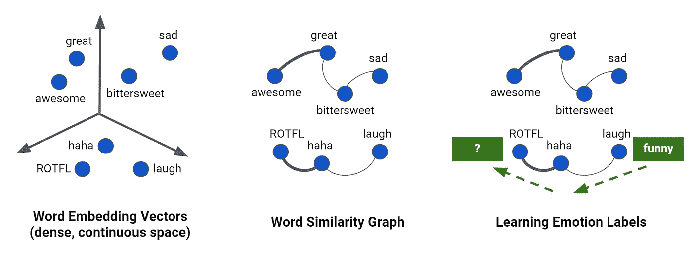
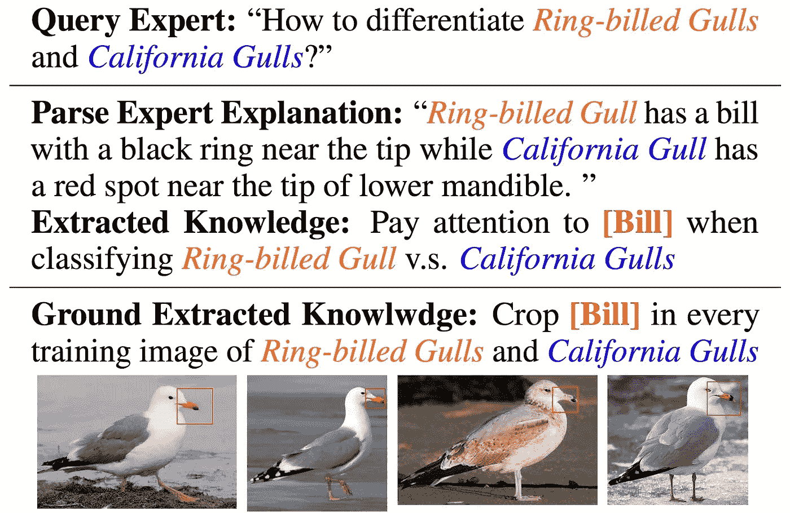

# 主动和半监督机器学习:9 月 14 日至 25 日

> 原文：<https://towardsdatascience.com/active-and-semi-supervised-machine-learning-sep-14-25-93f19ff60fb1?source=collection_archive---------47----------------------->

## 主动学习时事通讯

## 关于主动(偶尔半监督或弱监督)深度学习的最新 arXiv 预印本精选

前一期:

 [## 主动和半监督机器学习:8 月 31 日至 9 月 11 日

### 关于主动(偶尔半监督或弱监督)深度学习的最新 arXiv 预印本精选

towardsdatascience.com](/active-and-semi-supervised-machine-learning-aug-31-sep-11-f985d593bd99) 

[你也可以在这里找到我迄今为止所有的主动学习简讯](https://towardsdatascience.com/tagged/active-learning-news)。

[七射手](https://unsplash.com/@sevenshooterimage?utm_source=unsplash&utm_medium=referral&utm_content=creditCopyText)在 [Unsplash](https://unsplash.com/s/photos/reading?utm_source=unsplash&utm_medium=referral&utm_content=creditCopyText) 上的照片

我必须承认，我最近才接触到基于图形的机器学习，但它在半监督环境中的应用听起来很有趣。基本思想是数据(标记的和未标记的)由图中的节点表示，数据点之间的关系对应于图的边。在这篇来自 Google AI 的博文中，考虑了给单词分配情感标签的任务。首先，单词通过它们的嵌入来表示，然后基于不同嵌入向量之间的相似性来绘制边缘。这是半监督学习，一些节点被标记，但大多数没有。然后，标签(例如，“有趣”、“悲伤”等)在整个图表中传播，大致如下所示:

[图像来源](https://ai.googleblog.com/2016/10/graph-powered-machine-learning-at-google.html)

这是基本的想法，现在让我们回到过去两周 arXiv 的内容。基于图的半监督学习+卷积网络，生活(至少是机器学习工程师的生活)会变得更好吗？嗯，有可能！进入对比学习:

> 对比学习是一类自我监督的方法，它训练编码器在描述感兴趣的统计相关性的表示和不描述感兴趣的统计相关性的表示之间进行对比。

当涉及到监督任务(例如分类)时，普通的对比学习本身并不能帮助你。幸运的是，*基于图的半监督学习的对比和生成图卷积网络*的作者通过将关于可用标签的信息合并到损失函数中找到了一种解决方法:

 [## 基于图的半监督学习的对比生成图卷积网络

### 基于图的半监督学习(SSL)旨在将少量已标记数据的标签转移到剩余的标签中

arxiv.org](https://arxiv.org/abs/2009.07111) 

很好理解，最终，你的模型只能和你的数据一样好。除此之外，这意味着无论数据中存在什么样的偏差，它们都会成为模型的一部分。因此，如果你考虑我们的历史，难怪*公平*不仅是[道德基础理论](https://en.wikipedia.org/wiki/Moral_foundations_theory)的六大支柱之一，也是人工智能领域活跃研究的主题。确定一个系统的公平性的指标往往是相当特别的，但通常相当于确定结果不应该依赖的某些特征，并确保情况确实如此。你知道，就像种族和性别对比[一个人是否会被叫去参加工作面试](https://www.bbc.com/news/technology-45809919)之类的事情。无论如何，在有人监督和无人监督的情况下，这个主题的处理方式存在一定的差异，所以我很高兴看到半有人监督的社区也在研究这个问题:

 [## 半监督学习中的公平性约束

### 机器学习中的公平性受到了相当大的关注。然而，大多数关于公平学习的研究都集中在…

arxiv.org](https://arxiv.org/abs/2009.06190) 

许多不同的半监督学习方法的共同点是*聚类*的思想。您获取数据，将其分组，然后根据被注释的数据点分配标签。这个过程中有一个假设是我们在机器学习中经常想当然的:那就是拥有数据点。也就是说，独立的数据实例，而不是用一个更好的词来形容，数据块。但是，如果您处理的是顺序数据，该怎么办呢？例如，您的智能设备不断收集的关于您和您的环境的数据类型:例如，您的睡眠跟踪器。为了对这类数据执行聚类，首先需要将序列分解成片段。分割和标记都是昂贵的任务，因此显然需要适合处理序列数据的半监督方法。在*通过变化点检测的半监督序列分类*中，作者应用“变化点检测方法……识别序列中对应于可能类别变化的点”:

 [## 基于变点检测的半监督序列分类

### 在各种各样的实际应用中产生顺序传感器数据。一个根本性的挑战包括…

arxiv.org](https://arxiv.org/abs/2009.11829) 

以半监督方式训练的机器学习模型的性能通常很大程度上取决于已经被注释的训练样本的选择。然而，这些注释的质量同样重要:事实上，我们拥有的标记样本越少，它就越重要。在现实世界中，注释很难做到 100%准确，为了达到最终模型的最佳性能，必须处理这个问题。*的作者用直推式半监督留一滤波器识别噪声标签*提出了一种去除被认为可能不正确的标签的方法:

 [## 用直推式半监督留一滤波器识别噪声标签

### 获取带有有意义标签的数据通常成本高昂且容易出错。在这种情况下，半监督学习…

arxiv.org](https://arxiv.org/abs/2009.11811) 

在下一份预印本中，

 [## 神经网络模型主动学习的模型中心和数据中心方面

### 我们用神经网络模型研究主动学习的以数据为中心和以模型为中心的不同方面。我)我们…

arxiv.org](https://arxiv.org/abs/2009.10835) 

作者考虑了两种基于池的主动学习的训练方法:增量和累积。对于主动学习循环的每次迭代，增量训练对应于仅在新添加的标签上微调模型，而累积训练意味着我们从头开始在所有当前可用的标签上重新训练模型。在我自己的实现中，我实际上使用了两者之间的东西:微调模型而不是重新训练，但是是在整个更新的标签集上。我发现这个工作得相当好:

 [## PyTorch 的主动学习

### 通过这个循序渐进的影像分类教程，了解如何节省高达 50%的数据标注成本

medium.com](https://medium.com/scaleway-cloud/active-learning-with-pytorch-dc6805956b0f) 

但是，回到预印本！作者采用 MNIST 和时尚-MNIST 数据集，开始一次标记 120 张图像，并比较通过增量和累积训练方法获得的模型在三种查询策略下的性能:随机(本质上不是一种策略)、余量和熵不确定性采样。顺便说一句，如果你想知道后两者是什么，我可以让你感兴趣:

 [## 主动学习:理论

### 主动学习仍然是机器学习中的一种利基方法，但这种情况必将改变。

medium.com](https://medium.com/scaleway-cloud/active-learning-part-1-the-theory-239b7a43ddb5) 

说到数据注释，我们通常是在标签之后。然而，注释者选择背后的推理可以提供对任务本质的有价值的洞察。这种信息不容易包含在机器学习过程中，这使得下面的工作更加有趣:

 [## 爱丽丝:对比自然语言解释的主动学习

### 训练受监督的神经网络分类器通常需要许多带注释的训练样本。收集和…

arxiv.org](https://arxiv.org/abs/2009.10259) 

爱丽丝到底是怎么运作的？假设你在为一个鸟类分类问题做主动学习。该模型将首先挑选出那些图像，对于这些图像，它很难在两个类别之间做出决定。(有点像边际抽样，只是在论文中，他们考虑的是特征空间中训练实例之间的距离，而不是模型预测的类别概率。)然后，它将要求注释者不仅标记图像，还要说明她如何区分这两个类:

[图像来源](https://arxiv.org/pdf/2009.10259.pdf)

这些信息将被解析成机器友好的形式，并用于提高模型的性能。

这是这两周对我来说最突出的预印本。你呢，这些引起你的注意了吗？我错过了什么吗？

十月中旬见！