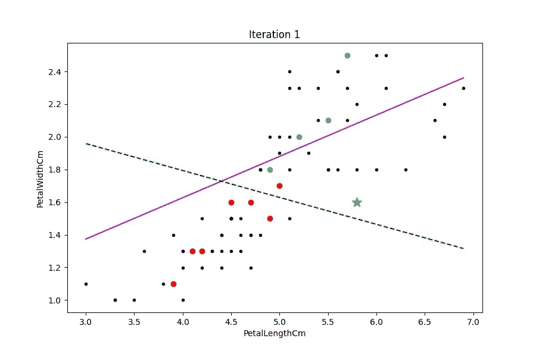

# 主动学习教程—使用 Python 进行机器学习

> 原文：<https://towardsdatascience.com/active-learning-5b9d0955292d?source=collection_archive---------3----------------------->

## 这是一个 Python 主动学习的教程，对概念进行了解释，并对代码中的步骤进行了详细说明


作者图片

## 什么是主动学习？

主动学习是一种机器学习技术，其中我们使用较少的标记数据，并交互式地标记新的数据点，以提高模型的性能。

术语:
训练数据集=标记的数据点
池=未标记的数据点

我们从一些带标签的数据点(训练数据集)开始。有大量未标记的数据点。这些未标记的数据点必须被标记并添加到训练数据集中以创建模型。然而，在主动学习中，我们将只标记一小部分数据点，而不是标记池中的所有数据点，但是仍然可以获得良好的性能。

我们创建一个模型(分类器),并根据标记的数据对其进行训练。然后，我们检查池中的所有数据点，识别分类器最不明确的点，并将这些点添加到训练数据中(我们每次可能只添加一个点)。我们重复这个过程来提高模型性能。这种技术通常在贴标成本较高时使用。

我将很快在 [YouTube](https://bit.ly/ai-n-ml-youtube) 上传一段视频，详细解释主动学习背后的概念。


主动学习和其他采样新数据点进行标记的方法的性能改进比较—图片由[基金会](https://www.google.com/url?sa=i&url=https%3A%2F%2Fwww.groundai.com%2Fproject%2Flearning-to-sample-an-active-learning-framework%2F1&psig=AOvVaw2itxPFqwYbNZCnGV_EFSpQ&ust=1590952401948000&source=images&cd=vfe&ved=0CA0QjhxqFwoTCICnqNil3OkCFQAAAAAdAAAAABAY)提供

## 主要代码

在这里，我们导入所需的库:
pandas —处理数据
sklearn —用于 SVM 模型
numpy —用于矩阵和数组操作
matplotlib.pyplot —用于图形绘制
imageio —制作 gif
OS—创建文件夹并检查它们的内容

```
from sklearn.svm import SVC, LinearSVC
import pandas as pd
import numpy as np
import matplotlib.pyplot as plt
from sklearn.model_selection import train_test_split
import imageio as io
import os
```

这里，我们从 CSV 文件中读取数据。该数据可在 [Kaggle](https://www.kaggle.com/uciml/iris) 上获得。

```
origdata = pd.read_csv("Iris.csv")
origdata[:10]
```


单元格输出:虹膜数据集预览-作者提供的图像

该数据集包含关于鸢尾花的 3 个**种/亚种**的数据。每个样本都有萼片的长度、萼片的宽度、花瓣的长度和花瓣的宽度，都以厘米为单位。每个样本都是这三种鸢尾中的一种——刚毛鸢尾、杂色鸢尾和海滨鸢尾。

我们从数据集中选择两个属性(列)来执行主动学习。我们选择了两列，因为这样很容易将 2D 数据可视化。但是注意，只取 2 列未必比取所有列用于机器学习或主动学习更好。

```
k1, k2 = 'PetalLengthCm', 'PetalWidthCm'
data = origdata[[k1, k2, 'Species']].copy()
data[:10]
```


仅包含选定列的 Iris 数据集-按作者分类的图像

对于训练数据，我们采用前面选择的两列。物种栏是标签。我们将标签更改为 0(鸢尾-刚毛鸢尾)、1(鸢尾-杂色)和 2(鸢尾-海滨鸢尾)。

```
X = data[[k1, k2]]
y = data['Species']
print('Classes:')
print(y.unique(), '\n\n\n')

y[y=='Iris-setosa'] = 0
y[y=='Iris-versicolor'] = 1
y[y=='Iris-virginica'] = 2
```

输出:

`Classes:
['Iris-setosa' 'Iris-versicolor' 'Iris-virginica']`

我们在 2D 图上绘制了云芝和海滨锦葵的样本，云芝用红色，海滨锦葵用青色。

```
plt.figure()
setosa = y == 0
versicolor = y == 1
virginica = y == 2

plt.scatter(X[k1][versicolor], X[k2][versicolor], c='r')
plt.scatter(X[k1][virginica], X[k2][virginica], c='c')
plt.xlabel(k1)
plt.ylabel(k2)
plt.show()
```

输出:


杂色-红色；Virginica-青色——作者图片

我们丢弃鸢尾的样本。

```
X1 = X[y != 0]
y1 = y[y != 0]
X1[:5]
```

输出:


注意，数据帧的行从 50 开始，而不是从 0 开始。这里的索引不是从 0 开始，因为 0–49 索引行包含鸢尾花的数据，50–149 索引行包含其他两种花的数据——按作者分类的图像

然后，我们重置数据帧的索引。

```
X1 = X1.reset_index(drop=True)
y1 = y1.reset_index(drop=True)
y1 -= 1
print(y1.unique())
X1[:5]
```

输出:
`[0 1]`


重置索引后的数据帧-作者图片

我们将数据绘制在 2D 图上，并将图形保存为“main.jpg”。

```
fig = plt.figure()

plt.scatter(X1[k1][y1==0], X1[k2][y1==0], c='r')
plt.scatter(X1[k1][y1==1], X1[k2][y1==1], c='c')

plt.xlabel(k1)
plt.ylabel(k2)
fig.savefig('main.jpg', dpi=100)
plt.show() 
```


我们在全部数据上训练线性 SVM 核，以理解当使用全部数据时我们将得到的 SVM 模型。由于这是一个线性 SVM 模型，决策边界(分隔两个类别的边界)将是一条直线。我们看决策边界的斜率和截距。

```
y1 = y1.astype(dtype=np.uint8)clf0 = LinearSVC()
clf0.fit(X1, y1)LinearSVC(C=1.0, class_weight=None, dual=True, fit_intercept=True,
          intercept_scaling=1, loss='squared_hinge', max_iter=1000,
          multi_class='ovr', penalty='l2', random_state=None, tol=0.0001,
          verbose=0)print(clf0.coef_)
print(clf0.intercept_)
```

输出

```
[[0.2801542  1.70097577]]
[-4.17110884]
```

这里，我们绘制了决策边界以及所有数据点。在这种情况下，决策边界是一条直线(因为模型是线性 SVM)。`clf0`是受过训练的量词(SVM)。我们从`clf0.coef_`和`clf0.intercept`得到系数。`a0, b0, c0`是线的系数(线方程:`a0*x + b0*y + c0 = 0; y = -(a0*x + c0)/b0`)。我们在这条线上得到 100 个点(`lx0- has the x-corrdinates; ly0- has the y-coordinates`)并绘制它们(一条洋红色的线)。让我们称之为*理想决策边界*(当我们使用不同种类的 SVM 核时，这可能不是所有 SVM 的理想决策边界，但是，它确实是一个好的决策边界)。
然后，我们根据类别用青色和红色绘制数据集中的所有点。

```
xmin, xmax = X1[k1].min(), X1[k1].max()
ymin, ymax = X1[k2].min(), X1[k2].max()
stepx = (xmax - xmin)/99
stepy = (ymax - ymin)/99a0, b0, c0 = clf0.coef_[0, 0], clf0.coef_[0, 1], clf0.intercept_# Formula for reference
# a*x + b*y + c = 0
# y = -(a*x + c)/b

lx0 = [xmin + stepx * i for i in range(100)]
ly0 = [-(a0*lx0[i] + c0)/b0 for i in range(100)]

plt.figure()

plt.scatter(X1[k1][y1==0], X1[k2][y1==0], c='r')
plt.scatter(X1[k1][y1==1], X1[k2][y1==1], c='c')

plt.plot(lx0, ly0, c='m')

plt.xlabel(k1)
plt.ylabel(k2)

plt.show()
```


紫线是 SVM 模型的决策边界。红色和青色点是两个类别。

现在，我们将数据集分成两部分—池(80%)和测试(20%)。我们使用随机状态 1。数据集的分割取决于随机状态。
(我做过随机状态为 1 后主动学习 5 次迭代和随机状态为 2 后主动学习算法 20 次迭代的仿真)。

```
X_pool, X_test, y_pool, y_test = train_test_split(X1, y1, test_size=0.2, random_state=1)
X_pool, X_test, y_pool, y_test = X_pool.reset_index(drop=True), X_test.reset_index(drop=True), y_pool.reset_index(drop=True), y_test.reset_index(drop=True)
# random state 1 5 iterations
# random state 2 20 iterations
```

让我们对两个数据点应用 SVM 的判定函数。通常，对于两类线性 SVM，决策函数为其中一类(决策边界的一侧)输出正值，为另一类(决策边界的另一侧)输出负值，并在决策边界上输出零。
对于线性 SVM，决策函数的大小等于数据点到决策函数的距离。这是因为，如果一个点靠近决策边界，那么它可能是决策边界另一侧的类的异常值。

```
clf0.decision_function(X_pool.iloc[6:8])
```

输出

```
array([-0.55706427,  0.26340314])
```

这里，我们看到决策函数对于其中一个点具有负值，对于另一个点具有正值。

函数`find_most_ambiguous`给出了分类器最不明确的点。对于 SVM 分类器，如果数据点更接近决策边界，并且如果数据点更远离决策边界，则不那么模糊，而不管该点在决策边界的哪一侧。因此，`find_most_ambiguous`给出了最接近决策边界的未标记点。
`clf- classifier (trained SVM model); unknown_indexes- indexes from the dataset that are the unlabelled/unknown pool`

```
def find_most_ambiguous(clf, unknown_indexes):

    ind = np.argmin(np.abs( 
        list(clf0.decision_function(X_pool.iloc[unknown_indexes]) )
        ))
    return unknown_indexes[ind]
```

函数`plot_svm`用于绘制以下内容:
SVM 判定边界、根据分类来自列车数据的数据点以及未知样本池中的数据点。
`clf- classifier (trained SVM model).`
`train_indexes- Indexes of the dataset that are the train data points.
unknown_indexes- Indexes of the dataset that are the unlabelled pool data points.
title- The title of the plot.
name- the name of the image file that when the plot is saved to a file.
new_index- This is the index of the most ambiguous point in the unlabelled pool`

在这个函数中，首先，我们分别从`train_indexes`和`unknown_indexes`获取列车数据(`X_train, y_train`)和未标记数据(`X_unk, y_unk`)。我们用黑色标出了池中所有未标记的点。然后，我们根据分类标签，用不同的颜色(红色和青色)绘制来自训练数据的所有点。我们从 clf.coef_ 和 clf.intercept 中得到决策边界(直线)的系数，利用这个和直线的公式，我们画出这条线(绿色虚线)。我们还有前面计算的*理想决策边界*。这条线也用洋红色标出。
最后，我们绘制出`new_index`点，也就是最模糊的点(黄星)。

```
def plot_svm(clf, train_indexes, unknown_indexes, new_index = False, title = False, name = False):
    X_train = X_pool.iloc[train_indexes]
    y_train = y_pool.iloc[train_indexes]

    X_unk = X_pool.iloc[unknown_indexes]

    if new_index:
        X_new = X_pool.iloc[new_index]

    a, b, c = clf.coef_[0, 0], clf.coef_[0, 1], clf.intercept_ # Straight Line Formula
    # a*x + b*y + c = 0
    # y = -(a*x + c)/b

    lx = [xmin + stepx * i for i in range(100)]
    ly = [-(a*lx[i] + c)/b for i in range(100)]

    fig = plt.figure(figsize=(9,6))

    # plt.scatter(x[k1][setosa], x[k2][setosa], c='r')
    plt.scatter(X_unk[k1], X_unk[k2], c='k', marker = '.')
    plt.scatter(X_train[k1][y_train==0], X_train[k2][y_train==0], c='r', marker = 'o')
    plt.scatter(X_train[k1][y_train==1], X_train[k2][y_train==1], c='c', marker = 'o')

    plt.plot(lx, ly, c='m')
    plt.plot(lx0, ly0, '--', c='g')

    if new_index:
        plt.scatter(X_new[k1], X_new[k2], c='y', marker="*", s=125)
        plt.scatter(X_new[k1], X_new[k2], c='y', marker="*", s=125)
        plt.scatter(X_new[k1], X_new[k2], c='y', marker="*", s=125)
        plt.scatter(X_new[k1], X_new[k2], c='y', marker="*", s=125)
        plt.scatter(X_new[k1], X_new[k2], c='y', marker="*", s=125)

    if title:
        plt.title(title)

    plt.xlabel(k1)
    plt.ylabel(k2)

    if name:
        fig.set_size_inches((9,6))
        plt.savefig(name, dpi=100)

    plt.show()
```

我们将集合的前 10 个指数/数据点作为初始训练数据，其余 70 个点作为未标记的样本。我们用所有未标记的样本、*理想决策边界*和 10 个训练数据点创建开始图。
然后，我们在训练数据上训练一个 SVM，我们找到最不明确的点并创建一个新的图(“迭代 0”)，用这个点作为一个黄色的星，并且还绘制训练的 SVM 的决策边界。

```
train_indexes = list(range(10))
unknown_indexes = list(range(10, 80))
X_train = X_pool.iloc[train_indexes]
y_train = y_pool.iloc[train_indexes]
clf = LinearSVC()
clf.fit(X_train, y_train)

# folder = "rs1it5/"
folder = "rs2it20/"
# folder = "rs1it20/"

try:
    os.mkdir(folder)
except:
    pass

filenames = ["ActiveLearningTitleSlide2.jpg"] * 2

title = "Beginning"
# name = folder + ("rs1it5_0a.jpg")
name = folder + ("rs2it20_0a.jpg")
plot_svm(clf, train_indexes, unknown_indexes, False, title, name)

filenames.append(name)

n = find_most_ambiguous(clf, unknown_indexes)
unknown_indexes.remove(n)

title = "Iteration 0"
name = folder + ("rs1it5_0b.jpg")
# name = folder + ("rs2it20_0b.jpg")
filenames.append(name)
plot_svm(clf, train_indexes, unknown_indexes, n, title, name)
```


接下来，我们运行主动学习算法 5 次迭代。在每一个阶段中，我们将最模糊的点添加到训练数据中，并训练一个 SVM，在这个阶段找到最明确的点，然后创建一个图。

```
num = 5
# num = 20
t = []
for i in range(num):

    train_indexes.append(n)
    X_train = X_pool.iloc[train_indexes]
    y_train = y_pool.iloc[train_indexes]
    clf = LinearSVC()
    clf.fit(X_train, y_train)
    title, name = "Iteration "+str(i+1), folder + ("rs1it5_%d.jpg" % (i+1))
    # title, name = "Iteration "+str(i+1), folder + ("rs2it20_%d.jpg" % (i+1))

    n = find_most_ambiguous(clf, unknown_indexes)
    unknown_indexes.remove(n)
    plot_svm(clf, train_indexes, unknown_indexes, n, title, name)
    filenames.append(name)
```



```
images = []
for filename in filenames:
    images.append(io.imread(filename))
io.mimsave('rs1it5.gif', images, duration = 1)
# io.mimsave('rs2it20.gif', images, duration = 1)
# io.mimsave('rs1it20.gif', images, duration = 1)
try:
    os.mkdir('rs1it5')
#    os.mkdir('rt2it20')
except:
    pass
os.listdir('rs1it5')
```

输出

```
['ActiveLearningTitleSlide2.jpg',
 'ActiveLearningTitleSlide2.jpg',
 'rs1it5/rs1it5_0a.jpg',
 'rs1it5/rs1it5_0b.jpg',
 'rs1it5/rs1it5_1.jpg',
 'rs1it5/rs1it5_2.jpg',
 'rs1it5/rs1it5_3.jpg',
 'rs1it5/rs1it5_4.jpg',
 'rs1it5/rs1it5_5.jpg']
```

现在，我们显示 GIF 文件

```
with open('rs1it5.gif','rb') as f:
    display(Image(data=f.read(), format='gif'))
```


请注意，在上面的 GIF 中，随着我们添加更多的点(迭代次数)，绿线越来越接近*理想决策边界*。

*请注意，在上面的一些代码块和下面的代码块中，有一些带有数字 20 的注释行。这是为了运行 20 次迭代，而不是 5 次迭代。要运行它，我们必须用 5 注释所有的行，用 20 取消注释所有的行。* 当我们运行 20 次主动学习算法的迭代时，我们得到下面的 GIF。请注意，为此，我们在将数据分为测试和池时使用了 2 作为随机状态。
注意，随着下面 GIF 中迭代次数的增加，绿线越来越接近*理想决策边界*。


注意，主动学习可以用于其他机器学习/深度学习模型(不仅仅是支持向量机)。
另外，第一个`ActiveLearningTitleSlide2.jpg`是我用画图工具创建的一个简单的图像，和其他图像的长宽比一样(900x600)。

## 结论

我们看到，我们已经训练了一个好的分类器，也就是说，一个分类器的性能接近用所有点训练的 SVM，尽管我们使用了非常少量的点。这就是如何使用主动学习来创建标记更少数据点的健壮模型。

完整的代码可以在 [GitHub](https://gist.github.com/akhileshravi/198bc38d66547affa4ca0eb019c1ac13) 上获得

你可以看看我的 [YouTube 频道](https://bit.ly/ai-n-ml-youtube)上解释 AI 和 ML 概念的视频。